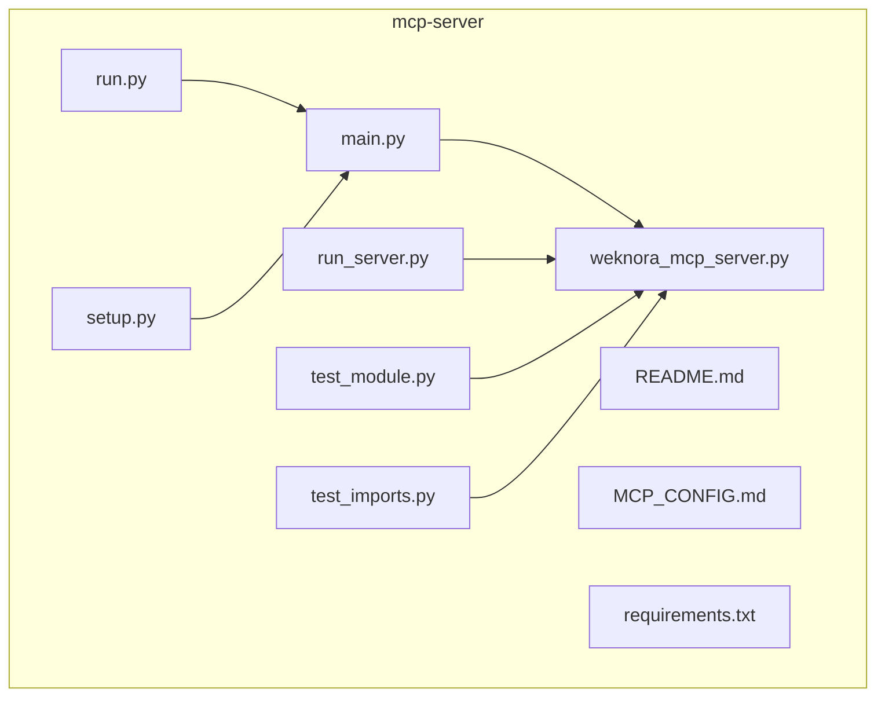
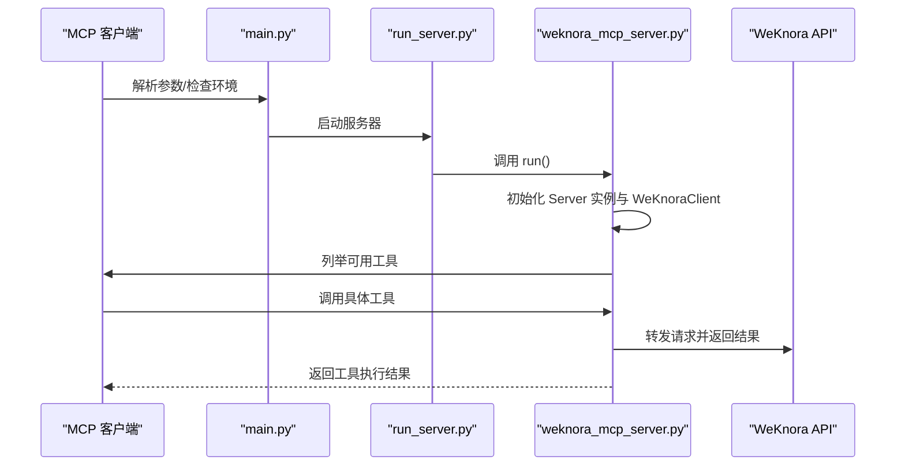
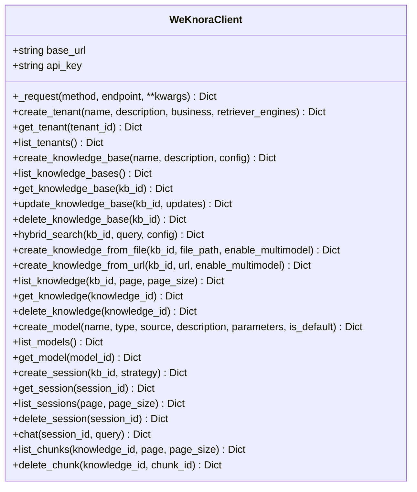
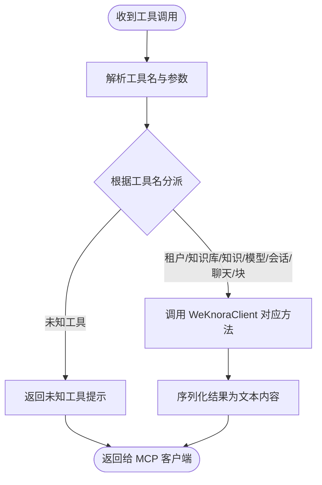
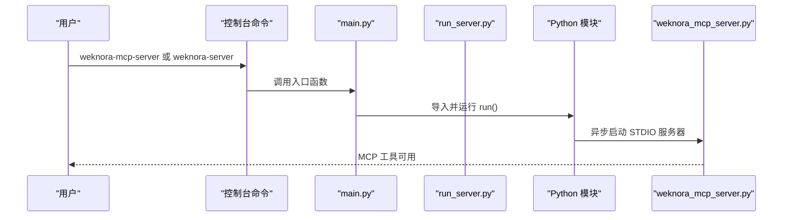
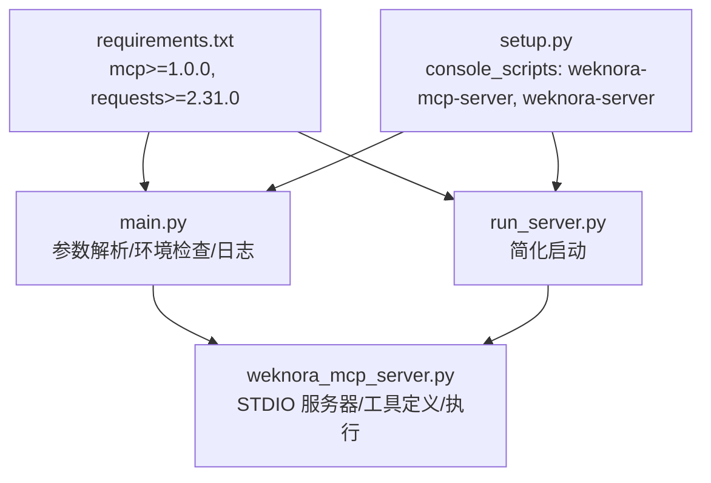

# MCP服务器

<cite>
**本文引用的文件**
- [mcp-server/weknora_mcp_server.py](file://mcp-server/weknora_mcp_server.py)
- [mcp-server/main.py](file://mcp-server/main.py)
- [mcp-server/run_server.py](file://mcp-server/run_server.py)
- [mcp-server/run.py](file://mcp-server/run.py)
- [mcp-server/README.md](file://mcp-server/README.md)
- [mcp-server/MCP_CONFIG.md](file://mcp-server/MCP_CONFIG.md)
- [mcp-server/requirements.txt](file://mcp-server/requirements.txt)
- [mcp-server/setup.py](file://mcp-server/setup.py)
- [mcp-server/test_module.py](file://mcp-server/test_module.py)
- [mcp-server/test_imports.py](file://mcp-server/test_imports.py)
</cite>

## 目录
1. [简介](#简介)
2. [项目结构](#项目结构)
3. [核心组件](#核心组件)
4. [架构总览](#架构总览)
5. [详细组件分析](#详细组件分析)
6. [依赖关系分析](#依赖关系分析)
7. [性能与可扩展性](#性能与可扩展性)
8. [故障排查指南](#故障排查指南)
9. [结论](#结论)
10. [附录](#附录)

## 简介
本文件面向开发者，系统化介绍 WeKnora 新版中的 MCP（Model Context Protocol）服务器实现与使用方法。MCP 协议旨在让外部客户端（如 Claude、Cursor 等）通过标准协议调用本地或远端的工具与资源，从而无缝集成 WeKnora 的知识管理能力。本仓库中的 MCP 服务器以 Python 实现，通过 STDIO 通道与 MCP 客户端通信，将 WeKnora 的知识库、模型、会话与聊天等能力封装为工具集，供外部系统按需调用。

在 WeKnora_New 中，MCP 服务器的作用是：
- 将 WeKnora 的知识管理 API 暴露为 MCP 工具，便于外部编辑器或 AI 助手直接检索与对话。
- 提供统一的上下文管理策略（如会话策略、重写策略、阈值等），简化外部系统接入成本。
- 通过标准化的工具定义与输入 Schema，降低跨系统集成的复杂度。

## 项目结构
mcp-server 目录包含 MCP 服务器的全部实现与配套脚本，主要文件如下：
- weknora_mcp_server.py：MCP 服务器主体，定义工具集、处理工具调用、封装 WeKnora API 客户端。
- main.py：统一入口点，负责环境检查、参数解析、日志控制与启动。
- run_server.py：简化启动脚本，适合快速运行。
- run.py：便捷启动脚本，提供最小化功能。
- README.md：快速开始、安装与使用说明。
- MCP_CONFIG.md：基于 uv 的 MCP 客户端配置示例。
- requirements.txt：运行依赖。
- setup.py：打包与安装配置，定义控制台命令入口。
- test_module.py 与 test_imports.py：模块导入与运行测试脚本。

图表来源
- [mcp-server/weknora_mcp_server.py](file://mcp-server/weknora_mcp_server.py#L1-L673)
- [mcp-server/main.py](file://mcp-server/main.py#L1-L141)
- [mcp-server/run_server.py](file://mcp-server/run_server.py#L1-L43)
- [mcp-server/run.py](file://mcp-server/run.py#L1-L44)
- [mcp-server/README.md](file://mcp-server/README.md#L1-L139)
- [mcp-server/MCP_CONFIG.md](file://mcp-server/MCP_CONFIG.md#L1-L115)
- [mcp-server/requirements.txt](file://mcp-server/requirements.txt#L1-L2)
- [mcp-server/setup.py](file://mcp-server/setup.py#L1-L61)
- [mcp-server/test_module.py](file://mcp-server/test_module.py#L1-L231)
- [mcp-server/test_imports.py](file://mcp-server/test_imports.py#L1-L38)

章节来源
- [mcp-server/README.md](file://mcp-server/README.md#L1-L139)
- [mcp-server/MCP_CONFIG.md](file://mcp-server/MCP_CONFIG.md#L1-L115)

## 核心组件
- WeKnoraClient：封装 WeKnora API 的客户端，负责租户、知识库、知识、模型、会话、聊天、块等接口的调用，并统一处理请求头与错误。
- MCP Server（Server 实例）：注册工具列表与工具执行回调，通过 STDIO 与 MCP 客户端交互。
- 工具定义（Tools）：覆盖租户管理、知识库管理、知识管理、模型管理、会话管理、聊天、块管理等全链路能力。
- 启动入口：main.py 提供统一入口；run_server.py 与 run.py 提供简化入口；setup.py 注册控制台命令。

章节来源
- [mcp-server/weknora_mcp_server.py](file://mcp-server/weknora_mcp_server.py#L28-L202)
- [mcp-server/weknora_mcp_server.py](file://mcp-server/weknora_mcp_server.py#L208-L495)
- [mcp-server/weknora_mcp_server.py](file://mcp-server/weknora_mcp_server.py#L496-L673)
- [mcp-server/main.py](file://mcp-server/main.py#L1-L141)
- [mcp-server/run_server.py](file://mcp-server/run_server.py#L1-L43)
- [mcp-server/run.py](file://mcp-server/run.py#L1-L44)
- [mcp-server/setup.py](file://mcp-server/setup.py#L1-L61)

## 架构总览
MCP 服务器采用 STDIO 通道与客户端通信，工具定义与执行均在 weknora_mcp_server.py 中完成。main.py 负责环境检查、参数解析与日志级别控制，并委托 run() 启动 MCP 服务器。MCP 客户端（如 Claude Desktop、Cursor）通过配置指向 uv 与 run_server.py，传入环境变量（WEKNORA_BASE_URL、WEKNORA_API_KEY）即可连接。

图表来源
- [mcp-server/main.py](file://mcp-server/main.py#L91-L141)
- [mcp-server/run_server.py](file://mcp-server/run_server.py#L24-L43)
- [mcp-server/weknora_mcp_server.py](file://mcp-server/weknora_mcp_server.py#L650-L673)

## 详细组件分析

### WeKnoraClient 组件
- 职责：封装 WeKnora API 的 HTTP 请求，统一处理请求头（含 X-API-Key）、错误与响应。
- 关键能力：
  - 租户管理：创建、查询、列出租户。
  - 知识库管理：创建、查询、列出、更新、删除知识库。
  - 知识管理：从文件/URL 创建知识，列出知识，查询与删除知识。
  - 模型管理：创建、查询、列出模型。
  - 会话管理：创建、查询、列出、删除会话。
  - 聊天：向指定会话发送消息（返回流式数据，简化处理）。
  - 块管理：列出与删除知识块。
- 设计要点：
  - 使用 requests.Session 统一会话与头部。
  - 对 multipart/form-data 场景临时移除 Content-Type 并单独传递文件字段。
  - 对 SSE 场景简化为 JSON 返回以便 MCP 传输。

图表来源
- [mcp-server/weknora_mcp_server.py](file://mcp-server/weknora_mcp_server.py#L28-L202)

章节来源
- [mcp-server/weknora_mcp_server.py](file://mcp-server/weknora_mcp_server.py#L28-L202)

### MCP Server 工具定义与执行
- 工具注册：通过装饰器注册工具列表，每个工具包含名称、描述与输入 Schema。
- 工具执行：handle_call_tool 根据工具名分派到 WeKnoraClient 的对应方法，组装参数（含默认策略与阈值），并将结果包装为文本内容返回。
- 上下文管理策略：
  - 会话策略：最大轮数、是否启用查询重写、回退策略与固定回复、向量/关键词阈值、摘要模型等。
  - 混合检索策略：向量相似度阈值、关键词匹配阈值、返回条数等。
  - 分页策略：知识、会话、块列表的分页参数默认值。
- 错误处理：捕获异常并返回人类可读的错误信息。

图表来源
- [mcp-server/weknora_mcp_server.py](file://mcp-server/weknora_mcp_server.py#L208-L495)
- [mcp-server/weknora_mcp_server.py](file://mcp-server/weknora_mcp_server.py#L496-L673)

章节来源
- [mcp-server/weknora_mcp_server.py](file://mcp-server/weknora_mcp_server.py#L208-L495)
- [mcp-server/weknora_mcp_server.py](file://mcp-server/weknora_mcp_server.py#L496-L673)

### 启动流程与入口点
- main.py：解析命令行参数（检查环境、详细日志、版本），导入并异步运行 run()。
- run_server.py：检查环境变量，导入并运行 run()。
- run.py：最简入口，打印环境信息并委托 main。
- setup.py：注册控制台命令 weknora-mcp-server 与 weknora-server，指向不同入口。

图表来源
- [mcp-server/setup.py](file://mcp-server/setup.py#L48-L56)
- [mcp-server/main.py](file://mcp-server/main.py#L91-L141)
- [mcp-server/run_server.py](file://mcp-server/run_server.py#L24-L43)
- [mcp-server/weknora_mcp_server.py](file://mcp-server/weknora_mcp_server.py#L650-L673)

章节来源
- [mcp-server/main.py](file://mcp-server/main.py#L1-L141)
- [mcp-server/run_server.py](file://mcp-server/run_server.py#L1-L43)
- [mcp-server/run.py](file://mcp-server/run.py#L1-L44)
- [mcp-server/setup.py](file://mcp-server/setup.py#L1-L61)

## 依赖关系分析
- 运行依赖：mcp（>=1.0.0）、requests（>=2.31.0）。
- 控制台入口：weknora-mcp-server 与 weknora-server。
- MCP 客户端配置：通过 uv 指向 run_server.py，并设置 WEKNORA_BASE_URL 与 WEKNORA_API_KEY。

图表来源
- [mcp-server/requirements.txt](file://mcp-server/requirements.txt#L1-L2)
- [mcp-server/setup.py](file://mcp-server/setup.py#L48-L56)
- [mcp-server/main.py](file://mcp-server/main.py#L54-L115)
- [mcp-server/run_server.py](file://mcp-server/run_server.py#L1-L43)
- [mcp-server/weknora_mcp_server.py](file://mcp-server/weknora_mcp_server.py#L650-L673)

章节来源
- [mcp-server/requirements.txt](file://mcp-server/requirements.txt#L1-L2)
- [mcp-server/setup.py](file://mcp-server/setup.py#L1-L61)
- [mcp-server/main.py](file://mcp-server/main.py#L54-L115)
- [mcp-server/run_server.py](file://mcp-server/run_server.py#L1-L43)
- [mcp-server/weknora_mcp_server.py](file://mcp-server/weknora_mcp_server.py#L650-L673)

## 性能与可扩展性
- 连接与会话：WeKnoraClient 使用 requests.Session，减少 TCP 握手开销，建议在高并发场景下复用会话并合理设置超时。
- 请求头与多部分上传：对 multipart/form-data 场景临时移除 Content-Type，避免框架自动设置导致签名或服务端解析问题，注意与服务端兼容性。
- 流式响应：聊天接口返回 SSE，当前实现简化为 JSON，若需要流式输出，可在 MCP 层做适配。
- 默认策略：会话与混合检索的阈值与返回数量有默认值，可根据业务场景调整以平衡召回与质量。
- 可扩展点：新增工具时，遵循现有 Schema 定义与参数组装模式，保持一致的错误处理与日志记录。

[本节为通用建议，不直接分析具体文件]

## 故障排查指南
- 依赖缺失：确认已安装 mcp 与 requests；可通过 test_imports.py 与 test_module.py 验证导入与运行。
- 环境变量：WEKNORA_BASE_URL 与 WEKNORA_API_KEY 未设置时会打印警告；建议在 MCP 客户端配置中显式设置。
- 启动失败：使用 main.py 的 --check-only 检查环境；使用 --verbose 查看详细日志；使用 --help 查看帮助。
- 控制台命令：确保已安装包或使用 python -m 方式运行；setup.py 注册了两个命令入口。
- MCP 客户端：参考 MCP_CONFIG.md，确保 uv 指向正确的 run_server.py，并设置正确的环境变量。

章节来源
- [mcp-server/test_imports.py](file://mcp-server/test_imports.py#L1-L38)
- [mcp-server/test_module.py](file://mcp-server/test_module.py#L1-L231)
- [mcp-server/main.py](file://mcp-server/main.py#L36-L115)
- [mcp-server/MCP_CONFIG.md](file://mcp-server/MCP_CONFIG.md#L1-L115)
- [mcp-server/README.md](file://mcp-server/README.md#L1-L139)

## 结论
本 MCP 服务器将 WeKnora 的知识管理能力以标准化工具的形式暴露给外部系统，借助 STDIO 与 MCP 客户端（Claude Desktop、Cursor 等）实现即插即用的检索与对话能力。通过清晰的工具定义、统一的上下文管理策略与完善的启动入口，开发者可以快速集成并扩展 MCP 能力，满足不同场景下的知识增强需求。

[本节为总结性内容，不直接分析具体文件]

## 附录

### 配置与运行步骤
- 安装依赖：使用 requirements.txt 安装 mcp 与 requests。
- 设置环境变量：WEKNORA_BASE_URL 与 WEKNORA_API_KEY。
- 启动方式：
  - 推荐：python main.py
  - 其他：python run_server.py、python run.py、python weknora_mcp_server.py、python -m weknora_mcp_server
  - 安装后：weknora-mcp-server 或 weknora-server
- MCP 客户端配置：参考 MCP_CONFIG.md，使用 uv 指向 run_server.py，并设置环境变量。

章节来源
- [mcp-server/README.md](file://mcp-server/README.md#L1-L139)
- [mcp-server/MCP_CONFIG.md](file://mcp-server/MCP_CONFIG.md#L1-L115)
- [mcp-server/requirements.txt](file://mcp-server/requirements.txt#L1-L2)
- [mcp-server/setup.py](file://mcp-server/setup.py#L48-L56)

### 使用示例（概念性）
- 在 MCP 客户端中添加 weknora 服务器配置，指向 uv 与 run_server.py。
- 在客户端中调用工具：
  - 创建知识库：提供名称与描述，可选嵌入与摘要模型 ID。
  - 混合检索：提供知识库 ID 与查询语句，可调整阈值与返回数量。
  - 从文件/URL 创建知识：提供知识库 ID 与文件路径或 URL。
  - 创建会话：提供知识库 ID 与会话策略（轮数、重写、阈值、摘要模型等）。
  - 发送消息：提供会话 ID 与查询语句。
  - 列出/获取/删除知识与块：提供相应 ID 与分页参数。
- 注意：工具输入均带有 Schema 定义，客户端应按要求提供参数。

章节来源
- [mcp-server/weknora_mcp_server.py](file://mcp-server/weknora_mcp_server.py#L208-L495)
- [mcp-server/MCP_CONFIG.md](file://mcp-server/MCP_CONFIG.md#L1-L115)