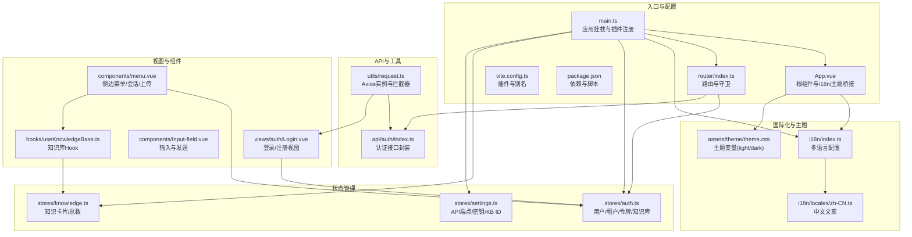
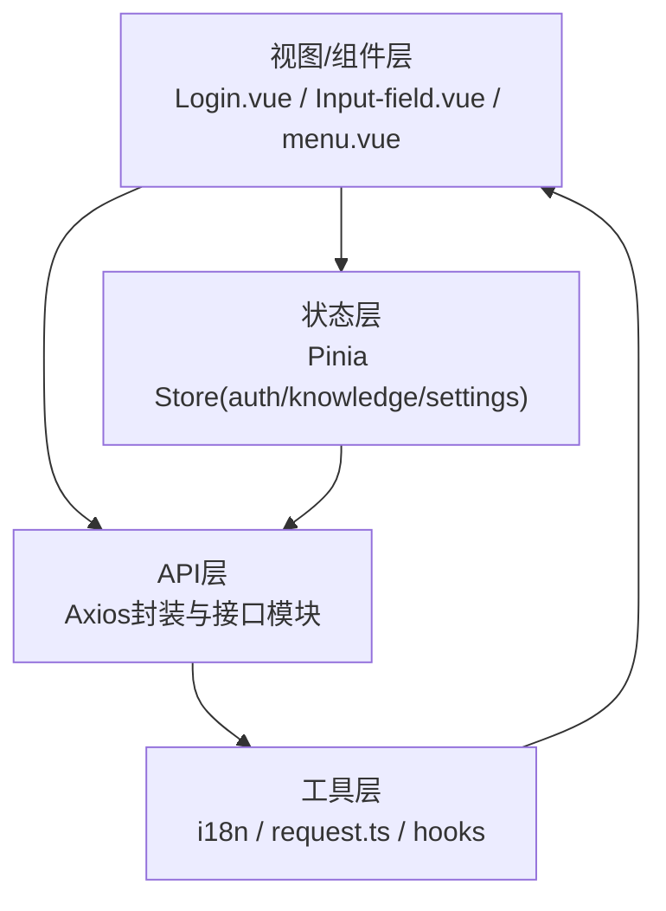
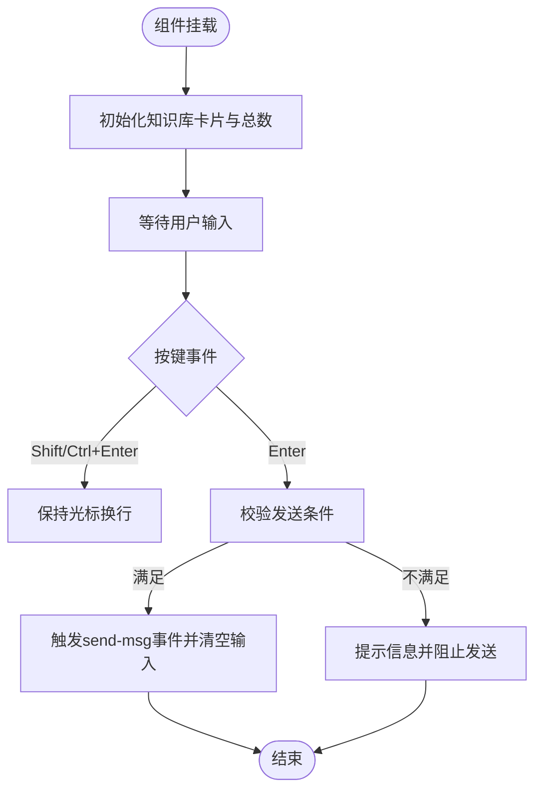
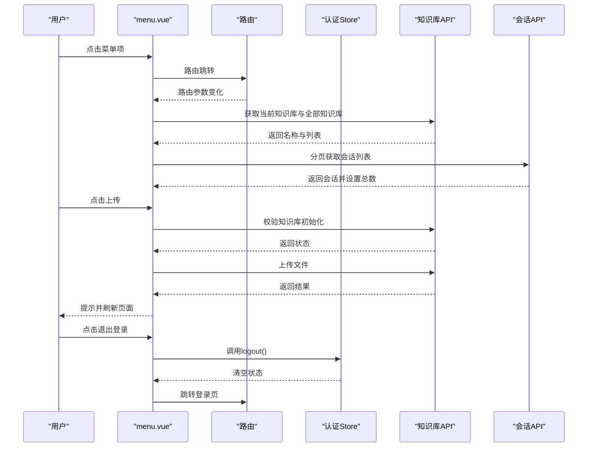
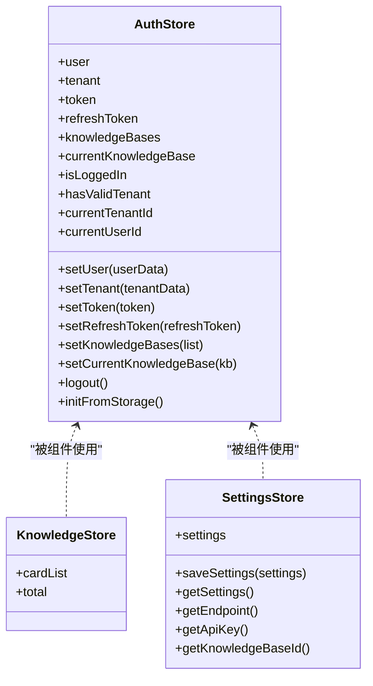
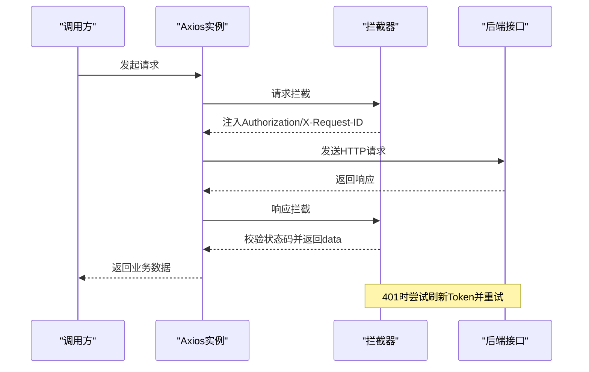
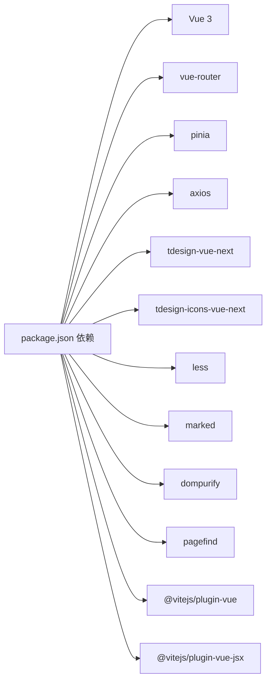

# 前端应用

<cite>
**本文档引用的文件**
- [package.json](file://frontend/package.json)
- [vite.config.ts](file://frontend/vite.config.ts)
- [main.ts](file://frontend/src/main.ts)
- [App.vue](file://frontend/src/App.vue)
- [router/index.ts](file://frontend/src/router/index.ts)
- [components/Input-field.vue](file://frontend/src/components/Input-field.vue)
- [components/menu.vue](file://frontend/src/components/menu.vue)
- [stores/auth.ts](file://frontend/src/stores/auth.ts)
- [stores/knowledge.ts](file://frontend/src/stores/knowledge.ts)
- [stores/settings.ts](file://frontend/src/stores/settings.ts)
- [api/auth/index.ts](file://frontend/src/api/auth/index.ts)
- [utils/request.ts](file://frontend/src/utils/request.ts)
- [i18n/index.ts](file://frontend/src/i18n/index.ts)
- [i18n/locales/zh-CN.ts](file://frontend/src/i18n/locales/zh-CN.ts)
- [assets/theme/theme.css](file://frontend/src/assets/theme/theme.css)
- [hooks/useKnowledgeBase.ts](file://frontend/src/hooks/useKnowledgeBase.ts)
- [views/auth/Login.vue](file://frontend/src/views/auth/Login.vue)
</cite>

## 目录
1. [简介](#简介)
2. [项目结构](#项目结构)
3. [核心组件](#核心组件)
4. [架构总览](#架构总览)
5. [详细组件分析](#详细组件分析)
6. [依赖关系分析](#依赖关系分析)
7. [性能考量](#性能考量)
8. [故障排查指南](#故障排查指南)
9. [结论](#结论)
10. [附录](#附录)

## 简介
本文件面向WeKnora_New前端应用，围绕Vue 3 + Vite + Pinia技术栈，系统化梳理项目结构、UI组件、状态管理、API集成与国际化、主题定制等内容。文档既帮助开发者快速理解架构与实现细节，也指导用户高效完成登录、知识库管理、对话交互等典型操作。

## 项目结构
前端位于frontend目录，采用Vite构建，使用TypeScript与Vue 3 Composition API，Pinia进行状态管理，TDesign作为UI组件库，支持多语言与主题切换。路由采用vue-router，Axios封装统一请求与鉴权拦截。

图表来源
- [main.ts](file://frontend/src/main.ts#L1-L19)
- [App.vue](file://frontend/src/App.vue#L1-L46)
- [router/index.ts](file://frontend/src/router/index.ts#L1-L118)
- [vite.config.ts](file://frontend/vite.config.ts#L1-L17)
- [package.json](file://frontend/package.json#L1-L52)
- [stores/auth.ts](file://frontend/src/stores/auth.ts#L1-L169)
- [stores/knowledge.ts](file://frontend/src/stores/knowledge.ts#L1-L12)
- [stores/settings.ts](file://frontend/src/stores/settings.ts#L1-L51)
- [utils/request.ts](file://frontend/src/utils/request.ts#L1-L199)
- [api/auth/index.ts](file://frontend/src/api/auth/index.ts#L1-L240)
- [i18n/index.ts](file://frontend/src/i18n/index.ts#L1-L24)
- [i18n/locales/zh-CN.ts](file://frontend/src/i18n/locales/zh-CN.ts#L1-L200)
- [assets/theme/theme.css](file://frontend/src/assets/theme/theme.css#L1-L95)
- [views/auth/Login.vue](file://frontend/src/views/auth/Login.vue#L1-L200)
- [components/Input-field.vue](file://frontend/src/components/Input-field.vue#L1-L139)
- [components/menu.vue](file://frontend/src/components/menu.vue#L1-L200)
- [hooks/useKnowledgeBase.ts](file://frontend/src/hooks/useKnowledgeBase.ts#L1-L167)

章节来源
- [package.json](file://frontend/package.json#L1-L52)
- [vite.config.ts](file://frontend/vite.config.ts#L1-L17)
- [main.ts](file://frontend/src/main.ts#L1-L19)
- [App.vue](file://frontend/src/App.vue#L1-L46)

## 核心组件
- 应用入口与插件注册：在入口文件中注册TDesign、Pinia、路由与i18n，并挂载应用。
- 根组件与主题桥接：通过ConfigProvider将i18n语言映射到TDesign组件库区域设置，统一全局样式与字体。
- 路由与守卫：定义平台级路由、子路由与权限守卫，控制登录态与初始化状态。
- 状态管理：Pinia Store集中管理用户信息、租户信息、令牌、知识库列表与当前KB、设置项。
- API封装：Axios实例统一处理基础URL、超时、请求头注入、响应拦截与Token刷新。
- 国际化：基于vue-i18n，支持中/英/俄三语，持久化语言偏好。
- 主题系统：CSS自定义属性定义品牌色、背景、文字、圆角与阴影，支持明暗主题切换。

章节来源
- [main.ts](file://frontend/src/main.ts#L1-L19)
- [App.vue](file://frontend/src/App.vue#L1-L46)
- [router/index.ts](file://frontend/src/router/index.ts#L1-L118)
- [stores/auth.ts](file://frontend/src/stores/auth.ts#L1-L169)
- [stores/settings.ts](file://frontend/src/stores/settings.ts#L1-L51)
- [utils/request.ts](file://frontend/src/utils/request.ts#L1-L199)
- [i18n/index.ts](file://frontend/src/i18n/index.ts#L1-L24)
- [assets/theme/theme.css](file://frontend/src/assets/theme/theme.css#L1-L95)

## 架构总览
前端采用“视图-组件-状态-API-工具”分层：
- 视图层：Login.vue、知识库与聊天视图等，负责用户交互与业务流程。
- 组件层：Input-field.vue、menu.vue等复用UI与交互逻辑。
- 状态层：Pinia Store管理用户、知识库、设置等跨组件共享状态。
- API层：Axios封装与接口模块，统一错误处理与鉴权。
- 工具层：国际化、安全、请求辅助函数等。

图表来源
- [views/auth/Login.vue](file://frontend/src/views/auth/Login.vue#L1-L200)
- [components/Input-field.vue](file://frontend/src/components/Input-field.vue#L1-L139)
- [components/menu.vue](file://frontend/src/components/menu.vue#L1-L200)
- [stores/auth.ts](file://frontend/src/stores/auth.ts#L1-L169)
- [stores/knowledge.ts](file://frontend/src/stores/knowledge.ts#L1-L12)
- [stores/settings.ts](file://frontend/src/stores/settings.ts#L1-L51)
- [utils/request.ts](file://frontend/src/utils/request.ts#L1-L199)
- [i18n/index.ts](file://frontend/src/i18n/index.ts#L1-L24)

## 详细组件分析

### 输入组件 Input-field.vue
- 功能概述
  - 提供多行文本输入框，支持回车发送、清空、禁用发送条件校验。
  - 与知识库Hook联动，显示来源数量，保障上传与提问的正确性。
  - 使用MessagePlugin进行提示反馈。
- 关键行为
  - 键盘事件处理：支持Shift/Ctrl+Enter换行，Enter发送。
  - 发送前校验：空内容、未上传知识库、正在回复中等场景提示。
  - 清空输入与路由变更时清理状态。
- 交互与样式
  - 使用TDesign TextArea，配合scoped样式与Less变量。
  - 发送按钮与来源计数位置固定，适配底部悬浮布局。

图表来源
- [components/Input-field.vue](file://frontend/src/components/Input-field.vue#L1-L66)

章节来源
- [components/Input-field.vue](file://frontend/src/components/Input-field.vue#L1-L139)

### 侧边菜单组件 menu.vue
- 功能概述
  - 平台导航：知识库列表、知识库详情、创建对话、租户信息、系统设置、退出登录。
  - 会话列表：按当前知识库过滤并滚动加载，支持删除会话。
  - 知识库切换：根据路由参数动态切换当前知识库，支持下拉切换与图标状态。
  - 文件上传：校验知识库初始化状态与文件类型，上传后通过自定义事件刷新页面。
  - 退出登录：调用认证Store并跳转登录页。
- 关键逻辑
  - 路由守卫：根据requiresAuth/requireInit控制访问。
  - 图标状态：根据当前路由动态切换图标颜色。
  - 上传流程：获取当前KB ID -> 校验初始化 -> 上传 -> 成功/失败提示 -> 刷新页面。
  - 会话管理：Promise并发获取知识库与全部知识库列表，再筛选当前KB会话。

图表来源
- [components/menu.vue](file://frontend/src/components/menu.vue#L1-L200)
- [router/index.ts](file://frontend/src/router/index.ts#L1-L118)
- [stores/auth.ts](file://frontend/src/stores/auth.ts#L1-L169)
- [api/auth/index.ts](file://frontend/src/api/auth/index.ts#L1-L240)

章节来源
- [components/menu.vue](file://frontend/src/components/menu.vue#L1-L575)
- [router/index.ts](file://frontend/src/router/index.ts#L1-L118)

### 认证与状态管理（Pinia）
- auth.store
  - 状态：用户、租户、令牌、刷新令牌、知识库列表、当前知识库。
  - 计算属性：登录态、租户有效、当前租户ID/用户ID。
  - 方法：设置/移除用户/租户/令牌/知识库，登出清理localStorage，从localStorage恢复状态。
- knowledge.store
  - 状态：卡片列表、总数。
- settings.store
  - 状态：端点、API Key、知识库ID。
  - 方法：保存/读取设置，按环境变量决定默认端点，持久化至localStorage。

图表来源
- [stores/auth.ts](file://frontend/src/stores/auth.ts#L1-L169)
- [stores/knowledge.ts](file://frontend/src/stores/knowledge.ts#L1-L12)
- [stores/settings.ts](file://frontend/src/stores/settings.ts#L1-L51)

章节来源
- [stores/auth.ts](file://frontend/src/stores/auth.ts#L1-L169)
- [stores/knowledge.ts](file://frontend/src/stores/knowledge.ts#L1-L12)
- [stores/settings.ts](file://frontend/src/stores/settings.ts#L1-L51)

### API集成模式（Axios）
- Axios实例
  - 基础URL：根据环境变量决定是否为空（Docker部署）。
  - 请求头：自动注入Authorization与X-Request-ID。
  - 超时：30秒。
- 拦截器
  - 请求：注入Authorization与随机请求ID。
  - 响应：统一返回data；401处理：对非刷新接口尝试刷新Token；刷新失败则清空本地令牌并跳转登录。
- 接口封装
  - 认证：登录、注册、获取当前用户/租户、刷新Token、登出、验证Token。
  - Chat/知识库：上传文件、列表查询、详情查询、删除等（在对应API模块中）。
- 流程示意

图表来源
- [utils/request.ts](file://frontend/src/utils/request.ts#L1-L199)
- [api/auth/index.ts](file://frontend/src/api/auth/index.ts#L1-L240)

章节来源
- [utils/request.ts](file://frontend/src/utils/request.ts#L1-L199)
- [api/auth/index.ts](file://frontend/src/api/auth/index.ts#L1-L240)

### 国际化与主题定制
- 国际化
  - 使用vue-i18n，支持zh-CN、en-US、ru-RU。
  - 语言偏好持久化到localStorage，默认使用zh-CN。
  - App.vue通过ConfigProvider将locale映射到TDesign区域设置。
- 主题
  - CSS自定义属性定义品牌色、背景、文字、圆角与阴影。
  - 支持明/暗两种主题模式，通过根元素属性切换。
  - 可通过覆盖变量或引入自定义样式文件进行扩展。

章节来源
- [i18n/index.ts](file://frontend/src/i18n/index.ts#L1-L24)
- [i18n/locales/zh-CN.ts](file://frontend/src/i18n/locales/zh-CN.ts#L1-L200)
- [App.vue](file://frontend/src/App.vue#L1-L46)
- [assets/theme/theme.css](file://frontend/src/assets/theme/theme.css#L1-L95)

### 登录视图 Login.vue
- 功能概述
  - 支持登录/注册双模式切换。
  - 表单校验：邮箱、密码长度与字符要求。
  - 调用认证API，成功后写入Store与localStorage，跳转知识库列表。
- 交互要点
  - Enter键触发提交。
  - 加载态与按钮文案切换。
  - 语言切换器组件集成。

章节来源
- [views/auth/Login.vue](file://frontend/src/views/auth/Login.vue#L1-L200)
- [api/auth/index.ts](file://frontend/src/api/auth/index.ts#L1-L240)
- [stores/auth.ts](file://frontend/src/stores/auth.ts#L1-L169)

## 依赖关系分析
- 技术栈
  - Vue 3 + Vite + TypeScript + Pinia + TDesign + vue-i18n + axios。
- 关键依赖
  - 组件库：tdesign-vue-next、tdesign-icons-vue-next。
  - 状态：pinia。
  - 路由：vue-router。
  - 网络：axios。
  - 文档渲染：marked。
  - 安全：dompurify。
  - 搜索：pagefind。
- 构建与开发
  - 插件：@vitejs/plugin-vue、@vitejs/plugin-vue-jsx。
  - 样式：less/less-loader。
  - 类型：typescript、@vue/tsconfig。

图表来源
- [package.json](file://frontend/package.json#L1-L52)

章节来源
- [package.json](file://frontend/package.json#L1-L52)

## 性能考量
- 资源加载
  - 使用Vite按需打包，组件按需引入，减少首屏体积。
  - 图标与图片通过相对路径引用，避免额外CDN开销。
- 网络优化
  - Axios统一超时与请求头，避免重复请求。
  - 401自动刷新Token，减少手动重试。
- UI渲染
  - 组件内使用computed与storeToRefs，避免不必要的重渲染。
  - 列表滚动加载与分页，降低一次性渲染压力。
- 主题与国际化
  - CSS变量集中管理，明/暗主题切换成本低。
  - i18n消息键集中维护，便于缓存与复用。

## 故障排查指南
- 登录失败
  - 检查邮箱/密码格式与长度规则。
  - 查看后端返回的错误消息，确认账号是否存在。
- 401未授权
  - 若为登录接口，拦截器会返回具体错误信息。
  - 非登录接口401时，系统尝试刷新Token；若失败则清空本地令牌并跳转登录。
- 上传失败
  - 确认知识库已初始化（嵌入模型与摘要模型均配置）。
  - 检查文件类型与大小限制，查看提示信息。
- 会话列表不刷新
  - 确认路由参数包含正确的知识库ID。
  - 页面通过自定义事件通知刷新，检查事件是否触发。
- 语言切换无效
  - 确认localStorage中locale键值正确。
  - 刷新页面后生效。

章节来源
- [utils/request.ts](file://frontend/src/utils/request.ts#L1-L199)
- [components/menu.vue](file://frontend/src/components/menu.vue#L1-L575)
- [i18n/index.ts](file://frontend/src/i18n/index.ts#L1-L24)

## 结论
WeKnora_New前端采用现代化技术栈，结构清晰、职责明确。通过Pinia集中管理状态、Axios统一处理请求与鉴权、TDesign提供一致的UI体验、i18n与主题系统增强可维护性与可定制性。组件与Hook解耦良好，便于扩展与复用。建议后续持续完善错误边界与日志埋点，进一步提升可观测性与用户体验。

## 附录
- 环境变量
  - VITE_IS_DOCKER：用于决定API基础URL是否为空（Docker部署时为空）。
- 设置项
  - API端点、API Key、知识库ID可通过设置Store读取与保存，持久化至localStorage。
- 常用路径参考
  - 登录视图：views/auth/Login.vue
  - 输入组件：components/Input-field.vue
  - 侧边菜单：components/menu.vue
  - 知识库Hook：hooks/useKnowledgeBase.ts
  - 认证API：api/auth/index.ts
  - 请求封装：utils/request.ts
  - 国际化：i18n/index.ts、i18n/locales/zh-CN.ts
  - 主题：assets/theme/theme.css