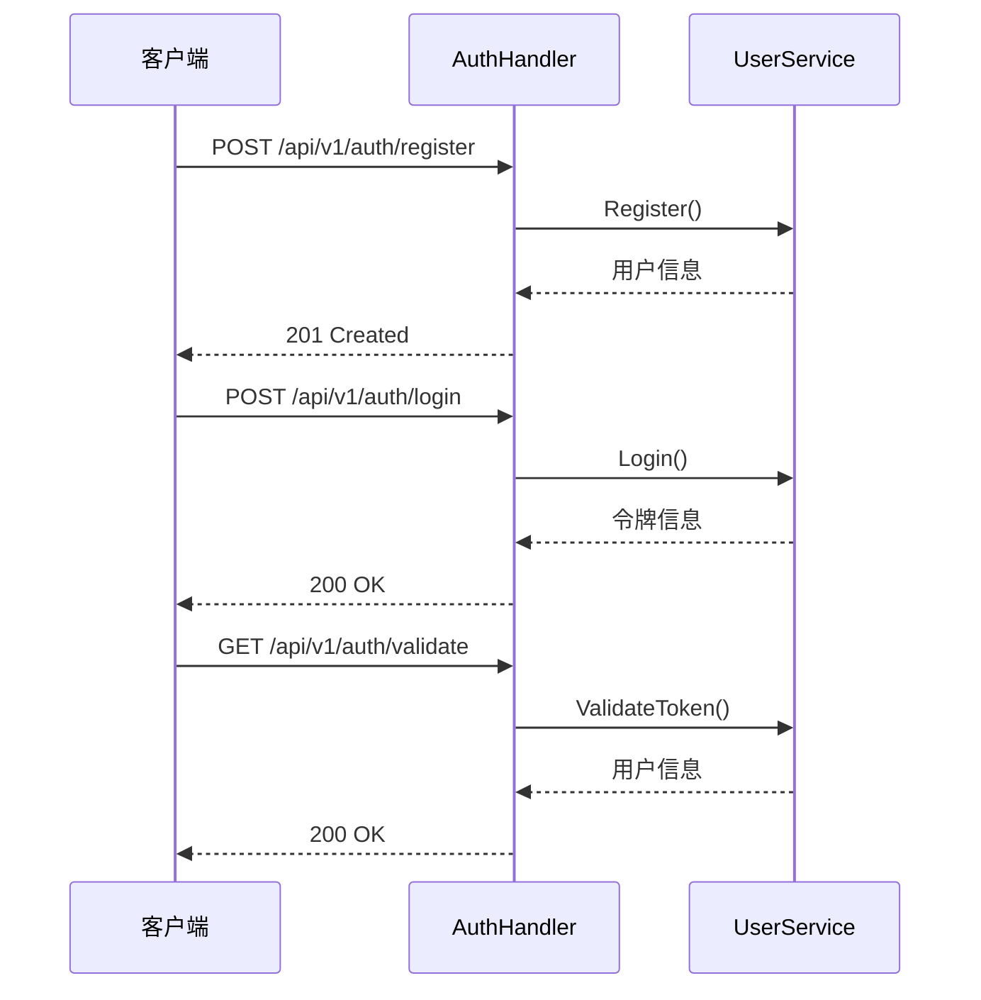
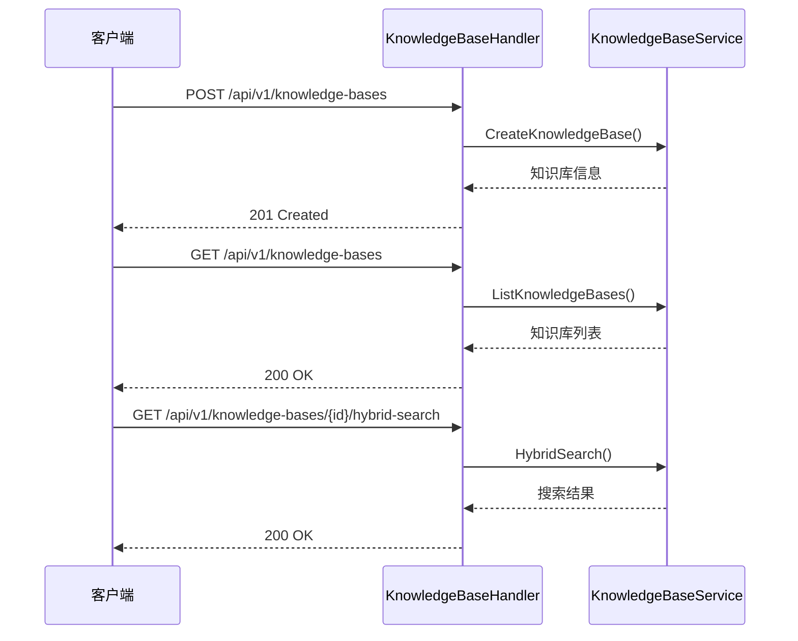
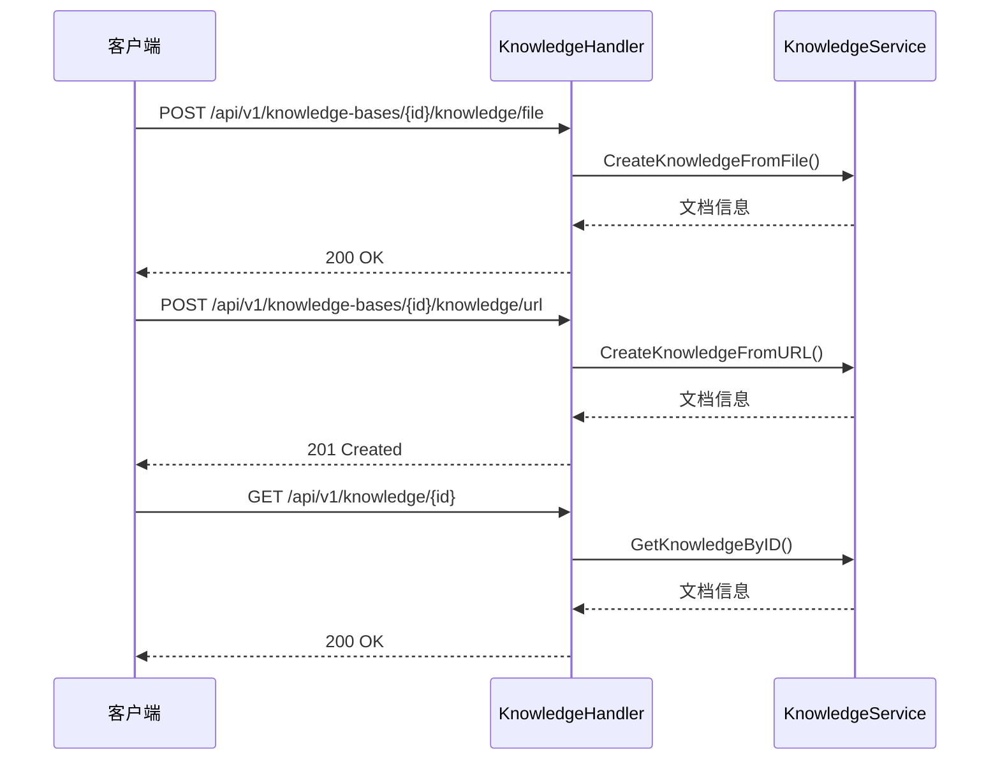
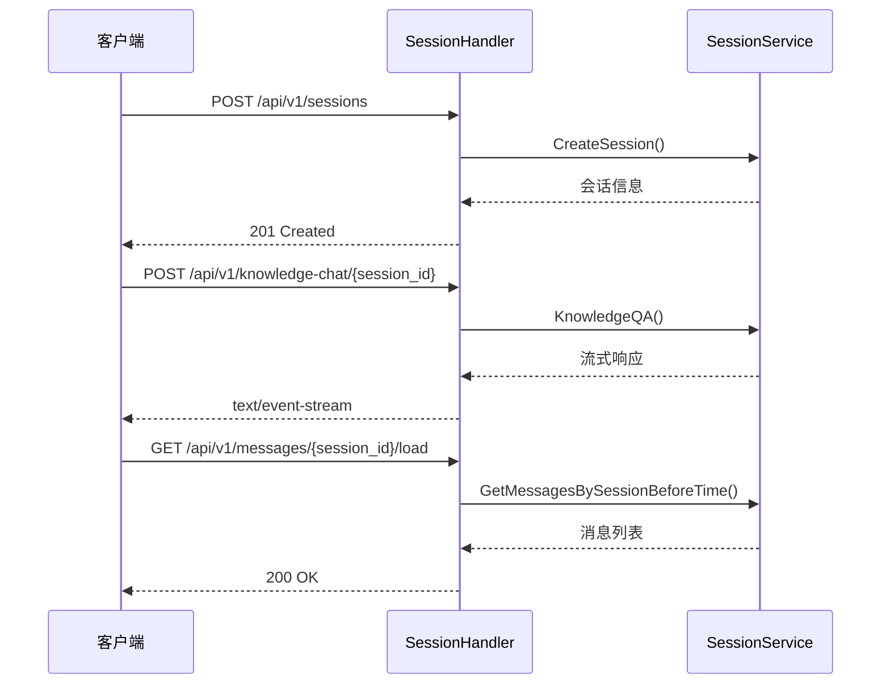
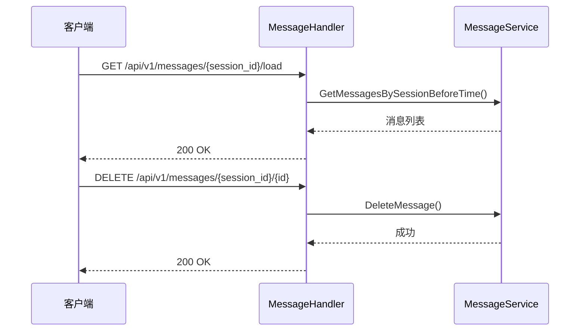
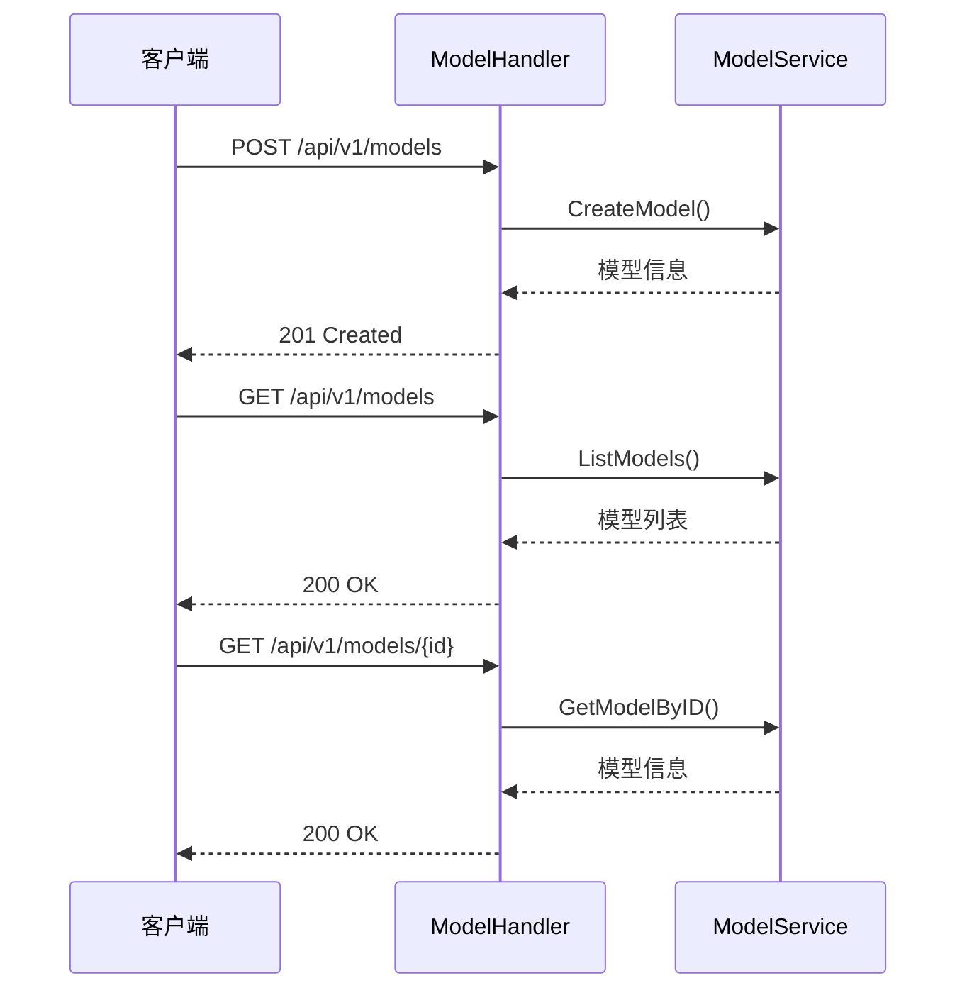
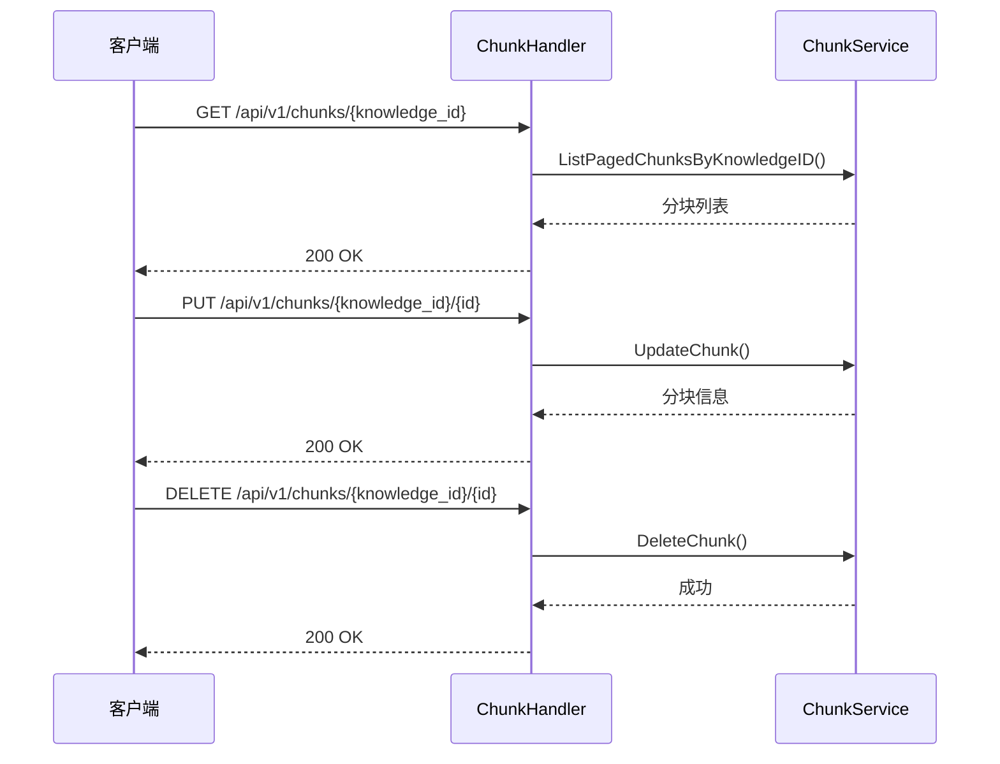
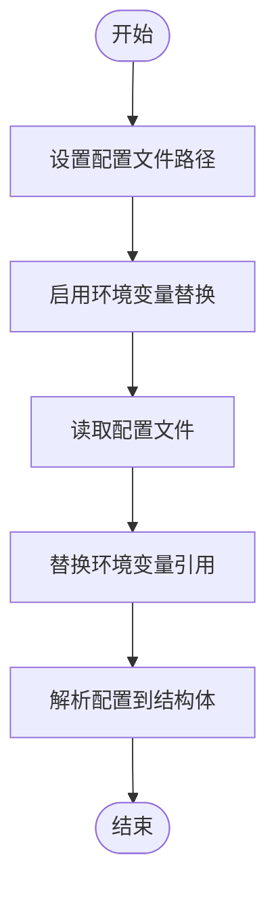
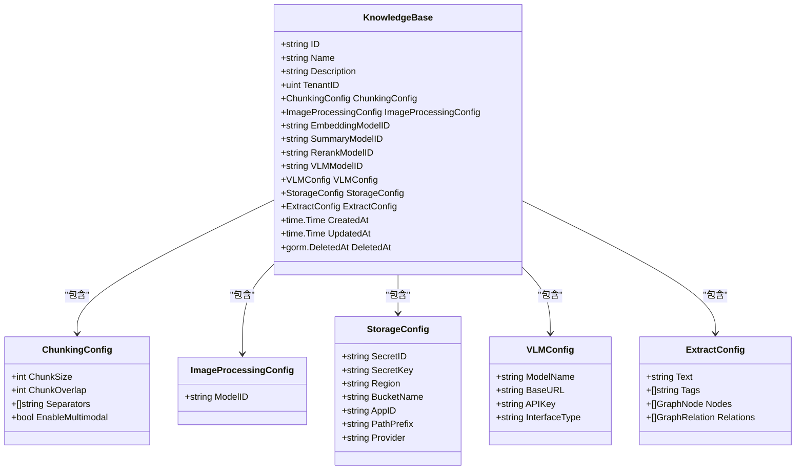
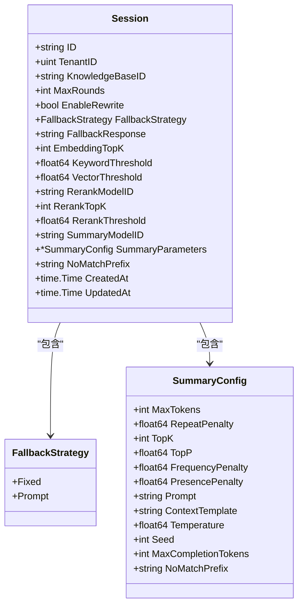

# 后端服务

<cite>
**本文档引用的文件**   
- [main.go](file://cmd/server/main.go)
- [config.yaml](file://config/config.yaml)
- [config.go](file://internal/config/config.go)
- [router.go](file://internal/router/router.go)
- [auth.go](file://internal/handler/auth.go)
- [knowledgebase.go](file://internal/handler/knowledgebase.go)
- [knowledge.go](file://internal/handler/knowledge.go)
- [message.go](file://internal/handler/message.go)
- [session.go](file://internal/handler/session.go)
- [model.go](file://internal/handler/model.go)
- [chunk.go](file://internal/handler/chunk.go)
- [knowledgebase.go](file://internal/types/knowledgebase.go)
- [knowledge.go](file://internal/types/knowledge.go)
- [chunk.go](file://internal/types/chunk.go)
- [session.go](file://internal/types/session.go)
- [message.go](file://internal/types/message.go)
</cite>

## 目录
1. [API参考文档](#api参考文档)
2. [配置管理系统](#配置管理系统)
3. [核心数据模型](#核心数据模型)

## API参考文档

本节详细说明WeKnora_New后端服务提供的所有API接口，包括认证、知识库、文档、问答、模型配置等。所有API均基于RESTful设计，使用JSON格式进行请求和响应，通过HTTP状态码表示操作结果。

### 认证接口

认证接口提供用户注册、登录、令牌刷新和身份验证功能，所有需要认证的接口都需要在请求头中包含`Authorization: Bearer <token>`。



**Diagram sources**
- [auth.go](file://internal/handler/auth.go#L36-L344)
- [router.go](file://internal/router/router.go#L241-L250)

#### 用户注册
- **HTTP方法**: POST
- **URL模式**: `/api/v1/auth/register`
- **请求头**: `Content-Type: application/json`
- **请求体**:
```json
{
  "username": "string",
  "email": "string",
  "password": "string"
}
```
- **成功响应** (201 Created):
```json
{
  "success": true,
  "message": "Registration successful",
  "user": {
    "id": "string",
    "username": "string",
    "email": "string"
  }
}
```
- **错误响应**:
  - 400 Bad Request: 参数验证失败
  - 500 Internal Server Error: 注册失败

**Section sources**
- [auth.go](file://internal/handler/auth.go#L36-L80)

#### 用户登录
- **HTTP方法**: POST
- **URL模式**: `/api/v1/auth/login`
- **请求头**: `Content-Type: application/json`
- **请求体**:
```json
{
  "email": "string",
  "password": "string"
}
```
- **成功响应** (200 OK):
```json
{
  "success": true,
  "access_token": "string",
  "refresh_token": "string",
  "user": {
    "id": "string",
    "username": "string",
    "email": "string"
  }
}
```
- **错误响应**:
  - 400 Bad Request: 缺少必要字段
  - 401 Unauthorized: 登录失败

**Section sources**
- [auth.go](file://internal/handler/auth.go#L82-L128)

#### 令牌刷新
- **HTTP方法**: POST
- **URL模式**: `/api/v1/auth/refresh`
- **请求头**: `Content-Type: application/json`
- **请求体**:
```json
{
  "refreshToken": "string"
}
```
- **成功响应** (200 OK):
```json
{
  "success": true,
  "access_token": "string",
  "refresh_token": "string"
}
```
- **错误响应**:
  - 400 Bad Request: 请求格式错误
  - 401 Unauthorized: 令牌刷新失败

**Section sources**
- [auth.go](file://internal/handler/auth.go#L175-L211)

#### 令牌验证
- **HTTP方法**: GET
- **URL模式**: `/api/v1/auth/validate`
- **请求头**: `Authorization: Bearer <token>`
- **成功响应** (200 OK):
```json
{
  "success": true,
  "message": "Token is valid",
  "user": {
    "id": "string",
    "username": "string",
    "email": "string"
  }
}
```
- **错误响应**:
  - 400 Bad Request: 缺少授权头
  - 401 Unauthorized: 令牌验证失败

**Section sources**
- [auth.go](file://internal/handler/auth.go#L299-L343)

### 知识库接口

知识库接口提供知识库的创建、查询、更新和删除功能，以及混合搜索和复制操作。



**Diagram sources**
- [knowledgebase.go](file://internal/handler/knowledgebase.go#L28-L298)
- [router.go](file://internal/router/router.go#L139-L158)

#### 创建知识库
- **HTTP方法**: POST
- **URL模式**: `/api/v1/knowledge-bases`
- **认证方式**: Bearer Token
- **请求头**: `Content-Type: application/json`
- **请求体**:
```json
{
  "name": "string",
  "description": "string",
  "config": {
    "chunking_config": {
      "chunk_size": 512,
      "chunk_overlap": 50,
      "separators": ["\n\n", "\n", "。"]
    },
    "image_processing_config": {
      "enable_multimodal": true
    }
  }
}
```
- **成功响应** (201 Created):
```json
{
  "success": true,
  "data": {
    "id": "string",
    "name": "string",
    "description": "string",
    "tenant_id": 0,
    "chunking_config": {
      "chunk_size": 512,
      "chunk_overlap": 50,
      "separators": ["\n\n", "\n", "。"]
    },
    "image_processing_config": {
      "enable_multimodal": true
    },
    "created_at": "string",
    "updated_at": "string"
  }
}
```
- **错误响应**:
  - 400 Bad Request: 请求参数无效
  - 401 Unauthorized: 未授权
  - 500 Internal Server Error: 创建失败

**Section sources**
- [knowledgebase.go](file://internal/handler/knowledgebase.go#L67-L95)

#### 获取知识库列表
- **HTTP方法**: GET
- **URL模式**: `/api/v1/knowledge-bases`
- **认证方式**: Bearer Token
- **查询参数**:
  - `page`: 页码 (默认: 1)
  - `page_size`: 每页数量 (默认: 20)
- **成功响应** (200 OK):
```json
{
  "success": true,
  "data": [
    {
      "id": "string",
      "name": "string",
      "description": "string",
      "tenant_id": 0,
      "chunking_config": {
        "chunk_size": 512,
        "chunk_overlap": 50,
        "separators": ["\n\n", "\n", "。"]
      },
      "image_processing_config": {
        "enable_multimodal": true
      },
      "created_at": "string",
      "updated_at": "string"
    }
  ],
  "total": 0,
  "page": 1,
  "page_size": 20
}
```
- **错误响应**:
  - 401 Unauthorized: 未授权
  - 500 Internal Server Error: 获取失败

**Section sources**
- [knowledgebase.go](file://internal/handler/knowledgebase.go#L158-L191)

#### 获取知识库详情
- **HTTP方法**: GET
- **URL模式**: `/api/v1/knowledge-bases/{id}`
- **认证方式**: Bearer Token
- **路径参数**:
  - `id`: 知识库ID
- **成功响应** (200 OK):
```json
{
  "success": true,
  "data": {
    "id": "string",
    "name": "string",
    "description": "string",
    "tenant_id": 0,
    "chunking_config": {
      "chunk_size": 512,
      "chunk_overlap": 50,
      "separators": ["\n\n", "\n", "。"]
    },
    "image_processing_config": {
      "enable_multimodal": true
    },
    "created_at": "string",
    "updated_at": "string"
  }
}
```
- **错误响应**:
  - 400 Bad Request: 知识库ID为空
  - 401 Unauthorized: 未授权
  - 403 Forbidden: 无权限访问
  - 500 Internal Server Error: 获取失败

**Section sources**
- [knowledgebase.go](file://internal/handler/knowledgebase.go#L139-L156)

#### 更新知识库
- **HTTP方法**: PUT
- **URL模式**: `/api/v1/knowledge-bases/{id}`
- **认证方式**: Bearer Token
- **路径参数**:
  - `id`: 知识库ID
- **请求头**: `Content-Type: application/json`
- **请求体**:
```json
{
  "name": "string",
  "description": "string",
  "config": {
    "chunking_config": {
      "chunk_size": 512,
      "chunk_overlap": 50,
      "separators": ["\n\n", "\n", "。"]
    },
    "image_processing_config": {
      "enable_multimodal": true
    }
  }
}
```
- **成功响应** (200 OK):
```json
{
  "success": true,
  "data": {
    "id": "string",
    "name": "string",
    "description": "string",
    "tenant_id": 0,
    "chunking_config": {
      "chunk_size": 512,
      "chunk_overlap": 50,
      "separators": ["\n\n", "\n", "。"]
    },
    "image_processing_config": {
      "enable_multimodal": true
    },
    "created_at": "string",
    "updated_at": "string"
  }
}
```
- **错误响应**:
  - 400 Bad Request: 请求参数无效
  - 401 Unauthorized: 未授权
  - 403 Forbidden: 无权限操作
  - 500 Internal Server Error: 更新失败

**Section sources**
- [knowledgebase.go](file://internal/handler/knowledgebase.go#L200-L235)

#### 删除知识库
- **HTTP方法**: DELETE
- **URL模式**: `/api/v1/knowledge-bases/{id}`
- **认证方式**: Bearer Token
- **路径参数**:
  - `id`: 知识库ID
- **成功响应** (200 OK):
```json
{
  "success": true,
  "message": "Knowledge base deleted successfully"
}
```
- **错误响应**:
  - 400 Bad Request: 知识库ID为空
  - 401 Unauthorized: 未授权
  - 403 Forbidden: 无权限操作
  - 500 Internal Server Error: 删除失败

**Section sources**
- [knowledgebase.go](file://internal/handler/knowledgebase.go#L237-L263)

#### 混合搜索
- **HTTP方法**: GET
- **URL模式**: `/api/v1/knowledge-bases/{id}/hybrid-search`
- **认证方式**: Bearer Token
- **路径参数**:
  - `id`: 知识库ID
- **查询参数**:
  - `query_text`: 搜索查询文本
  - `top_k`: 返回结果数量 (默认: 10)
  - `keyword_threshold`: 关键词阈值 (默认: 0.3)
  - `vector_threshold`: 向量阈值 (默认: 0.5)
- **成功响应** (200 OK):
```json
{
  "success": true,
  "data": [
    {
      "id": "string",
      "knowledge_id": "string",
      "content": "string",
      "score": 0.9,
      "metadata": {}
    }
  ]
}
```
- **错误响应**:
  - 400 Bad Request: 知识库ID为空或请求参数无效
  - 401 Unauthorized: 未授权
  - 500 Internal Server Error: 搜索失败

**Section sources**
- [knowledgebase.go](file://internal/handler/knowledgebase.go#L28-L65)

### 文档接口

文档接口提供文档的创建、查询、更新和删除功能，支持从文件和URL创建文档。



**Diagram sources**
- [knowledge.go](file://internal/handler/knowledge.go#L84-L477)
- [router.go](file://internal/router/router.go#L108-L137)

#### 从文件创建文档
- **HTTP方法**: POST
- **URL模式**: `/api/v1/knowledge-bases/{id}/knowledge/file`
- **认证方式**: Bearer Token
- **路径参数**:
  - `id`: 知识库ID
- **请求头**: `Content-Type: multipart/form-data`
- **请求参数**:
  - `file`: 文件内容 (multipart/form-data)
  - `metadata`: 元数据 (JSON字符串)
  - `enable_multimodel`: 是否启用多模态 (布尔值)
- **成功响应** (200 OK):
```json
{
  "success": true,
  "data": {
    "id": "string",
    "tenant_id": 0,
    "knowledge_base_id": "string",
    "type": "string",
    "title": "string",
    "description": "string",
    "source": "string",
    "parse_status": "string",
    "enable_status": "string",
    "embedding_model_id": "string",
    "file_name": "string",
    "file_type": "string",
    "file_size": 0,
    "file_hash": "string",
    "file_path": "string",
    "storage_size": 0,
    "metadata": {},
    "created_at": "string",
    "updated_at": "string",
    "processed_at": "string",
    "error_message": "string"
  }
}
```
- **错误响应**:
  - 400 Bad Request: 文件上传失败或参数无效
  - 401 Unauthorized: 未授权
  - 409 Conflict: 文档已存在
  - 500 Internal Server Error: 创建失败

**Section sources**
- [knowledge.go](file://internal/handler/knowledge.go#L84-L152)

#### 从URL创建文档
- **HTTP方法**: POST
- **URL模式**: `/api/v1/knowledge-bases/{id}/knowledge/url`
- **认证方式**: Bearer Token
- **路径参数**:
  - `id`: 知识库ID
- **请求头**: `Content-Type: application/json`
- **请求体**:
```json
{
  "url": "string",
  "enable_multimodel": true
}
```
- **成功响应** (201 Created):
```json
{
  "success": true,
  "data": {
    "id": "string",
    "tenant_id": 0,
    "knowledge_base_id": "string",
    "type": "string",
    "title": "string",
    "description": "string",
    "source": "string",
    "parse_status": "string",
    "enable_status": "string",
    "embedding_model_id": "string",
    "file_name": "string",
    "file_type": "string",
    "file_size": 0,
    "file_hash": "string",
    "file_path": "string",
    "storage_size": 0,
    "metadata": {},
    "created_at": "string",
    "updated_at": "string",
    "processed_at": "string",
    "error_message": "string"
  }
}
```
- **错误响应**:
  - 400 Bad Request: URL为空或格式无效
  - 401 Unauthorized: 未授权
  - 409 Conflict: 文档已存在
  - 500 Internal Server Error: 创建失败

**Section sources**
- [knowledge.go](file://internal/handler/knowledge.go#L154-L197)

#### 获取文档列表
- **HTTP方法**: GET
- **URL模式**: `/api/v1/knowledge-bases/{id}/knowledge`
- **认证方式**: Bearer Token
- **路径参数**:
  - `id`: 知识库ID
- **查询参数**:
  - `page`: 页码 (默认: 1)
  - `page_size`: 每页数量 (默认: 20)
- **成功响应** (200 OK):
```json
{
  "success": true,
  "data": [
    {
      "id": "string",
      "tenant_id": 0,
      "knowledge_base_id": "string",
      "type": "string",
      "title": "string",
      "description": "string",
      "source": "string",
      "parse_status": "string",
      "enable_status": "string",
      "embedding_model_id": "string",
      "file_name": "string",
      "file_type": "string",
      "file_size": 0,
      "file_hash": "string",
      "file_path": "string",
      "storage_size": 0,
      "metadata": {},
      "created_at": "string",
      "updated_at": "string",
      "processed_at": "string",
      "error_message": "string"
    }
  ],
  "total": 0,
  "page": 1,
  "page_size": 20
}
```
- **错误响应**:
  - 400 Bad Request: 知识库ID为空
  - 401 Unauthorized: 未授权
  - 500 Internal Server Error: 获取失败

**Section sources**
- [knowledge.go](file://internal/handler/knowledge.go#L228-L269)

#### 获取文档详情
- **HTTP方法**: GET
- **URL模式**: `/api/v1/knowledge/{id}`
- **认证方式**: Bearer Token
- **路径参数**:
  - `id`: 文档ID
- **成功响应** (200 OK):
```json
{
  "success": true,
  "data": {
    "id": "string",
    "tenant_id": 0,
    "knowledge_base_id": "string",
    "type": "string",
    "title": "string",
    "description": "string",
    "source": "string",
    "parse_status": "string",
    "enable_status": "string",
    "embedding_model_id": "string",
    "file_name": "string",
    "file_type": "string",
    "file_size": 0,
    "file_hash": "string",
    "file_path": "string",
    "storage_size": 0,
    "metadata": {},
    "created_at": "string",
    "updated_at": "string",
    "processed_at": "string",
    "error_message": "string"
  }
}
```
- **错误响应**:
  - 400 Bad Request: 文档ID为空
  - 500 Internal Server Error: 获取失败

**Section sources**
- [knowledge.go](file://internal/handler/knowledge.go#L199-L226)

#### 删除文档
- **HTTP方法**: DELETE
- **URL模式**: `/api/v1/knowledge/{id}`
- **认证方式**: Bearer Token
- **路径参数**:
  - `id`: 文档ID
- **成功响应** (200 OK):
```json
{
  "success": true,
  "message": "Deleted successfully"
}
```
- **错误响应**:
  - 400 Bad Request: 文档ID为空
  - 500 Internal Server Error: 删除失败

**Section sources**
- [knowledge.go](file://internal/handler/knowledge.go#L271-L297)

#### 批量获取文档
- **HTTP方法**: GET
- **URL模式**: `/api/v1/knowledge/batch`
- **认证方式**: Bearer Token
- **查询参数**:
  - `ids`: 文档ID列表 (逗号分隔)
- **成功响应** (200 OK):
```json
{
  "success": true,
  "data": [
    {
      "id": "string",
      "tenant_id": 0,
      "knowledge_base_id": "string",
      "type": "string",
      "title": "string",
      "description": "string",
      "source": "string",
      "parse_status": "string",
      "enable_status": "string",
      "embedding_model_id": "string",
      "file_name": "string",
      "file_type": "string",
      "file_size": 0,
      "file_hash": "string",
      "file_path": "string",
      "storage_size": 0,
      "metadata": {},
      "created_at": "string",
      "updated_at": "string",
      "processed_at": "string",
      "error_message": "string"
    }
  ]
}
```
- **错误响应**:
  - 400 Bad Request: ID列表为空或格式无效
  - 401 Unauthorized: 未授权
  - 500 Internal Server Error: 获取失败

**Section sources**
- [knowledge.go](file://internal/handler/knowledge.go#L352-L399)

#### 下载文档文件
- **HTTP方法**: GET
- **URL模式**: `/api/v1/knowledge/{id}/download`
- **认证方式**: Bearer Token
- **路径参数**:
  - `id`: 文档ID
- **成功响应**: 文件流 (Content-Disposition: attachment)
- **错误响应**:
  - 400 Bad Request: 文档ID为空
  - 500 Internal Server Error: 文件获取失败

**Section sources**
- [knowledge.go](file://internal/handler/knowledge.go#L300-L345)

### 问答接口

问答接口提供基于知识库的问答功能，支持会话管理和流式响应。



**Diagram sources**
- [session.go](file://internal/handler/session.go#L82-L800)
- [router.go](file://internal/router/router.go#L173-L200)

#### 创建会话
- **HTTP方法**: POST
- **URL模式**: `/api/v1/sessions`
- **认证方式**: Bearer Token
- **请求头**: `Content-Type: application/json`
- **请求体**:
```json
{
  "knowledge_base_id": "string",
  "session_strategy": {
    "max_rounds": 5,
    "enable_rewrite": true,
    "fallback_strategy": "fixed",
    "fallback_response": "抱歉，我无法回答这个问题。",
    "embedding_top_k": 10,
    "keyword_threshold": 0.3,
    "vector_threshold": 0.5,
    "rerank_model_id": "string",
    "rerank_top_k": 5,
    "rerank_threshold": 0.5,
    "summary_model_id": "string",
    "summary_parameters": {
      "max_tokens": 2048,
      "temperature": 0.3,
      "repeat_penalty": 1.0,
      "prompt": "string",
      "context_template": "string",
      "no_match_prefix": "NO_MATCH"
    },
    "no_match_prefix": "NO_MATCH"
  }
}
```
- **成功响应** (201 Created):
```json
{
  "success": true,
  "data": {
    "id": "string",
    "tenant_id": 0,
    "knowledge_base_id": "string",
    "max_rounds": 5,
    "enable_rewrite": true,
    "fallback_strategy": "fixed",
    "fallback_response": "抱歉，我无法回答这个问题。",
    "embedding_top_k": 10,
    "keyword_threshold": 0.3,
    "vector_threshold": 0.5,
    "rerank_model_id": "string",
    "rerank_top_k": 5,
    "rerank_threshold": 0.5,
    "summary_model_id": "string",
    "summary_parameters": {
      "max_tokens": 2048,
      "temperature": 0.3,
      "repeat_penalty": 1.0,
      "prompt": "string",
      "context_template": "string",
      "no_match_prefix": "NO_MATCH"
    },
    "no_match_prefix": "NO_MATCH",
    "created_at": "string",
    "updated_at": "string"
  }
}
```
- **错误响应**:
  - 400 Bad Request: 请求参数无效
  - 401 Unauthorized: 未授权
  - 500 Internal Server Error: 创建失败

**Section sources**
- [session.go](file://internal/handler/session.go#L82-L223)

#### 获取会话
- **HTTP方法**: GET
- **URL模式**: `/api/v1/sessions/{id}`
- **认证方式**: Bearer Token
- **路径参数**:
  - `id`: 会话ID
- **成功响应** (200 OK):
```json
{
  "success": true,
  "data": {
    "id": "string",
    "tenant_id": 0,
    "knowledge_base_id": "string",
    "max_rounds": 5,
    "enable_rewrite": true,
    "fallback_strategy": "fixed",
    "fallback_response": "抱歉，我无法回答这个问题。",
    "embedding_top_k": 10,
    "keyword_threshold": 0.3,
    "vector_threshold": 0.5,
    "rerank_model_id": "string",
    "rerank_top_k": 5,
    "rerank_threshold": 0.5,
    "summary_model_id": "string",
    "summary_parameters": {
      "max_tokens": 2048,
      "temperature": 0.3,
      "repeat_penalty": 1.0,
      "prompt": "string",
      "context_template": "string",
      "no_match_prefix": "NO_MATCH"
    },
    "no_match_prefix": "NO_MATCH",
    "created_at": "string",
    "updated_at": "string"
  }
}
```
- **错误响应**:
  - 400 Bad Request: 会话ID为空
  - 404 Not Found: 会话不存在
  - 500 Internal Server Error: 获取失败

**Section sources**
- [session.go](file://internal/handler/session.go#L225-L259)

#### 获取会话列表
- **HTTP方法**: GET
- **URL模式**: `/api/v1/sessions`
- **认证方式**: Bearer Token
- **查询参数**:
  - `page`: 页码 (默认: 1)
  - `page_size`: 每页数量 (默认: 20)
- **成功响应** (200 OK):
```json
{
  "success": true,
  "data": [
    {
      "id": "string",
      "tenant_id": 0,
      "knowledge_base_id": "string",
      "max_rounds": 5,
      "enable_rewrite": true,
      "fallback_strategy": "fixed",
      "fallback_response": "抱歉，我无法回答这个问题。",
      "embedding_top_k": 10,
      "keyword_threshold": 0.3,
      "vector_threshold": 0.5,
      "rerank_model_id": "string",
      "rerank_top_k": 5,
      "rerank_threshold": 0.5,
      "summary_model_id": "string",
      "summary_parameters": {
        "max_tokens": 2048,
        "temperature": 0.3,
        "repeat_penalty": 1.0,
        "prompt": "string",
        "context_template": "string",
        "no_match_prefix": "NO_MATCH"
      },
      "no_match_prefix": "NO_MATCH",
      "created_at": "string",
      "updated_at": "string"
    }
  ],
  "total": 0,
  "page": 1,
  "page_size": 20
}
```
- **错误响应**:
  - 401 Unauthorized: 未授权
  - 500 Internal Server Error: 获取失败

**Section sources**
- [session.go](file://internal/handler/session.go#L261-L294)

#### 更新会话
- **HTTP方法**: PUT
- **URL模式**: `/api/v1/sessions/{id}`
- **认证方式**: Bearer Token
- **路径参数**:
  - `id`: 会话ID
- **请求头**: `Content-Type: application/json`
- **请求体**:
```json
{
  "id": "string",
  "tenant_id": 0,
  "knowledge_base_id": "string",
  "max_rounds": 5,
  "enable_rewrite": true,
  "fallback_strategy": "fixed",
  "fallback_response": "抱歉，我无法回答这个问题。",
  "embedding_top_k": 10,
  "keyword_threshold": 0.3,
  "vector_threshold": 0.5,
  "rerank_model_id": "string",
  "rerank_top_k": 5,
  "rerank_threshold": 0.5,
  "summary_model_id": "string",
  "summary_parameters": {
    "max_tokens": 2048,
    "temperature": 0.3,
    "repeat_penalty": 1.0,
    "prompt": "string",
    "context_template": "string",
    "no_match_prefix": "NO_MATCH"
  },
  "no_match_prefix": "NO_MATCH"
}
```
- **成功响应** (200 OK):
```json
{
  "success": true,
  "data": {
    "id": "string",
    "tenant_id": 0,
    "knowledge_base_id": "string",
    "max_rounds": 5,
    "enable_rewrite": true,
    "fallback_strategy": "fixed",
    "fallback_response": "抱歉，我无法回答这个问题。",
    "embedding_top_k": 10,
    "keyword_threshold": 0.3,
    "vector_threshold": 0.5,
    "rerank_model_id": "string",
    "rerank_top_k": 5,
    "rerank_threshold": 0.5,
    "summary_model_id": "string",
    "summary_parameters": {
      "max_tokens": 2048,
      "temperature": 0.3,
      "repeat_penalty": 1.0,
      "prompt": "string",
      "context_template": "string",
      "no_match_prefix": "NO_MATCH"
    },
    "no_match_prefix": "NO_MATCH",
    "created_at": "string",
    "updated_at": "string"
  }
}
```
- **错误响应**:
  - 400 Bad Request: 请求参数无效
  - 401 Unauthorized: 未授权
  - 404 Not Found: 会话不存在
  - 500 Internal Server Error: 更新失败

**Section sources**
- [session.go](file://internal/handler/session.go#L296-L349)

#### 删除会话
- **HTTP方法**: DELETE
- **URL模式**: `/api/v1/sessions/{id}`
- **认证方式**: Bearer Token
- **路径参数**:
  - `id`: 会话ID
- **成功响应** (200 OK):
```json
{
  "success": true,
  "message": "Session deleted successfully"
}
```
- **错误响应**:
  - 400 Bad Request: 会话ID为空
  - 404 Not Found: 会话不存在
  - 500 Internal Server Error: 删除失败

**Section sources**
- [session.go](file://internal/handler/session.go#L351-L384)

#### 生成会话标题
- **HTTP方法**: POST
- **URL模式**: `/api/v1/sessions/{session_id}/generate_title`
- **认证方式**: Bearer Token
- **路径参数**:
  - `session_id`: 会话ID
- **请求头**: `Content-Type: application/json`
- **请求体**:
```json
{
  "messages": [
    {
      "id": "string",
      "session_id": "string",
      "role": "user",
      "content": "string",
      "request_id": "string",
      "created_at": "string",
      "is_completed": true
    }
  ]
}
```
- **成功响应** (200 OK):
```json
{
  "success": true,
  "data": "string"
}
```
- **错误响应**:
  - 400 Bad Request: 会话ID为空或请求参数无效
  - 500 Internal Server Error: 生成失败

**Section sources**
- [session.go](file://internal/handler/session.go#L386-L428)

#### 知识问答
- **HTTP方法**: POST
- **URL模式**: `/api/v1/knowledge-chat/{session_id}`
- **认证方式**: Bearer Token
- **路径参数**:
  - `session_id`: 会话ID
- **请求头**: `Content-Type: application/json`
- **请求体**:
```json
{
  "query": "string"
}
```
- **成功响应** (200 OK, Content-Type: text/event-stream):
```json
{
  "id": "string",
  "role": "assistant",
  "content": "string",
  "created_at": "string",
  "done": false
}
```
- **错误响应**:
  - 400 Bad Request: 会话ID为空或查询内容为空
  - 404 Not Found: 会话不存在
  - 500 Internal Server Error: 问答失败

**Section sources**
- [session.go](file://internal/handler/session.go#L686-L797)

#### 继续流式响应
- **HTTP方法**: GET
- **URL模式**: `/api/v1/sessions/continue-stream/{session_id}`
- **认证方式**: Bearer Token
- **路径参数**:
  - `session_id`: 会话ID
- **查询参数**:
  - `message_id`: 消息ID
- **成功响应** (200 OK, Content-Type: text/event-stream):
```json
{
  "id": "string",
  "role": "assistant",
  "content": "string",
  "created_at": "string",
  "done": false
}
```
- **错误响应**:
  - 400 Bad Request: 会话ID或消息ID为空
  - 404 Not Found: 会话或消息不存在
  - 500 Internal Server Error: 继续流失败

**Section sources**
- [session.go](file://internal/handler/session.go#L492-L684)

#### 知识搜索
- **HTTP方法**: POST
- **URL模式**: `/api/v1/knowledge-search`
- **认证方式**: Bearer Token
- **请求头**: `Content-Type: application/json`
- **请求体**:
```json
{
  "query": "string",
  "knowledge_base_id": "string"
}
```
- **成功响应** (200 OK):
```json
{
  "success": true,
  "data": [
    {
      "id": "string",
      "knowledge_id": "string",
      "content": "string",
      "score": 0.9,
      "metadata": {}
    }
  ]
}
```
- **错误响应**:
  - 400 Bad Request: 查询内容或知识库ID为空
  - 500 Internal Server Error: 搜索失败

**Section sources**
- [session.go](file://internal/handler/session.go#L441-L490)

### 消息接口

消息接口提供消息的加载和删除功能，用于管理会话中的消息历史。



**Diagram sources**
- [message.go](file://internal/handler/message.go#L32-L136)
- [router.go](file://internal/router/router.go#L161-L172)

#### 加载消息
- **HTTP方法**: GET
- **URL模式**: `/api/v1/messages/{session_id}/load`
- **认证方式**: Bearer Token
- **路径参数**:
  - `session_id`: 会话ID
- **查询参数**:
  - `limit`: 返回消息数量 (默认: 20)
  - `before_time`: 时间戳 (RFC3339Nano格式)
- **成功响应** (200 OK):
```json
{
  "success": true,
  "data": [
    {
      "id": "string",
      "session_id": "string",
      "role": "user",
      "content": "string",
      "request_id": "string",
      "created_at": "string",
      "is_completed": true
    }
  ]
}
```
- **错误响应**:
  - 400 Bad Request: 会话ID为空或时间格式无效
  - 500 Internal Server Error: 加载失败

**Section sources**
- [message.go](file://internal/handler/message.go#L32-L108)

#### 删除消息
- **HTTP方法**: DELETE
- **URL模式**: `/api/v1/messages/{session_id}/{id}`
- **认证方式**: Bearer Token
- **路径参数**:
  - `session_id`: 会话ID
  - `id`: 消息ID
- **成功响应** (200 OK):
```json
{
  "success": true,
  "message": "Message deleted successfully"
}
```
- **错误响应**:
  - 400 Bad Request: 会话ID或消息ID为空
  - 500 Internal Server Error: 删除失败

**Section sources**
- [message.go](file://internal/handler/message.go#L110-L136)

### 模型接口

模型接口提供模型的创建、查询、更新和删除功能，用于管理AI模型配置。



**Diagram sources**
- [model.go](file://internal/handler/model.go#L41-L266)
- [router.go](file://internal/router/router.go#L215-L231)

#### 创建模型
- **HTTP方法**: POST
- **URL模式**: `/api/v1/models`
- **认证方式**: Bearer Token
- **请求头**: `Content-Type: application/json`
- **请求体**:
```json
{
  "name": "string",
  "type": "embedding",
  "source": "remote",
  "description": "string",
  "parameters": {
    "model_name": "string",
    "base_url": "string",
    "api_key": "string"
  },
  "is_default": false
}
```
- **成功响应** (201 Created):
```json
{
  "success": true,
  "data": {
    "id": "string",
    "tenant_id": 0,
    "name": "string",
    "type": "embedding",
    "source": "remote",
    "description": "string",
    "parameters": {
      "model_name": "string",
      "base_url": "string",
      "api_key": "string"
    },
    "is_default": false,
    "created_at": "string",
    "updated_at": "string"
  }
}
```
- **错误响应**:
  - 400 Bad Request: 请求参数无效
  - 401 Unauthorized: 未授权
  - 500 Internal Server Error: 创建失败

**Section sources**
- [model.go](file://internal/handler/model.go#L41-L89)

#### 获取模型列表
- **HTTP方法**: GET
- **URL模式**: `/api/v1/models`
- **认证方式**: Bearer Token
- **成功响应** (200 OK):
```json
{
  "success": true,
  "data": [
    {
      "id": "string",
      "tenant_id": 0,
      "name": "string",
      "type": "embedding",
      "source": "remote",
      "description": "string",
      "parameters": {
        "model_name": "string",
        "base_url": "string",
        "api_key": "string"
      },
      "is_default": false,
      "created_at": "string",
      "updated_at": "string"
    }
  ]
}
```
- **错误响应**:
  - 401 Unauthorized: 未授权
  - 500 Internal Server Error: 获取失败

**Section sources**
- [model.go](file://internal/handler/model.go#L128-L157)

#### 获取模型详情
- **HTTP方法**: GET
- **URL模式**: `/api/v1/models/{id}`
- **认证方式**: Bearer Token
- **路径参数**:
  - `id`: 模型ID
- **成功响应** (200 OK):
```json
{
  "success": true,
  "data": {
    "id": "string",
    "tenant_id": 0,
    "name": "string",
    "type": "embedding",
    "source": "remote",
    "description": "string",
    "parameters": {
      "model_name": "string",
      "base_url": "string",
      "api_key": "string"
    },
    "is_default": false,
    "created_at": "string",
    "updated_at": "string"
  }
}
```
- **错误响应**:
  - 400 Bad Request: 模型ID为空
  - 404 Not Found: 模型不存在
  - 500 Internal Server Error: 获取失败

**Section sources**
- [model.go](file://internal/handler/model.go#L91-L126)

#### 更新模型
- **HTTP方法**: PUT
- **URL模式**: `/api/v1/models/{id}`
- **认证方式**: Bearer Token
- **路径参数**:
  - `id`: 模型ID
- **请求头**: `Content-Type: application/json`
- **请求体**:
```json
{
  "name": "string",
  "description": "string",
  "parameters": {
    "model_name": "string",
    "base_url": "string",
    "api_key": "string"
  },
  "is_default": false
}
```
- **成功响应** (200 OK):
```json
{
  "success": true,
  "data": {
    "id": "string",
    "tenant_id": 0,
    "name": "string",
    "type": "embedding",
    "source": "remote",
    "description": "string",
    "parameters": {
      "model_name": "string",
      "base_url": "string",
      "api_key": "string"
    },
    "is_default": false,
    "created_at": "string",
    "updated_at": "string"
  }
}
```
- **错误响应**:
  - 400 Bad Request: 请求参数无效
  - 404 Not Found: 模型不存在
  - 500 Internal Server Error: 更新失败

**Section sources**
- [model.go](file://internal/handler/model.go#L168-L229)

#### 删除模型
- **HTTP方法**: DELETE
- **URL模式**: `/api/v1/models/{id}`
- **认证方式**: Bearer Token
- **路径参数**:
  - `id`: 模型ID
- **成功响应** (200 OK):
```json
{
  "success": true,
  "message": "Model deleted"
}
```
- **错误响应**:
  - 400 Bad Request: 模型ID为空
  - 404 Not Found: 模型不存在
  - 500 Internal Server Error: 删除失败

**Section sources**
- [model.go](file://internal/handler/model.go#L231-L265)

### 分块接口

分块接口提供文档分块的查询、更新和删除功能，用于管理知识库中的文本片段。



**Diagram sources**
- [chunk.go](file://internal/handler/chunk.go#L25-L242)
- [router.go](file://internal/router/router.go#L92-L106)

#### 获取分块列表
- **HTTP方法**: GET
- **URL模式**: `/api/v1/chunks/{knowledge_id}`
- **认证方式**: Bearer Token
- **路径参数**:
  - `knowledge_id`: 文档ID
- **查询参数**:
  - `page`: 页码 (默认: 1)
  - `page_size`: 每页数量 (默认: 20)
- **成功响应** (200 OK):
```json
{
  "success": true,
  "data": [
    {
      "id": "string",
      "tenant_id": 0,
      "knowledge_id": "string",
      "knowledge_base_id": "string",
      "content": "string",
      "chunk_index": 0,
      "is_enabled": true,
      "start_at": 0,
      "end_at": 0,
      "pre_chunk_id": "string",
      "next_chunk_id": "string",
      "chunk_type": "text",
      "parent_chunk_id": "string",
      "relation_chunks": [],
      "indirect_relation_chunks": [],
      "image_info": "string",
      "created_at": "string",
      "updated_at": "string"
    }
  ],
  "total": 0,
  "page": 1,
  "page_size": 20
}
```
- **错误响应**:
  - 400 Bad Request: 文档ID为空
  - 401 Unauthorized: 未授权
  - 500 Internal Server Error: 获取失败

**Section sources**
- [chunk.go](file://internal/handler/chunk.go#L25-L74)

#### 更新分块
- **HTTP方法**: PUT
- **URL模式**: `/api/v1/chunks/{knowledge_id}/{id}`
- **认证方式**: Bearer Token
- **路径参数**:
  - `knowledge_id`: 文档ID
  - `id`: 分块ID
- **请求头**: `Content-Type: application/json`
- **请求体**:
```json
{
  "content": "string",
  "is_enabled": true,
  "start_at": 0,
  "end_at": 0,
  "image_info": "string"
}
```
- **成功响应** (200 OK):
```json
{
  "success": true,
  "data": {
    "id": "string",
    "tenant_id": 0,
    "knowledge_id": "string",
    "knowledge_base_id": "string",
    "content": "string",
    "chunk_index": 0,
    "is_enabled": true,
    "start_at": 0,
    "end_at": 0,
    "pre_chunk_id": "string",
    "next_chunk_id": "string",
    "chunk_type": "text",
    "parent_chunk_id": "string",
    "relation_chunks": [],
    "indirect_relation_chunks": [],
    "image_info": "string",
    "created_at": "string",
    "updated_at": "string"
  }
}
```
- **错误响应**:
  - 400 Bad Request: 请求参数无效
  - 401 Unauthorized: 未授权
  - 404 Not Found: 分块不存在
  - 500 Internal Server Error: 更新失败

**Section sources**
- [chunk.go](file://internal/handler/chunk.go#L139-L177)

#### 删除分块
- **HTTP方法**: DELETE
- **URL模式**: `/api/v1/chunks/{knowledge_id}/{id}`
- **认证方式**: Bearer Token
- **路径参数**:
  - `knowledge_id`: 文档ID
  - `id`: 分块ID
- **成功响应** (200 OK):
```json
{
  "success": true,
  "message": "Chunk deleted"
}
```
- **错误响应**:
  - 400 Bad Request: 文档ID或分块ID为空
  - 401 Unauthorized: 未授权
  - 404 Not Found: 分块不存在
  - 500 Internal Server Error: 删除失败

**Section sources**
- [chunk.go](file://internal/handler/chunk.go#L179-L204)

#### 删除文档所有分块
- **HTTP方法**: DELETE
- **URL模式**: `/api/v1/chunks/{knowledge_id}`
- **认证方式**: Bearer Token
- **路径参数**:
  - `knowledge_id`: 文档ID
- **成功响应** (200 OK):
```json
{
  "success": true,
  "message": "All chunks under knowledge deleted"
}
```
- **错误响应**:
  - 400 Bad Request: 文档ID为空
  - 401 Unauthorized: 未授权
  - 500 Internal Server Error: 删除失败

**Section sources**
- [chunk.go](file://internal/handler/chunk.go#L206-L242)

## 配置管理系统

WeKnora_New后端服务的配置管理系统基于YAML配置文件和环境变量覆盖机制，提供了灵活的配置管理能力。系统通过`config.yaml`文件定义默认配置，并允许通过环境变量进行动态覆盖。

### 配置文件结构

`config.yaml`文件定义了系统的所有配置项，包括服务器、对话服务、知识库、租户、模型、向量数据库等配置。

```yaml
# 服务器配置
server:
  port: 8080
  host: "0.0.0.0"

# 对话服务配置
conversation:
  max_rounds: 5
  keyword_threshold: 0.3
  embedding_top_k: 10
  vector_threshold: 0.5
  rerank_threshold: 0.5
  rerank_top_k: 5
  fallback_strategy: "fixed"
  fallback_response: "抱歉，我无法回答这个问题。"
  fallback_prompt: |
    你是一个专业、友好的AI助手。现在用户提出的问题超出了你的知识库范围，你需要生成一个礼貌且有帮助的回复。

    ## 回复要求
    - 诚实承认你无法提供准确答案
    - 简洁友好，不要过度道歉
    - 可以提供相关的建议或替代方案
    - 回复控制在50字以内
    - 使用礼貌、专业的语气

    ## Few-shot示例

    用户问题: 今天杭州西湖的游客数量是多少？
    回复: 抱歉，我无法获取实时的杭州西湖游客数据。您可以通过杭州旅游官网或相关APP查询这一信息。

    用户问题: 张教授的新论文发表了吗？
    回复: 我没有张教授的最新论文信息。建议您查询学术数据库或直接联系张教授获取最新动态。

    用户问题: 我的银行卡号是多少？
    回复: 作为AI助手，我无法获取您的个人银行信息。请登录您的银行APP或联系银行客服获取相关信息。

    ## 用户当前的问题是:
    {{.Query}}
  enable_rewrite: true
  enable_rerank: true
  rewrite_prompt_system: |
    你是一个专注于指代消解和省略补全的智能助手，你的任务是根据历史对话上下文，清晰识别用户问题中的代词并替换为明确的主语，同时补全省略的关键信息。

    ## 改写目标
    请根据历史对话，对当前用户问题进行改写，目标是：
    - 进行指代消解，将"它"、"这个"、"那个"、"他"、"她"、"它们"、"他们"、"她们"等代词替换为明确的主语
    - 补全省略的关键信息，确保问题语义完整
    - 保持问题的原始含义和表达方式不变
    - 改写后必须也是一个问题
    - 改写后的问题字数控制在30字以内
    - 仅输出改写后的问题，不要输出任何解释，更不要尝试回答该问题，后面有其他助手回去解答此问题

    ## Few-shot示例

    示例1:
    历史对话:
    用户: 微信支付有哪些功能？
    助手: 微信支付的主要功能包括转账、付款码、收款、信用卡还款等多种支付服务。

    用户问题: 它的安全性
    改写后: 微信支付的安全性

    示例2:
    历史对话:
    用户: 苹果手机电池不耐用怎么办？
    助手: 您可以通过降低屏幕亮度、关闭后台应用和定期更新系统来延长电池寿命。

    用户问题: 这样会影响使用体验吗？
    改写后: 降低屏幕亮度和关闭后台应用是否影响使用体验

    示例3:
    历史对话:
    用户: 如何制作红烧肉？
    助手: 红烧肉的制作需要先将肉块焯水，然后加入酱油、糖等调料慢炖。
    用户问题: 需要炖多久？
    改写后: 红烧肉需要炖多久

    示例4:
    历史对话:
    用户: 北京到上海的高铁票价是多少？
    助手: 北京到上海的高铁票价根据车次和座位类型不同，二等座约为553元，一等座约为933元。

    用户问题: 时间呢？
    改写后: 北京到上海的高铁时长

    示例5:
    历史对话:
    用户: 如何注册微信账号？
    助手: 注册微信账号需要下载微信APP，输入手机号，接收验证码，然后设置昵称和密码。

    用户问题: 国外手机号可以吗？
    改写后: 国外手机号是否可以注册微信账号
  rewrite_prompt_user: |
    ## 历史对话背景
    {{range .Conversation}}
    ------BEGIN------
    用户的问题是：{{.Query}}
    助手的回答是：{{.Answer}}
    ------END------
    {{end}}

    ## 需要改写的用户问题
    {{.Query}}

    ## 改写后的问题
  keywords_extraction_prompt: |
    # 角色
    你是一个专业的关键词提取助手，你的任务是根据用户的问题，提取出最重要的关键词/短语。

    # 要求
    - 总结用户的问题，并给出最重要的关键词/短语，关键词/短语的数量不超过5个
    - 使用逗号作为分隔符来分隔关键词/短语
    - 当问题中包含一个完整的、不可拆分的专业术语时，这个完整的术语本身必须作为一个独立的关键词出现，同时可以再搭配其核心组成部分或其他相关术语
    - 不要输出任何解释，直接输出关键词/短语，不要有任何前缀、解释或标点符号，不要尝试回答该问题，后面有其他助手会去搜索此问题


    # 输出格式
    keyword1, keyword2, keyword3, keyword4, keyword5

    # Examples

    ## Example 1
    USER: 胰腺假性囊肿是什么
    ###############
    Output: 胰腺假性囊肿, 胰腺, 假性囊肿, 囊肿 

    ## Example 2
    USER: 什么是急性心肌梗死
    ###############
    Output: 急性心肌梗死, 心肌梗死, 急性, 心肌

    ## Example 3
    USER: 二尖瓣反流怎么治疗
    ###############
    Output: 二尖瓣反流, 二尖瓣, 反流, 治疗

    ## Example 4
    USER: 苹果手机电池不耐用怎么解决？
    ###############
    Output: 苹果手机, 电池不耐用, 电池优化, 电池寿命, 电池保养

    ## Example 5
    USER: 量子计算中的量子纠缠原理是什么
    ###############
    Output: 量子纠缠, 量子计算, 量子, 纠缠, 原理

    # Real Data
    USER: {{.Query}}

  keywords_extraction_prompt_user: |
    Output:

  generate_summary_prompt: |
    你是一个精准的文章总结专家。你的任务是提取并总结用户提供的文章或片段的核心内容。

    ## 核心要求
    - 总结结果长度为50-100个字，根据内容复杂度灵活调整
    - 完全基于提供的文章内容生成总结，不添加任何未在文章中出现的信息
    - 确保总结包含文章的关键信息点和主要结论
    - 即使文章内容较复杂或专业，也必须尝试提取核心要点进行总结
    - 直接输出总结结果，不包含任何引言、前缀或解释

    ## 格式与风格
    - 使用客观、中立的第三人称陈述语气
    - 使用清晰简洁的中文表达
    - 保持逻辑连贯性，确保句与句之间有合理过渡
    - 避免重复使用相同的表达方式或句式结构

    ## 注意事项
    - 绝对不输出"无法生成"、"无法总结"、"内容不足"等拒绝回应的词语
    - 不要照抄或参考示例中的任何内容，确保总结完全基于用户提供的新文章
    - 对于任何文本都尽最大努力提取重点并总结，无论长度或复杂度

    ## 以下是用户给出的文章相关信息：

  generate_session_title_prompt: |
    你是一个专业的会话标题生成助手，你的任务是为用户提问创建简洁、精准且具描述性的标题。

    ## 格式要求
    - 标题长度必须在10个字以内
    - 标题应准确反映用户问题的核心主题
    - 使用名词短语结构，避免使用问句
    - 保持简洁明了，删除非必要词语
    - 不要使用"关于"、"如何"等冗余词语开头
    - 直接输出标题文本，不要有任何前缀、解释或标点符号

    ## Few-shot示例

    用户问题: 如何提高英语口语水平？
    标题: 英语口语提升

    用户问题: 最近上海有什么好玩的展览活动？
    标题: 上海展览推荐

    用户问题: 苹果手机电池不耐用怎么解决？
    标题: 苹果电池优化

    ## 用户的问题是：

  summary:
    repeat_penalty: 1.0
    temperature: 0.3
    max_completion_tokens: 2048
    no_match_prefix: |-
       <think>
       </think>
      NO_MATCH
    prompt: |
      这是用户和助手之间的对话。当用户提出问题时，助手会基于特定的信息进行解答。助手首先在心中思考推理过程，然后向用户提供答案。
      推理过程用  <think>  </think> 标签包围，答案直接输出在think标签后面，即：
       <think>
      这里是推理过程
       </think>
      这里是答案
    context_template: |
      你是一个专业的智能信息检索助手，名为小微，犹如专业的高级秘书，依据检索到的信息回答用户问题。
      当用户提出问题时，助手只能基于给定的信息进行解答，不能利用任何先验知识。

      ## 回答问题规则
      - 仅根据检索到的信息中的事实进行回复，不得运用任何先验知识，保持回应的客观性和准确性。
      - 复杂问题和答案的按Markdown分结构展示，总述部分不需要拆分
      - 如果是比较简单的答案，不需要把最终答案拆分的过于细碎
      - 结果中使用的图片地址必须来自于检索到的信息，不得虚构
      - 检查结果中的文字和图片是否来自于检索到的信息，如果扩展了不在检索到的信息中的内容，必须进行修改，直到得到最终答案
      - 如果用户问题无法回答，只输出NOMATCH即可，即：
       <think>
       </think>
      NOMATCH

      ## 输出限制
      - 以Markdown图文格式输出你的最终结果
      - 输出内容要保证简短且全面，条理清晰，信息明确，不重复。
      - 对于需要引用多个信息来源的答案，使用上标编号进行引用标注，如[1]、[2]等
      - 在回答末尾添加"参考文献"部分，按引用顺序列出对应的信息来源
      ## 当前时间是：
      {{.CurrentTime}} {{.CurrentWeek}}

      ## 检索到的信息如下：
      ------BEGIN------
      {{range .Contexts}}
      {{.}}
      {{end}}
      ------END------

      ## 用户当前的问题是：
      {{.Query}}
  extract_entities_prompt: |
    ## 任务
    用户提供的文本中，提取所有符合以下实体类型的实体：
    EntityTypes: [Person, Organization, Location, Product, Event, Date, Work, Concept, Resource, Category, Operation]

    ## 要求
    1. 提取结果必须以JSON数组格式输出
    2. 每个实体必须包含 title 和 type 字段，description 字段可选但强烈建议提供
    3. 确保 type 字段的值必须严格从 EntityTypes 列表中选择，不得创建新类型
    4. 如果无法确定实体类型，不要强行归类，宁可不提取该实体
    5. 不要输出任何解释或额外内容，只输出JSON数组
    6. 所有字段值不能包含HTML标签或其他代码
    7. 如果实体有歧义，需在description中说明具体指代
    8. 若没有找到任何实体，返回空数组 []

    ## 实体提取规则
    - Person: 真实或虚构的人物，包括历史人物、现代人物、文学角色等
    - Organization: 公司、政府机构、团队、学校等组织实体
    - Location: 地理位置、地标、国家、城市等
    - Product: 商品、服务、品牌等商业产品
    - Event: 事件、会议、节日、历史事件等
    - Date: 日期、时间段、年代等时间相关信息
    - Work: 书籍、电影、音乐、艺术作品等创作内容
    - Concept: 抽象概念、思想、理论等
    - Resource: 自然资源、信息资源、工具等
    - Category: 分类、类别、领域等
    - Operation: 操作、动作、方法、过程等

    ## 提取步骤
    1. 仔细阅读文本，识别可能的实体
    2. 对每个识别到的实体，确定其最适合的实体类型（必须从EntityTypes中选择）
    3. 为每个实体创建包含以下字段的JSON对象：
       - title: 实体的标准名称，不包含修饰词，如引号等
       - type: 从EntityTypes中选择的实体类型
       - description: 对该实体的简明中文描述，应基于文本内容
    4. 验证每个实体的所有字段是否正确且格式化恰当
    5. 将所有实体对象合并为一个JSON数组
    6. 检查最终JSON是否有效并符合要求

    ## 示例
    [输入]
    文本： 《红楼梦》，又名《石头记》，是清代作家曹雪芹创作的中国古典四大名著之一，被誉为中国封建社会的百科全书。该书前80回由曹雪芹所著，后40回一般认为是高鹗所续。小说以贾、史、王、薛四大家族的兴衰为背景，以贾宝玉、林黛玉和薛宝钗的爱情悲剧为主线，刻画了以贾宝玉和金陵十二钗为中心的正邪两赋、贤愚并出的高度复杂的人物群像。成书于乾隆年间（1743年前后），是中国文学史上现实主义的高峰，对后世影响深远。

    [输出]
    [
      {
        "title": "红楼梦",
        "type": "Work",
        "description": "红楼梦是清代作家曹雪芹创作的中国古典四大名著之一，被誉为中国封建社会的百科全书"
      },
      {
        "title": "石头记",
        "type": "Work",
        "description": "石头记是红楼梦的别名"
      },
      {
        "title": "曹雪芹",
        "type": "Person",
        "description": "曹雪芹是清代作家，红楼梦的作者，创作了前80回"
      },
      {
        "title": "高鹗",
        "type": "Person",
        "description": "高鹗是红楼梦后40回的续作者"
      },
      {
        "title": "贾宝玉",
        "type": "Person",
        "description": "贾宝玉是红楼梦中的主要角色，爱情悲剧的主角之一"
      },
      {
        "title": "林黛玉",
        "type": "Person",
        "description": "林黛玉是红楼梦中的主要角色，爱情悲剧的主角之一"
      },
      {
        "title": "薛宝钗",
        "type": "Person",
        "description": "薛宝钗是红楼梦中的主要角色，爱情悲剧的主角之一"
      },
      {
        "title": "金陵十二钗",
        "type": "Concept",
        "description": "金陵十二钗是红楼梦中以贾宝玉为中心的十二位主要女性角色"
      },
      {
        "title": "乾隆年间",
        "type": "Date",
        "description": "乾隆年间指的是红楼梦成书的时间，约1743年前后"
      },
      {
        "title": "四大家族",
        "type": "Concept",
        "description": "四大家族是红楼梦中的贾、史、王、薛四个家族，是小说的背景"
      },
      {
        "title": "中国文学史",
        "type": "Category",
        "description": "红楼梦被视为中国文学史中现实主义的高峰之作"
      }
    ]

  extract_relationships_prompt: |
    ## 任务
    从用户提供的实体数组中，提取实体之间存在的明确关系，形成结构化的关系网络。

    ## 要求
    1. 关系提取必须基于提供的文本内容，不得臆测不存在的关系
    2. 结果必须以JSON数组格式输出，每个关系为数组中的一个对象
    3. 每个关系对象必须包含 source, target, description 和 strength 字段
    4. 不要输出任何解释或额外内容，只输出JSON数组
    5. 若没有找到任何关系，返回空数组 []

    ## 关系提取规则
    - 只有在文本中明确体现的关系才应被提取
    - 源实体(source)和目标实体(target)必须是实体数组中已有的实体
    - 关系描述(description)应简明扼要地说明两个实体间的具体关系
    - 关系强度(strength)应根据以下标准确定：
      * 10分：直接创造/从属关系（如作者与作品、发明者与发明、母公司与子公司）
      * 9分：同一实体的不同表现形式（如别名、曾用名）
      * 8分：紧密相关且互相影响的关系（如密切合作伙伴、家庭成员）
      * 7分：明确但非直接的关系（如作品中的角色、组织中的成员）
      * 6分：间接关联且有明确联系（如同事关系、相似产品）
      * 5分：存在关联但较为松散（如同一领域的不同概念）

    ## 提取步骤
    1. 仔细分析文本内容，确定哪些实体之间存在明确关系
    2. 只考虑文本中明确提及的关系，不要臆测
    3. 对每个找到的关系，确定：
       - source: 关系的源实体标题（必须是实体列表中已有的实体）
       - target: 关系的目标实体标题（必须是实体列表中已有的实体）
       - description: 简明准确的关系描述（用中文表述）
       - strength: 基于上述标准的关系强度（5-10之间的整数）
    4. 检查每个关系是否双向：
       - 如果关系是双向的（如"A是B的朋友"意味着"B也是A的朋友"），考虑是否需要创建反向关系
       - 如果关系是单向的（如"A创作了B"），则只保留单向关系
    5. 验证所有关系的一致性和合理性：
       - 确保没有矛盾的关系（如A同时是B的父亲和兄弟）
       - 确保关系描述与关系强度匹配
    6. 将所有有效关系组织为JSON数组

    ## 示例
    [输入]
    实体： [
      {
        "title": "红楼梦",
        "type": "Work",
        "description": "红楼梦是清代作家曹雪芹创作的中国古典四大名著之一，被誉为中国封建社会的百科全书"
      },
      {
        "title": "石头记",
        "type": "Work",
        "description": "石头记是红楼梦的别名"
      },
      {
        "title": "曹雪芹",
        "type": "Person",
        "description": "曹雪芹是清代作家，红楼梦的作者，创作了前80回"
      },
      {
        "title": "高鹗",
        "type": "Person",
        "description": "高鹗是红楼梦后40回的续作者"
      },
      {
        "title": "贾宝玉",
        "type": "Person",
        "description": "贾宝玉是红楼梦中的主要角色，爱情悲剧的主角之一"
      },
      {
        "title": "林黛玉",
        "type": "Person",
        "description": "林黛玉是红楼梦中的主要角色，爱情悲剧的主角之一"
      },
      {
        "title": "薛宝钗",
        "type": "Person",
        "description": "薛宝钗是红楼梦中的主要角色，爱情悲剧的主角之一"
      },
      {
        "title": "四大家族",
        "type": "Concept",
        "description": "四大家族是红楼梦中的贾、史、王、薛四个家族，是小说的背景"
      },
      {
        "title": "金陵十二钗",
        "type": "Concept",
        "description": "金陵十二钗是红楼梦中以贾宝玉为中心的十二位主要女性角色"
      },
      {
        "title": "乾隆年间",
        "type": "Date",
        "description": "乾隆年间指的是红楼梦成书的时间，约1743年前后"
      },
      {
        "title": "中国文学史",
        "type": "Category",
        "description": "红楼梦被视为中国文学史中现实主义的高峰之作"
      }
    ]

    文本： 《红楼梦》，又名《石头记》，是清代作家曹雪芹创作的中国古典四大名著之一，被誉为中国封建社会的百科全书。该书前80回由曹雪芹所著，后40回一般认为是高鹗所续。小说以贾、史、王、薛四大家族的兴衰为背景，以贾宝玉、林黛玉和薛宝钗的爱情悲剧为主线，刻画了以贾宝玉和金陵十二钗为中心的正邪两赋、贤愚并出的高度复杂的人物群像。成书于乾隆年间（1743年前后），是中国文学史上现实主义的高峰，对后世影响深远。

    [输出]
    [
      {
        "source": "曹雪芹",
        "target": "红楼梦",
        "description": "曹雪芹是红楼梦的主要作者，创作了前80回",
        "strength": 10
      },
      {
        "source": "高鹗",
        "target": "红楼梦",
        "description": "高鹗是红楼梦后40回的续作者",
        "strength": 10
      },
      {
        "source": "红楼梦",
        "target": "石头记",
        "description": "石头记是红楼梦的别名",
        "strength": 9
      },
      {
        "source": "红楼梦",
        "target": "中国文学史",
        "description": "红楼梦被视为中国文学史中现实主义的高峰之作",
        "strength": 7
      },
      {
        "source": "贾宝玉",
        "target": "林黛玉",
        "description": "贾宝玉与林黛玉有深厚的爱情关系，是小说主线之一",
        "strength": 8
      },
      {
        "source": "贾宝玉",
        "target": "薛宝钗",
        "description": "贾宝玉与薛宝钗的关系是小说爱情悲剧主线的一部分",
        "strength": 8
      },
      {
        "source": "贾宝玉",
        "target": "金陵十二钗",
        "description": "贾宝玉是金陵十二钗故事的中心人物",
        "strength": 8
      },
      {
        "source": "红楼梦",
        "target": "贾宝玉",
        "description": "贾宝玉是红楼梦中的主要角色",
        "strength": 7
      },
      {
        "source": "红楼梦",
        "target": "林黛玉",
        "description": "林黛玉是红楼梦中的主要角色",
        "strength": 7
      },
      {
        "source": "红楼梦",
        "target": "薛宝钗",
        "description": "薛宝钗是红楼梦中的主要角色",
        "strength": 7
      },
      {
        "source": "红楼梦",
        "target": "四大家族",
        "description": "四大家族是红楼梦的背景设定",
        "strength": 7
      },
      {
        "source": "红楼梦",
        "target": "金陵十二钗",
        "description": "金陵十二钗是红楼梦中的重要概念",
        "strength": 7
      },
      {
        "source": "红楼梦",
        "target": "乾隆年间",
        "description": "红楼梦成书于乾隆年间，约1743年前后",
        "strength": 6
      }
    ]

# 知识库配置
knowledge_base:
  chunk_size: 512
  chunk_overlap: 50
  split_markers: ["\n\n", "\n", "。"]
  image_processing:
    enable_multimodal: true

extract:
  extract_graph:
    description: |
      请基于给定文本，按以下步骤完成信息提取任务，确保逻辑清晰、信息完整准确：

      ## 一、实体提取与属性补充
      1. **提取核心实体**：通读文本，按逻辑顺序（如文本叙述顺序、实体关联紧密程度）提取所有与任务相关的核心实体。
      2. **补充实体详细属性**：针对每个提取的实体，全面补充其在文本中明确提及的详细属性，确保无关键属性遗漏。

      ## 二、关系提取与验证
      1. **明确关系类型**：仅从指定关系列表中选择对应类型，限定关系类型为: %s。
      2. **提取有效关系**：基于已提取的实体及属性，识别文本中真实存在的关系，确保关系符合文本事实、无虚假关联。
      3. **明确关系主体**：对每一组提取的关系，清晰标注两个关联主体，避免主体混淆。
      4. **补充关联属性**：若文本中存在与该关系直接相关的补充信息，需将该信息作为关系的关联属性补充，进一步完善关系信息。
    tags:
      - "作者"
      - "别名"
    examples:
      - text: |
          《红楼梦》，又名《石头记》，是清代作家曹雪芹创作的中国古典四大名著之一，被誉为中国封建社会的百科全书。该书前80回由曹雪芹所著，后40回一般认为是高鹗所续。
          小说以贾、史、王、薛四大家族的兴衰为背景，以贾宝玉、林黛玉和薛宝钗的爱情悲剧为主线，刻画了以贾宝玉和金陵十二钗为中心的正邪两赋、贤愚并出的高度复杂的人物群像。
          成书于乾隆年间（1743年前后），是中国文学史上现实主义的高峰，对后世影响深远。
        node:
          - name: "红楼梦"
            attributes:
              - "中国古典四大名著之一"
              - "又名《石头记》"
              - "被誉为中国封建社会的百科全书"
          - name: "石头记"
            attributes:
              - "《红楼梦》的别名"
          - name: "曹雪芹"
            attributes:
              - "清代作家"
              - "《红楼梦》前 80 回的作者"
          - name: "高鹗"
            attributes:
              - "一般认为是《红楼梦》后 40 回的续写者"
        relation:
          - node1: "红楼梦"
            node2: "曹雪芹"
            type: "作者"
          - node1: "红楼梦"
            node2: "高鹗"
            type: "作者"
          - node1: "红楼梦"
            node2: "石头记"
            type: "别名"
  extract_entity:
    description: |
      请基于用户给的问题，按以下步骤处理关键信息提取任务：
      1. 梳理逻辑关联：首先完整分析文本内容，明确其核心逻辑关系，并简要标注该核心逻辑类型；
      2. 提取关键实体：围绕梳理出的逻辑关系，精准提取文本中的关键信息并归类为明确实体，确保不遗漏核心信息、不添加冗余内容；
      3. 排序实体优先级：按实体与文本核心主题的关联紧密程度排序，优先呈现对理解文本主旨最重要的实体；
    examples:
      - text: "《红楼梦》，又名《石头记》，是清代作家曹雪芹创作的中国古典四大名著之一，被誉为中国封建社会的百科全书。"
        node:
          - name: "红楼梦"
          - name: "曹雪芹"
          - name: "中国古典四大名著"
  fabri_text:
    with_tag: |
      请随机生成一段文本，要求内容与 %s 等相关，字数在 [50-200] 之间，并且尽量包含一些与这些标签相关的专业术语或典型元素，使文本更具针对性和相关性。
    with_no_tag: |
      请随机生成一段文本，内容请自由发挥，字数在 [50-200] 之间。 
```

**Section sources**
- [config.yaml](file://config/config.yaml#L1-L604)

### 配置项详解

#### 服务器配置
- **server.port**: 服务器监听端口，默认8080
- **server.host**: 服务器监听地址，默认"0.0.0.0"
- **server.log_path**: 日志文件路径
- **server.shutdown_timeout**: 服务器关闭超时时间

#### 对话服务配置
- **conversation.max_rounds**: 最大对话轮数
- **conversation.keyword_threshold**: 关键词检索阈值
- **conversation.embedding_top_k**: 向量检索返回结果数量
- **conversation.vector_threshold**: 向量相似度阈值
- **conversation.rerank_threshold**: 重排序阈值
- **conversation.rerank_top_k**: 重排序后返回结果数量
- **conversation.fallback_strategy**: 无匹配时的回退策略
- **conversation.fallback_response**: 固定回退响应内容
- **conversation.fallback_prompt**: 回退提示词模板
- **conversation.enable_rewrite**: 是否启用查询重写
- **conversation.enable_rerank**: 是否启用重排序
- **conversation.summary**: 摘要生成配置
- **conversation.generate_session_title_prompt**: 会话标题生成提示词
- **conversation.generate_summary_prompt**: 内容摘要生成提示词
- **conversation.rewrite_prompt_system**: 查询重写系统提示词
- **conversation.rewrite_prompt_user**: 查询重写用户提示词
- **conversation.keywords_extraction_prompt**: 关键词提取提示词
- **conversation.keywords_extraction_prompt_user**: 关键词提取用户提示词
- **conversation.extract_entities_prompt**: 实体提取提示词
- **conversation.extract_relationships_prompt**: 关系提取提示词

#### 知识库配置
- **knowledge_base.chunk_size**: 文本分块大小
- **knowledge_base.chunk_overlap**: 分块重叠大小
- **knowledge_base.split_markers**: 文本分割标记
- **knowledge_base.image_processing.enable_multimodal**: 是否启用多模态处理

#### 租户配置
- **tenant.default_session_name**: 默认会话名称
- **tenant.default_session_title**: 默认会话标题
- **tenant.default_session_description**: 默认会话描述

#### 模型配置
- **models**: 模型配置列表
  - **type**: 模型类型 (embedding, rerank, summary)
  - **source**: 模型来源 (local, remote)
  - **model_name**: 模型名称
  - **parameters**: 模型参数

#### 向量数据库配置
- **vector_database.driver**: 向量数据库驱动

#### 文档读取器配置
- **docreader.addr**: 文档读取器服务地址

#### 流管理器配置
- **stream_manager.type**: 流管理器类型 (memory, redis)
- **stream_manager.redis**: Redis配置
- **stream_manager.cleanup_timeout**: 清理超时时间

#### 抽取管理器配置
- **extract.extract_graph**: 图谱抽取配置
- **extract.extract_entity**: 实体抽取配置
- **extract.fabri_text**: 文本生成配置

**Section sources**
- [config.go](file://internal/config/config.go#L15-L193)

### 环境变量覆盖机制

WeKnora_New支持通过环境变量覆盖配置文件中的配置项，环境变量名称使用下划线代替点号。例如，`server.port`对应的环境变量为`SERVER_PORT`。

配置加载流程如下：
1. 设置配置文件名和路径
2. 启用环境变量替换
3. 读取配置文件内容
4. 替换配置中的环境变量引用（`${ENV_VAR}`格式）
5. 解析配置到结构体



**Diagram sources**
- [config.go](file://internal/config/config.go#L143-L192)

## 核心数据模型

WeKnora_New后端服务的核心数据模型包括KnowledgeBase、Document、Chunk、Message、Session等关键实体，这些实体通过关系相互关联，构成了系统的数据基础。

### 知识库 (KnowledgeBase)

知识库是文档的容器，用于组织和管理相关文档。每个知识库属于一个租户，具有独立的配置。



**Diagram sources**
- [knowledgebase.go](file://internal/types/knowledgebase.go#L15-L196)

#### 字段定义
- **ID**: 知识库唯一标识符
- **Name**: 知识库名称
- **Description**: 知识库描述
- **TenantID**: 租户ID，用于多租户隔离
- **ChunkingConfig**: 文档分块配置
  - **ChunkSize**: 分块大小
  - **ChunkOverlap**: 分块重叠大小
  - **Separators**: 分割标记
  - **EnableMultimodal**: 是否启用多模态
- **ImageProcessingConfig**: 图像处理配置
  - **ModelID**: 模型ID
- **EmbeddingModelID**: 嵌入模型ID
- **SummaryModelID**: 摘要模型ID
- **RerankModelID**: 重排序模型ID
- **VLMModelID**: 视觉语言模型ID
- **VLMConfig**: 视觉语言模型配置
  - **ModelName**: 模型名称
  - **BaseURL**: 基础URL
  - **APIKey**: API密钥
  - **InterfaceType**: 接口类型 (ollama, openai)
- **StorageConfig**: 存储配置
  - **SecretID**: 密钥ID
  - **SecretKey**: 密钥
  - **Region**: 区域
  - **BucketName**: 存储桶名称
  - **AppID**: 应用ID
  - **PathPrefix**: 路径前缀
  - **Provider**: 服务提供商
- **ExtractConfig**: 抽取配置
  - **Text**: 文本
  - **Tags**: 标签
  - **Nodes**: 节点
  - **Relations**: 关系
- **CreatedAt**: 创建时间
- **UpdatedAt**: 更新时间
- **DeletedAt**: 删除时间（软删除）

#### 业务规则
- 每个知识库必须属于一个租户
- 知识库名称在租户内必须唯一
- 知识库配置决定了文档处理方式
- 支持软删除，可恢复数据

**Section sources**
- [knowledgebase.go](file://internal/types/knowledgebase.go#L15-L196)

### 文档 (Knowledge)

文档是知识库中的基本单位，代表一个具体的文件或URL内容。文档经过处理后被分割成多个文本块。

```mermaid
classDiagram
class Knowledge {
+string ID
+uint TenantID
+string KnowledgeBaseID
+string Type
+string Title
+string Description
+string Source
+string ParseStatus
+string EnableStatus
+string EmbeddingModelID
+string FileName
+string FileType
+int64 FileSize
+string FileHash
+string FilePath
+int64 StorageSize
+JSON Metadata
+time.Time CreatedAt
+time.Time UpdatedAt
+*time.Time ProcessedAt
+string ErrorMessage
+gorm.DeletedAt DeletedAt
}
class JSON {
+Map() map[string]interface{}
+String() string
}
Knowledge --> JSON : "包含"
```

**Diagram sources**
- [knowledge.go](file://internal/types/knowledge.go#L14-L93)

#### 字段定义
- **ID**: 文档唯一标识符
- **TenantID**: 租户ID
- **KnowledgeBaseID**: 所属知识库ID
- **Type**: 文档类型 (file, url, passage)
- **Title**: 文档标题
- **Description**: 文档描述
- **Source**: 文档来源
- **ParseStatus**: 解析状态 (pending, processing, completed, failed)
- **EnableStatus**: 启用状态 (enabled, disabled)
- **EmbeddingModelID**: 嵌入模型ID
- **FileName**: 文件名
- **FileType**: 文件类型
- **FileSize**: 文件大小
- **FileHash**: 文件哈希
- **FilePath**: 文件路径
- **StorageSize**: 存储大小
- **Metadata**: 元数据 (JSON格式)
- **CreatedAt**: 创建时间
- **UpdatedAt**: 更新时间
- **ProcessedAt**: 处理完成时间
- **ErrorMessage**: 错误信息
- **DeletedAt**: 删除时间（软删除）

#### 业务规则
- 每个文档必须属于一个知识库
- 文档状态机管理解析流程
- 支持从文件、URL和文本段创建文档
- 文档元数据可用于过滤和搜索
- 支持软删除

**Section sources**
- [knowledge.go](file://internal/types/knowledge.go#L14-L93)

### 文本块 (Chunk)

文本块是文档的最小处理单元，每个文本块包含一段连续的文本内容，可独立进行向量化和检索。

```mermaid
classDiagram
class Chunk {
+string ID
+uint TenantID
+string KnowledgeID
+string KnowledgeBaseID
+string Content
+int ChunkIndex
+bool IsEnabled
+int StartAt
+int EndAt
+string PreChunkID
+string NextChunkID
+ChunkType ChunkType
+string ParentChunkID
+JSON RelationChunks
+JSON IndirectRelationChunks
+string ImageInfo
+time.Time CreatedAt
+time.Time UpdatedAt
+gorm.DeletedAt DeletedAt
}
class ChunkType {
+Text
+ImageOCR
+ImageCaption
+Summary
+Entity
+Relationship
}
class ImageInfo {
+string URL
+string OriginalURL
+int StartPos
+int EndPos
+string Caption
+string OCRText
}
class JSON {
+Map() map[string]interface{}
+String() string
}
Chunk --> ChunkType : "包含"
Chunk --> ImageInfo : "包含"
Chunk --> JSON : "包含"
```

**Diagram sources**
- [chunk.go](file://internal/types/chunk.go#L45-L91)

#### 字段定义
- **ID**: 文本块唯一标识符
- **TenantID**: 租户ID
- **KnowledgeID**: 所属文档ID
- **KnowledgeBaseID**: 所属知识库ID
- **Content**: 文本内容
- **ChunkIndex**: 在文档中的索引位置
- **IsEnabled**: 是否启用
- **StartAt**: 在原文本中的起始位置
- **EndAt**: 在原文本中的结束位置
- **PreChunkID**: 前一个文本块ID
- **NextChunkID**: 后一个文本块ID
- **ChunkType**: 文本块类型
  - **Text**: 普通文本
  - **ImageOCR**: 图片OCR文本
  - **ImageCaption**: 图片描述
  - **Summary**: 摘要
  - **Entity**: 实体
  - **Relationship**: 关系
- **ParentChunkID**: 父文本块ID（用于图片文本块）
- **RelationChunks**: 关系文本块ID列表
- **IndirectRelationChunks**: 间接关系文本块ID列表
- **ImageInfo**: 图片信息（JSON格式）
  - **URL**: 图片URL
  - **OriginalURL**: 原始图片URL
  - **StartPos**: 图片在文本中的起始位置
  - **EndPos**: 图片在文本中的结束位置
  - **Caption**: 图片描述
  - **OCRText**: 图片OCR文本
- **CreatedAt**: 创建时间
- **UpdatedAt**: 更新时间
- **DeletedAt**: 删除时间（软删除）

#### 业务规则
- 每个文本块必须属于一个文档
- 文本块按顺序链接形成文档结构
- 支持多种类型的文本块
- 图片相关文本块与原始文本块关联
- 支持软删除

**Section sources**
- [chunk.go](file://internal/types/chunk.go#L45-L91)

### 消息 (Message)

消息代表会话中的用户输入或系统响应，用于维护对话历史。

```mermaid
classDiagram
class Message {
+string ID
+string SessionID
+string Role
+string Content
+string RequestID
+bool IsCompleted
+[]SearchResult KnowledgeReferences
+time.Time CreatedAt
+time.Time UpdatedAt
}
class SearchResult {
+string ID
+string KnowledgeID
+string Content
+float64 Score
+map[string]interface{} Metadata
}
Message --> SearchResult : "包含"
```

**Diagram sources**
- [message.go](file://internal/types/message.go#L14-L58)

#### 字段定义
- **ID**: 消息唯一标识符
- **SessionID**: 所属会话ID
- **Role**: 角色 (user, assistant)
- **Content**: 消息内容
- **RequestID**: 请求ID
- **IsCompleted**: 是否完成
- **KnowledgeReferences**: 知识引用列表
  - **ID**: 引用ID
  - **KnowledgeID**: 文档ID
  - **Content**: 内容
  - **Score**: 相似度分数
  - **Metadata**: 元数据
- **CreatedAt**: 创建时间
- **UpdatedAt**: 更新时间

#### 业务规则
- 每个消息必须属于一个会话
- 消息按时间顺序排列
- 助手消息包含知识引用
- 支持流式响应的消息更新

**Section sources**
- [message.go](file://internal/types/message.go#L14-L58)

### 会话 (Session)

会话代表一次问答交互，包含对话策略和上下文信息。



**Diagram sources**
- [session.go](file://internal/types/session.go#L14-L108)

#### 字段定义
- **ID**: 会话唯一标识符
- **TenantID**: 租户ID
- **KnowledgeBaseID**: 所属知识库ID
- **MaxRounds**: 最大对话轮数
- **EnableRewrite**: 是否启用查询重写
- **FallbackStrategy**: 回退策略
  - **Fixed**: 固定响应
  - **Prompt**: 提示词生成
- **FallbackResponse**: 固定回退响应
- **EmbeddingTopK**: 向量检索返回数量
- **KeywordThreshold**: 关键词阈值
- **VectorThreshold**: 向量阈值
- **RerankModelID**: 重排序模型ID
- **RerankTopK**: 重排序后返回数量
- **RerankThreshold**: 重排序阈值
- **SummaryModelID**: 摘要模型ID
- **SummaryParameters**: 摘要生成参数
  - **MaxTokens**: 最大令牌数
  - **RepeatPenalty**: 重复惩罚
  - **TopK**: Top-K
  - **TopP**: Top-P
  - **FrequencyPenalty**: 频率惩罚
  - **PresencePenalty**: 存在惩罚
  - **Prompt**: 提示词
  - **ContextTemplate**: 上下文模板
  - **Temperature**: 温度
  - **Seed**: 随机种子
  - **MaxCompletionTokens**: 最大完成令牌数
  - **NoMatchPrefix**: 无匹配前缀
- **NoMatchPrefix**: 无匹配前缀
- **CreatedAt**: 创建时间
- **UpdatedAt**: 更新时间

#### 业务规则
- 每个会话必须属于一个知识库
- 会话策略决定问答行为
- 支持自定义摘要生成参数
- 会话状态持久化

**Section sources**
- [session.go](file://internal/types/session.go#L14-L108)