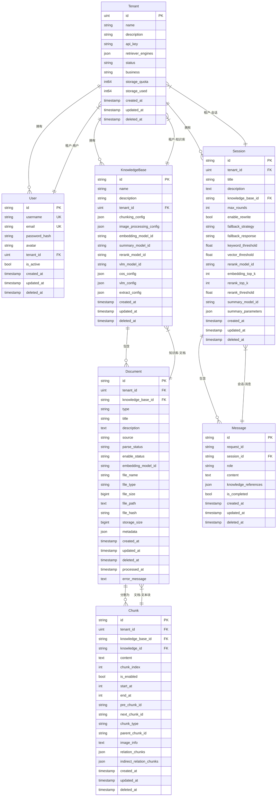

# 数据模型

<cite>
**本文档引用的文件**
- [knowledgebase.go](file://internal/types/knowledgebase.go)
- [chunk.go](file://internal/types/chunk.go)
- [message.go](file://internal/types/message.go)
- [session.go](file://internal/types/session.go)
- [user.go](file://internal/types/user.go)
- [tenant.go](file://internal/types/tenant.go)
- [00-init-db.sql](file://migrations/mysql/00-init-db.sql)
- [knowledgebase.go](file://internal/application/repository/knowledgebase.go)
- [message.go](file://internal/application/repository/message.go)
- [session.go](file://internal/application/repository/session.go)
- [chunk.go](file://internal/application/repository/chunk.go)
- [user.go](file://internal/application/repository/user.go)
- [tenant.go](file://internal/application/repository/tenant.go)
</cite>

## 目录
1. [引言](#引言)
2. [核心实体定义](#核心实体定义)
3. [实体关系与ER图](#实体关系与er图)
4. [内存对象与持久化存储映射](#内存对象与持久化存储映射)
5. [主键、外键约束与索引设计](#主键外键约束与索引设计)
6. [数据生命周期管理](#数据生命周期管理)
7. [结论](#结论)

## 引言
WeKnora_New系统是一个基于知识库的智能问答平台，其核心数据模型围绕知识管理、会话交互和用户租户隔离构建。本文档详细定义了KnowledgeBase（知识库）、Document（文档）、Chunk（文本块）、Message（消息）、Session（会话）、User（用户）和Tenant（租户）等关键实体的字段、数据类型、业务含义及相互关系。通过分析Go结构体定义和MySQL数据库迁移脚本，阐述了各实体在内存对象与持久化存储之间的映射机制。重点说明了知识库与文档的一对多关系、会话与消息的关联机制、文本块的向量化状态，以及主外键约束和索引设计。最后，探讨了会话过期等数据生命周期管理策略。

## 核心实体定义

### KnowledgeBase（知识库）
知识库是系统中组织和管理知识的核心容器，用于存储和检索特定主题领域的信息。

**字段定义：**
- **ID** (`string`): 知识库的唯一标识符，作为主键。
- **Name** (`string`): 知识库的名称，用于用户识别。
- **Description** (`string`): 知识库的描述信息。
- **TenantID** (`uint`): 所属租户ID，实现多租户数据隔离。
- **ChunkingConfig** (`ChunkingConfig`): 文档分块配置，以JSON格式存储，包含分块大小、重叠长度等。
- **ImageProcessingConfig** (`ImageProcessingConfig`): 图像处理配置，以JSON格式存储，指定图像识别模型。
- **EmbeddingModelID** (`string`): 用于向量化嵌入的模型ID。
- **SummaryModelID** (`string`): 用于生成摘要的模型ID。
- **RerankModelID** (`string`): 用于结果重排序的模型ID。
- **VLMModelID** (`string`): 视觉语言模型ID。
- **StorageConfig** (`StorageConfig`): 存储配置（如COS），以JSON格式存储。
- **ExtractConfig** (`*ExtractConfig`): 信息抽取配置，以JSON格式存储。
- **CreatedAt** (`time.Time`): 创建时间。
- **UpdatedAt** (`time.Time`): 最后更新时间。
- **DeletedAt** (`gorm.DeletedAt`): 软删除时间戳。

**Section sources**
- [knowledgebase.go](file://internal/types/knowledgebase.go#L15-L49)

### Document（文档）
在数据库中，文档实体被称为`knowledges`，代表上传到知识库中的单个文件或内容源。

**字段定义：**
- **id** (`VARCHAR(36)`): 文档的唯一标识符，主键。
- **tenant_id** (`INT`): 所属租户ID。
- **knowledge_base_id** (`VARCHAR(36)`): 所属知识库ID，建立与知识库的外键关系。
- **type** (`VARCHAR(50)`): 文档类型（如文件、网页）。
- **title** (`VARCHAR(255)`): 文档标题。
- **description** (`TEXT`): 文档描述。
- **source** (`VARCHAR(128)`): 来源（如本地上传、URL）。
- **parse_status** (`VARCHAR(50)`): 解析状态（未处理、处理中、已完成）。
- **enable_status** (`VARCHAR(50)`): 启用状态。
- **embedding_model_id** (`VARCHAR(64)`): 用于此文档的嵌入模型ID。
- **file_name** (`VARCHAR(255)`): 原始文件名。
- **file_type** (`VARCHAR(50)`): 文件MIME类型。
- **file_size** (`BIGINT`): 文件大小（字节）。
- **file_path** (`TEXT`): 文件在存储系统中的路径。
- **file_hash** (`VARCHAR(64)`): 文件内容哈希，用于去重。
- **storage_size** (`BIGINT`): 占用的存储空间。
- **metadata** (`JSON`): 元数据。
- **created_at** (`TIMESTAMP`): 创建时间。
- **updated_at** (`TIMESTAMP`): 更新时间。
- **deleted_at** (`TIMESTAMP`): 软删除时间。

**Section sources**
- [00-init-db.sql](file://migrations/mysql/00-init-db.sql#L62-L85)

### Chunk（文本块）
文本块是知识库检索的基本单元，由文档解析后生成的有意义的文本片段。

**字段定义：**
- **ID** (`string`): 文本块的唯一标识符，主键。
- **TenantID** (`uint`): 所属租户ID。
- **KnowledgeID** (`string`): 所属文档ID，建立与文档的关联。
- **KnowledgeBaseID** (`string`): 所属知识库ID，便于快速查询。
- **Content** (`string`): 文本块的实际内容。
- **ChunkIndex** (`int`): 在原始文档中的索引位置。
- **IsEnabled** (`bool`): 是否启用，可用于临时禁用某些块。
- **StartAt** (`int`): 在原始文本中的起始字符位置。
- **EndAt** (`int`): 在原始文本中的结束字符位置。
- **PreChunkID** (`string`): 前一个文本块ID，用于构建链式结构。
- **NextChunkID** (`string`): 后一个文本块ID，用于构建链式结构。
- **ChunkType** (`ChunkType`): 文本块类型（如`text`, `image_ocr`, `image_caption`）。
- **ParentChunkID** (`string`): 父文本块ID，用于关联图片块与原始文本块。
- **RelationChunks** (`JSON`): 关系文本块ID列表。
- **IndirectRelationChunks** (`JSON`): 间接关系文本块ID列表。
- **ImageInfo** (`string`): 图片信息，以JSON字符串形式存储。
- **CreatedAt** (`time.Time`): 创建时间。
- **UpdatedAt** (`time.Time`): 更新时间。
- **DeletedAt** (`gorm.DeletedAt`): 软删除时间。

**Section sources**
- [chunk.go](file://internal/types/chunk.go#L51-L90)

### Message（消息）
消息代表会话中的一次交互，可以是用户提问或系统回复。

**字段定义：**
- **ID** (`string`): 消息的唯一标识符，主键。
- **SessionID** (`string`): 所属会话ID，建立与会话的外键关系。
- **RequestID** (`string`): 请求标识符，用于追踪API请求。
- **Content** (`string`): 消息的文本内容。
- **Role** (`string`): 消息角色（`user`, `assistant`, `system`）。
- **KnowledgeReferences** (`References`): 回答所引用的知识块，以JSON格式存储。
- **IsCompleted** (`bool`): 消息生成是否完成。
- **CreatedAt** (`time.Time`): 创建时间。
- **UpdatedAt** (`time.Time`): 更新时间。
- **DeletedAt** (`gorm.DeletedAt`): 软删除时间。

**Section sources**
- [message.go](file://internal/types/message.go#L21-L45)

### Session（会话）
会话代表一次完整的对话过程，包含一系列相关的消息。

**字段定义：**
- **ID** (`string`): 会话的唯一标识符，主键。
- **Title** (`string`): 会话标题。
- **Description** (`string`): 会话描述。
- **TenantID** (`uint`): 所属租户ID。
- **KnowledgeBaseID** (`string`): 关联的知识库ID。
- **MaxRounds** (`int`): 多轮对话保持的轮数。
- **EnableRewrite** (`bool`): 是否启用多轮改写。
- **FallbackStrategy** (`FallbackStrategy`): 兜底策略（`fixed`, `model`）。
- **FallbackResponse** (`string`): 固定回复内容。
- **EmbeddingTopK** (`int`): 向量召回TopK数量。
- **KeywordThreshold** (`float64`): 关键词召回阈值。
- **VectorThreshold** (`float64`): 向量召回阈值。
- **RerankModelID** (`string`): 重排序模型ID。
- **RerankTopK** (`int`): 重排序TopK数量。
- **RerankThreshold** (`float64`): 重排序阈值。
- **SummaryModelID** (`string`): 总结模型ID。
- **SummaryParameters** (`*SummaryConfig`): 总结模型参数，以JSON格式存储。
- **CreatedAt** (`time.Time`): 创建时间。
- **UpdatedAt** (`time.Time`): 更新时间。
- **DeletedAt** (`gorm.DeletedAt`): 软删除时间。
- **Messages** (`[]Message`): 关联的消息列表，是GORM的关联关系，不直接存储在数据库中。

**Section sources**
- [session.go](file://internal/types/session.go#L47-L79)

### User（用户）
用户是系统的使用者，与租户关联。

**字段定义：**
- **ID** (`string`): 用户的唯一标识符，主键。
- **Username** (`string`): 用户名，唯一索引。
- **Email** (`string`): 邮箱地址，唯一索引。
- **PasswordHash** (`string`): 密码哈希值，不对外暴露。
- **Avatar** (`string`): 头像URL。
- **TenantID** (`uint`): 所属租户ID。
- **IsActive** (`bool`): 用户是否激活。
- **CreatedAt** (`time.Time`): 创建时间。
- **UpdatedAt** (`time.Time`): 更新时间。
- **DeletedAt** (`gorm.DeletedAt`): 软删除时间。
- **Tenant** (`*Tenant`): 关联的租户对象，是GORM的关联关系。

**Section sources**
- [user.go](file://internal/types/user.go#L9-L34)

### Tenant（租户）
租户是系统中的独立组织单元，实现数据和资源的隔离。

**字段定义：**
- **ID** (`uint`): 租户的唯一标识符，主键。
- **Name** (`string`): 租户名称。
- **Description** (`string`): 租户描述。
- **APIKey** (`string`): 租户API密钥。
- **Status** (`string`): 租户状态（如`active`）。
- **RetrieverEngines** (`RetrieverEngines`): 检索引擎配置，以JSON格式存储。
- **Business** (`string`): 业务类型。
- **StorageQuota** (`int64`): 存储配额（字节）。
- **StorageUsed** (`int64`): 已用存储空间（字节）。
- **CreatedAt** (`time.Time`): 创建时间。
- **UpdatedAt** (`time.Time`): 更新时间。
- **DeletedAt** (`gorm.DeletedAt`): 软删除时间。

**Section sources**
- [tenant.go](file://internal/types/tenant.go#L15-L41)

## 实体关系与ER图

**Diagram sources**
- [00-init-db.sql](file://migrations/mysql/00-init-db.sql#L9-L154)
- [knowledgebase.go](file://internal/types/knowledgebase.go)
- [chunk.go](file://internal/types/chunk.go)
- [message.go](file://internal/types/message.go)
- [session.go](file://internal/types/session.go)
- [user.go](file://internal/types/user.go)
- [tenant.go](file://internal/types/tenant.go)

## 内存对象与持久化存储映射

### KnowledgeBase映射
`KnowledgeBase`结构体与`knowledge_bases`表通过GORM标签精确映射。`ID`、`Name`、`Description`等简单字段直接对应表中的`id`、`name`、`description`列。复杂配置如`ChunkingConfig`、`ImageProcessingConfig`等被标记为`gorm:"type:json"`，其值通过`Value()`和`Scan()`方法自动序列化为JSON字符串存入数据库，并在读取时反序列化回结构体。

**Section sources**
- [knowledgebase.go](file://internal/types/knowledgebase.go#L16-L49)
- [00-init-db.sql](file://migrations/mysql/00-init-db.sql#L41-L58)

### Document映射
`Document`（代码中为`Knowledge`）实体在内存中由`types.Knowledge`结构体表示，持久化到`knowledges`表。`knowledge_base_id`字段作为外键，将文档与特定知识库关联，实现`KnowledgeBase`与`Document`的一对多关系。`metadata`和`parse_status`等字段直接映射到数据库列。

**Section sources**
- [00-init-db.sql](file://migrations/mysql/00-init-db.sql#L62-L85)

### Chunk映射
`Chunk`结构体与`chunks`表完全对应。`KnowledgeID`字段是关键，它将文本块与生成它的文档关联，形成`Document`与`Chunk`的一对多关系。`ChunkType`字段的向量化状态通过`chunk_type`列存储，支持对不同类型的文本块（如普通文本、图片OCR）进行区分查询。`ImageInfo`字段以JSON字符串形式存储图片的URL、位置和描述等信息。

**Section sources**
- [chunk.go](file://internal/types/chunk.go#L51-L90)
- [00-init-db.sql](file://migrations/mysql/00-init-db.sql#L129-L154)

### Message与Session映射
`Message`和`Session`实体通过`session_id`字段建立关联。`Message`结构体中的`SessionID`字段对应`messages`表中的`session_id`列，作为外键指向`sessions`表的`id`列。在内存中，`Session`结构体通过`Messages []Message`字段（`gorm:"foreignKey:SessionID"`）定义了一对多的关联关系，GORM会在查询时自动加载关联的消息列表。

**Section sources**
- [message.go](file://internal/types/message.go#L21-L45)
- [session.go](file://internal/types/session.go#L78-L79)
- [00-init-db.sql](file://migrations/mysql/00-init-db.sql#L89-L128)

### User与Tenant映射
`User`结构体通过`TenantID`字段与`Tenant`结构体关联。`Tenant`的`ID`是主键，`User`的`TenantID`是外键。在内存中，`User`结构体通过`Tenant *Tenant`字段（`gorm:"foreignKey:TenantID"`）建立了与租户的关联，实现了`Tenant`与`User`的一对多关系。

**Section sources**
- [user.go](file://internal/types/user.go#L9-L34)
- [tenant.go](file://internal/types/tenant.go#L15-L41)
- [00-init-db.sql](file://migrations/mysql/00-init-db.sql#L1-L22)

## 主键、外键约束与索引设计

### 主键与外键
- **主键 (Primary Key)**: 每个核心实体（`tenants`, `models`, `knowledge_bases`, `knowledges`, `sessions`, `messages`, `chunks`）都拥有一个名为`id`的主键，通常为`VARCHAR(36)`（UUID）或`BIGINT AUTO_INCREMENT`。
- **外键 (Foreign Key)**: 系统通过外键维护数据完整性。
  - `models.tenant_id` -> `tenants.id`
  - `knowledge_bases.tenant_id` -> `tenants.id`
  - `knowledges.tenant_id` -> `tenants.id`
  - `knowledges.knowledge_base_id` -> `knowledge_bases.id`
  - `sessions.tenant_id` -> `tenants.id`
  - `sessions.knowledge_base_id` -> `knowledge_bases.id`
  - `messages.session_id` -> `sessions.id`
  - `chunks.tenant_id` -> `tenants.id`
  - `chunks.knowledge_base_id` -> `knowledge_bases.id`
  - `chunks.knowledge_id` -> `knowledges.id`

### 索引设计
索引设计旨在优化查询性能：
- **`idx_models_tenant_source_type`**: 在`models`表上创建，覆盖`(tenant_id, source, type)`，加速按租户、来源和类型查询模型。
- **`idx_knowledge_bases_tenant_name`**: 在`knowledge_bases`表上创建，覆盖`(tenant_id, name)`，加速按租户查询知识库列表。
- **`idx_knowledges_tenant_id`**: 在`knowledges`表上创建，覆盖`(tenant_id, knowledge_base_id)`，加速按租户和知识库查询文档。
- **`idx_sessions_tenant_id`**: 在`sessions`表上创建，覆盖`tenant_id`，加速按租户查询会话列表。
- **`idx_messages_session_role`**: 在`messages`表上创建，覆盖`(session_id, role)`，加速按会话ID和角色查询消息。
- **`idx_chunks_tenant_knowledge`**: 在`chunks`表上创建，覆盖`(tenant_id, knowledge_id)`，加速按租户和文档查询文本块。
- **`idx_chunks_parent_id`**: 在`chunks`表上创建，覆盖`parent_chunk_id`，加速查询与特定父块关联的子块（如图片块）。
- **`idx_chunks_chunk_type`**: 在`chunks`表上创建，覆盖`chunk_type`，加速按类型（如`image_ocr`）查询文本块。

**Section sources**
- [00-init-db.sql](file://migrations/mysql/00-init-db.sql#L39-L154)

## 数据生命周期管理

### 会话过期机制
系统通过`deleted_at`字段实现软删除，允许数据恢复。虽然当前代码中未直接实现自动过期，但`deleted_at`字段为实现会话过期策略提供了基础。可以通过后台任务定期扫描`sessions`表，根据`created_at`时间判断会话是否超过预设的生命周期（如30天），然后将其`deleted_at`字段设置为当前时间，从而实现逻辑上的过期。前端或API在查询会话时，会自动忽略`deleted_at`非空的记录。

### 存储配额管理
`Tenant`实体包含`storage_quota`（配额）和`storage_used`（已用）字段。`tenantRepository`中的`AdjustStorageUsed`方法通过数据库事务和悲观锁（`clause.Locking{Strength: "UPDATE"}`）来安全地增减`storage_used`值，防止并发更新导致的数据不一致。当上传新文档或删除文档时，系统会调用此方法调整租户的已用存储空间，确保不会超出配额。

### 软删除与数据恢复
所有核心实体都包含`deleted_at`字段。当执行删除操作时，系统并非物理删除记录，而是更新`deleted_at`字段。例如，`knowledgeBaseRepository.DeleteKnowledgeBase`方法执行`DELETE`语句，但GORM会将其转换为`UPDATE`语句，仅设置`deleted_at`。这使得数据可以被逻辑隐藏，同时保留了恢复的可能性。

**Section sources**
- [session.go](file://internal/types/session.go#L75)
- [tenant.go](file://internal/application/repository/tenant.go#L65-L82)
- [knowledgebase.go](file://internal/application/repository/knowledgebase.go#L68-L69)

## 结论
WeKnora_New的核心数据模型设计清晰，通过`Tenant`实现了多租户隔离，通过`KnowledgeBase`和`Document`的层级结构组织知识，并通过`Chunk`作为检索的基本单元。`Session`和`Message`的关联机制支持了完整的对话历史管理。数据模型在内存对象（Go结构体）和持久化存储（MySQL表）之间通过GORM框架实现了无缝映射，利用JSON字段存储复杂配置，提高了灵活性。精心设计的主外键约束保证了数据完整性，而多维度的索引策略则优化了查询性能。通过软删除和存储配额管理，系统具备了完善的数据生命周期管理能力，为构建一个稳定、可扩展的智能问答平台奠定了坚实的基础。