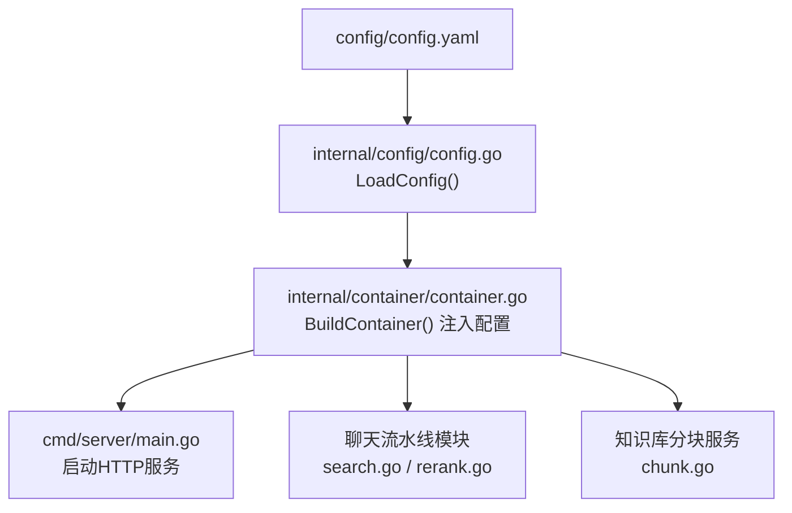
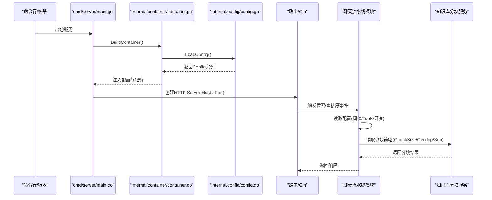
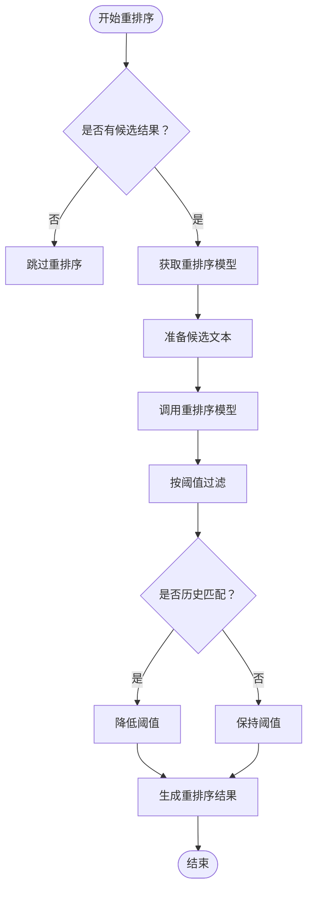
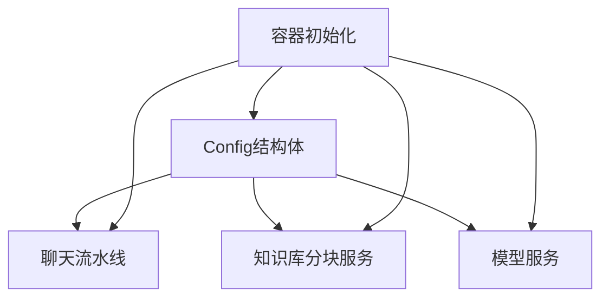
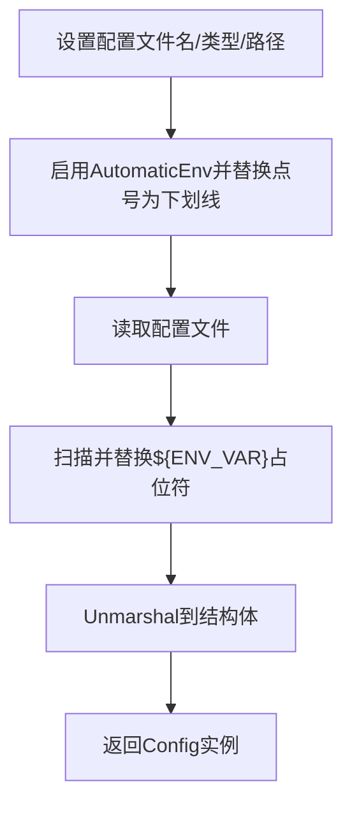

# 配置管理

<cite>
**本文引用的文件**
- [config/config.yaml](file://config/config.yaml)
- [internal/config/config.go](file://internal/config/config.go)
- [cmd/server/main.go](file://cmd/server/main.go)
- [internal/container/container.go](file://internal/container/container.go)
- [internal/application/service/chat_pipline/search.go](file://internal/application/service/chat_pipline/search.go)
- [internal/application/service/chat_pipline/rerank.go](file://internal/application/service/chat_pipline/rerank.go)
- [internal/application/service/chat_pipline/chat_pipline.go](file://internal/application/service/chat_pipline/chat_pipline.go)
- [internal/types/chat_manage.go](file://internal/types/chat_manage.go)
- [internal/handler/session.go](file://internal/handler/session.go)
- [internal/application/service/chunk.go](file://internal/application/service/chunk.go)
- [docreader/parser/config.py](file://docreader/parser/config.py)
- [docreader/parser/base_parser.py](file://docreader/parser/base_parser.py)
</cite>

## 目录
1. [简介](#简介)
2. [项目结构](#项目结构)
3. [核心组件](#核心组件)
4. [架构总览](#架构总览)
5. [详细组件分析](#详细组件分析)
6. [依赖分析](#依赖分析)
7. [性能考量](#性能考量)
8. [故障排查指南](#故障排查指南)
9. [结论](#结论)
10. [附录](#附录)

## 简介
本文件面向WeKnora_New的配置管理系统，系统性解析config.yaml中的各项配置及其在代码中的落地实现，重点覆盖：
- 服务器端口与主机绑定
- 对话流水线参数（轮次上限、关键词阈值、向量TopK、向量阈值、重排序阈值、重排序TopK、回退策略与提示、查询改写与重排序开关）
- 知识库分块策略（chunk_size、chunk_overlap、分隔符、图像多模态处理开关）
- 配置加载机制（Viper库使用、环境变量覆盖优先级、配置热更新支持情况）
- 配置对系统行为的影响（如rerank_threshold如何控制检索结果过滤）
- 生产与开发环境的最佳实践

## 项目结构
WeKnora_New采用“配置文件 + 结构体 + Viper加载 + 依赖注入”的模式：
- 配置文件：config/config.yaml
- 结构体定义：internal/config/config.go
- 加载入口：internal/config/config.go 中的 LoadConfig
- 依赖注入：internal/container/container.go 中注册 LoadConfig 并注入到服务层
- 业务使用：聊天流水线、知识库分块、模型服务等模块读取配置

图表来源
- [config/config.yaml](file://config/config.yaml#L1-L604)
- [internal/config/config.go](file://internal/config/config.go#L143-L192)
- [internal/container/container.go](file://internal/container/container.go#L53-L138)
- [cmd/server/main.go](file://cmd/server/main.go#L24-L105)
- [internal/application/service/chat_pipline/search.go](file://internal/application/service/chat_pipline/search.go#L1-L126)
- [internal/application/service/chat_pipline/rerank.go](file://internal/application/service/chat_pipline/rerank.go#L1-L172)
- [internal/application/service/chunk.go](file://internal/application/service/chunk.go#L1-L279)

章节来源
- [config/config.yaml](file://config/config.yaml#L1-L604)
- [internal/config/config.go](file://internal/config/config.go#L143-L192)
- [internal/container/container.go](file://internal/container/container.go#L53-L138)
- [cmd/server/main.go](file://cmd/server/main.go#L24-L105)

## 核心组件
- 配置结构体：Config、ConversationConfig、ServerConfig、KnowledgeBaseConfig、ImageProcessingConfig、SummaryConfig 等，均通过yaml标签映射到config.yaml键名。
- 配置加载：LoadConfig使用Viper读取配置文件，启用AutomaticEnv并自定义环境变量键名替换，随后对${ENV_VAR}占位符进行二次替换，最后Unmarshal到结构体。
- 依赖注入：BuildContainer在容器初始化时调用config.LoadConfig，将Config实例注入到各服务与处理器。
- 业务使用：聊天流水线（search、rerank）与知识库分块服务读取配置中的阈值、TopK、开关等参数，驱动检索与重排序行为。

章节来源
- [internal/config/config.go](file://internal/config/config.go#L15-L114)
- [internal/config/config.go](file://internal/config/config.go#L143-L192)
- [internal/container/container.go](file://internal/container/container.go#L53-L138)

## 架构总览
下图展示了配置在系统中的流转路径与关键交互点。

图表来源
- [cmd/server/main.go](file://cmd/server/main.go#L24-L105)
- [internal/container/container.go](file://internal/container/container.go#L53-L138)
- [internal/config/config.go](file://internal/config/config.go#L143-L192)
- [internal/application/service/chat_pipline/search.go](file://internal/application/service/chat_pipline/search.go#L1-L126)
- [internal/application/service/chat_pipline/rerank.go](file://internal/application/service/chat_pipline/rerank.go#L1-L172)
- [internal/application/service/chunk.go](file://internal/application/service/chunk.go#L1-L279)

## 详细组件分析

### 1) 服务器配置（server）
- 配置项
  - port：监听端口
  - host：监听地址
- 影响范围
  - 服务启动时用于http.Server的Addr拼接
- 类型安全
  - ServerConfig.Port为int，Host为string，结构体定义与yaml键名一致

章节来源
- [config/config.yaml](file://config/config.yaml#L1-L6)
- [internal/config/config.go](file://internal/config/config.go#L78-L84)
- [cmd/server/main.go](file://cmd/server/main.go#L60-L63)

### 2) 对话流水线配置（conversation）
- 关键参数
  - max_rounds：对话轮次上限
  - keyword_threshold：关键词检索阈值
  - embedding_top_k：向量检索TopK
  - vector_threshold：向量检索阈值
  - rerank_threshold：重排序阈值
  - rerank_top_k：重排序TopK
  - fallback_strategy/fallback_response/fallback_prompt：无相关结果时的回退策略与提示
  - enable_rewrite：是否启用查询改写
  - enable_rerank：是否启用重排序
  - rewrite_prompt_system/user：改写提示模板
  - keywords_extraction_prompt/_user：关键词抽取提示模板
  - generate_summary_prompt/generate_session_title_prompt：摘要与会话标题生成提示
  - summary.*：摘要生成的采样与上下文模板参数
- 影响范围
  - 搜索阶段：keyword_threshold、vector_threshold、embedding_top_k决定混合检索结果集合
  - 重排序阶段：rerank_threshold、rerank_top_k决定重排序后保留的结果
  - 回退阶段：fallback_strategy、fallback_response在无结果时生效
  - 改写阶段：enable_rewrite开启后，rewrite_prompt_system/user参与改写
- 类型安全
  - ConversationConfig字段与yaml键名一一对应，结构体定义明确类型（int、float64、bool、string）

章节来源
- [config/config.yaml](file://config/config.yaml#L7-L120)
- [config/config.yaml](file://config/config.yaml#L121-L247)
- [config/config.yaml](file://config/config.yaml#L248-L531)
- [internal/config/config.go](file://internal/config/config.go#L36-L60)
- [internal/config/config.go](file://internal/config/config.go#L62-L76)

### 3) 重排序阈值（rerank_threshold）的行为机制
- 重排序流程
  - 从搜索阶段获得候选结果
  - 通过rerank模型对候选进行重排，得到相关性分数
  - 以rerank_threshold为阈值过滤，低于阈值的候选被剔除
  - 特殊处理：历史匹配（MatchTypeHistory）会降低阈值，提高召回率
- 影响
  - rerank_threshold越高，越严格，减少噪声但可能漏召回
  - rerank_top_k与阈值共同决定最终返回的候选数量

图表来源
- [internal/application/service/chat_pipline/rerank.go](file://internal/application/service/chat_pipline/rerank.go#L35-L125)
- [internal/application/service/chat_pipline/tracing.go](file://internal/application/service/chat_pipline/tracing.go#L105-L139)

章节来源
- [internal/application/service/chat_pipline/rerank.go](file://internal/application/service/chat_pipline/rerank.go#L35-L125)
- [internal/application/service/chat_pipline/tracing.go](file://internal/application/service/chat_pipline/tracing.go#L105-L139)

### 4) 知识库分块策略（chunk_size、chunk_overlap、split_markers、image_processing.enable_multimodal）
- 配置项
  - chunk_size：每块大小
  - chunk_overlap：块间重叠字符数
  - split_markers：分隔符优先级（如段落、换行、中文句号）
  - image_processing.enable_multimodal：是否启用图像多模态处理
- 影响范围
  - 文档解析与分块：影响向量化与检索质量
  - 图像处理：当启用多模态时，重排序阶段会融合图片描述与OCR文本增强候选内容
- 类型安全
  - KnowledgeBaseConfig与ImageProcessingConfig结构体定义明确字段类型

章节来源
- [config/config.yaml](file://config/config.yaml#L533-L540)
- [internal/config/config.go](file://internal/config/config.go#L86-L99)
- [internal/application/service/chunk.go](file://internal/application/service/chunk.go#L1-L279)
- [docreader/parser/config.py](file://docreader/parser/config.py#L1-L21)
- [docreader/parser/base_parser.py](file://docreader/parser/base_parser.py#L792-L921)

### 5) 配置加载机制与环境变量覆盖
- Viper配置加载
  - 设置配置文件名、类型、搜索路径（当前目录、config子目录、用户目录、etc目录）
  - 启用AutomaticEnv并将点号替换为下划线，使ENV_VAR覆盖对应配置键
  - 读取配置文件后，再次扫描并替换${ENV_VAR}占位符，确保占位符在YAML中也能被环境变量覆盖
  - 使用mapstructure将配置Unmarshal到结构体
- 环境变量覆盖优先级
  - AutomaticEnv自动读取环境变量
  - ${ENV_VAR}占位符替换发生在Unmarshal之前，因此优先级最高
- 热更新支持
  - 代码中未发现Viper Watch/Reload机制，配置在进程启动时一次性加载，不支持运行时热更新

章节来源
- [internal/config/config.go](file://internal/config/config.go#L143-L192)

### 6) 配置在聊天流水线中的使用
- 搜索阶段（PluginSearch）
  - 读取keyword_threshold、vector_threshold、embedding_top_k
  - 执行混合检索并合并历史匹配
- 重排序阶段（PluginRerank）
  - 读取rerank_threshold、rerank_top_k
  - 通过rerank模型对候选进行重排并按阈值过滤
- 回退策略（ChatManage）
  - 读取fallback_strategy、fallback_response
  - 在无结果时返回预设回退响应

章节来源
- [internal/application/service/chat_pipline/search.go](file://internal/application/service/chat_pipline/search.go#L44-L95)
- [internal/application/service/chat_pipline/rerank.go](file://internal/application/service/chat_pipline/rerank.go#L35-L125)
- [internal/types/chat_manage.go](file://internal/types/chat_manage.go#L19-L40)
- [internal/handler/session.go](file://internal/handler/session.go#L37-L68)

### 7) 配置在知识库分块中的使用
- 分块参数
  - chunk_size、chunk_overlap、split_markers
- 图像多模态
  - enable_multimodal为true时，重排序阶段会融合图片描述与OCR文本，提升检索质量

章节来源
- [config/config.yaml](file://config/config.yaml#L533-L540)
- [internal/config/config.go](file://internal/config/config.go#L86-L99)
- [internal/application/service/chunk.go](file://internal/application/service/chunk.go#L1-L279)
- [docreader/parser/config.py](file://docreader/parser/config.py#L1-L21)
- [docreader/parser/base_parser.py](file://docreader/parser/base_parser.py#L792-L921)

## 依赖分析
- 配置到服务的依赖链
  - LoadConfig -> Container -> 服务层（聊天流水线、知识库分块、模型服务等）
- 关键耦合点
  - 聊天流水线通过ChatManage读取配置参数，直接影响检索与重排序
  - 知识库分块服务读取分块策略，影响向量化与检索质量
- 外部依赖
  - Viper负责配置解析与环境变量替换
  - 依赖注入框架（dig）负责组件装配与生命周期管理

图表来源
- [internal/config/config.go](file://internal/config/config.go#L15-L114)
- [internal/container/container.go](file://internal/container/container.go#L53-L138)
- [internal/application/service/chat_pipline/chat_pipline.go](file://internal/application/service/chat_pipline/chat_pipline.go#L1-L162)
- [internal/application/service/chunk.go](file://internal/application/service/chunk.go#L1-L279)

章节来源
- [internal/config/config.go](file://internal/config/config.go#L15-L114)
- [internal/container/container.go](file://internal/container/container.go#L53-L138)

## 性能考量
- 重排序阈值与TopK
  - rerank_threshold过高会减少候选数量，提升响应速度但可能漏召回；过低会增加候选数量，提升召回但可能引入噪声
  - rerank_top_k与阈值共同决定最终候选规模，建议结合业务场景与硬件能力调优
- 分块策略
  - chunk_size过大导致向量维度高、内存占用大；过小导致碎片化、检索精度下降
  - chunk_overlap过大会增加存储与向量计算成本；过小可能导致语义断裂
- 查询改写与关键词抽取
  - enable_rewrite与关键词抽取有助于提升检索质量，但会增加一次LLM调用开销
- 环境变量与占位符
  - 使用${ENV_VAR}可在不修改YAML的情况下覆盖敏感参数，便于CI/CD部署

[本节为通用指导，无需列出具体文件来源]

## 故障排查指南
- 配置文件未加载
  - 检查配置文件路径与权限，确认Viper的配置路径包含当前目录与config子目录
  - 确认环境变量键名已被替换（点号转下划线）
- 环境变量未生效
  - 确认AutomaticEnv已启用
  - 检查${ENV_VAR}占位符是否被正确替换
- 重排序无结果
  - 检查rerank_threshold是否过高
  - 检查rerank_model_id是否为空
  - 检查历史匹配阈值调整逻辑是否符合预期
- 分块异常
  - 检查chunk_size、chunk_overlap、split_markers是否合理
  - 确认enable_multimodal开启时，图片描述与OCR文本是否正确传入重排序阶段

章节来源
- [internal/config/config.go](file://internal/config/config.go#L143-L192)
- [internal/application/service/chat_pipline/rerank.go](file://internal/application/service/chat_pipline/rerank.go#L35-L125)
- [internal/application/service/chat_pipline/search.go](file://internal/application/service/chat_pipline/search.go#L44-L95)
- [docreader/parser/base_parser.py](file://docreader/parser/base_parser.py#L792-L921)

## 结论
WeKnora_New的配置管理以结构化YAML为核心，通过Viper实现灵活的加载与环境变量覆盖，配合依赖注入在运行时为聊天流水线与知识库分块提供统一的参数来源。其中rerank_threshold对检索结果过滤具有决定性影响，而分块策略与图像多模态开关则直接影响向量化与检索质量。建议在生产环境中通过环境变量与占位符实现参数隔离，在开发环境中使用默认配置并通过脚本快速启动。

[本节为总结性内容，无需列出具体文件来源]

## 附录

### A. 配置项一览与作用范围
- 服务器
  - server.port：HTTP监听端口
  - server.host：HTTP监听地址
- 对话流水线
  - conversation.max_rounds：对话轮次上限
  - conversation.keyword_threshold：关键词检索阈值
  - conversation.embedding_top_k：向量检索TopK
  - conversation.vector_threshold：向量检索阈值
  - conversation.rerank_threshold：重排序阈值
  - conversation.rerank_top_k：重排序TopK
  - conversation.fallback_strategy/fallback_response/fallback_prompt：无结果回退策略与提示
  - conversation.enable_rewrite：是否启用查询改写
  - conversation.enable_rerank：是否启用重排序
  - conversation.rewrite_prompt_system/user：改写提示模板
  - conversation.keywords_extraction_prompt/_user：关键词抽取提示模板
  - conversation.generate_summary_prompt/generate_session_title_prompt：摘要与会话标题生成提示
  - conversation.summary.*：摘要生成采样与上下文模板参数
- 知识库
  - knowledge_base.chunk_size：分块大小
  - knowledge_base.chunk_overlap：分块重叠
  - knowledge_base.split_markers：分隔符优先级
  - knowledge_base.image_processing.enable_multimodal：图像多模态开关

章节来源
- [config/config.yaml](file://config/config.yaml#L1-L604)
- [internal/config/config.go](file://internal/config/config.go#L36-L114)

### B. 配置加载与环境变量覆盖流程

图表来源
- [internal/config/config.go](file://internal/config/config.go#L143-L192)

### C. 生产与开发最佳实践
- 开发环境
  - 使用默认配置，通过环境变量覆盖端口、日志路径等
  - 使用本地存储与轻量检索引擎
- 生产环境
  - 使用环境变量与${ENV_VAR}占位符集中管理敏感参数
  - 合理设置rerank_threshold与rerank_top_k，平衡召回与性能
  - 根据文档特性调整chunk_size与chunk_overlap，结合split_markers优化分块质量
  - 启用图像多模态时，确保OCR与图片描述服务稳定

[本节为通用指导，无需列出具体文件来源]