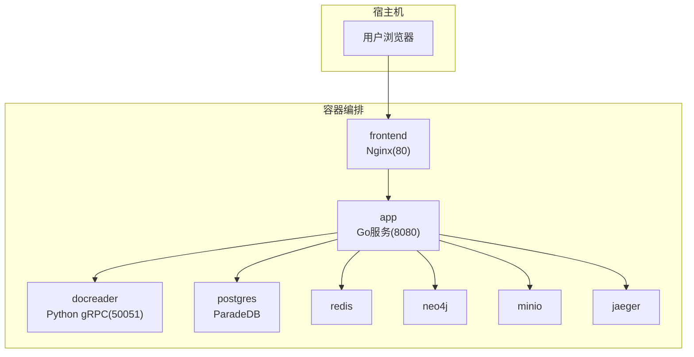
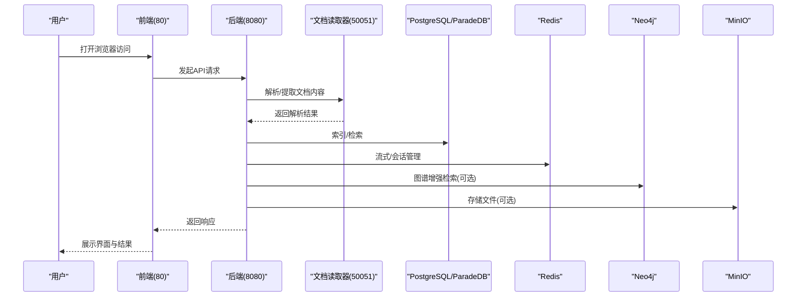

# 快速入门

<cite>
**本文引用的文件**
- [README.md](file://README.md)
- [docker-compose.yml](file://docker-compose.yml)
- [docker-compose.dev.yml](file://docker-compose.dev.yml)
- [scripts/start_all.sh](file://scripts/start_all.sh)
- [scripts/start_dev.sh](file://scripts/start_dev.sh)
- [Makefile](file://Makefile)
- [cmd/server/main.go](file://cmd/server/main.go)
- [config/config.yaml](file://config/config.yaml)
- [frontend/package.json](file://frontend/package.json)
- [frontend/Dockerfile](file://frontend/Dockerfile)
- [docker/Dockerfile.app](file://docker/Dockerfile.app)
- [docker/Dockerfile.docreader](file://docker/Dockerfile.docreader)
- [go.mod](file://go.mod)
- [dataset/README_zh.md](file://dataset/README_zh.md)
</cite>

## 目录
1. [简介](#简介)
2. [项目结构](#项目结构)
3. [核心组件](#核心组件)
4. [架构总览](#架构总览)
5. [详细组件分析](#详细组件分析)
6. [依赖分析](#依赖分析)
7. [性能注意事项](#性能注意事项)
8. [故障排查指南](#故障排查指南)
9. [结论](#结论)
10. [附录](#附录)

## 简介
本指南面向新手用户，帮助你在本地快速搭建并运行 WeKnora_New 项目，涵盖环境准备、安装步骤、开发与生产两种启动模式、首次使用流程（启动服务、访问界面、上传文档、问答），以及关键脚本的使用说明。文档同时提供后续深入配置与功能的链接指引，便于你逐步掌握系统能力。

## 项目结构
WeKnora_New 采用多模块分层设计：
- 后端服务：Go 编写的主服务，提供 REST API、路由与业务逻辑
- 前端界面：Vue 3 + Vite 构建的 Web 应用
- 文档解析服务：Python 实现的文档读取器（docreader），提供 gRPC 接口
- 数据库与中间件：PostgreSQL（ParadeDB）、Redis、Neo4j、MinIO、Jaeger
- 配置与脚本：YAML 配置、Docker Compose 编排、Shell 启动脚本与 Makefile

图表来源
- [docker-compose.yml](file://docker-compose.yml#L1-L253)

章节来源
- [README.md](file://README.md#L92-L164)
- [docker-compose.yml](file://docker-compose.yml#L1-L253)

## 核心组件
- 后端服务（Go）
  - 入口程序负责初始化容器、路由、链路追踪与优雅关闭
  - 通过环境变量与配置文件驱动运行参数
- 文档读取器（Python）
  - 提供文档解析、OCR、图像处理与 gRPC 接口
  - 内置模型缓存与 Playwright 依赖
- 前端界面（Vue 3 + Vite）
  - 提供知识库管理、聊天对话、设置等功能页面
  - 构建后由 Nginx 提供静态资源
- 数据与中间件
  - PostgreSQL（ParadeDB）：结构化存储与向量检索
  - Redis：流式管理与缓存
  - Neo4j：知识图谱（可选）
  - MinIO：对象存储（可选 COS/MinIO）
  - Jaeger：链路追踪

章节来源
- [cmd/server/main.go](file://cmd/server/main.go#L24-L104)
- [docker/Dockerfile.app](file://docker/Dockerfile.app#L1-L79)
- [docker/Dockerfile.docreader](file://docker/Dockerfile.docreader#L1-L159)
- [frontend/Dockerfile](file://frontend/Dockerfile#L1-L36)
- [docker-compose.yml](file://docker-compose.yml#L1-L253)

## 架构总览
系统通过 Docker Compose 编排，将前端、后端、文档读取器、数据库、缓存、对象存储与链路追踪统一部署。后端服务通过环境变量与配置文件控制模型、检索策略与存储类型等。

图表来源
- [docker-compose.yml](file://docker-compose.yml#L1-L253)
- [cmd/server/main.go](file://cmd/server/main.go#L24-L104)

## 详细组件分析

### 环境准备与依赖
- 必需工具
  - Docker 与 Docker Compose
  - Git
- 可选依赖
  - Ollama（本地大模型推理，可远程配置）
  - Python（用于文档读取器与数据集工具）
- 环境变量
  - 通过 .env 文件注入（模板文件为 .env.example）
  - 关键变量包括数据库、存储、检索、链路追踪、模型初始化等

章节来源
- [README.md](file://README.md#L94-L121)
- [scripts/start_all.sh](file://scripts/start_all.sh#L86-L111)
- [docker-compose.yml](file://docker-compose.yml#L1-L253)

### 安装与首次启动（生产模式）
- 步骤
  1) 克隆仓库并进入目录
  2) 准备 .env（复制模板并按注释填写）
  3) 启动全部服务
     - 使用脚本：./scripts/start_all.sh
     - 或使用 Make：make start-all
  4) 访问服务
     - 前端：http://localhost
     - 后端 API：http://localhost:8080
     - Jaeger：http://localhost:16686
- 停止服务
  - ./scripts/start_all.sh --stop
  - 或 make stop-all

章节来源
- [README.md](file://README.md#L122-L148)
- [scripts/start_all.sh](file://scripts/start_all.sh#L645-L729)
- [Makefile](file://Makefile#L114-L132)

### 开发模式启动（热重载）
- 使用脚本：./scripts/start_dev.sh
- 使用 Make：make start-all（内部调用 start_dev.sh）
- 开发模式特点
  - 后端容器使用 app-dev，挂载源码并以 air 热重载运行
  - 前端容器依赖 app-dev，便于联调
  - 通过 docker-compose.dev.yml 指定开发编排

章节来源
- [scripts/start_dev.sh](file://scripts/start_dev.sh#L313-L359)
- [docker-compose.dev.yml](file://docker-compose.dev.yml#L1-L123)
- [Makefile](file://Makefile#L114-L132)

### 首次使用：启动服务、访问界面、上传文档与问答
- 启动服务
  - 生产模式：./scripts/start_all.sh
  - 开发模式：./scripts/start_dev.sh
- 访问界面
  - 前端：http://localhost
  - 登录认证（v0.1.3 起引入）
- 上传第一个文档
  - 在“知识库”页面拖拽上传文档
  - 查看处理进度与状态
- 首次问答
  - 在“聊天”页面发起问题
  - 查看带来源的结构化回答与知识图谱视图（如开启）

章节来源
- [README.md](file://README.md#L149-L227)
- [docker-compose.yml](file://docker-compose.yml#L114-L125)

### 关键脚本说明
- start_all.sh
  - 功能：检查环境、拉起 Ollama（本地或远程）、拉起 Docker 服务、列出/拉取镜像、重启容器、检查环境、输出日志
  - 常用参数：--all、--ollama、--docker、--stop、--check、--list、--pull、--no-pull
- start_dev.sh
  - 功能：与 start_all.sh 类似，但使用 docker-compose.dev.yml，后端容器为 app-dev 并启用热重载
- Makefile
  - 提供 build、run、test、docker-*、start-all、stop-all、migrate-*、check-env、list-containers、pull-images 等常用命令

章节来源
- [scripts/start_all.sh](file://scripts/start_all.sh#L1-L120)
- [scripts/start_all.sh](file://scripts/start_all.sh#L313-L359)
- [scripts/start_dev.sh](file://scripts/start_dev.sh#L1-L120)
- [scripts/start_dev.sh](file://scripts/start_dev.sh#L313-L359)
- [Makefile](file://Makefile#L1-L216)

### 配置文件与模型初始化
- config/config.yaml
  - 服务器端口、对话策略、重写/重排、关键词抽取、摘要生成、会话标题、实体抽取与关系抽取提示词等
- 初始化配置
  - 首次访问 Web UI 会跳转到初始化页面，按页面提示完成模型与检索策略配置

章节来源
- [config/config.yaml](file://config/config.yaml#L1-L604)
- [README.md](file://README.md#L200-L227)

### 数据集工具（可选）
- dataset/README_zh.md
  - 提供从大规模数据集采样、生成答案与展示结果的工具链
  - 依赖：Python 3.7+、OpenAI API 密钥
  - 常用命令：sample、generate、show

章节来源
- [dataset/README_zh.md](file://dataset/README_zh.md#L1-L284)

## 依赖分析
- 后端依赖（Go）
  - Web 框架、ORM、缓存、向量库、OpenTelemetry、gRPC、JWT、Redis、Elasticsearch、Neo4j、MinIO、COS 等
- 前端依赖（Node.js/Vue）
  - Vue 3、Pinia、Vue Router、Axios、Marked、Pagefind、TDesign 等
- 文档读取器（Python）
  - uv 同步依赖、Playwright、PaddleOCR 模型、protobuf 工具链

章节来源
- [go.mod](file://go.mod#L1-L114)
- [frontend/package.json](file://frontend/package.json#L1-L52)
- [docker/Dockerfile.docreader](file://docker/Dockerfile.docreader#L1-L159)

## 性能注意事项
- 容器资源
  - PostgreSQL（ParadeDB）、Redis、Neo4j、MinIO、Jaeger 均配置健康检查与持久化卷
- 模型与检索
  - Ollama 可本地或远程部署；远程模式下需确保网络可达
  - 向量检索与重排策略可根据数据规模与硬件条件调整
- 前端构建
  - 使用 Node 24 与 pnpm，构建时设置内存上限避免 OOM

章节来源
- [docker-compose.yml](file://docker-compose.yml#L186-L253)
- [frontend/Dockerfile](file://frontend/Dockerfile#L1-L36)

## 故障排查指南
- 环境检查
  - 使用脚本内置检查：./scripts/start_all.sh --check 或 make check-env
  - 检查 Docker 与 Compose 是否安装并运行
- 日志查看
  - 启动后持续输出容器日志：./scripts/start_all.sh 或 ./scripts/start_dev.sh
  - 生产模式：logs app docreader postgres
  - 开发模式：logs app-dev docreader postgres
- 常见问题
  - 端口冲突：调整 FRONTEND_PORT/APP_PORT/DB_PORT 等环境变量
  - 网络连通：确认 Ollama/MinIO/Redis/Postgres/Neo4j 的容器健康状态
  - 权限与存储：确认数据卷挂载与权限

章节来源
- [scripts/start_all.sh](file://scripts/start_all.sh#L496-L566)
- [scripts/start_dev.sh](file://scripts/start_dev.sh#L496-L566)
- [docker-compose.yml](file://docker-compose.yml#L1-L253)

## 结论
通过本快速入门，你可以在本地完成 WeKnora_New 的环境准备、安装与启动，并完成首次上传文档与问答流程。建议在熟悉基础功能后，结合配置文件与初始化页面进一步定制模型与检索策略，并参考后续文档深入探索高级特性。

## 附录
- 进一步阅读
  - API 文档与常见问题：README 中的 API 参考与 FAQ 链接
  - 开发者指南与目录结构：README 的开发者指南章节
- 常用命令速查
  - 启动/停止：make start-all / make stop-all
  - 数据库迁移：make migrate-up / make migrate-down
  - 拉取镜像：make pull-images
  - 列出容器：make list-containers
  - 环境检查：make check-env

章节来源
- [README.md](file://README.md#L260-L301)
- [Makefile](file://Makefile#L1-L216)