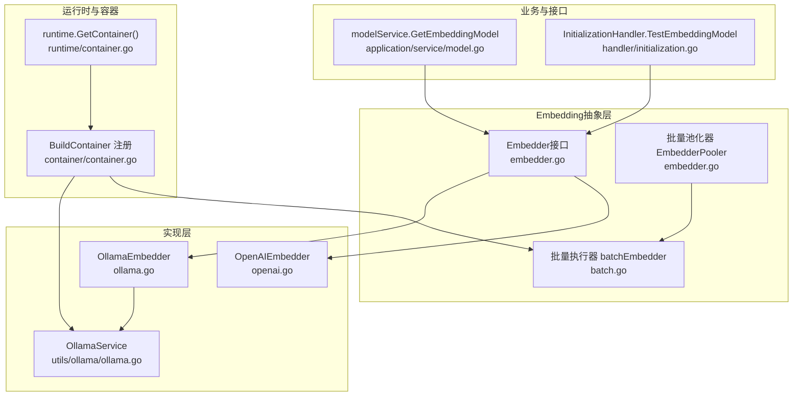
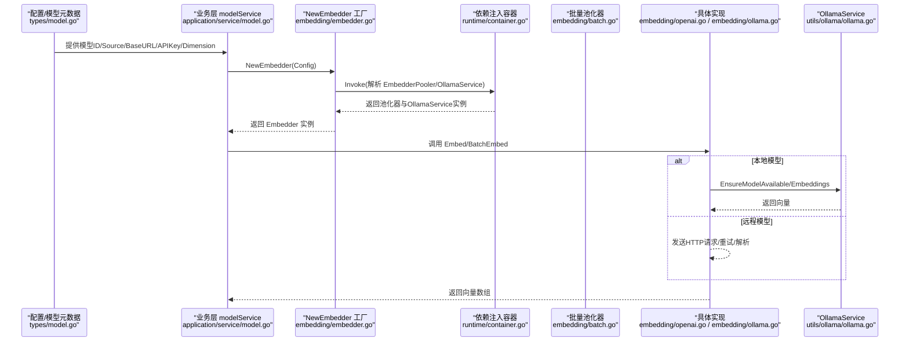
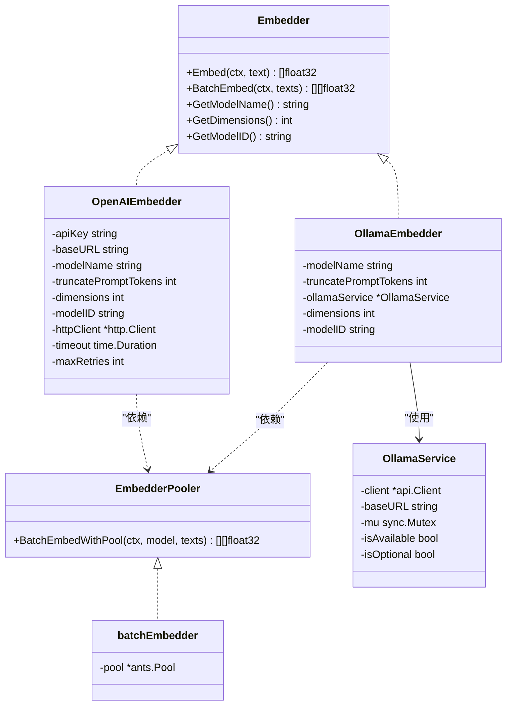

# Embedding模型集成

<cite>
**本文引用的文件列表**
- [embedder.go](file://internal/models/embedding/embedder.go)
- [openai.go](file://internal/models/embedding/openai.go)
- [ollama.go](file://internal/models/embedding/ollama.go)
- [batch.go](file://internal/models/embedding/batch.go)
- [ollama.go](file://internal/models/utils/ollama/ollama.go)
- [container.go](file://internal/container/container.go)
- [runtime.go](file://internal/runtime/container.go)
- [model.go](file://internal/application/service/model.go)
- [initialization.go](file://internal/handler/initialization.go)
- [model.go](file://internal/types/model.go)
- [config.go](file://internal/config/config.go)
</cite>

## 目录
1. [简介](#简介)
2. [项目结构与角色定位](#项目结构与角色定位)
3. [核心组件](#核心组件)
4. [架构总览](#架构总览)
5. [详细组件分析](#详细组件分析)
6. [依赖关系分析](#依赖关系分析)
7. [性能与并发特性](#性能与并发特性)
8. [故障排查指南](#故障排查指南)
9. [结论](#结论)
10. [附录：从零集成新Embedding模型步骤](#附录从零集成新embedding模型步骤)

## 简介
本文件面向希望在 WeKnora_New 中集成新的 Embedding 模型的开发者，围绕 internal/models/embedding 包的接口与实现，系统讲解：
- Embedder 接口的实现要求：向量化方法、批处理支持、错误处理与返回规范
- 从配置加载、服务注册到实际调用的完整流程
- 借助 openai.go 与 ollama.go 的实现示例，说明如何适配第三方 API 或本地模型服务
- 输入预处理、输出归一化、性能优化与依赖注入容器注册要点

## 项目结构与角色定位
- internal/models/embedding：Embedding 模型抽象与具体实现（OpenAI、Ollama）
- internal/models/utils/ollama：Ollama 客户端封装与模型可用性管理
- internal/container：依赖注入容器构建，负责注册 EmbedderPooler、OllamaService 等
- internal/runtime：全局 dig 容器入口
- internal/application/service/model.go：业务层根据模型 ID 获取 Embedder 实例
- internal/handler/initialization.go：初始化/测试接口，用于验证模型连通性与维度
- internal/types/model.go：模型元数据与枚举（ModelSource、ModelType 等）

图表来源
- [embedder.go](file://internal/models/embedding/embedder.go#L1-L77)
- [openai.go](file://internal/models/embedding/openai.go#L1-L199)
- [ollama.go](file://internal/models/embedding/ollama.go#L1-L126)
- [batch.go](file://internal/models/embedding/batch.go#L1-L84)
- [ollama.go](file://internal/models/utils/ollama/ollama.go#L1-L322)
- [container.go](file://internal/container/container.go#L1-L138)
- [runtime.go](file://internal/runtime/container.go#L1-L24)
- [model.go](file://internal/application/service/model.go#L189-L228)
- [initialization.go](file://internal/handler/initialization.go#L1095-L1137)

章节来源
- [embedder.go](file://internal/models/embedding/embedder.go#L1-L77)
- [container.go](file://internal/container/container.go#L1-L138)
- [runtime.go](file://internal/runtime/container.go#L1-L24)

## 核心组件
- Embedder 接口：定义单条文本向量化、批量向量化、模型名、维度、模型 ID 查询以及池化批处理能力
- EmbedderPooler 接口：提供带 goroutine 池的批量向量化能力，内部使用 ants 并发池
- OpenAIEmbedder：基于 OpenAI Embeddings API 的实现，包含请求重试、超时、状态码校验与响应解析
- OllamaEmbedder：基于本地 Ollama 服务的实现，负责模型可用性检查与拉取
- OllamaService：对官方 Ollama 客户端的封装，提供心跳、模型列表、拉取、版本查询等能力
- NewEmbedder 工厂：根据配置的 Source（local/remote）选择具体实现，并通过依赖注入容器解析所需依赖

章节来源
- [embedder.go](file://internal/models/embedding/embedder.go#L1-L77)
- [openai.go](file://internal/models/embedding/openai.go#L1-L199)
- [ollama.go](file://internal/models/embedding/ollama.go#L1-L126)
- [batch.go](file://internal/models/embedding/batch.go#L1-L84)
- [ollama.go](file://internal/models/utils/ollama/ollama.go#L1-L322)

## 架构总览
下图展示了从“配置/模型元数据”到“Embedder 实例”的装配链路，以及“业务层/接口层”如何调用 Embedder 的整体流程。

图表来源
- [model.go](file://internal/application/service/model.go#L189-L228)
- [embedder.go](file://internal/models/embedding/embedder.go#L51-L77)
- [batch.go](file://internal/models/embedding/batch.go#L1-L84)
- [openai.go](file://internal/models/embedding/openai.go#L1-L199)
- [ollama.go](file://internal/models/embedding/ollama.go#L1-L126)
- [ollama.go](file://internal/models/utils/ollama/ollama.go#L1-L322)
- [runtime.go](file://internal/runtime/container.go#L1-L24)

## 详细组件分析

### Embedder 接口与工厂
- 接口职责
  - 单条向量化：Embed(ctx, text) -> []float32
  - 批量向量化：BatchEmbed(ctx, texts) -> [][]float32
  - 元信息查询：GetModelName()、GetDimensions()、GetModelID()
  - 池化批处理：EmbedderPooler.BatchEmbedWithPool(ctx, model, texts)
- 工厂 NewEmbedder
  - 根据 Config.Source 选择实现
  - local：NewOllamaEmbedder，依赖 EmbedderPooler 与 OllamaService
  - remote：NewOpenAIEmbedder，依赖 EmbedderPooler
  - 不支持的 Source 返回错误

章节来源
- [embedder.go](file://internal/models/embedding/embedder.go#L1-L77)

### OpenAIEmbedder 实现要点
- 请求构造
  - OpenAIEmbedRequest：包含 model、input、truncate_prompt_tokens
  - 默认 base_url 为官方地址；默认 truncate_prompt_tokens 为 511
- 错误处理
  - doRequestWithRetry：指数退避重试，最多 maxRetries 次
  - 状态码非 200 直接报错
  - JSON 序列化/反序列化失败统一包装错误
- 输出解析
  - OpenAIEmbedResponse：按顺序提取每个样本的 embedding
- 兼容性
  - Embed 方法内部通过 BatchEmbed 实现，保证一致性

章节来源
- [openai.go](file://internal/models/embedding/openai.go#L1-L199)

### OllamaEmbedder 实现要点
- 模型可用性
  - ensureModelAvailable：通过 OllamaService 确保模型存在，必要时拉取
  - OllamaService 支持可选模式（OLLAMA_OPTIONAL=true），不可用时不中断应用
- 请求参数
  - OllamaEmbedRequest：model、prompt、truncate_prompt_tokens
  - Options 中设置 truncate 参数
- 输出
  - 直接返回 OllamaService.Embeddings 的结果

章节来源
- [ollama.go](file://internal/models/embedding/ollama.go#L1-L126)
- [ollama.go](file://internal/models/utils/ollama/ollama.go#L1-L322)

### 批量池化器与并发
- batchEmbedder
  - 使用 ants.Pool 管理并发
  - 将 texts 分块（固定批次大小），提交到池中并发执行 BatchEmbed
  - 任一任务失败记录 firstErr，最终汇总结果
  - 通过 utils.MapSlice/ChunkSlice 组织数据与分片

章节来源
- [batch.go](file://internal/models/embedding/batch.go#L1-L84)

### 依赖注入与容器注册
- runtime.GetContainer() 提供全局 dig 容器
- container.BuildContainer
  - 注册 EmbedderPooler：embedding.NewBatchEmbedder
  - 注册 OllamaService：initOllamaService
  - 注册 goroutine 池：initAntsPool
- NewEmbedder 在创建具体实现时，通过 runtime.GetContainer().Invoke 解析依赖

章节来源
- [runtime.go](file://internal/runtime/container.go#L1-L24)
- [container.go](file://internal/container/container.go#L1-L138)
- [embedder.go](file://internal/models/embedding/embedder.go#L51-L77)

### 业务层与接口层调用
- modelService.GetEmbeddingModel
  - 依据模型 ID 获取模型元数据（含 Source、Parameters）
  - 调用 embedding.NewEmbedder 构建 Embedder 实例
- InitializationHandler.TestEmbeddingModel
  - 接收前端传入的 source、model_name、base_url、api_key、dimension
  - 构造 embedding.Config，调用 NewEmbedder 并返回可用性与维度信息

章节来源
- [model.go](file://internal/application/service/model.go#L189-L228)
- [initialization.go](file://internal/handler/initialization.go#L1095-L1137)

## 依赖关系分析

图表来源
- [embedder.go](file://internal/models/embedding/embedder.go#L1-L77)
- [openai.go](file://internal/models/embedding/openai.go#L1-L199)
- [ollama.go](file://internal/models/embedding/ollama.go#L1-L126)
- [batch.go](file://internal/models/embedding/batch.go#L1-L84)
- [ollama.go](file://internal/models/utils/ollama/ollama.go#L1-L322)

## 性能与并发特性
- 并发池化
  - 通过 ants.Pool 控制并发度，避免高负载下的资源争用
  - batchEmbedder 将输入分块，减少单次请求规模，提升吞吐
- 重试与超时
  - OpenAIEmbedder 内置指数退避重试与 HTTP 超时，增强稳定性
- 可选 Ollama
  - OllamaService 支持可选模式，不可用时不会阻断应用，适合开发/测试场景
- 维度与截断
  - 通过 Config.Dimensions 与 TruncatePromptTokens 控制输出维度与输入长度，平衡精度与性能

章节来源
- [batch.go](file://internal/models/embedding/batch.go#L1-L84)
- [openai.go](file://internal/models/embedding/openai.go#L1-L199)
- [ollama.go](file://internal/models/utils/ollama/ollama.go#L1-L322)

## 故障排查指南
- 常见错误来源
  - OpenAI：HTTP 状态码非 200、JSON 解析失败、API Key 无效
  - Ollama：服务不可达、模型不存在、拉取失败
- 排查步骤
  - 使用 InitializationHandler.TestEmbeddingModel 快速验证连通性与维度
  - 检查 OLLAMA_BASE_URL、OLLAMA_OPTIONAL 环境变量
  - 查看日志中重试次数与耗时，定位网络或服务端瓶颈
- 建议
  - 为远程模型设置合理的超时与重试上限
  - 本地模型提前确保模型已存在，避免首次调用阻塞

章节来源
- [initialization.go](file://internal/handler/initialization.go#L1095-L1137)
- [openai.go](file://internal/models/embedding/openai.go#L1-L199)
- [ollama.go](file://internal/models/utils/ollama/ollama.go#L1-L322)

## 结论
WeKnora_New 的 Embedding 模型体系以 Embedder 接口为核心，通过工厂与依赖注入实现灵活扩展。OpenAI 与 Ollama 的实现分别覆盖了远程 API 与本地服务两种主流场景，配合批量池化器与可选 Ollama 模式，兼顾性能与稳定性。开发者只需遵循接口约定与配置规范，即可快速集成新的 Embedding 模型。

## 附录：从零集成新Embedding模型步骤

### 步骤一：定义实现类
- 新建文件 internal/models/embedding/newimpl.go
- 实现以下方法：
  - Embed(ctx, text) -> []float32
  - BatchEmbed(ctx, texts) -> [][]float32
  - GetModelName()、GetDimensions()、GetModelID()
- 若需要池化批处理，实现 EmbedderPooler 接口或复用现有 batchEmbedder

章节来源
- [embedder.go](file://internal/models/embedding/embedder.go#L1-L77)
- [batch.go](file://internal/models/embedding/batch.go#L1-L84)

### 步骤二：实现工厂函数
- 在 internal/models/embedding/embedder.go 中扩展 NewEmbedder：
  - 在 switch 中新增 case，根据自定义 Source 创建你的实现
  - 通过 runtime.GetContainer().Invoke 解析所需依赖（如池化器、外部服务）
- 为你的实现补充必要的构造参数（如 base_url、api_key、dimensions、model_id 等）

章节来源
- [embedder.go](file://internal/models/embedding/embedder.go#L51-L77)

### 步骤三：配置与注册
- 在 internal/container/container.go 中：
  - 如需自定义依赖（如外部客户端），在 BuildContainer 中注册 Provide
  - 确保 EmbedderPooler 已注册（embedding.NewBatchEmbedder）
- 在 internal/runtime/container.go 中确认 GetContainer() 可用

章节来源
- [container.go](file://internal/container/container.go#L1-L138)
- [runtime.go](file://internal/runtime/container.go#L1-L24)

### 步骤四：业务层与接口层对接
- 在 internal/application/service/model.go 中：
  - GetEmbeddingModel 根据模型 Source 与参数构造 Config，并调用 embedding.NewEmbedder
- 在 internal/handler/initialization.go 中：
  - 为你的 Source 添加测试逻辑，返回可用性与维度信息

章节来源
- [model.go](file://internal/application/service/model.go#L189-L228)
- [initialization.go](file://internal/handler/initialization.go#L1095-L1137)

### 步骤五：输入预处理与输出归一化
- 输入预处理
  - 截断策略：参考 TruncatePromptTokens，控制最大 token 数
  - 文本清洗：去除多余空白、特殊字符，确保模型输入稳定
- 输出归一化
  - 归一化：若模型输出未归一化，可在返回前做 L2 归一化，便于检索相似度计算
  - 维度校验：确保 GetDimensions() 返回值与 Config.Dimensions 一致

章节来源
- [openai.go](file://internal/models/embedding/openai.go#L1-L199)
- [ollama.go](file://internal/models/embedding/ollama.go#L1-L126)

### 步骤六：性能优化建议
- 批量处理：优先使用 BatchEmbed，结合 batchEmbedder 的分块与并发
- 并发控制：通过 ants.Pool 调整并发度，避免过载
- 缓存与重用：对相同输入的向量结果进行缓存（视业务需求）
- 超时与重试：为远程模型设置合理超时与指数退避重试

章节来源
- [batch.go](file://internal/models/embedding/batch.go#L1-L84)
- [openai.go](file://internal/models/embedding/openai.go#L1-L199)