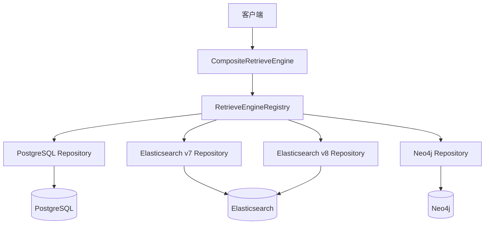
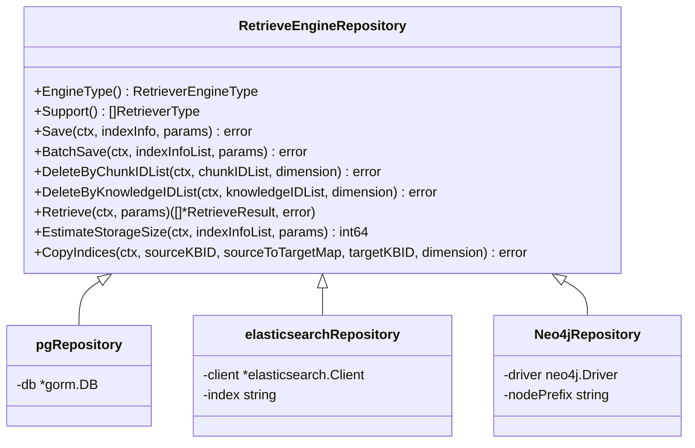
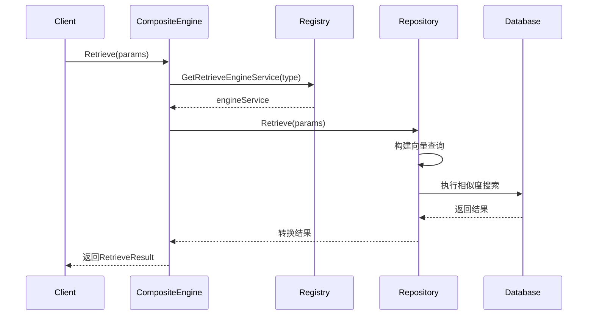
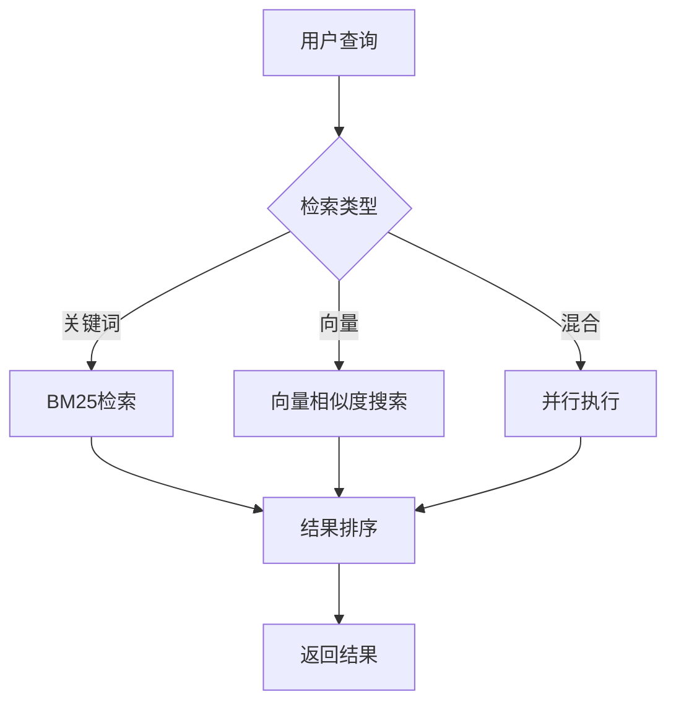

# 向量数据库支持

<cite>
**本文档引用的文件**  
- [retriever.go](file://internal/types/interfaces/retriever.go)
- [registry.go](file://internal/application/service/retriever/registry.go)
- [repository.go](file://internal/application/repository/retriever/postgres/repository.go)
- [repository.go](file://internal/application/repository/retriever/elasticsearch/v7/repository.go)
- [repository.go](file://internal/application/repository/retriever/elasticsearch/v8/repository.go)
- [repository.go](file://internal/application/repository/retriever/neo4j/repository.go)
- [retriever.go](file://internal/types/retriever.go)
- [composite.go](file://internal/application/service/retriever/composite.go)
- [keywords_vector_hybrid_indexer.go](file://internal/application/service/retriever/keywords_vector_hybrid_indexer.go)
- [retriever_graph.go](file://internal/types/interfaces/retriever_graph.go)
- [config.yaml](file://config/config.yaml)
- [structs.go](file://internal/application/repository/retriever/postgres/structs.go)
- [structs.go](file://internal/application/repository/retriever/elasticsearch/structs.go)
</cite>

## 目录
1. [引言](#引言)
2. [核心架构模式](#核心架构模式)
3. [数据访问抽象层设计原则](#数据访问抽象层设计原则)
4. [Retriever接口实现方法](#retriever接口实现方法)
5. [开发流程](#开发流程)
6. [与现有检索管道的集成](#与现有检索管道的集成)
7. [配置系统与动态切换](#配置系统与动态切换)
8. [结论](#结论)

## 引言
WeKnora_New项目通过统一的抽象层支持多种向量数据库，包括PostgreSQL/pgvector、Elasticsearch和Neo4j。该系统采用依赖注入和注册表模式，实现了向量存储后端的灵活扩展和动态切换。本指南详细说明了如何为系统添加新的向量数据库支持，分析了现有实现的架构模式，并提供了从驱动接入到结果映射的完整开发流程。

**Section sources**
- [retriever.go](file://internal/types/interfaces/retriever.go)
- [registry.go](file://internal/application/service/retriever/registry.go)

## 核心架构模式

WeKnora_New的向量数据库支持基于分层架构设计，核心组件包括：

1. **接口层**：定义`RetrieveEngineRepository`接口，规范了向量数据库的基本操作
2. **服务层**：`KeywordsVectorHybridRetrieveEngineService`实现混合检索逻辑
3. **注册表层**：`RetrieveEngineRegistry`管理所有注册的检索引擎
4. **组合模式**：`CompositeRetrieveEngine`支持多引擎并行检索



**Diagram sources**
- [composite.go](file://internal/application/service/retriever/composite.go)
- [registry.go](file://internal/application/service/retriever/registry.go)

## 数据访问抽象层设计原则

系统通过`RetrieveEngineRepository`接口实现了数据访问的抽象，其设计遵循以下原则：

1. **统一接口**：所有向量数据库实现相同的接口方法
2. **类型安全**：使用枚举类型`RetrieverEngineType`和`RetrieverType`确保类型安全
3. **可扩展性**：通过注册表模式支持新数据库的无缝接入
4. **事务一致性**：提供批量操作和原子性保证



**Diagram sources**
- [retriever.go](file://internal/types/interfaces/retriever.go)
- [repository.go](file://internal/application/repository/retriever/postgres/repository.go)
- [repository.go](file://internal/application/repository/retriever/elasticsearch/v7/repository.go)
- [repository.go](file://internal/application/repository/retriever/neo4j/repository.go)

## Retriever接口实现方法

### 向量相似度搜索
向量相似度搜索通过`VectorRetrieve`方法实现，不同数据库采用不同的相似度计算方式：

- **PostgreSQL/pgvector**：使用余弦相似度操作符`<=>`
- **Elasticsearch**：使用`cosineSimilarity`脚本评分
- **Neo4j**：通过图算法计算节点相似度



**Diagram sources**
- [composite.go](file://internal/application/service/retriever/composite.go)
- [repository.go](file://internal/application/repository/retriever/postgres/repository.go)

### 元数据过滤
元数据过滤通过`RetrieveParams`中的`KnowledgeBaseIDs`、`ExcludeKnowledgeIDs`等字段实现，系统在查询时自动构建相应的过滤条件：

- **PostgreSQL**：使用`WHERE`子句和`IN`操作符
- **Elasticsearch**：使用`bool`查询的`must`和`must_not`条件
- **Neo4j**：在`MATCH`语句中添加条件约束

### 分页查询
分页查询通过`TopK`参数控制返回结果数量，系统在查询时自动添加`LIMIT`或`size`限制：

- **PostgreSQL**：使用`LIMIT`子句
- **Elasticsearch**：使用`size`参数
- **Neo4j**：使用`LIMIT`子句

### 连接管理
连接管理通过依赖注入容器实现，各数据库的连接实例在系统启动时初始化并注入到相应的Repository中：

- **PostgreSQL**：使用GORM的`*gorm.DB`连接
- **Elasticsearch**：使用官方客户端的`TypedClient`
- **Neo4j**：使用官方驱动的`Driver`实例

**Section sources**
- [retriever.go](file://internal/types/retriever.go)
- [repository.go](file://internal/application/repository/retriever/postgres/repository.go)
- [repository.go](file://internal/application/repository/retriever/elasticsearch/v8/repository.go)
- [repository.go](file://internal/application/repository/retriever/neo4j/repository.go)

## 开发流程

### 数据库驱动接入
添加新的向量数据库支持需要以下步骤：

1. 实现`RetrieveEngineRepository`接口
2. 创建相应的数据模型结构体
3. 实现连接初始化和健康检查
4. 注册到`RetrieveEngineRegistry`

### 查询语句构建
查询语句构建遵循统一的模式：

1. 解析`RetrieveParams`参数
2. 根据`RetrieverType`确定查询类型
3. 构建相应的数据库查询语句
4. 执行查询并处理结果

### 结果映射
结果映射通过`IndexWithScore`结构体实现，将数据库查询结果转换为统一的领域模型：

```go
type IndexWithScore struct {
    ID              string
    Content         string
    SourceID        string
    SourceType      SourceType
    ChunkID         string
    KnowledgeID     string
    KnowledgeBaseID string
    Score           float64
    MatchType       MatchType
}
```

**Section sources**
- [retriever.go](file://internal/types/retriever.go)
- [structs.go](file://internal/application/repository/retriever/postgres/structs.go)
- [structs.go](file://internal/application/repository/retriever/elasticsearch/structs.go)

## 与现有检索管道的集成

系统通过`CompositeRetrieveEngine`实现与现有检索管道的集成，支持BM25+向量混合检索：

1. **关键词检索**：使用`KeywordsRetrieverType`进行全文搜索
2. **向量检索**：使用`VectorRetrieverType`进行语义搜索
3. **混合检索**：并行执行两种检索并合并结果



**Diagram sources**
- [composite.go](file://internal/application/service/retriever/composite.go)

## 配置系统与动态切换

系统通过配置文件和运行时注册表实现存储后端的动态切换：

### 配置文件
```yaml
# config.yaml
conversation:
  embedding_top_k: 10
  vector_threshold: 0.5
```

### 动态切换
通过`RetrieveEngineRegistry`的注册机制，可以在运行时动态添加或替换存储后端：

1. 创建新的Repository实例
2. 调用`Register`方法注册到注册表
3. 系统自动路由到新的存储后端

**Section sources**
- [config.yaml](file://config/config.yaml)
- [registry.go](file://internal/application/service/retriever/registry.go)

## 结论
WeKnora_New的向量数据库支持系统通过清晰的分层架构和接口抽象，实现了对多种存储后端的灵活支持。开发者可以通过实现标准接口、构建查询语句和映射结果来添加新的向量数据库支持。系统通过注册表模式和组合模式，确保了扩展性和灵活性，同时保持了代码的可维护性。