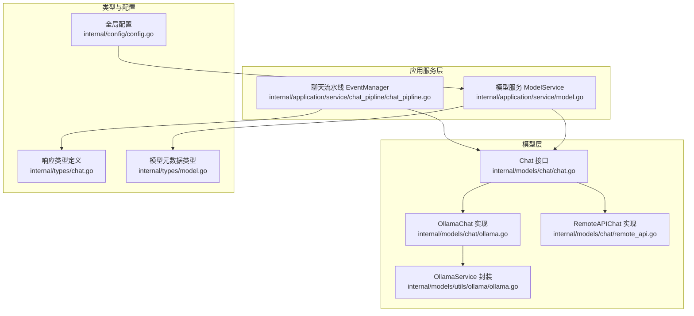
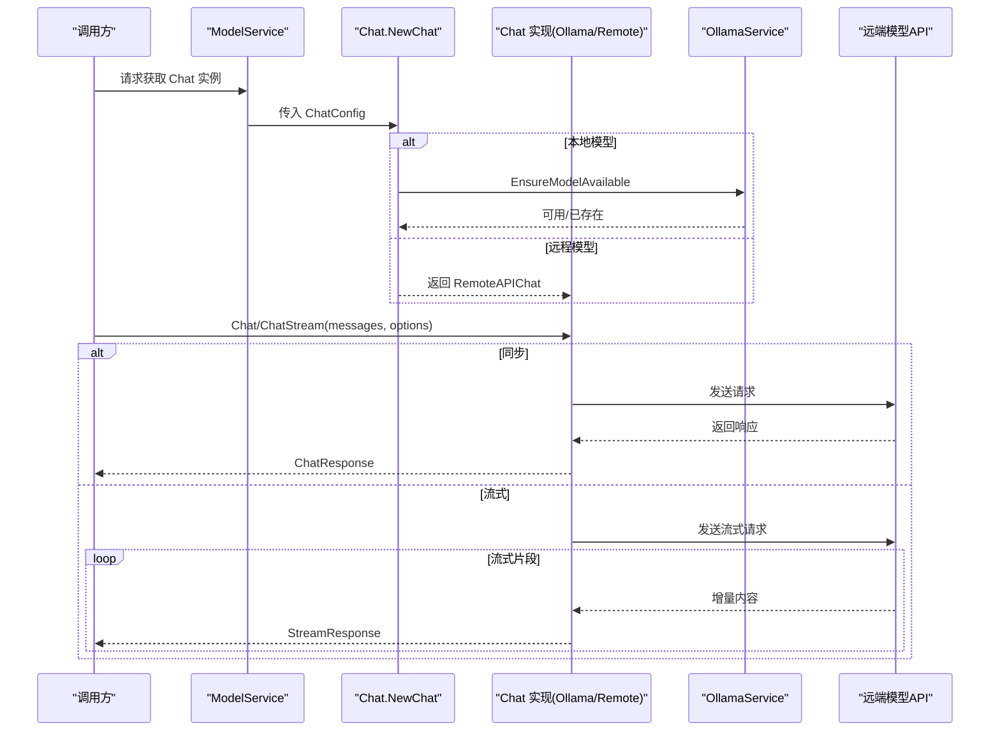
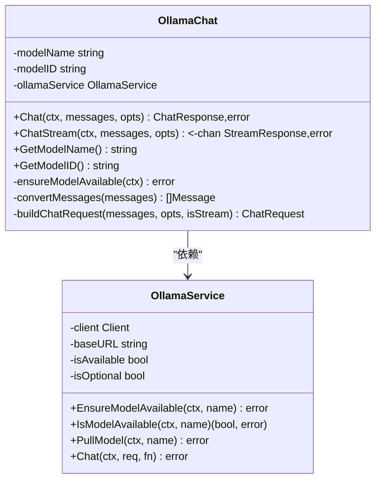
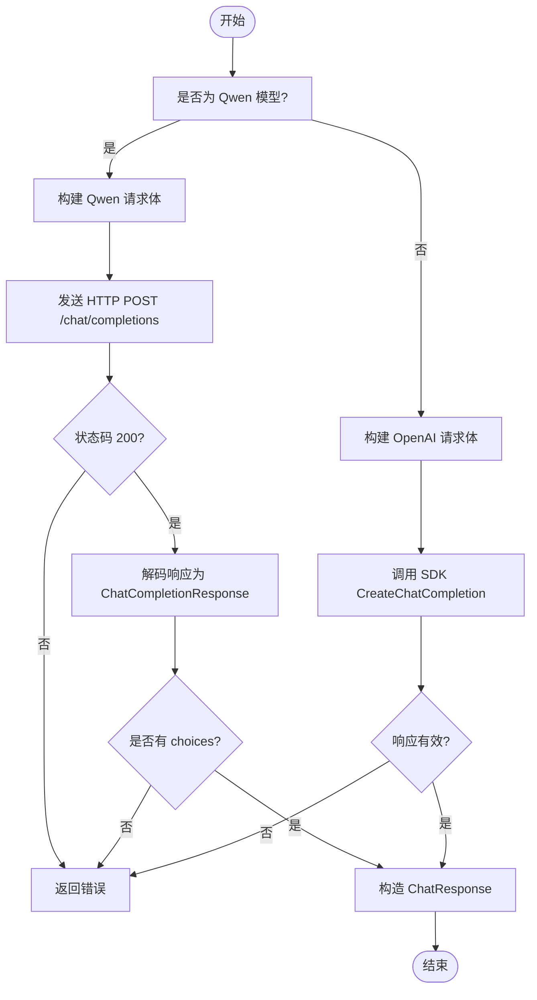
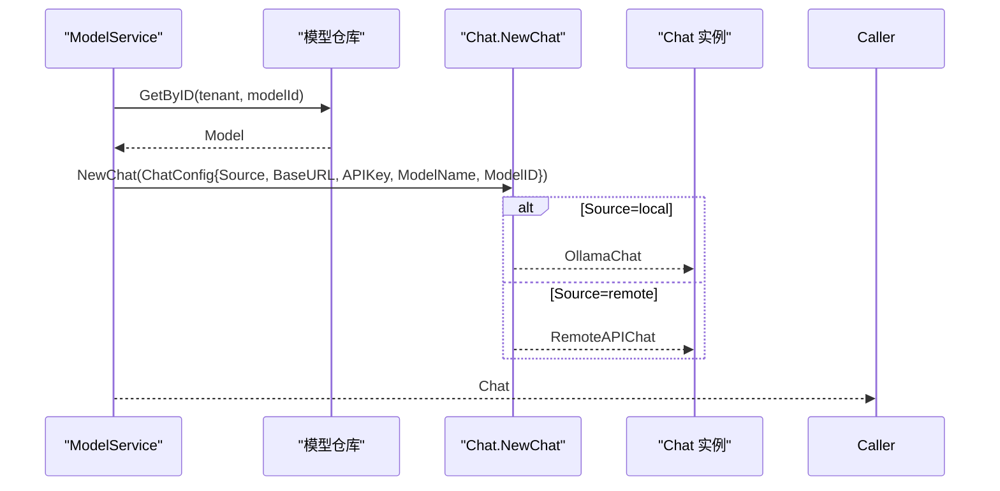
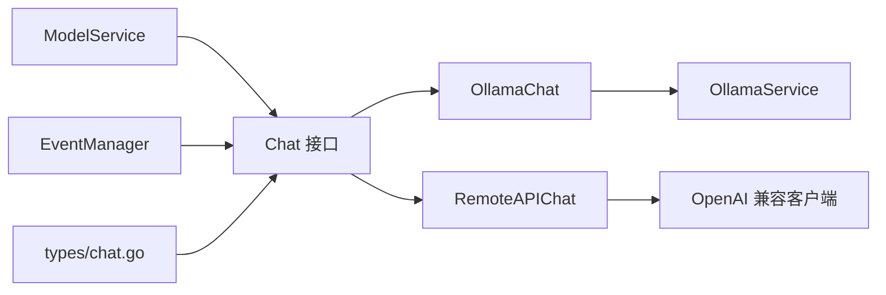

# 大语言模型集成

<cite>
**本文引用的文件**
- [internal/models/chat/chat.go](file://internal/models/chat/chat.go)
- [internal/models/chat/ollama.go](file://internal/models/chat/ollama.go)
- [internal/models/chat/remote_api.go](file://internal/models/chat/remote_api.go)
- [internal/models/utils/ollama/ollama.go](file://internal/models/utils/ollama/ollama.go)
- [internal/types/chat.go](file://internal/types/chat.go)
- [internal/types/model.go](file://internal/types/model.go)
- [internal/application/service/model.go](file://internal/application/service/model.go)
- [internal/application/service/chat_pipline/chat_pipline.go](file://internal/application/service/chat_pipline/chat_pipline.go)
- [internal/config/config.go](file://internal/config/config.go)
- [internal/models/chat/remote_api_test.go](file://internal/models/chat/remote_api_test.go)
</cite>

## 目录
1. [简介](#简介)
2. [项目结构](#项目结构)
3. [核心组件](#核心组件)
4. [架构总览](#架构总览)
5. [详细组件分析](#详细组件分析)
6. [依赖关系分析](#依赖关系分析)
7. [性能与可扩展性](#性能与可扩展性)
8. [故障排查指南](#故障排查指南)
9. [结论](#结论)
10. [附录](#附录)

## 简介
本指南面向需要在系统中接入大语言模型（LLM）的开发者，围绕 internal/models/chat 包提供的抽象接口，系统讲解 ChatModel 接口的实现规范与最佳实践，覆盖：
- 同步/流式响应处理
- 上下文长度与令牌控制
- 重试与速率限制策略建议
- 提示词模板注入与系统指令配置
- 响应解析与错误映射
- 以 Qwen 与 Ollama 为例的 RESTful 封装流程
- 自定义模型适配器的实现要点
- 运行时通过配置动态加载不同模型实例

目标是帮助你在不深入底层细节的前提下，快速、安全地完成 LLM 集成与扩展。

## 项目结构
与 LLM 集成直接相关的模块分布如下：
- models/chat：定义 Chat 接口及本地/远程适配器（Ollama、OpenAI 兼容）
- models/utils/ollama：Ollama 客户端封装与模型可用性检查
- types：统一的响应数据结构（含流式）
- application/service/model：根据模型配置创建 Chat 实例
- application/service/chat_pipline：聊天流水线插件与事件驱动
- config：全局配置（包含对话、模型等）

图表来源
- [internal/models/chat/chat.go](file://internal/models/chat/chat.go#L1-L73)
- [internal/models/chat/ollama.go](file://internal/models/chat/ollama.go#L1-L192)
- [internal/models/chat/remote_api.go](file://internal/models/chat/remote_api.go#L1-L272)
- [internal/models/utils/ollama/ollama.go](file://internal/models/utils/ollama/ollama.go#L1-L322)
- [internal/application/service/model.go](file://internal/application/service/model.go#L282-L327)
- [internal/application/service/chat_pipline/chat_pipline.go](file://internal/application/service/chat_pipline/chat_pipline.go#L1-L162)
- [internal/types/chat.go](file://internal/types/chat.go#L1-L65)
- [internal/types/model.go](file://internal/types/model.go#L1-L106)
- [internal/config/config.go](file://internal/config/config.go#L1-L193)

章节来源
- [internal/models/chat/chat.go](file://internal/models/chat/chat.go#L1-L73)
- [internal/application/service/model.go](file://internal/application/service/model.go#L282-L327)

## 核心组件
- Chat 接口：统一的聊天能力抽象，支持同步与流式两种模式；提供模型名称/ID 查询能力。
- ChatOptions：统一的推理参数集合，包含温度、TopP、最大 token、惩罚项、思考开关等。
- Message：标准化的消息结构（role/content），便于跨模型适配。
- ChatConfig：模型初始化配置，包含来源（本地/远程）、BaseURL、APIKey、模型名与ID。
- 响应类型：ChatResponse 与 StreamResponse，统一输出内容与用量统计，支持知识引用字段。

章节来源
- [internal/models/chat/chat.go](file://internal/models/chat/chat.go#L1-L73)
- [internal/types/chat.go](file://internal/types/chat.go#L1-L65)
- [internal/types/model.go](file://internal/types/model.go#L1-L106)

## 架构总览
系统通过 ModelService 根据模型配置动态创建 Chat 实例，随后在聊天流水线中调用 Chat 接口完成对话。本地模型通过 OllamaService 管理模型可用性与拉取；远程模型通过 OpenAI 兼容客户端或自定义 HTTP 客户端访问。

图表来源
- [internal/application/service/model.go](file://internal/application/service/model.go#L282-L327)
- [internal/models/chat/chat.go](file://internal/models/chat/chat.go#L55-L73)
- [internal/models/chat/ollama.go](file://internal/models/chat/ollama.go#L177-L192)
- [internal/models/chat/remote_api.go](file://internal/models/chat/remote_api.go#L122-L217)

## 详细组件分析

### Chat 接口与实现规范
- 必须实现的方法
  - Chat(ctx, messages, opts) -> ChatResponse,error
  - ChatStream(ctx, messages, opts) -> chan StreamResponse,error
  - GetModelName()/GetModelID()
- 同步/流式一致性
  - 同步返回 ChatResponse，包含 content 与 usage（prompt/completion/total tokens）
  - 流式返回连续的 StreamResponse，Done=false 表示增量片段，Done=true 表示结束
- 上下文长度与令牌控制
  - ChatOptions 中的 MaxTokens/MaxCompletionTokens 用于限制生成长度
  - RemoteAPIChat 支持 Temperature/TopP/FrequencyPenalty/PresencePenalty 等参数透传
  - OllamaChat 将温度与 TopP 映射为 Ollama Options，MaxTokens 映射为 num_predict
- 思考开关
  - ChatOptions.Thinking 控制是否启用“思考”模式
  - RemoteAPIChat 通过 ChatTemplateKwargs.enable_thinking 注入
  - OllamaChat 通过 Think 字段传递

章节来源
- [internal/models/chat/chat.go](file://internal/models/chat/chat.go#L1-L73)
- [internal/types/chat.go](file://internal/types/chat.go#L1-L65)

### Ollama 适配器（本地模型）
- 模型可用性保障
  - ensureModelAvailable 内部调用 OllamaService.EnsureModelAvailable，自动拉取缺失模型
  - OllamaService 支持可选模式（OLLAMA_OPTIONAL=true）：服务不可用时不中断业务
- 请求构建
  - convertMessages 将通用 Message 转换为 Ollama API 消息
  - buildChatRequest 将 ChatOptions 映射为 Ollama Options
- 同步与流式
  - 同步：回调中累积 content 并提取 eval 计数作为 usage
  - 流式：逐片推送 StreamResponse，Done=true 标记结束
- 日志与错误
  - 关键步骤记录日志，错误包装为可读信息

图表来源
- [internal/models/chat/ollama.go](file://internal/models/chat/ollama.go#L1-L192)
- [internal/models/utils/ollama/ollama.go](file://internal/models/utils/ollama/ollama.go#L1-L322)

章节来源
- [internal/models/chat/ollama.go](file://internal/models/chat/ollama.go#L1-L192)
- [internal/models/utils/ollama/ollama.go](file://internal/models/utils/ollama/ollama.go#L1-L322)

### 远程 API 适配器（以 Qwen 为例）
- 初始化
  - NewRemoteAPIChat 使用 APIKey 与 BaseURL 构造 OpenAI 兼容客户端
- 请求构建
  - convertMessages 将通用 Message 转为 OpenAI 消息
  - buildChatCompletionRequest 将 ChatOptions 映射为 OpenAI 请求参数
- 特殊模型处理（Qwen）
  - isAliyunQwen3Model 判断是否为特定前缀且 BaseURL 为 DashScope 兼容模式
  - buildQwenChatCompletionRequest 强制非流式场景关闭 enable_thinking
  - chatWithQwen 使用自定义 JSON 请求体与 Authorization 头直接调用 /chat/completions
- 同步与流式
  - 同步：CreateChatCompletion 返回 ChatCompletionResponse，转换为 ChatResponse
  - 流式：CreateChatCompletionStream 循环接收增量 Delta.Content，封装为 StreamResponse
- 错误处理
  - 对 HTTP 状态码进行校验，解码失败与无 choices 场景均返回明确错误

图表来源
- [internal/models/chat/remote_api.go](file://internal/models/chat/remote_api.go#L58-L217)

章节来源
- [internal/models/chat/remote_api.go](file://internal/models/chat/remote_api.go#L1-L272)

### 模型工厂与运行时加载
- 工厂函数 NewChat 根据 ChatConfig.Source 分派到本地或远程适配器
  - 本地：通过容器注入 OllamaService，创建 OllamaChat
  - 远程：创建 RemoteAPIChat
- ModelService.GetChatModel 从仓库获取模型后，构造 ChatConfig 并调用 NewChat
- types.Model 结构包含模型元数据与参数（BaseURL/APIKey/参数对象），用于动态加载

图表来源
- [internal/application/service/model.go](file://internal/application/service/model.go#L282-L327)
- [internal/models/chat/chat.go](file://internal/models/chat/chat.go#L55-L73)
- [internal/types/model.go](file://internal/types/model.go#L1-L106)

章节来源
- [internal/application/service/model.go](file://internal/application/service/model.go#L282-L327)
- [internal/models/chat/chat.go](file://internal/models/chat/chat.go#L55-L73)
- [internal/types/model.go](file://internal/types/model.go#L1-L106)

### 聊天流水线与插件
- EventManager 提供插件注册与事件链路，支持在调用 Chat 前后插入预处理、检索、重排等逻辑
- 插件通过 next() 串联执行，发生错误时可返回 PluginError 并携带描述与类型
- 聊天完成后的 ChatResponse 由流水线后续阶段使用（如引用、摘要、溯源）

章节来源
- [internal/application/service/chat_pipline/chat_pipline.go](file://internal/application/service/chat_pipline/chat_pipline.go#L1-L162)

## 依赖关系分析
- Chat 接口被 ModelService 与流水线共同依赖，保证上层调用的一致性
- OllamaChat 依赖 OllamaService，后者负责服务可用性检测与模型拉取
- RemoteAPIChat 依赖 OpenAI 兼容 SDK 或自定义 HTTP 客户端
- types/chat.go 定义的响应结构贯穿同步/流式路径，确保下游消费一致

图表来源
- [internal/models/chat/chat.go](file://internal/models/chat/chat.go#L1-L73)
- [internal/models/chat/ollama.go](file://internal/models/chat/ollama.go#L1-L192)
- [internal/models/chat/remote_api.go](file://internal/models/chat/remote_api.go#L1-L272)
- [internal/models/utils/ollama/ollama.go](file://internal/models/utils/ollama/ollama.go#L1-L322)
- [internal/application/service/model.go](file://internal/application/service/model.go#L282-L327)
- [internal/application/service/chat_pipline/chat_pipline.go](file://internal/application/service/chat_pipline/chat_pipline.go#L1-L162)
- [internal/types/chat.go](file://internal/types/chat.go#L1-L65)

## 性能与可扩展性
- 同步/流式选择
  - 对实时交互优先使用流式，减少等待时间；对批处理或需要一次性聚合结果时使用同步
- 上下文长度控制
  - 合理设置 MaxTokens/MaxCompletionTokens，避免过长上下文导致延迟与成本上升
  - ChatOptions 中的温度与 TopP 影响生成多样性与稳定性，建议结合业务场景调参
- 本地模型可用性
  - OllamaService 支持可选模式，服务不可用时仍可继续运行，但需注意降级策略
- 远程模型稳定性
  - 建议在 RemoteAPIChat 层增加指数退避与重试（见“重试与速率限制”章节），并设置合理的超时
- 扩展新模型
  - 新增适配器只需实现 Chat 接口，复用现有工厂与流水线，降低耦合

[本节为通用建议，无需具体文件引用]

## 故障排查指南
- 本地模型未就绪
  - 现象：Chat 调用报错或返回空内容
  - 排查：确认 OllamaService.StartService 成功；检查 OLLAMA_BASE_URL 与 OLLAMA_OPTIONAL 配置
  - 参考
    - [internal/models/utils/ollama/ollama.go](file://internal/models/utils/ollama/ollama.go#L60-L90)
    - [internal/models/chat/ollama.go](file://internal/models/chat/ollama.go#L177-L192)
- 远程模型认证失败
  - 现象：HTTP 401/403 或 SDK 抛错
  - 排查：核对 APIKey 与 BaseURL；确认 DashScope 兼容模式 URL 与 Qwen 前缀匹配
  - 参考
    - [internal/models/chat/remote_api.go](file://internal/models/chat/remote_api.go#L30-L44)
    - [internal/models/chat/remote_api.go](file://internal/models/chat/remote_api.go#L58-L77)
- 流式连接异常
  - 现象：流式通道提前关闭或无增量内容
  - 排查：检查 SDK CreateChatCompletionStream 的错误处理与 Close 调用；确认网络稳定
  - 参考
    - [internal/models/chat/remote_api.go](file://internal/models/chat/remote_api.go#L219-L261)
- 响应为空或无用量
  - 现象：choices 为空或 usage 为 0
  - 排查：确认模型返回结构；RemoteAPIChat 对无 choices 场景返回明确错误
  - 参考
    - [internal/models/chat/remote_api.go](file://internal/models/chat/remote_api.go#L122-L155)

章节来源
- [internal/models/utils/ollama/ollama.go](file://internal/models/utils/ollama/ollama.go#L60-L90)
- [internal/models/chat/ollama.go](file://internal/models/chat/ollama.go#L177-L192)
- [internal/models/chat/remote_api.go](file://internal/models/chat/remote_api.go#L30-L44)
- [internal/models/chat/remote_api.go](file://internal/models/chat/remote_api.go#L122-L155)
- [internal/models/chat/remote_api.go](file://internal/models/chat/remote_api.go#L219-L261)

## 结论
通过 Chat 接口与工厂模式，系统实现了对本地与远程模型的统一抽象与动态加载。Ollama 与 OpenAI 兼容客户端分别满足本地推理与云端模型接入的需求。配合流水线插件与类型化的响应结构，开发者可以快速扩展新的模型适配器，并在不改变上层调用的情况下实现差异化配置与行为。

[本节为总结，无需具体文件引用]

## 附录

### 实现自定义模型适配器的步骤清单
- 实现 Chat 接口
  - Chat(ctx, messages, opts) -> ChatResponse,error
  - ChatStream(ctx, messages, opts) -> chan StreamResponse,error
  - GetModelName()/GetModelID()
- 参数映射
  - 将 ChatOptions 映射到目标模型的请求参数（温度、TopP、最大 token、惩罚项、思考开关）
- 认证与网络
  - 支持 APIKey/BaseURL 配置；必要时设置超时与重试
- 响应解析
  - 同步：填充 ChatResponse.content 与 usage
  - 流式：按增量推送 StreamResponse，Done=true 标记结束
- 可选特性
  - 模型可用性检查（本地模型）
  - 特定模型的兼容处理（如 Qwen 的特殊字段）
- 注册与加载
  - 在 Chat.NewChat 中新增分支，按 Source 分派
  - 在 ModelService.GetChatModel 中使用 ChatConfig 动态创建实例

章节来源
- [internal/models/chat/chat.go](file://internal/models/chat/chat.go#L1-L73)
- [internal/models/chat/remote_api.go](file://internal/models/chat/remote_api.go#L1-L272)
- [internal/models/chat/ollama.go](file://internal/models/chat/ollama.go#L1-L192)
- [internal/application/service/model.go](file://internal/application/service/model.go#L282-L327)

### 重试与速率限制建议
- 重试策略
  - 对瞬时网络错误与 429/5xx 响应采用指数退避重试
  - 限制最大重试次数与总超时时间
- 速率限制
  - 远程模型侧：遵循供应商限速，必要时引入队列或令牌桶
  - 本地模型侧：避免并发拉取同一模型导致资源争用
- 超时设置
  - 为 HTTP 请求与 SDK 调用设置合理超时，防止阻塞
- 错误码映射
  - 将 HTTP 状态码与 SDK 错误映射为统一的错误类型，便于上层处理

[本节为通用建议，无需具体文件引用]

### 配置驱动的动态加载
- 模型配置
  - Model 结构包含 BaseURL、APIKey、参数对象等，用于初始化 Chat 实例
- 全局配置
  - config.Config 提供对话、服务器、流管理等配置入口
- 加载流程
  - ModelService.GetChatModel 读取仓库中的模型元数据，构造 ChatConfig 并调用工厂创建实例

章节来源
- [internal/types/model.go](file://internal/types/model.go#L1-L106)
- [internal/config/config.go](file://internal/config/config.go#L1-L193)
- [internal/application/service/model.go](file://internal/application/service/model.go#L282-L327)

### 示例：Qwen 与 Ollama 的 RESTful 封装要点
- Qwen（DashScope 兼容）
  - 使用自定义请求体与 Authorization 头
  - 非流式场景强制关闭 enable_thinking
  - 严格校验 HTTP 状态码与响应结构
- Ollama
  - 通过 OllamaService 确保模型可用
  - 将 ChatOptions 映射为 Ollama Options
  - 同步/流式分别处理增量内容与结束标记

章节来源
- [internal/models/chat/remote_api.go](file://internal/models/chat/remote_api.go#L58-L217)
- [internal/models/chat/ollama.go](file://internal/models/chat/ollama.go#L41-L120)