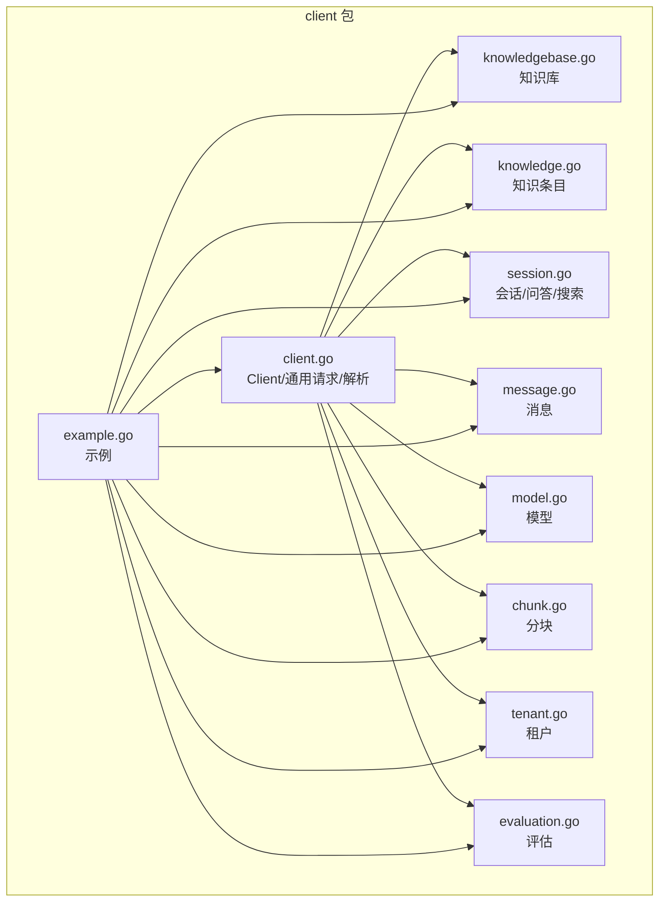
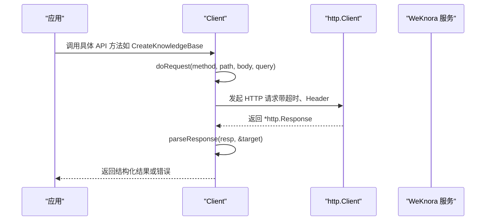
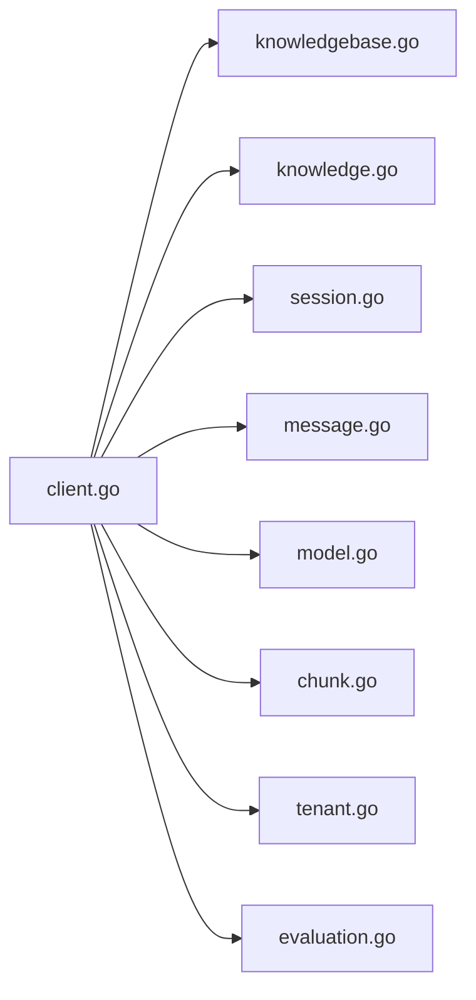

# 客户端SDK使用

<cite>
**本文引用的文件**
- [client.go](file://client/client.go)
- [example.go](file://client/example.go)
- [knowledgebase.go](file://client/knowledgebase.go)
- [knowledge.go](file://client/knowledge.go)
- [session.go](file://client/session.go)
- [message.go](file://client/message.go)
- [model.go](file://client/model.go)
- [chunk.go](file://client/chunk.go)
- [tenant.go](file://client/tenant.go)
- [evaluation.go](file://client/evaluation.go)
- [README.md](file://client/README.md)
- [go.mod](file://client/go.mod)
- [README.md（项目根）](file://README.md)
</cite>

## 目录
1. [简介](#简介)
2. [项目结构](#项目结构)
3. [核心组件](#核心组件)
4. [架构总览](#架构总览)
5. [详细组件分析](#详细组件分析)
6. [依赖关系分析](#依赖关系分析)
7. [性能与可扩展性](#性能与可扩展性)
8. [故障排查指南](#故障排查指南)
9. [结论](#结论)
10. [附录](#附录)

## 简介
本文件面向使用 Go 客户端 SDK 的开发者，系统讲解如何通过 client 包中的 Client 结构体与 WeKnora_New 服务进行交互。内容覆盖：
- 认证配置（API Key）
- 请求超时设置
- 连接池管理（默认使用 Go 标准库 http.Client）
- 知识库管理、文档上传、会话创建与消息发送等核心功能
- API 方法参数、返回值结构与错误处理模式
- 实现重试逻辑、日志追踪与性能监控的建议
- 扩展客户端以支持自定义功能的方法

## 项目结构
client 包采用按“资源域”划分的模块化组织方式，每个资源域对应一个 Go 文件，职责清晰：
- client.go：通用 HTTP 客户端封装、请求与响应解析
- knowledgebase.go：知识库 CRUD、混合检索、复制
- knowledge.go：知识条目上传（本地文件/URL）、查询、分页、下载、更新、图像信息更新
- session.go：会话 CRUD、标题生成、问答（含流式 SSE）、搜索、续流
- message.go：消息加载、最近消息、指定时间前消息、删除
- model.go：模型 CRUD、列表
- chunk.go：知识分块 CRUD、批量删除
- tenant.go：租户 CRUD、列表
- evaluation.go：评估任务启动与结果查询
- example.go：完整使用示例（创建 KB、上传文件、创建会话、问答、模型管理、分块管理、消息获取、清理）
- README.md：使用说明与示例

图表来源
- [client.go](file://client/client.go#L1-L105)
- [knowledgebase.go](file://client/knowledgebase.go#L1-L212)
- [knowledge.go](file://client/knowledge.go#L1-L357)
- [session.go](file://client/session.go#L1-L404)
- [message.go](file://client/message.go#L1-L83)
- [model.go](file://client/model.go#L1-L156)
- [chunk.go](file://client/chunk.go#L1-L172)
- [tenant.go](file://client/tenant.go#L1-L137)
- [evaluation.go](file://client/evaluation.go#L1-L114)
- [example.go](file://client/example.go#L1-L272)

章节来源
- [README.md（项目根）](file://README.md#L260-L265)
- [README.md（项目根）](file://README.md#L266-L308)

## 核心组件
- Client 结构体
  - 字段：baseURL、httpClient、token
  - 能力：统一发起 HTTP 请求、自动注入 Content-Type、X-API-Key、X-Request-ID；解析响应并处理非 2xx 错误
- ClientOption 选项
  - WithTimeout：设置 http.Client.Timeout
  - WithToken：设置 X-API-Key 请求头
- doRequest：封装 JSON 序列化、URL 拼接、查询参数编码、上下文传递、请求头注入与执行
- parseResponse：统一处理状态码、关闭 Body、JSON 解码目标对象

章节来源
- [client.go](file://client/client.go#L16-L21)
- [client.go](file://client/client.go#L23-L38)
- [client.go](file://client/client.go#L40-L54)
- [client.go](file://client/client.go#L56-L88)
- [client.go](file://client/client.go#L90-L105)

## 架构总览
客户端 SDK 通过 Client 统一发起 HTTP 请求，各资源域模块在 Client 基础上实现各自的 API 方法。典型调用链如下：

图表来源
- [client.go](file://client/client.go#L56-L88)
- [client.go](file://client/client.go#L90-L105)
- [knowledgebase.go](file://client/knowledgebase.go#L89-L102)
- [knowledge.go](file://client/knowledge.go#L204-L218)
- [session.go](file://client/session.go#L95-L108)

## 详细组件分析

### 认证与配置
- 认证方式
  - 通过 WithToken 设置 X-API-Key 请求头
  - 可结合上下文注入 X-Request-ID，便于跨服务追踪
- 超时控制
  - 通过 WithTimeout 设置 http.Client.Timeout
- 连接池
  - 默认使用标准库 http.DefaultTransport，具备连接复用、空闲回收等能力
  - 如需自定义连接池行为，可在 NewClient 前传入自定义 http.Client

章节来源
- [client.go](file://client/client.go#L23-L38)
- [client.go](file://client/client.go#L40-L54)
- [client.go](file://client/client.go#L74-L88)
- [example.go](file://client/example.go#L23-L30)

### 知识库管理（KnowledgeBase）
- 关键方法
  - CreateKnowledgeBase：创建知识库
  - GetKnowledgeBase：按 ID 查询
  - ListKnowledgeBases：分页列出
  - UpdateKnowledgeBase：更新名称/描述/配置
  - DeleteKnowledgeBase：删除
  - HybridSearch：基于知识库 ID 的混合检索
  - CopyKnowledgeBase：复制知识库
- 数据模型
  - KnowledgeBase、ChunkingConfig、ImageProcessingConfig、SearchResult、HybridSearchResponse
- 错误处理
  - 非 2xx 状态码统一返回错误
  - 成功响应包装为 KnowledgeBaseResponse/KnowledgeBaseListResponse

章节来源
- [knowledgebase.go](file://client/knowledgebase.go#L89-L102)
- [knowledgebase.go](file://client/knowledgebase.go#L104-L118)
- [knowledgebase.go](file://client/knowledgebase.go#L120-L133)
- [knowledgebase.go](file://client/knowledgebase.go#L142-L159)
- [knowledgebase.go](file://client/knowledgebase.go#L161-L175)
- [knowledgebase.go](file://client/knowledgebase.go#L177-L195)
- [knowledgebase.go](file://client/knowledgebase.go#L197-L211)

### 文档上传与知识管理（Knowledge）
- 上传方式
  - CreateKnowledgeFromFile：multipart/form-data 上传本地文件，支持 metadata 与 enable_multimodel
  - CreateKnowledgeFromURL：提交 URL 进行抓取
- 其他能力
  - GetKnowledge、GetKnowledgeBatch、ListKnowledge（分页）、DeleteKnowledge、DownloadKnowledgeFile、UpdateKnowledge
  - UpdateImageInfo：更新图像信息
- 特殊返回
  - 当重复文件/URL已存在时，返回 Conflict 并携带 ErrDuplicateFile/ErrDuplicateURL

章节来源
- [knowledge.go](file://client/knowledge.go#L80-L172)
- [knowledge.go](file://client/knowledge.go#L174-L202)
- [knowledge.go](file://client/knowledge.go#L204-L218)
- [knowledge.go](file://client/knowledge.go#L220-L240)
- [knowledge.go](file://client/knowledge.go#L242-L265)
- [knowledge.go](file://client/knowledge.go#L267-L281)
- [knowledge.go](file://client/knowledge.go#L283-L312)
- [knowledge.go](file://client/knowledge.go#L314-L328)
- [knowledge.go](file://client/knowledge.go#L330-L357)

### 会话创建与消息发送（Session/Message）
- 会话
  - CreateSession、GetSession、GetSessionsByTenant、UpdateSession、DeleteSession
  - GenerateTitle：根据消息生成会话标题
  - KnowledgeQAStream：流式问答（SSE），回调接收 StreamResponse
  - ContinueStream：继续接收活跃流
  - SearchKnowledge：无 LLM 摘要的知识检索
- 消息
  - LoadMessages、GetRecentMessages、GetMessagesBefore、DeleteMessage
- 数据模型
  - Session、SessionStrategy、SummaryConfig、Message、KnowledgeQARequest、StreamResponse、SearchKnowledgeRequest

章节来源
- [session.go](file://client/session.go#L95-L108)
- [session.go](file://client/session.go#L110-L124)
- [session.go](file://client/session.go#L126-L142)
- [session.go](file://client/session.go#L144-L158)
- [session.go](file://client/session.go#L160-L174)
- [session.go](file://client/session.go#L176-L201)
- [session.go](file://client/session.go#L224-L301)
- [session.go](file://client/session.go#L303-L362)
- [session.go](file://client/session.go#L364-L403)
- [message.go](file://client/message.go#L34-L56)
- [message.go](file://client/message.go#L58-L61)
- [message.go](file://client/message.go#L63-L66)
- [message.go](file://client/message.go#L68-L82)

### 模型管理（Model）
- CreateModel、GetModel、ListModels、UpdateModel、DeleteModel
- 数据模型：Model、CreateModelRequest、UpdateModelRequest、ModelResponse、ModelListResponse

章节来源
- [model.go](file://client/model.go#L79-L92)
- [model.go](file://client/model.go#L94-L108)
- [model.go](file://client/model.go#L110-L123)
- [model.go](file://client/model.go#L125-L139)
- [model.go](file://client/model.go#L141-L156)

### 分块管理（Chunk）
- ListKnowledgeChunks、UpdateChunk、DeleteChunk、DeleteChunksByKnowledgeID
- 数据模型：Chunk、UpdateChunkRequest、ChunkResponse、ChunkListResponse

章节来源
- [chunk.go](file://client/chunk.go#L64-L96)
- [chunk.go](file://client/chunk.go#L98-L124)
- [chunk.go](file://client/chunk.go#L126-L148)
- [chunk.go](file://client/chunk.go#L150-L171)

### 租户管理（Tenant）
- CreateTenant、GetTenant、UpdateTenant、DeleteTenant、ListTenants
- 数据模型：Tenant、RetrieverEngines、RetrieverEngineParams、TenantResponse、TenantListResponse

章节来源
- [tenant.go](file://client/tenant.go#L60-L73)
- [tenant.go](file://client/tenant.go#L75-L89)
- [tenant.go](file://client/tenant.go#L91-L105)
- [tenant.go](file://client/tenant.go#L107-L121)
- [tenant.go](file://client/tenant.go#L123-L136)

### 评估（Evaluation）
- StartEvaluation、GetEvaluationResult
- 数据模型：EvaluationTask、EvaluationResult、EvaluationRequest、EvaluationTaskResponse、EvaluationResultResponse

章节来源
- [evaluation.go](file://client/evaluation.go#L66-L87)
- [evaluation.go](file://client/evaluation.go#L89-L113)

### 完整使用示例
- 示例流程涵盖：创建知识库、上传文件（含元数据）、创建模型、创建会话、流式问答、获取最近消息、分块管理、清理资源
- 可作为快速上手与集成参考

章节来源
- [example.go](file://client/example.go#L11-L263)

## 依赖关系分析
- 模块内聚与耦合
  - 各资源域模块均依赖 Client 的 doRequest 与 parseResponse，保持一致的错误处理与响应解析风格
  - 仅在必要处引入 net/http、net/url、bufio 等标准库，避免过度耦合
- 外部依赖
  - go.mod 指定模块名与 Go 版本，未声明额外外部依赖
- 可能的循环依赖
  - 代码组织为单向依赖（各资源域依赖 client.go），未见循环导入迹象

图表来源
- [client.go](file://client/client.go#L1-L105)
- [knowledgebase.go](file://client/knowledgebase.go#L1-L212)
- [knowledge.go](file://client/knowledge.go#L1-L357)
- [session.go](file://client/session.go#L1-L404)
- [message.go](file://client/message.go#L1-L83)
- [model.go](file://client/model.go#L1-L156)
- [chunk.go](file://client/chunk.go#L1-L172)
- [tenant.go](file://client/tenant.go#L1-L137)
- [evaluation.go](file://client/evaluation.go#L1-L114)

章节来源
- [go.mod](file://client/go.mod#L1-L4)

## 性能与可扩展性
- 连接池与并发
  - 默认 http.Client 已内置连接池与复用策略，适合高并发场景
  - 若需精细化控制（如最大空闲连接、每主机空闲连接数、TLS 缓存等），可在 NewClient 前传入自定义 http.Client
- 超时与重试
  - WithTimeout 提供全局请求超时；对于易失败的长耗时操作（如文件上传、流式问答），建议在业务层实现指数退避重试
- 流式处理
  - KnowledgeQAStream 使用 SSE，按事件逐段回调，适合实时展示与低延迟反馈
- 日志与追踪
  - 支持通过上下文注入 X-Request-ID，便于跨服务链路追踪
  - 建议在业务层记录请求 ID、路径、状态码、耗时与错误摘要
- 监控指标
  - 建议采集：请求次数、错误率、P95/P99 延迟、重试次数、并发度、队列等待时间
- 扩展点
  - 可在 Client 层增加中间件（如鉴权、限流、熔断、埋点），通过 ClientOption 注入
  - 对于特殊协议（如 WebSocket），可在相应资源域模块中扩展

[本节为通用指导，不直接分析具体文件]

## 故障排查指南
- 常见错误类型
  - HTTP 非 2xx：parseResponse 会读取响应体并返回错误
  - 重复文件/URL：CreateKnowledgeFromFile/FromURL 在冲突时返回 ErrDuplicateFile/ErrDuplicateURL
  - SSE 流异常：KnowledgeQAStream/ContinueStream 中断或解析失败时返回错误
- 排查步骤
  - 检查 baseURL 与 X-API-Key 是否正确
  - 查看请求 ID（X-Request-ID）在服务端日志定位问题
  - 对长耗时接口开启超时与重试，记录重试次数与间隔
  - 对流式接口检查网络稳定性与服务端 SSE 配置
- 建议的日志字段
  - 请求 ID、方法、URL、状态码、耗时、错误码与错误信息、重试次数

章节来源
- [client.go](file://client/client.go#L90-L105)
- [knowledge.go](file://client/knowledge.go#L161-L171)
- [knowledge.go](file://client/knowledge.go#L191-L201)
- [session.go](file://client/session.go#L224-L301)
- [session.go](file://client/session.go#L303-L362)

## 结论
Go 客户端 SDK 以简洁的 Client 抽象统一封装 HTTP 请求与响应解析，资源域模块职责清晰、接口一致，便于快速集成 WeKnora_New 的知识库、知识、会话、消息、模型、分块、租户与评估等功能。通过 WithToken、WithTimeout 与上下文注入 X-Request-ID，可满足认证、超时与追踪需求。结合重试、日志与监控实践，可进一步提升稳定性与可观测性。

[本节为总结，不直接分析具体文件]

## 附录

### API 方法一览与要点
- 知识库
  - Create/Get/List/Update/Delete/HybridSearch/Copy：参数为结构体，返回结构体或错误
- 知识条目
  - CreateFromFile/CreateFromURL/Get/GetBatch/List/Delete/Download/Update/UpdateImageInfo：支持元数据与多模态开关
- 会话
  - Create/Get/List/Update/Delete/GenerateTitle/知识问答（含流式）/搜索/续流
- 消息
  - Load/GetRecent/GetBefore/Delete：支持分页与时间过滤
- 模型
  - Create/Get/List/Update/Delete：支持参数与默认模型标记
- 分块
  - List/Update/Delete/DeleteByKnowledgeID：支持分页与批量删除
- 租户
  - Create/Get/Update/Delete/List：支持检索引擎配置
- 评估
  - Start/Get：支持任务进度与指标

章节来源
- [knowledgebase.go](file://client/knowledgebase.go#L89-L211)
- [knowledge.go](file://client/knowledge.go#L80-L357)
- [session.go](file://client/session.go#L95-L403)
- [message.go](file://client/message.go#L34-L82)
- [model.go](file://client/model.go#L79-L156)
- [chunk.go](file://client/chunk.go#L64-L171)
- [tenant.go](file://client/tenant.go#L60-L136)
- [evaluation.go](file://client/evaluation.go#L66-L113)

### 使用示例参考路径
- 完整示例入口：[ExampleUsage](file://client/example.go#L11-L263)
- 知识库创建与上传：[ExampleUsage](file://client/example.go#L23-L74)
- 会话创建与问答：[ExampleUsage](file://client/example.go#L111-L193)
- 模型管理：[ExampleUsage](file://client/example.go#L82-L109)
- 分块管理：[ExampleUsage](file://client/example.go#L207-L234)
- 消息获取：[ExampleUsage](file://client/example.go#L195-L206)
- 清理资源：[ExampleUsage](file://client/example.go#L235-L261)

### 最佳实践清单
- 认证
  - 通过 WithToken 注入 API Key
  - 在上下文中注入 RequestID，贯穿请求链路
- 超时与重试
  - 使用 WithTimeout 设置合理超时
  - 对上传、流式问答等长耗时接口实现指数退避重试
- 日志与监控
  - 记录请求 ID、方法、URL、状态码、耗时、错误摘要
  - 采集 P95/P99 延迟、错误率、重试次数
- 扩展
  - 在 Client 层增加中间件（鉴权、限流、熔断、埋点）
  - 针对特殊协议（如 WebSocket）在资源域模块扩展

[本节为通用指导，不直接分析具体文件]