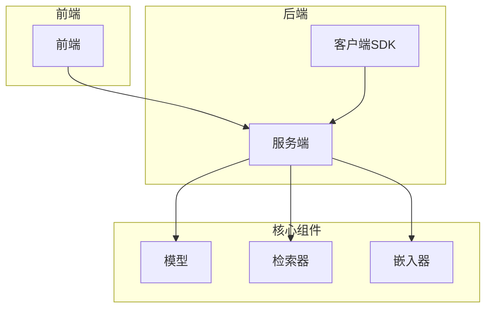
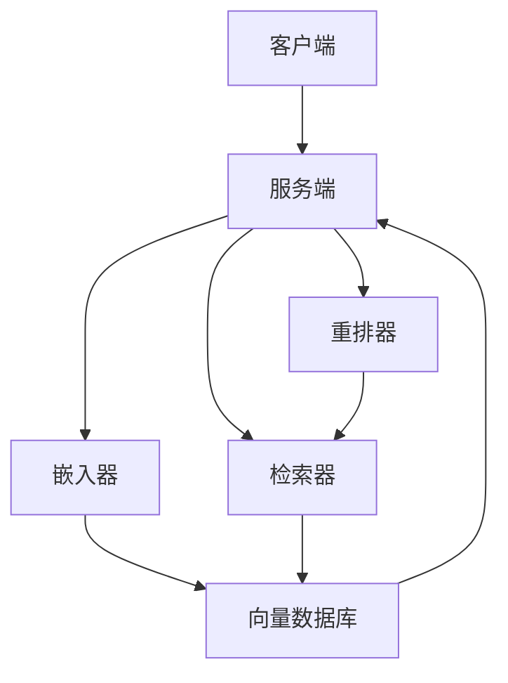
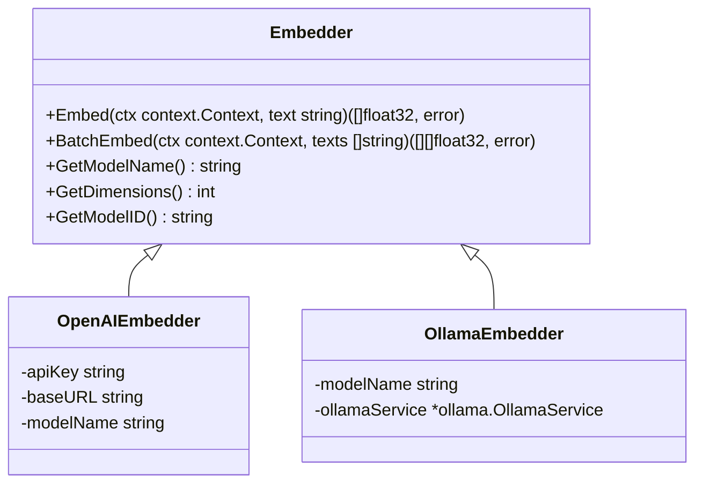
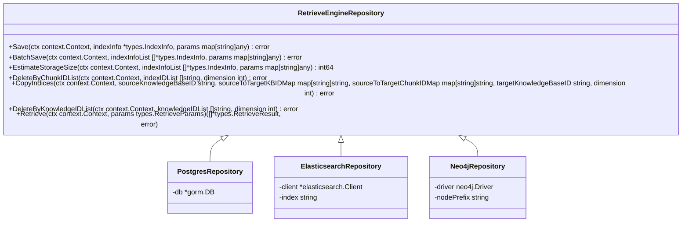
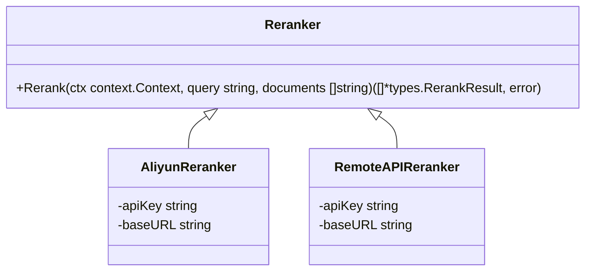
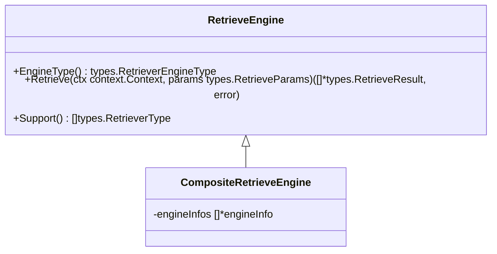
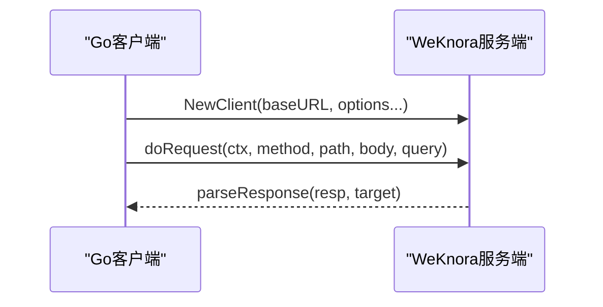
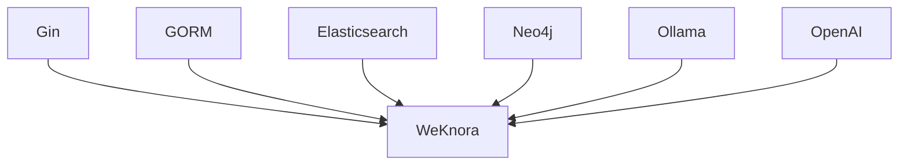

# 扩展开发

<cite>
**本文档引用的文件**   
- [main.go](file://cmd/server/main.go)
- [config.go](file://internal/config/config.go)
- [config.yaml](file://config/config.yaml)
- [embedder.go](file://internal/models/embedding/embedder.go)
- [openai.go](file://internal/models/embedding/openai.go)
- [ollama.go](file://internal/models/embedding/ollama.go)
- [registry.go](file://internal/application/service/retriever/registry.go)
- [composite.go](file://internal/application/service/retriever/composite.go)
- [retriever.go](file://internal/types/interfaces/retriever.go)
- [retriever.go](file://internal/types/retriever.go)
- [repository.go](file://internal/application/repository/retriever/elasticsearch/v7/repository.go)
- [repository.go](file://internal/application/repository/retriever/postgres/repository.go)
- [repository.go](file://internal/application/repository/retriever/neo4j/repository.go)
- [container.go](file://internal/container/container.go)
- [client.go](file://client/client.go)
</cite>

## 目录
1. [引言](#引言)
2. [项目结构](#项目结构)
3. [核心组件](#核心组件)
4. [架构概述](#架构概述)
5. [详细组件分析](#详细组件分析)
6. [依赖分析](#依赖分析)
7. [性能考虑](#性能考虑)
8. [故障排除指南](#故障排除指南)
9. [结论](#结论)
10. [附录](#附录)

## 引言
本文档旨在为WeKnora_New项目提供全面的扩展开发指南。WeKnora_New是一个基于插件化架构的智能问答系统，支持多种嵌入模型、向量数据库和大语言模型API。本文档将详细说明如何基于现有架构进行功能扩展，包括集成新的嵌入模型、支持新的向量数据库、接入不同的大语言模型API，以及开发自定义检索器。同时，本文档还将提供Go客户端SDK的使用示例，展示如何通过编程方式集成WeKnora_New功能。

## 项目结构
WeKnora_New项目采用模块化设计，主要分为以下几个部分：
- **client**: Go客户端SDK，提供与WeKnora_New服务交互的接口。
- **cmd/server**: 服务端主程序入口。
- **config**: 配置文件目录。
- **dataset**: 数据集相关脚本。
- **docker**: Docker相关配置。
- **docreader**: 文档读取器，负责解析各种文档格式。
- **frontend**: 前端代码。
- **internal**: 服务端核心代码，包含应用逻辑、模型、配置、容器、错误处理、处理器、日志、中间件、模型、路由、运行时、流、跟踪、类型和工具。
- **mcp-server**: MCP服务器代码。
- **migrations**: 数据库迁移脚本。
- **scripts**: 脚本文件。
- **go.mod** 和 **go.sum**: Go模块依赖管理文件。

**图源**
- [main.go](file://cmd/server/main.go)
- [config.go](file://internal/config/config.go)

**章节源**
- [main.go](file://cmd/server/main.go)
- [config.go](file://internal/config/config.go)

## 核心组件
WeKnora_New的核心组件包括嵌入器（Embedder）、检索器（Retriever）和重排器（Reranker）。这些组件通过依赖注入容器进行管理，支持灵活的插件化扩展。

**章节源**
- [embedder.go](file://internal/models/embedding/embedder.go)
- [retriever.go](file://internal/types/interfaces/retriever.go)
- [container.go](file://internal/container/container.go)

## 架构概述
WeKnora_New采用微服务架构，通过依赖注入容器管理各个组件。系统通过配置文件定义模型、向量数据库等组件，支持动态加载和替换。

**图源**
- [main.go](file://cmd/server/main.go)
- [container.go](file://internal/container/container.go)

## 详细组件分析

### 嵌入器扩展
WeKnora_New支持通过配置文件集成不同的嵌入模型。开发者可以通过实现`Embedder`接口来集成新的嵌入模型。

**图源**
- [embedder.go](file://internal/models/embedding/embedder.go)
- [openai.go](file://internal/models/embedding/openai.go)
- [ollama.go](file://internal/models/embedding/ollama.go)

**章节源**
- [embedder.go](file://internal/models/embedding/embedder.go)
- [openai.go](file://internal/models/embedding/openai.go)
- [ollama.go](file://internal/models/embedding/ollama.go)

### 检索器扩展
WeKnora_New支持多种检索器，包括关键词检索、向量检索和图检索。开发者可以通过实现`RetrieveEngineRepository`接口来支持新的向量数据库。

**图源**
- [retriever.go](file://internal/types/interfaces/retriever.go)
- [repository.go](file://internal/application/repository/retriever/postgres/repository.go)
- [repository.go](file://internal/application/repository/retriever/elasticsearch/v7/repository.go)
- [repository.go](file://internal/application/repository/retriever/neo4j/repository.go)

**章节源**
- [retriever.go](file://internal/types/interfaces/retriever.go)
- [repository.go](file://internal/application/repository/retriever/postgres/repository.go)
- [repository.go](file://internal/application/repository/retriever/elasticsearch/v7/repository.go)
- [repository.go](file://internal/application/repository/retriever/neo4j/repository.go)

### 重排器扩展
WeKnora_New支持通过配置文件接入不同的大语言模型API。开发者可以通过实现相应的接口来集成新的大语言模型。

**图源**
- [reranker.go](file://internal/models/rerank/reranker.go)
- [aliyun_reranker.go](file://internal/models/rerank/aliyun_reranker.go)
- [remote_api.go](file://internal/models/rerank/remote_api.go)

**章节源**
- [reranker.go](file://internal/models/rerank/reranker.go)
- [aliyun_reranker.go](file://internal/models/rerank/aliyun_reranker.go)
- [remote_api.go](file://internal/models/rerank/remote_api.go)

### 自定义检索器开发
WeKnora_New支持自定义检索器的开发，包括关键词检索、向量检索和图检索的组合策略。开发者可以通过实现`RetrieveEngine`接口来开发自定义检索器。

**图源**
- [retriever.go](file://internal/types/interfaces/retriever.go)
- [composite.go](file://internal/application/service/retriever/composite.go)

**章节源**
- [retriever.go](file://internal/types/interfaces/retriever.go)
- [composite.go](file://internal/application/service/retriever/composite.go)

### Go客户端SDK使用示例
WeKnora_New提供Go客户端SDK，开发者可以通过编程方式集成WeKnora_New功能。

**图源**
- [client.go](file://client/client.go)

**章节源**
- [client.go](file://client/client.go)

## 依赖分析
WeKnora_New通过依赖注入容器管理各个组件的依赖关系。主要依赖包括：
- **Gin**: Web框架
- **GORM**: ORM库
- **Elasticsearch**: 搜索引擎
- **Neo4j**: 图数据库
- **Ollama**: 模型推理服务
- **OpenAI**: 大语言模型API

**图源**
- [go.mod](file://go.mod)

**章节源**
- [go.mod](file://go.mod)

## 性能考虑
在扩展WeKnora_New时，需要考虑以下性能因素：
- **并发处理**: 使用goroutine池提高并发处理能力。
- **缓存**: 合理使用缓存减少重复计算。
- **数据库优化**: 优化数据库查询和索引。
- **网络延迟**: 减少网络请求次数，使用批量操作。

## 故障排除指南
在扩展WeKnora_New时，可能会遇到以下问题：
- **依赖注入失败**: 检查依赖注入容器的配置。
- **配置文件错误**: 检查配置文件的格式和内容。
- **网络连接问题**: 检查网络连接和防火墙设置。
- **性能瓶颈**: 分析性能瓶颈，优化代码和配置。

**章节源**
- [errors.go](file://internal/errors/errors.go)
- [logger.go](file://internal/logger/logger.go)

## 结论
WeKnora_New提供了一个灵活的插件化架构，支持多种嵌入模型、向量数据库和大语言模型API。通过本文档的指导，开发者可以轻松地扩展WeKnora_New的功能，满足不同的业务需求。

## 附录
- [配置文件示例](file://config/config.yaml)
- [Go客户端SDK文档](file://client/README.md)