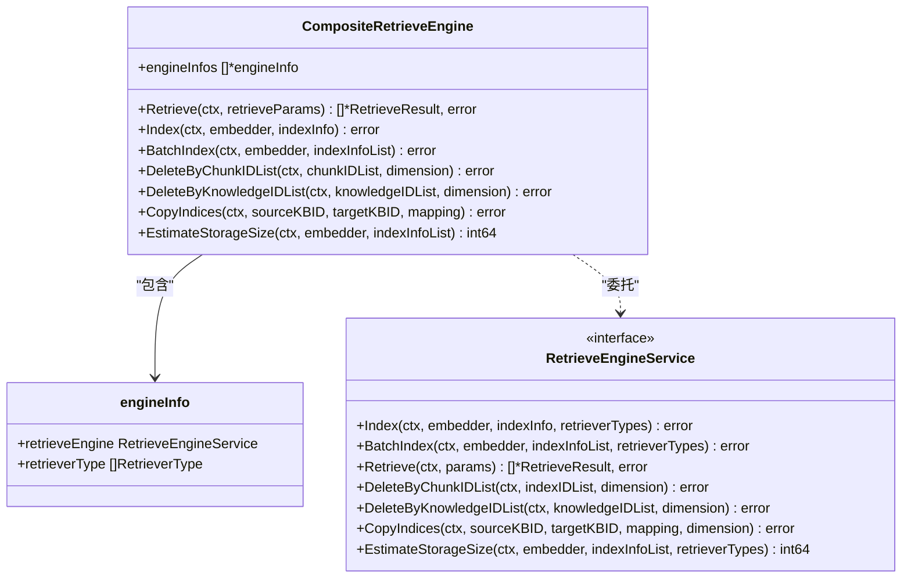
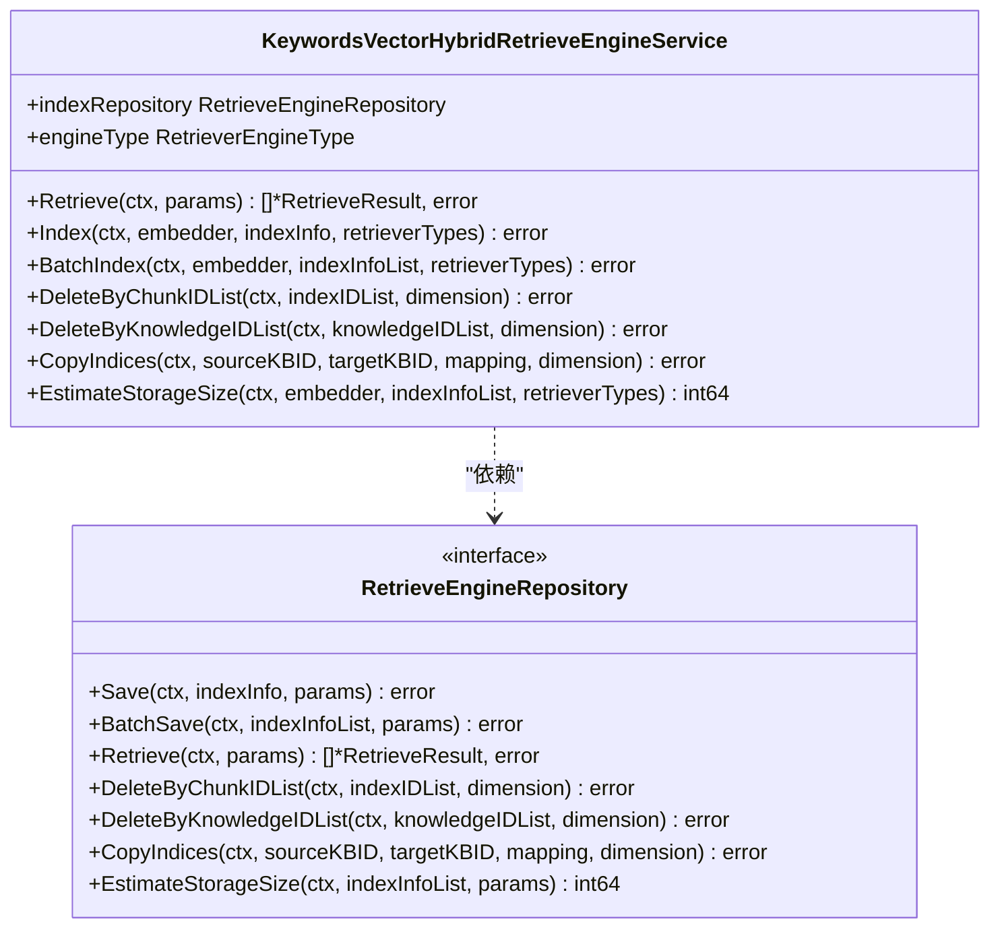
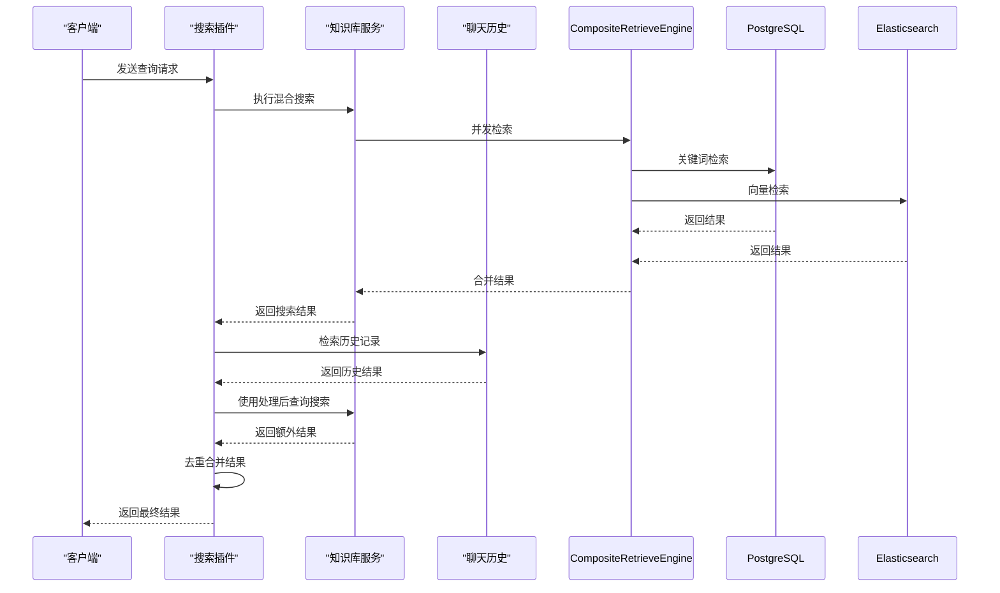
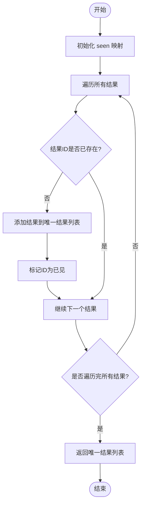
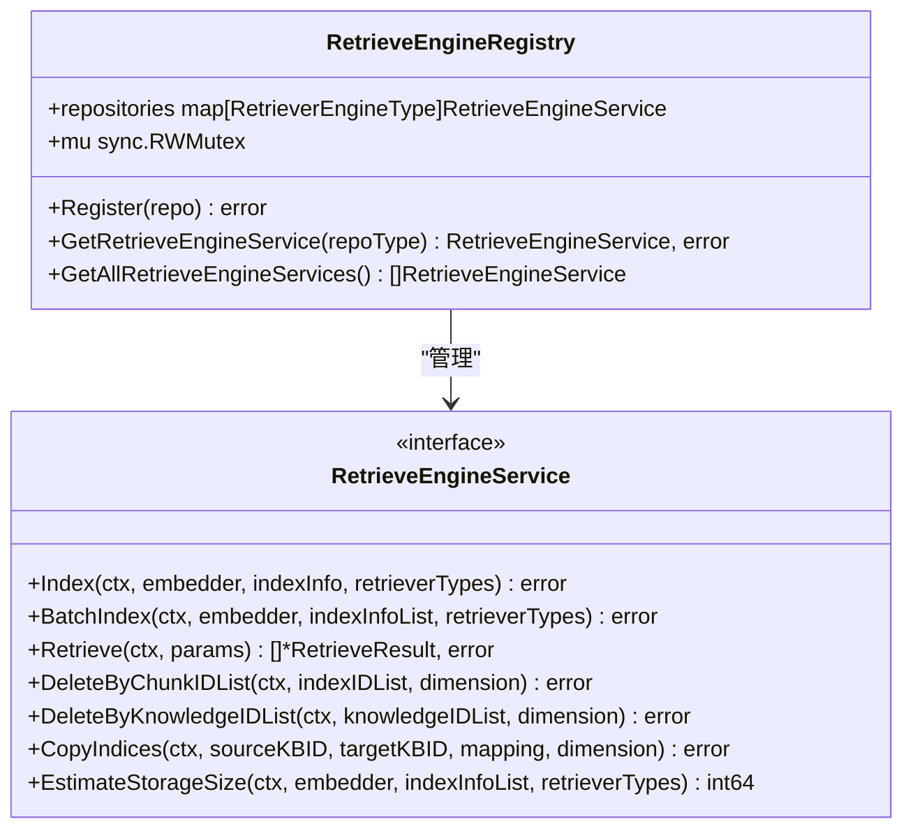
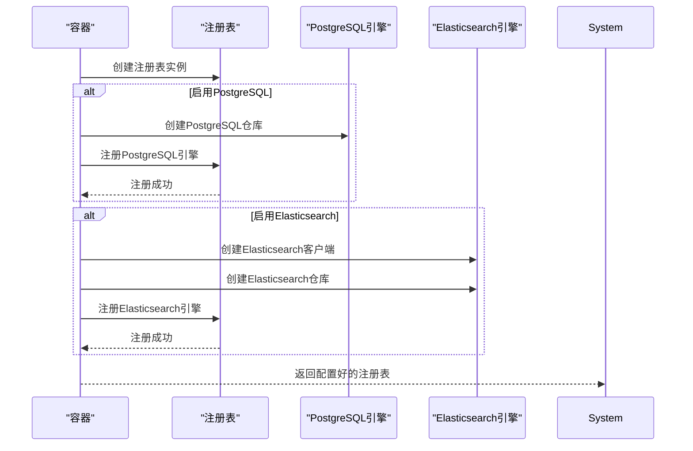
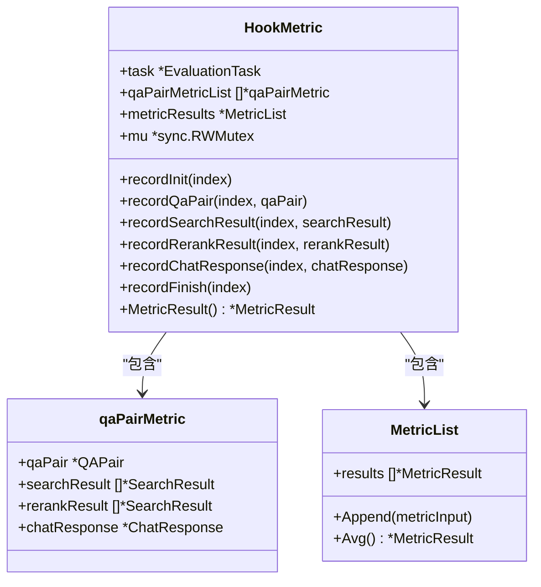
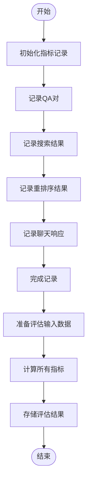

# 自定义检索器开发

<cite>
**本文档引用的文件**  
- [composite.go](file://internal/application/service/retriever/composite.go)
- [keywords_vector_hybrid_indexer.go](file://internal/application/service/retriever/keywords_vector_hybrid_indexer.go)
- [registry.go](file://internal/application/service/retriever/registry.go)
- [retriever.go](file://internal/types/interfaces/retriever.go)
- [retriever.go](file://internal/types/retriever.go)
- [container.go](file://internal/container/container.go)
- [metric_hook.go](file://internal/application/service/metric_hook.go)
- [search.go](file://internal/application/service/chat_pipline/search.go)
- [knowledgebase.go](file://internal/application/service/knowledgebase.go)
- [repository.go](file://internal/application/repository/retriever/postgres/repository.go)
- [repository.go](file://internal/application/repository/retriever/elasticsearch/v8/repository.go)
</cite>

## 目录
1. [简介](#简介)
2. [组合检索模式实现机制](#组合检索模式实现机制)
3. [混合检索策略构建](#混合检索策略构建)
4. [查询重写与多路召回](#查询重写与多路召回)
5. [结果融合实现](#结果融合实现)
6. [检索器注册机制](#检索器注册机制)
7. [性能评估钩子集成](#性能评估钩子集成)
8. [结论](#结论)

## 简介
本文档深入讲解自定义检索器的开发方法，重点分析WeKnora系统中检索器的实现机制。文档将详细解析组合检索模式的实现原理，说明如何构建关键词检索、向量检索和图检索的混合策略。通过分析核心代码文件，展示查询重写、多路召回和结果融合的具体实现方式。同时，解释检索器注册机制，指导开发者如何注册新的检索算法并参与检索管道。最后，提供性能评估钩子（metric_hook）的集成方式，确保新检索器可监控、可度量。

## 组合检索模式实现机制
组合检索模式通过`CompositeRetrieveEngine`结构体实现，采用组合设计模式将多个检索引擎的调用进行统一管理。该模式允许系统同时支持多种检索引擎，如PostgreSQL、Elasticsearch等，并根据检索类型动态选择合适的引擎。

**图示来源**
- [composite.go](file://internal/application/service/retriever/composite.go#L27-L290)
- [retriever.go](file://internal/types/interfaces/retriever.go#L67-L109)

`CompositeRetrieveEngine`的核心功能是根据检索参数中的`RetrieverType`字段，找到对应的检索引擎并执行检索操作。其`Retrieve`方法通过`concurrentRetrieve`函数实现并发检索，能够同时向多个检索引擎发送请求，提高检索效率。

当执行检索时，系统会遍历所有注册的引擎信息，检查每个引擎是否支持指定的检索类型。如果找到匹配的引擎，则调用该引擎的`Retrieve`方法执行实际的检索操作，并将结果合并返回。如果没有找到支持指定检索类型的引擎，则返回错误。

**代码路径**
- `NewCompositeRetrieveEngine`函数负责创建组合检索引擎实例，从依赖注入容器中获取检索引擎注册表，并根据配置参数初始化各个引擎。
- `concurrentRetrieve`函数实现了并发执行检索操作的逻辑，使用WaitGroup和互斥锁确保并发安全。
- `concurrentExecWithError`方法用于并发执行索引、删除等操作，并处理可能出现的错误。

**本节来源**
- [composite.go](file://internal/application/service/retriever/composite.go#L1-L290)

## 混合检索策略构建
混合检索策略通过`KeywordsVectorHybridRetrieveEngineService`实现，支持关键词检索和向量检索的混合使用。该策略允许系统同时利用关键词匹配的精确性和向量检索的语义理解能力，提高检索结果的相关性。

**图示来源**
- [keywords_vector_hybrid_indexer.go](file://internal/application/service/retriever/keywords_vector_hybrid_indexer.go#L1-L164)
- [retriever.go](file://internal/types/interfaces/retriever.go#L23-L54)

混合检索策略的核心在于`Index`和`BatchIndex`方法的实现。当创建索引时，系统会检查是否需要进行向量检索。如果需要，则调用嵌入模型生成内容的向量表示，并将向量数据与原始内容一起保存到检索引擎中。

在`Index`方法中，首先检查`retrieverTypes`参数中是否包含`VectorRetrieverType`。如果包含，则使用指定的嵌入模型对内容进行向量化处理，并将生成的向量存储在`embeddingMap`中。然后将向量数据作为参数传递给底层检索引擎的`Save`方法，完成索引创建。

`BatchIndex`方法实现了批量索引功能，能够显著提高大规模数据索引的效率。该方法首先检查是否需要进行向量检索，如果需要，则批量生成所有内容的向量表示。为了提高可靠性，系统会尝试最多5次向量生成操作，每次失败后等待100毫秒再重试。生成向量后，方法将数据分批（每批20条）保存到检索引擎中，避免单次操作数据量过大。

**本节来源**
- [keywords_vector_hybrid_indexer.go](file://internal/application/service/retriever/keywords_vector_hybrid_indexer.go#L1-L164)

## 查询重写与多路召回
查询重写和多路召回机制在聊天管道的搜索插件中实现，通过`PluginSearch`结构体和`OnEvent`方法完成。该机制允许系统对用户查询进行优化，并从多个来源获取相关结果。

**图示来源**
- [search.go](file://internal/application/service/chat_pipline/search.go#L1-L126)
- [knowledgebase.go](file://internal/application/service/knowledgebase.go#L1-L200)

查询重写过程从`OnEvent`方法开始，该方法接收聊天管理对象作为参数，从中提取重写后的查询文本。系统首先使用重写后的查询执行混合搜索，获取初步的检索结果。然后，系统会检查聊天历史记录，尝试从之前的对话中找到相关的知识引用，作为补充结果。

如果处理后的查询与重写后的查询不同，系统会使用处理后的查询再次执行搜索，以获取更多可能相关的结果。这种多轮搜索策略能够提高检索的召回率，确保不会遗漏重要信息。

多路召回的实现体现在结果的合并过程中。系统将初始搜索结果、历史记录结果和二次搜索结果全部合并到一个结果列表中。然后调用`removeDuplicateResults`函数去除重复的结果，确保最终返回的结果集既全面又不冗余。

**本节来源**
- [search.go](file://internal/application/service/chat_pipline/search.go#L1-L126)

## 结果融合实现
结果融合通过`removeDuplicateResults`函数实现，该函数使用哈希表来跟踪已见过的结果ID，确保每个结果只出现一次。这种去重机制对于提高用户体验至关重要，避免了相同内容的重复展示。

**图示来源**
- [search.go](file://internal/application/service/chat_pipline/search.go#L115-L125)

结果融合的实现相对简单但高效。函数创建一个`seen`映射来记录已处理的结果ID，以及一个`uniqueResults`切片来存储去重后的结果。然后遍历输入的结果列表，对于每个结果，检查其ID是否已在`seen`映射中。如果不存在，则将其添加到`uniqueResults`列表中，并在`seen`映射中标记该ID。

这种基于哈希表的去重算法具有O(n)的时间复杂度，其中n是结果的数量，效率较高。同时，由于只遍历一次结果列表，空间复杂度也相对较低。

在实际应用中，结果融合不仅包括去重，还包括结果的排序和截取。虽然这些操作在当前代码中没有直接体现，但它们通常是检索系统的重要组成部分。开发者可以根据需要在结果融合阶段添加这些功能，例如根据相关性分数对结果进行排序，或根据配置限制返回结果的数量。

**本节来源**
- [search.go](file://internal/application/service/chat_pipline/search.go#L115-L125)

## 检索器注册机制
检索器注册机制通过`RetrieveEngineRegistry`结构体实现，提供了一个中心化的注册表来管理所有可用的检索引擎。该机制允许系统动态注册和获取检索引擎服务，支持灵活的插件式架构。

**图示来源**
- [registry.go](file://internal/application/service/retriever/registry.go#L1-L65)
- [retriever.go](file://internal/types/interfaces/retriever.go#L67-L109)

注册机制的核心是`Register`方法，该方法接受一个`RetrieveEngineService`实例作为参数，并将其注册到内部的`repositories`映射中。在注册前，系统会检查是否已经存在相同类型的检索引擎，如果存在则返回错误，防止重复注册。

`GetRetrieveEngineService`方法用于根据检索引擎类型获取已注册的服务实例。该方法使用读写锁确保并发安全，允许多个goroutine同时读取注册表，但写操作（注册）时会独占访问。

系统在启动时通过`initRetrieveEngineRegistry`函数初始化注册表，并根据环境变量配置注册相应的检索引擎。例如，如果环境变量`RETRIEVE_DRIVER`包含"postgres"，则会创建PostgreSQL检索引擎并注册到注册表中。

**图示来源**
- [container.go](file://internal/container/container.go#L260-L350)
- [registry.go](file://internal/application/service/retriever/registry.go#L1-L65)

开发者可以通过实现`RetrieveEngineService`接口来创建自定义的检索算法，并通过注册机制将其集成到系统中。新检索器需要提供索引、检索、删除等基本操作的实现，并在系统启动时注册到检索引擎注册表中。

**本节来源**
- [registry.go](file://internal/application/service/retriever/registry.go#L1-L65)
- [container.go](file://internal/container/container.go#L260-L350)

## 性能评估钩子集成
性能评估钩子通过`HookMetric`结构体实现，提供了一套完整的评估框架来监控和度量检索系统的性能。该机制允许系统收集和分析各种评估指标，帮助开发者优化检索算法。

**图示来源**
- [metric_hook.go](file://internal/application/service/metric_hook.go#L1-L168)
- [retriever.go](file://internal/types/retriever.go#L1-L83)

性能评估钩子的核心是`recordFinish`方法，该方法在完成一个QA对的处理后被调用，负责计算和存储评估指标。方法首先从重排序结果中提取检索ID，然后从聊天响应中获取生成的文本，最后使用这些数据创建`MetricInput`对象并传递给`MetricList`进行计算。

`MetricList`结构体维护一个评估结果列表，并提供`Append`和`Avg`方法来添加新结果和计算平均值。`Append`方法遍历所有配置的评估计算器（如精确率、召回率、NDCG等），计算每个指标的分数并存储到结果中。

系统预定义了多种评估指标，包括检索指标（精确率、召回率、NDCG、MRR、MAP）和生成指标（BLEU、ROUGE）。这些指标通过`metricCalculators`变量集中管理，方便扩展和修改。

**图示来源**
- [metric_hook.go](file://internal/application/service/metric_hook.go#L1-L168)

新检索器可以通过调用`HookMetric`的相关方法来集成性能评估功能。例如，在执行检索操作后，可以调用`recordSearchResult`方法记录原始搜索结果；在重排序后，可以调用`recordRerankResult`方法记录重排序结果；在生成响应后，可以调用`recordChatResponse`方法记录生成的文本。

通过这种方式，新检索器的性能可以被全面监控和度量，为算法优化提供数据支持。开发者可以根据`MetricResult`返回的平均指标值来评估检索器的性能，并针对性地进行改进。

**本节来源**
- [metric_hook.go](file://internal/application/service/metric_hook.go#L1-L168)

## 结论
本文档详细分析了WeKnora系统中自定义检索器的开发方法，涵盖了从组合检索模式到性能评估钩子的各个方面。通过`CompositeRetrieveEngine`实现的组合模式，系统能够灵活地集成多种检索引擎，支持关键词检索、向量检索等多种检索方式。

混合检索策略通过`KeywordsVectorHybridRetrieveEngineService`实现，充分利用了关键词匹配的精确性和向量检索的语义理解能力，提高了检索结果的相关性。查询重写和多路召回机制进一步增强了系统的检索能力，确保能够从多个来源获取最相关的结果。

结果融合通过简单的去重算法实现，确保了返回结果的唯一性，提高了用户体验。检索器注册机制提供了灵活的插件式架构，允许开发者轻松地集成新的检索算法。

最后，性能评估钩子为新检索器提供了全面的监控和度量能力，帮助开发者优化算法性能。通过集成`HookMetric`，新检索器的性能可以被系统地评估和改进。

这些机制共同构成了一个强大而灵活的检索系统，为开发者提供了丰富的工具来构建和优化自定义检索器。