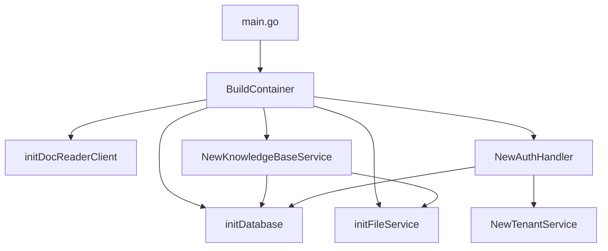
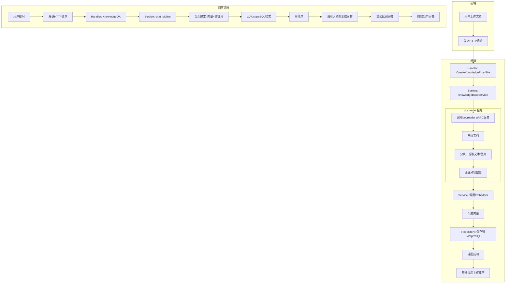

# 技术架构

<cite>
**本文档引用的文件**   
- [main.go](file://cmd/server/main.go)
- [container.go](file://internal/container/container.go)
- [router.go](file://internal/router/router.go)
- [config.yaml](file://config/config.yaml)
- [auth.go](file://internal/handler/auth.go)
- [chat_pipline.go](file://internal/application/service/chat_pipline/chat_pipline.go)
- [chunk.go](file://internal/application/repository/chunk.go)
- [client.go](file://docreader/client/client.go)
- [embedder.go](file://internal/models/embedding/embedder.go)
- [knowledgebase.go](file://internal/application/service/knowledgebase.go)
- [model.go](file://internal/application/service/model.go)
- [docker-compose.yml](file://docker-compose.yml)
</cite>

## 目录
1. [分层架构设计](#分层架构设计)
2. [依赖注入机制](#依赖注入机制)
3. [组件间通信方式](#组件间通信方式)
4. [微服务架构与服务边界](#微服务架构与服务边界)
5. [插件化设计思想](#插件化设计思想)
6. [数据流图](#数据流图)

## 分层架构设计

WeKnora_New系统采用典型的三层架构设计，遵循handler → service → repository的分层模式，确保了代码的高内聚、低耦合。

在**处理层（Handler）**，系统通过Gin框架暴露RESTful API接口，接收前端请求。每个Handler负责解析HTTP请求、验证参数，并将业务逻辑委托给相应的Service。例如，`auth.go`文件中的`AuthHandler`处理用户注册、登录等认证相关请求，通过`userService`和`tenantService`调用下层服务。

在**服务层（Service）**，实现了核心业务逻辑。服务层是业务规则的执行中心，协调多个Repository完成复杂的业务操作。例如，`knowledgebase.go`中的`knowledgeBaseService`提供了知识库的创建、更新、删除和混合搜索功能。该服务在执行混合搜索时，会调用`retriever`引擎，结合向量检索和关键词检索。

在**仓库层（Repository）**，负责与数据存储进行直接交互。该层屏蔽了底层数据库的细节，为上层提供统一的数据访问接口。例如，`chunk.go`中的`chunkRepository`实现了对文档分块（Chunk）的CRUD操作，使用GORM与PostgreSQL数据库交互。对于检索功能，系统通过`postgres/repository.go`实现了基于pgvector的向量检索和关键词检索。

这种分层架构确保了各层职责清晰：Handler只负责请求/响应处理，Service专注于业务逻辑，Repository则处理数据持久化，从而提高了系统的可维护性和可测试性。

**Section sources**
- [auth.go](file://internal/handler/auth.go#L15-L344)
- [knowledgebase.go](file://internal/application/service/knowledgebase.go#L1-L579)
- [chunk.go](file://internal/application/repository/chunk.go#L1-L132)

## 依赖注入机制

WeKnora_New系统使用`go.uber.org/dig`库实现依赖注入（DI），这是一种控制反转（IoC）的设计模式，用于管理组件之间的依赖关系。

在`container.go`文件中，`BuildContainer`函数是依赖注入容器的核心。它通过`dig.Provide`方法注册所有应用程序组件，包括配置、数据库连接、文件服务、外部客户端和各种服务。例如，`initDatabase`函数被注册以提供数据库连接，`NewKnowledgeBaseService`被注册以提供知识库服务。

依赖注入的关键优势在于它消除了硬编码的依赖关系。例如，`AuthHandler`的构造函数接受`UserService`和`TenantService`作为参数，而不是在内部创建它们。当容器调用`NewAuthHandler`时，`dig`会自动解析并注入这些依赖项。

**Diagram sources**
- [main.go](file://cmd/server/main.go#L24-L105)
- [container.go](file://internal/container/container.go#L45-L138)

## 组件间通信方式

WeKnora_New系统采用多种通信方式，以满足不同组件间交互的需求。

**前端与后端**通过**RESTful API**进行通信。前端使用TypeScript通过HTTP请求与后端交互。例如，前端在`frontend/src/api/auth/index.ts`中定义了登录API，后端在`internal/handler/auth.go`中通过`RegisterAuthRoutes`函数注册了相应的路由。

**后端与docreader服务**通过**gRPC**进行通信。gRPC是一种高性能、开源的远程过程调用框架，使用Protocol Buffers作为接口定义语言。在`docreader/client/client.go`中，Go客户端通过`grpc.Dial`连接到docreader服务。docreader服务在`docreader/main.py`中启动gRPC服务器，并注册`DocReaderServicer`来处理`ReadFromFile`和`ReadFromURL`请求。

**后端与向量数据库**通过**直接连接**进行交互。系统使用PostgreSQL作为主数据库，并通过`pgvector`扩展支持向量存储和检索。在`postgres/repository.go`中，`pgRepository`结构体直接使用GORM操作`embeddings`表，执行向量相似度搜索（使用`<=>`操作符）和关键词检索。

**后端与大模型API**通过**HTTP API**集成。系统支持多种大模型，如Ollama和OpenAI。在`models/embedding/embedder.go`中，`NewEmbedder`函数根据配置创建不同的Embedder实现。对于远程模型，它使用`NewOpenAIEmbedder`，通过HTTP请求调用OpenAI的API进行文本向量化。

**Section sources**
- [router.go](file://internal/router/router.go#L72-L87)
- [client.go](file://docreader/client/client.go#L39-L67)
- [embedder.go](file://internal/models/embedding/embedder.go#L51-L75)

## 微服务架构与服务边界

WeKnora_New系统采用微服务架构，将不同的功能模块拆分为独立的服务，每个服务都有明确的职责边界。

**主应用服务（app）** 是系统的核心，负责处理业务逻辑、管理用户会话和协调其他服务。它运行在8080端口，使用Go语言编写，包含了从用户认证到知识问答的完整流程。

**文档读取服务（docreader）** 是一个独立部署的微服务，专门负责文档解析。它使用Python编写，能够处理多种文档格式（PDF、DOCX、HTML等），并利用OCR技术提取图片中的文本。该服务通过gRPC暴露接口，主应用通过`docreader/client`包调用其`ReadFromFile`和`ReadFromURL`方法。这种独立部署的意义在于：
1.  **技术栈解耦**：可以使用最适合文档处理的Python生态（如PyPDF2、python-docx）。
2.  **资源隔离**：文档解析是计算密集型任务，独立部署可以避免影响主应用的性能。
3.  **可扩展性**：可以根据文档处理负载独立地扩展docreader服务实例。

**基础设施服务**包括：
- **MinIO**：提供对象存储，用于存放上传的文档和生成的分块。
- **PostgreSQL**：作为主数据库，存储元数据和向量。
- **Redis**：用于会话管理和流式响应的缓存。
- **Neo4j**：可选的图数据库，用于存储实体关系。

这些服务通过`docker-compose.yml`文件定义，实现了容器化部署和编排。

**Section sources**
- [docker-compose.yml](file://docker-compose.yml#L1-L253)
- [main.py](file://docreader/main.py#L357-L403)

## 插件化设计思想

WeKnora_New系统采用了高度插件化的设计思想，支持灵活替换和扩展核心组件。

**支持多种embedding模型**：系统通过`embedding.Embedder`接口抽象了文本向量化能力。在`embedder.go`中，`NewEmbedder`函数根据配置的`source`字段（`local`或`remote`）动态创建`OllamaEmbedder`或`OpenAIEmbedder`。这使得用户可以无缝切换不同的embedding模型，如本地的Ollama模型或远程的OpenAI模型。

**支持多种向量数据库**：系统通过`interfaces.RetrieveEngineRepository`接口抽象了检索引擎。在`container.go`的`initRetrieveEngineRegistry`函数中，系统根据环境变量`RETRIEVE_DRIVER`注册不同的检索引擎，如PostgreSQL、Elasticsearch v7/v8。这允许系统根据性能和成本需求选择最合适的向量数据库。

**支持多种大语言模型**：系统通过`models/chat.Chat`接口抽象了大模型的对话能力。在`model.go`的`GetChatModel`函数中，系统根据模型配置创建相应的聊天模型实例。此外，系统还支持可配置的重排序（rerank）模型，通过`GetRerankModel`函数集成。

这种插件化设计通过依赖注入和接口抽象实现，使得系统具有极高的灵活性和可扩展性，能够轻松集成新的模型和数据库技术。

**Section sources**
- [embedder.go](file://internal/models/embedding/embedder.go#L13-L31)
- [container.go](file://internal/container/container.go#L275-L334)
- [model.go](file://internal/application/service/model.go#L282-L327)

## 数据流图

以下数据流图展示了文档上传和问答请求的完整处理路径。

**Diagram sources**
- [knowledgebase.go](file://internal/application/service/knowledgebase.go#L260-L374)
- [chat_pipline.go](file://internal/application/service/chat_pipline/chat_pipline.go#L9-L18)
- [client.go](file://docreader/client/client.go#L89-L114)