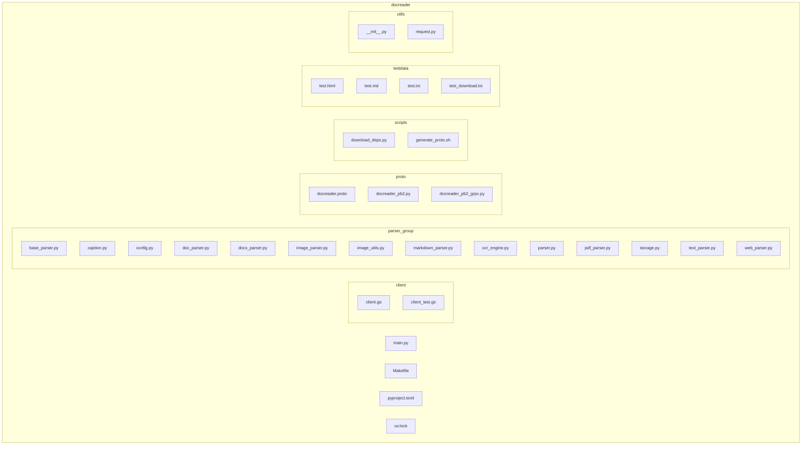
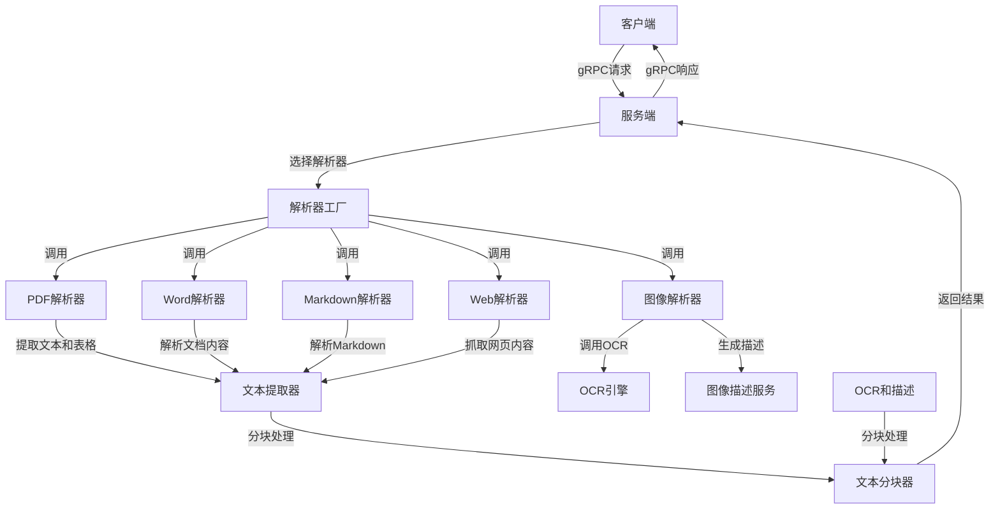
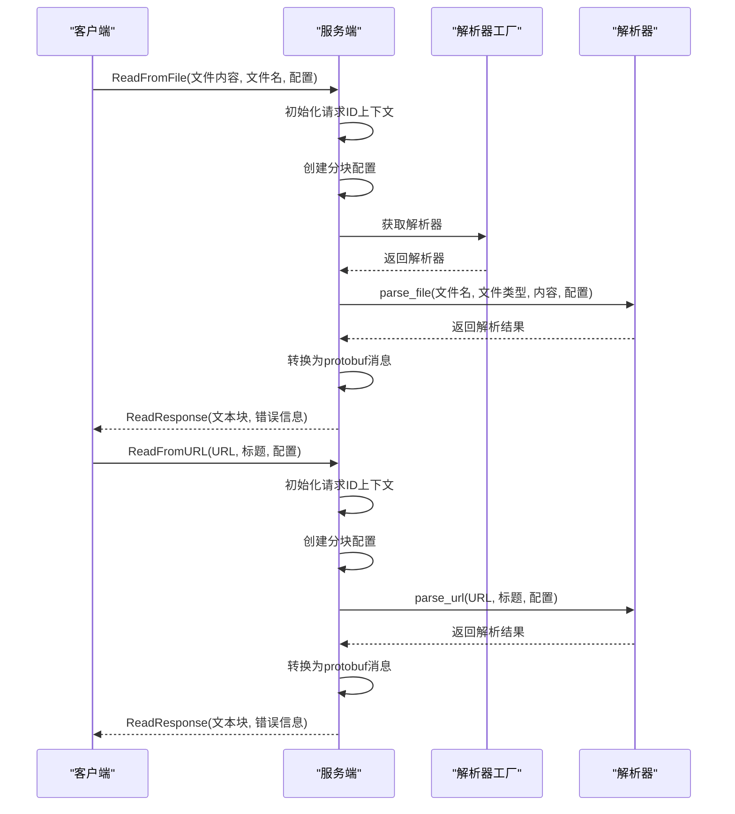
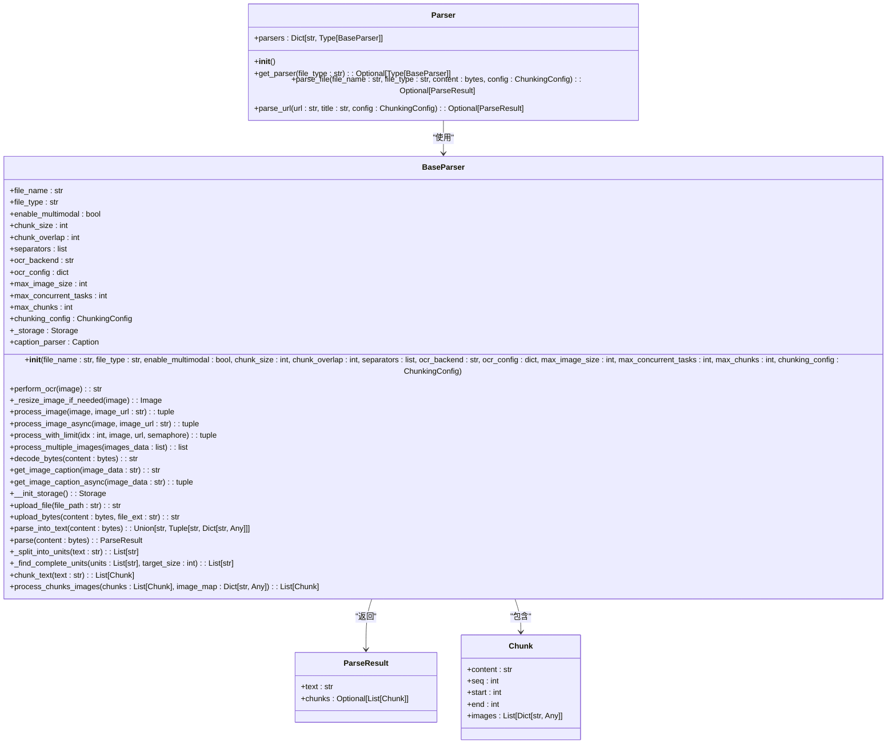
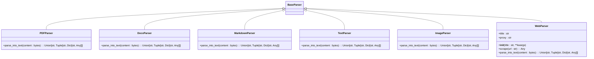
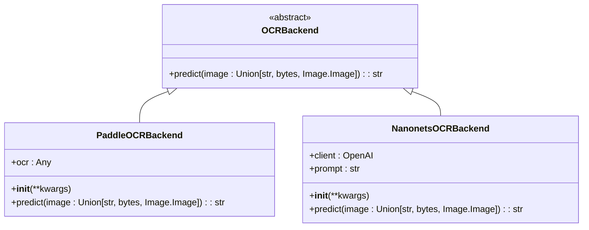
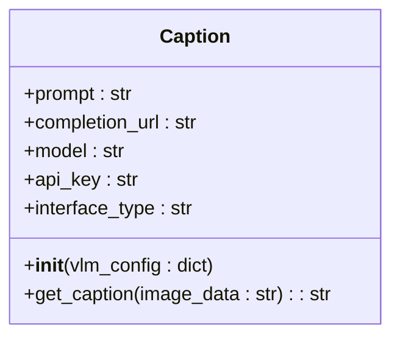
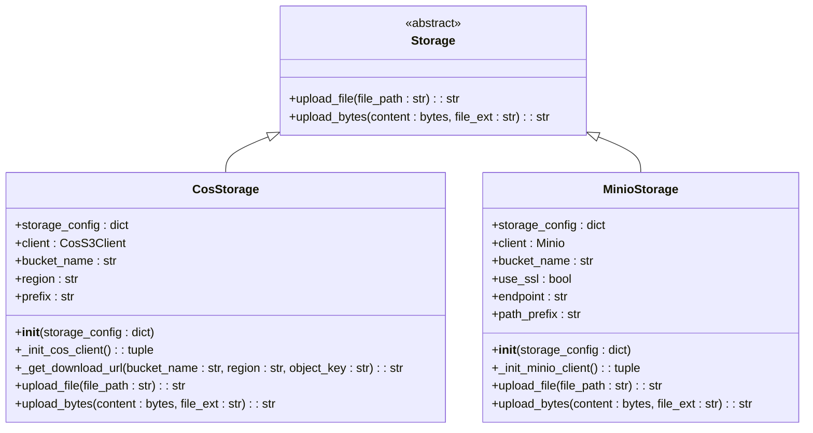
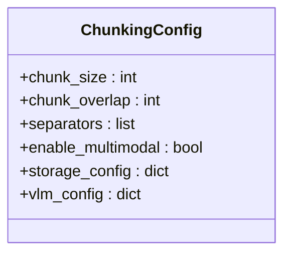
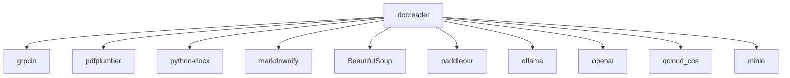

# 文档解析服务

<cite>
**本文档引用的文件**   
- [main.py](file://docreader/main.py)
- [docreader.proto](file://docreader/proto/docreader.proto)
- [parser.py](file://docreader/parser/parser.py)
- [base_parser.py](file://docreader/parser/base_parser.py)
- [pdf_parser.py](file://docreader/parser/pdf_parser.py)
- [image_parser.py](file://docreader/parser/image_parser.py)
- [web_parser.py](file://docreader/parser/web_parser.py)
- [caption.py](file://docreader/parser/caption.py)
- [ocr_engine.py](file://docreader/parser/ocr_engine.py)
- [config.py](file://docreader/parser/config.py)
- [storage.py](file://docreader/parser/storage.py)
- [request.py](file://docreader/utils/request.py)
</cite>

## 目录
1. [简介](#简介)
2. [项目结构](#项目结构)
3. [核心组件](#核心组件)
4. [架构概述](#架构概述)
5. [详细组件分析](#详细组件分析)
6. [依赖分析](#依赖分析)
7. [性能考虑](#性能考虑)
8. [故障排除指南](#故障排除指南)
9. [结论](#结论)

## 简介
文档解析服务是一个基于Python实现的gRPC服务，旨在高效解析多种格式的文档和图像文件。该服务支持PDF、Word、Markdown、HTML等文档格式，并具备OCR文本提取和图像描述生成（Caption）功能。通过gRPC接口，服务能够接收文档内容或URL，进行内容提取、表格识别和图像处理，最终返回结构化的文本块和相关信息。本文档将详细介绍该服务的架构、工作原理、配置选项及性能优化建议。

## 项目结构
文档解析服务位于`docreader`目录下，其主要结构包括客户端、解析器、协议缓冲区定义、脚本、测试数据和工具模块。解析器模块包含多种文件格式的解析器，如PDF、Word、Markdown、HTML和图像文件。协议缓冲区定义了gRPC服务的接口，脚本模块用于生成协议缓冲区代码和下载依赖。测试数据模块包含用于测试的示例文件，工具模块提供请求ID上下文管理和日志记录功能。

**图源**
- [main.py](file://docreader/main.py#L1-L404)
- [parser.py](file://docreader/parser/parser.py#L1-L207)

**本节源**
- [main.py](file://docreader/main.py#L1-L404)
- [parser.py](file://docreader/parser/parser.py#L1-L207)

## 核心组件
文档解析服务的核心组件包括gRPC服务端、解析器工厂、多种文件格式解析器、OCR引擎、图像描述生成器、存储客户端和配置管理。gRPC服务端负责接收客户端请求，调用解析器工厂选择合适的解析器进行文档解析。解析器工厂根据文件类型选择相应的解析器，如PDF解析器、Word解析器、Markdown解析器等。OCR引擎用于从图像中提取文本，图像描述生成器利用视觉语言模型生成图像描述。存储客户端负责将解析后的图像上传到对象存储服务，配置管理模块定义了文本分块的配置参数。

**本节源**
- [main.py](file://docreader/main.py#L1-L404)
- [parser.py](file://docreader/parser/parser.py#L1-L207)
- [base_parser.py](file://docreader/parser/base_parser.py#L1-L1245)
- [ocr_engine.py](file://docreader/parser/ocr_engine.py#L1-L279)
- [caption.py](file://docreader/parser/caption.py#L1-L361)
- [storage.py](file://docreader/parser/storage.py#L1-L360)
- [config.py](file://docreader/parser/config.py#L1-L22)

## 架构概述
文档解析服务采用微服务架构，通过gRPC协议提供高性能的文档解析功能。服务端接收客户端的请求，解析请求中的文档内容或URL，调用相应的解析器进行内容提取。解析器根据文件类型选择合适的解析策略，如PDF解析器使用`pdfplumber`库提取文本和表格，Word解析器使用`python-docx`库解析文档内容。对于图像文件，服务调用OCR引擎提取文本，并利用视觉语言模型生成图像描述。解析后的文本被分块处理，每个文本块包含内容、序列号、起始和结束位置，以及相关的图像信息。最终，服务将解析结果以结构化的形式返回给客户端。

**图源**
- [main.py](file://docreader/main.py#L1-L404)
- [parser.py](file://docreader/parser/parser.py#L1-L207)
- [base_parser.py](file://docreader/parser/base_parser.py#L1-L1245)
- [pdf_parser.py](file://docreader/parser/pdf_parser.py#L1-L114)
- [image_parser.py](file://docreader/parser/image_parser.py#L1-L69)
- [web_parser.py](file://docreader/parser/web_parser.py#L1-L131)
- [caption.py](file://docreader/parser/caption.py#L1-L361)
- [ocr_engine.py](file://docreader/parser/ocr_engine.py#L1-L279)

## 详细组件分析

### gRPC服务端分析
gRPC服务端是文档解析服务的入口，负责接收客户端的请求并返回解析结果。服务端通过`DocReaderServicer`类实现`DocReader`服务接口，提供`ReadFromFile`和`ReadFromURL`两个RPC方法。`ReadFromFile`方法接收文件内容、文件名和读取配置，调用解析器工厂选择合适的解析器进行文档解析。`ReadFromURL`方法接收URL、标题和读取配置，调用Web解析器抓取网页内容并进行解析。服务端还负责初始化OCR引擎和日志记录，确保服务的稳定运行。

**图源**
- [main.py](file://docreader/main.py#L1-L404)

**本节源**
- [main.py](file://docreader/main.py#L1-L404)

### 解析器工厂分析
解析器工厂是文档解析服务的核心组件之一，负责根据文件类型选择合适的解析器。工厂通过`parsers`字典维护文件类型与解析器类的映射关系，支持多种文件格式，如PDF、Word、Markdown、HTML和图像文件。当接收到解析请求时，工厂根据文件类型查找相应的解析器类，创建解析器实例并调用其`parse`方法进行文档解析。解析器工厂的设计使得服务易于扩展，只需添加新的解析器类并更新映射关系即可支持新的文件格式。

**图源**
- [parser.py](file://docreader/parser/parser.py#L1-L207)
- [base_parser.py](file://docreader/parser/base_parser.py#L1-L1245)

**本节源**
- [parser.py](file://docreader/parser/parser.py#L1-L207)
- [base_parser.py](file://docreader/parser/base_parser.py#L1-L1245)

### 文件格式解析器分析
文件格式解析器是文档解析服务的关键组件，负责解析不同类型的文档文件。每种解析器继承自`BaseParser`类，实现`parse_into_text`方法以提取文档内容。PDF解析器使用`pdfplumber`库提取文本和表格，Word解析器使用`python-docx`库解析文档内容，Markdown解析器使用`markdownify`库将Markdown转换为HTML，HTML解析器使用`BeautifulSoup`库解析HTML内容。图像解析器调用OCR引擎提取文本，并利用视觉语言模型生成图像描述。Web解析器使用`playwright`库抓取网页内容，并提取文本和图片。

**图源**
- [pdf_parser.py](file://docreader/parser/pdf_parser.py#L1-L114)
- [docx_parser.py](file://docreader/parser/docx_parser.py#L1-L100)
- [markdown_parser.py](file://docreader/parser/markdown_parser.py#L1-L100)
- [text_parser.py](file://docreader/parser/text_parser.py#L1-L100)
- [image_parser.py](file://docreader/parser/image_parser.py#L1-L69)
- [web_parser.py](file://docreader/parser/web_parser.py#L1-L131)

**本节源**
- [pdf_parser.py](file://docreader/parser/pdf_parser.py#L1-L114)
- [docx_parser.py](file://docreader/parser/docx_parser.py#L1-L100)
- [markdown_parser.py](file://docreader/parser/markdown_parser.py#L1-L100)
- [text_parser.py](file://docreader/parser/text_parser.py#L1-L100)
- [image_parser.py](file://docreader/parser/image_parser.py#L1-L69)
- [web_parser.py](file://docreader/parser/web_parser.py#L1-L131)

### OCR引擎分析
OCR引擎是文档解析服务的重要组件，负责从图像中提取文本。服务支持多种OCR后端，如PaddleOCR和Nanonets。PaddleOCR后端使用`paddleocr`库进行文本识别，支持多种语言和文本方向检测。Nanonets后端通过OpenAI API格式调用Nanonets OCR服务，支持高精度的文本提取。OCR引擎的设计使得服务能够灵活选择不同的OCR后端，以满足不同的性能和精度需求。

**图源**
- [ocr_engine.py](file://docreader/parser/ocr_engine.py#L1-L279)

**本节源**
- [ocr_engine.py](file://docreader/parser/ocr_engine.py#L1-L279)

### 图像描述生成器分析
图像描述生成器利用视觉语言模型生成图像描述，增强文档解析的多模态能力。服务通过`Caption`类实现图像描述功能，支持Ollama和OpenAI接口。`Caption`类初始化时配置模型名称、基础URL和API密钥，调用视觉语言模型生成图像描述。图像描述生成器的设计使得服务能够灵活集成不同的视觉语言模型，以满足不同的应用场景需求。

**图源**
- [caption.py](file://docreader/parser/caption.py#L1-L361)

**本节源**
- [caption.py](file://docreader/parser/caption.py#L1-L361)

### 存储客户端分析
存储客户端负责将解析后的图像上传到对象存储服务，支持腾讯云COS和MinIO/S3兼容存储。服务通过`Storage`抽象基类定义存储操作接口，`CosStorage`和`MinioStorage`类分别实现腾讯云COS和MinIO存储。存储客户端的设计使得服务能够灵活选择不同的对象存储服务，以满足不同的部署需求。

**图源**
- [storage.py](file://docreader/parser/storage.py#L1-L360)

**本节源**
- [storage.py](file://docreader/parser/storage.py#L1-L360)

### 配置管理分析
配置管理模块定义了文本分块的配置参数，控制文档解析的行为。`ChunkingConfig`类包含分块大小、重叠大小、分隔符、多模态处理开关、存储配置和视觉语言模型配置。配置管理的设计使得服务能够灵活调整解析参数，以适应不同的文档类型和应用场景。

**图源**
- [config.py](file://docreader/parser/config.py#L1-L22)

**本节源**
- [config.py](file://docreader/parser/config.py#L1-L22)

## 依赖分析
文档解析服务依赖多种第三方库和工具，以实现高效的文档解析功能。主要依赖包括`grpcio`用于gRPC通信，`pdfplumber`用于PDF解析，`python-docx`用于Word文档解析，`markdownify`用于Markdown解析，`BeautifulSoup`用于HTML解析，`paddleocr`用于OCR文本提取，`ollama`和`openai`用于图像描述生成，`qcloud_cos`和`minio`用于对象存储。这些依赖库的选择确保了服务的高性能和高可靠性。

**图源**
- [pyproject.toml](file://docreader/pyproject.toml#L1-L36)

**本节源**
- [pyproject.toml](file://docreader/pyproject.toml#L1-L36)

## 性能考虑
文档解析服务在设计时充分考虑了性能优化，以确保高效处理大量文档。服务通过多线程和异步IO提高并发处理能力，利用缓存机制减少重复解析，通过分块处理优化内存使用。此外，服务支持多种OCR后端和视觉语言模型，用户可以根据性能需求选择合适的后端。配置管理模块允许用户调整分块大小和重叠大小，以平衡解析精度和性能。

## 故障排除指南
在使用文档解析服务时，可能会遇到各种问题。以下是一些常见问题及其解决方案：
- **问题：解析PDF文件时出现错误**
  - **解决方案**：检查PDF文件是否损坏，确保`pdfplumber`库已正确安装。
- **问题：OCR识别失败**
  - **解决方案**：检查OCR后端配置，确保`paddleocr`或`openai`库已正确安装。
- **问题：图像描述生成失败**
  - **解决方案**：检查视觉语言模型配置，确保API密钥和基础URL正确。
- **问题：存储上传失败**
  - **解决方案**：检查存储配置，确保腾讯云COS或MinIO服务已正确配置。

**本节源**
- [main.py](file://docreader/main.py#L1-L404)
- [parser.py](file://docreader/parser/parser.py#L1-L207)
- [base_parser.py](file://docreader/parser/base_parser.py#L1-L1245)
- [ocr_engine.py](file://docreader/parser/ocr_engine.py#L1-L279)
- [caption.py](file://docreader/parser/caption.py#L1-L361)
- [storage.py](file://docreader/parser/storage.py#L1-L360)

## 结论
文档解析服务是一个功能强大且灵活的gRPC服务，能够高效解析多种格式的文档和图像文件。通过支持OCR文本提取和图像描述生成，服务实现了多模态文档解析，满足了复杂的应用场景需求。服务的设计注重性能优化和可扩展性，用户可以根据具体需求调整配置和选择合适的后端。本文档详细介绍了服务的架构、工作原理、配置选项及性能优化建议，为用户提供全面的使用指南。