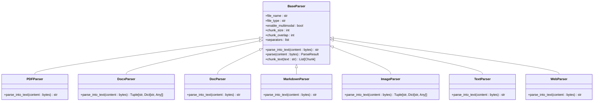
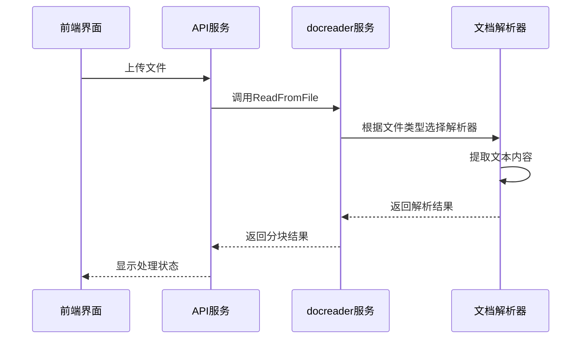
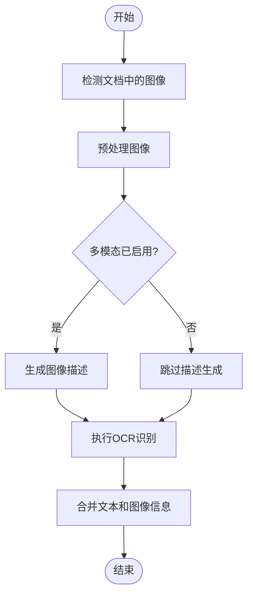
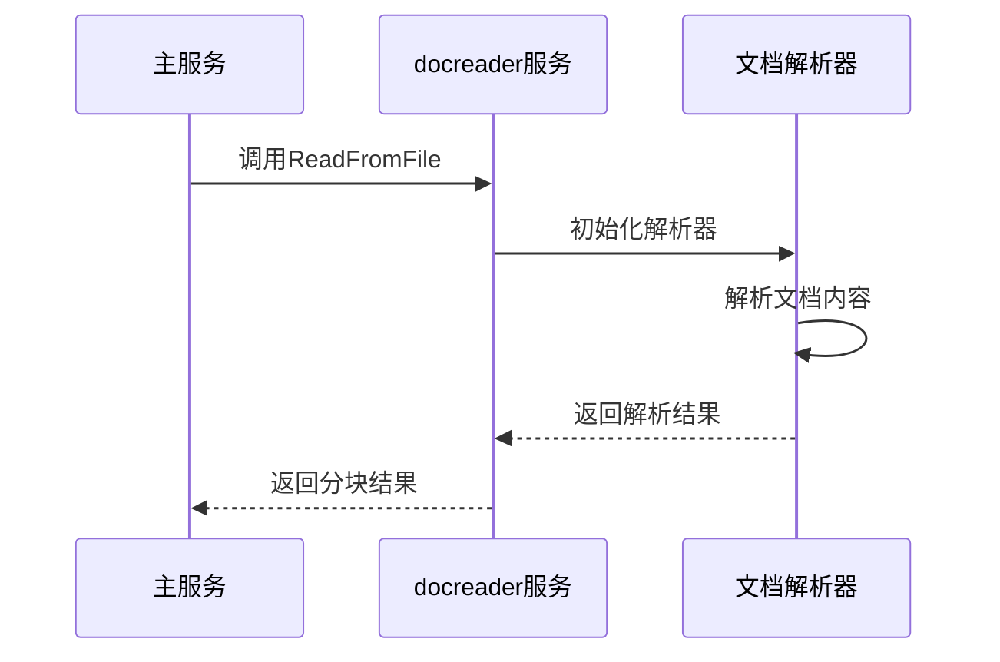
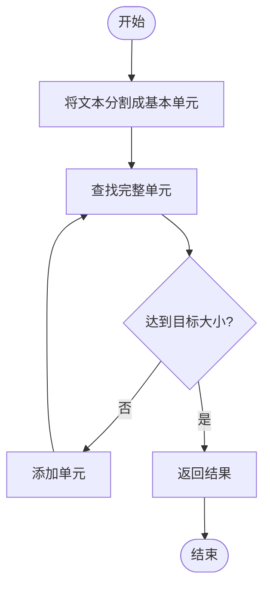
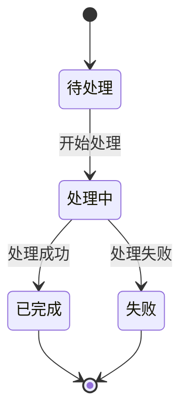

# 文档管理

<cite>
**本文档引用的文件**   
- [main.py](file://docreader/main.py)
- [docreader.proto](file://docreader/proto/docreader.proto)
- [base_parser.py](file://docreader/parser/base_parser.py)
- [pdf_parser.py](file://docreader/parser/pdf_parser.py)
- [docx_parser.py](file://docreader/parser/docx_parser.py)
- [doc_parser.py](file://docreader/parser/doc_parser.py)
- [markdown_parser.py](file://docreader/parser/markdown_parser.py)
- [image_parser.py](file://docreader/parser/image_parser.py)
- [text_parser.py](file://docreader/parser/text_parser.py)
- [web_parser.py](file://docreader/parser/web_parser.py)
- [ocr_engine.py](file://docreader/parser/ocr_engine.py)
- [config.py](file://docreader/parser/config.py)
- [KnowledgeBase.vue](file://frontend/src/views/knowledge/KnowledgeBase.vue)
- [knowledgebase.go](file://internal/application/service/knowledgebase.go)
- [knowledgebase.go](file://internal/handler/knowledgebase.go)
- [index.ts](file://frontend/src/api/knowledge-base/index.ts)
</cite>

## 目录
1. [简介](#简介)
2. [文档格式支持与解析机制](#文档格式支持与解析机制)
3. [文档上传与内容提取](#文档上传与内容提取)
4. [OCR处理与图像描述生成](#ocr处理与图像描述生成)
5. [docreader服务与gRPC通信](#docreader服务与grpc通信)
6. [文本分块策略与元数据提取](#文本分块策略与元数据提取)
7. [错误处理流程](#错误处理流程)
8. [文档状态管理](#文档状态管理)
9. [实际使用场景示例](#实际使用场景示例)
10. [常见问题及解决方案](#常见问题及解决方案)

## 简介
本文档全面介绍WeKnora系统中文档管理功能的技术实现。系统支持多种文档格式（PDF、Word、Markdown、HTML、纯文本、图像等）的上传、解析和内容提取。文档通过docreader服务进行处理，该服务使用gRPC接口与主服务通信，实现文档的解析、OCR处理、图像描述生成和文本分块。前端通过知识库界面展示文档处理状态，包括处理中、已完成和失败等状态。

## 文档格式支持与解析机制
系统支持多种文档格式的解析，每种格式由专门的解析器处理。解析器继承自`BaseParser`类，实现了`parse_into_text`方法，负责将文档内容转换为文本。

### 支持的文档格式
- **PDF**: 使用`pdfplumber`库解析，支持表格提取和文本识别
- **Word文档**: 支持`.doc`和`.docx`格式，使用`docx`库解析
- **Markdown**: 使用`markdown_parser.py`解析，保留文本结构
- **HTML**: 使用`web_parser.py`解析，通过Playwright获取页面内容
- **纯文本**: 使用`text_parser.py`解析，直接解码字节流
- **图像**: 使用`image_parser.py`解析，支持OCR和图像描述生成

### 解析器架构


**Diagram sources**
- [base_parser.py](file://docreader/parser/base_parser.py#L63-L607)
- [pdf_parser.py](file://docreader/parser/pdf_parser.py#L12-L113)
- [docx_parser.py](file://docreader/parser/docx_parser.py#L51-L100)
- [doc_parser.py](file://docreader/parser/doc_parser.py#L21-L315)
- [markdown_parser.py](file://docreader/parser/markdown_parser.py#L13-L33)
- [image_parser.py](file://docreader/parser/image_parser.py#L14-L68)
- [text_parser.py](file://docreader/parser/text_parser.py#L8-L32)
- [web_parser.py](file://docreader/parser/web_parser.py#L13-L130)

**Section sources**
- [base_parser.py](file://docreader/parser/base_parser.py#L63-L607)
- [pdf_parser.py](file://docreader/parser/pdf_parser.py#L12-L113)
- [docx_parser.py](file://docreader/parser/docx_parser.py#L51-L100)
- [doc_parser.py](file://docreader/parser/doc_parser.py#L21-L315)
- [markdown_parser.py](file://docreader/parser/markdown_parser.py#L13-L33)
- [image_parser.py](file://docreader/parser/image_parser.py#L14-L68)
- [text_parser.py](file://docreader/parser/text_parser.py#L8-L32)
- [web_parser.py](file://docreader/parser/web_parser.py#L13-L130)

## 文档上传与内容提取
文档上传通过前端界面完成，用户选择文件后，文件被上传到服务器。服务器接收到文件后，根据文件类型选择相应的解析器进行内容提取。

### 文档上传流程
1. 用户在前端界面选择文件
2. 前端通过API将文件上传到服务器
3. 服务器根据文件类型选择解析器
4. 解析器提取文档内容
5. 提取的内容被分块并存储

### 内容提取机制
内容提取由`BaseParser`类的`parse`方法统一处理。该方法首先调用`parse_into_text`方法获取文本内容，然后进行文本分块。



**Diagram sources**
- [main.py](file://docreader/main.py#L95-L197)
- [base_parser.py](file://docreader/parser/base_parser.py#L609-L675)
- [KnowledgeBase.vue](file://frontend/src/views/knowledge/KnowledgeBase.vue#L86-L93)
- [index.ts](file://frontend/src/api/knowledge-base/index.ts#L29-L30)

**Section sources**
- [main.py](file://docreader/main.py#L95-L197)
- [base_parser.py](file://docreader/parser/base_parser.py#L609-L675)
- [KnowledgeBase.vue](file://frontend/src/views/knowledge/KnowledgeBase.vue#L86-L93)
- [index.ts](file://frontend/src/api/knowledge-base/index.ts#L29-L30)

## OCR处理与图像描述生成
系统支持对图像和包含图像的文档进行OCR处理和图像描述生成。OCR处理使用PaddleOCR或Nanonets后端，图像描述生成使用VLM（视觉语言模型）。

### OCR处理流程
1. 检测文档中的图像
2. 对图像进行预处理（调整大小）
3. 使用OCR引擎识别图像中的文本
4. 将识别结果与原始文本结合

### 图像描述生成
当启用多模态处理时，系统会使用VLM模型为图像生成描述。描述生成基于图像的base64编码。



**Diagram sources**
- [base_parser.py](file://docreader/parser/base_parser.py#L162-L320)
- [ocr_engine.py](file://docreader/parser/ocr_engine.py#L29-L147)
- [image_parser.py](file://docreader/parser/image_parser.py#L14-L68)

**Section sources**
- [base_parser.py](file://docreader/parser/base_parser.py#L162-L320)
- [ocr_engine.py](file://docreader/parser/ocr_engine.py#L29-L147)
- [image_parser.py](file://docreader/parser/image_parser.py#L14-L68)

## docreader服务与gRPC通信
docreader服务是文档处理的核心组件，它通过gRPC接口与主服务通信。gRPC接口定义了`ReadFromFile`和`ReadFromURL`两个方法，分别用于处理文件和URL。

### gRPC接口定义
```protobuf
service DocReader {
  rpc ReadFromFile(ReadFromFileRequest) returns (ReadResponse) {}
  rpc ReadFromURL(ReadFromURLRequest) returns (ReadResponse) {}
}

message ReadFromFileRequest {
  bytes file_content = 1;
  string file_name = 2;
  string file_type = 3;
  ReadConfig read_config = 4;
  string request_id = 5;
}

message ReadResponse {
  repeated Chunk chunks = 1;
  string error = 2;
}
```

### 服务启动与配置
docreader服务在启动时初始化OCR引擎和gRPC服务器。服务配置包括最大消息长度、工作线程数和端口号。



**Diagram sources**
- [docreader.proto](file://docreader/proto/docreader.proto#L8-L89)
- [main.py](file://docreader/main.py#L95-L197)
- [main.py](file://docreader/main.py#L354-L403)

**Section sources**
- [docreader.proto](file://docreader/proto/docreader.proto#L8-L89)
- [main.py](file://docreader/main.py#L95-L197)
- [main.py](file://docreader/main.py#L354-L403)

## 文本分块策略与元数据提取
文本分块是文档处理的关键步骤，它将长文本分割成较小的块，便于后续处理和索引。系统使用基于分隔符的分块策略，同时保留文档结构。

### 分块策略
分块策略由`ChunkingConfig`类定义，包括：
- `chunk_size`: 块大小
- `chunk_overlap`: 块重叠
- `separators`: 分隔符列表
- `enable_multimodal`: 是否启用多模态处理

### 分块算法
分块算法首先将文本分割成基本单元，然后组合这些单元以形成不超过指定大小的块。



**Diagram sources**
- [config.py](file://docreader/parser/config.py#L5-L21)
- [base_parser.py](file://docreader/parser/base_parser.py#L767-L797)
- [base_parser.py](file://docreader/parser/base_parser.py#L799-L800)

**Section sources**
- [config.py](file://docreader/parser/config.py#L5-L21)
- [base_parser.py](file://docreader/parser/base_parser.py#L767-L797)
- [base_parser.py](file://docreader/parser/base_parser.py#L799-L800)

## 错误处理流程
系统实现了全面的错误处理机制，确保在文档处理过程中出现错误时能够正确处理并返回错误信息。

### 错误处理策略
- **异常捕获**: 在关键操作周围使用try-catch块
- **日志记录**: 记录详细的错误信息和堆栈跟踪
- **优雅降级**: 当主要方法失败时，尝试备用方法
- **资源清理**: 确保临时文件和资源被正确清理

### 错误处理示例
```python
def parse_into_text(self, content: bytes) -> str:
    try:
        # 主要解析逻辑
        result = self._main_parsing_logic(content)
        return result
    except Exception as e:
        # 记录错误日志
        logger.error(f"解析失败: {str(e)}")
        # 尝试备用方法
        return self._fallback_parsing_method(content)
    finally:
        # 清理资源
        self._cleanup_temporary_files()
```

**Section sources**
- [main.py](file://docreader/main.py#L199-L205)
- [doc_parser.py](file://docreader/parser/doc_parser.py#L123-L129)
- [pdf_parser.py](file://docreader/parser/pdf_parser.py#L103-L113)
- [docx_parser.py](file://docreader/parser/docx_parser.py#L183-L187)

## 文档状态管理
系统通过知识库界面管理文档处理状态，包括处理中、已完成和失败等状态。状态管理通过轮询机制实现实时更新。

### 状态管理机制
- **前端**: 显示文档处理状态，使用图标表示不同状态
- **后端**: 维护文档处理状态，提供状态查询API
- **轮询**: 前端定期查询文档状态

### 状态展示


**Diagram sources**
- [KnowledgeBase.vue](file://frontend/src/views/knowledge/KnowledgeBase.vue#L249-L255)
- [knowledgebase.go](file://internal/application/service/knowledgebase.go#L44-L67)
- [index.ts](file://frontend/src/api/knowledge-base/index.ts#L49-L50)

**Section sources**
- [KnowledgeBase.vue](file://frontend/src/views/knowledge/KnowledgeBase.vue#L249-L255)
- [knowledgebase.go](file://internal/application/service/knowledgebase.go#L44-L67)
- [index.ts](file://frontend/src/api/knowledge-base/index.ts#L49-L50)

## 实际使用场景示例
### 复杂文档处理
系统能够处理包含表格、公式和多栏布局的复杂文档。例如，PDF文档中的表格会被转换为Markdown格式，公式会被保留为LaTeX格式。

### 多模态文档处理
对于包含图像的文档，系统会提取图像并生成描述。例如，Word文档中的图表会被提取，OCR识别其内容，并生成描述。

### 大文件处理
系统通过分块处理大文件，避免内存溢出。例如，一个100页的PDF文档会被分割成多个块，每个块独立处理。

## 常见问题及解决方案
### OCR识别精度优化
- **问题**: OCR识别精度不高，特别是对于复杂布局的文档
- **解决方案**: 
  - 使用PaddleOCR后端，它对中文文档有更好的支持
  - 调整OCR配置，如启用文档方向分类
  - 对图像进行预处理，如调整大小和对比度

### 大文件处理性能调优
- **问题**: 处理大文件时性能下降
- **解决方案**:
  - 增加工作线程数
  - 优化分块策略，减少块重叠
  - 使用更高效的OCR后端
  - 启用缓存机制，避免重复处理

### 文档解析失败
- **问题**: 某些文档无法解析
- **解决方案**:
  - 检查文件格式是否支持
  - 验证文件是否损坏
  - 使用备用解析方法
  - 增加日志记录，便于调试