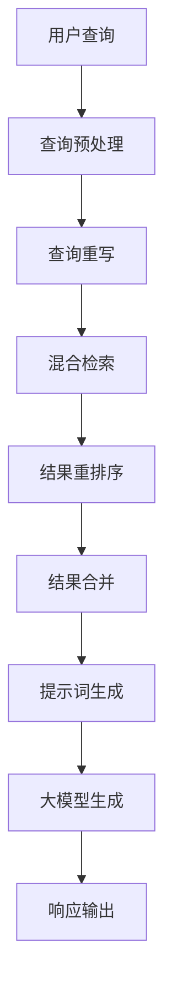
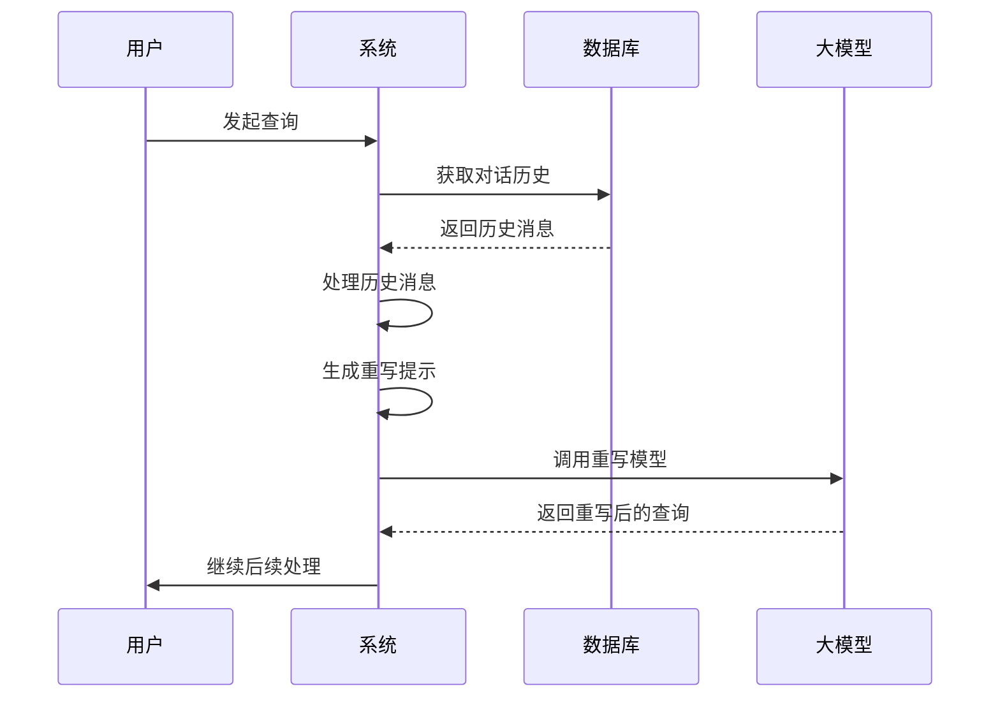
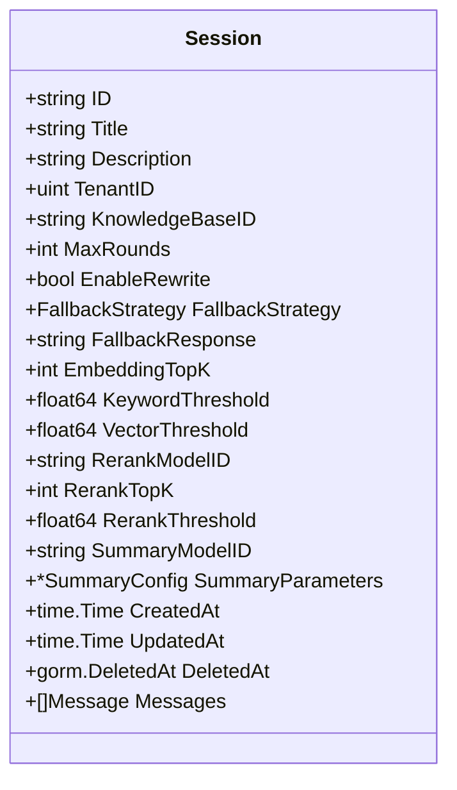
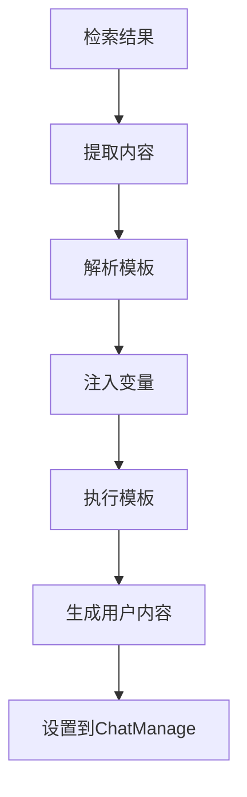
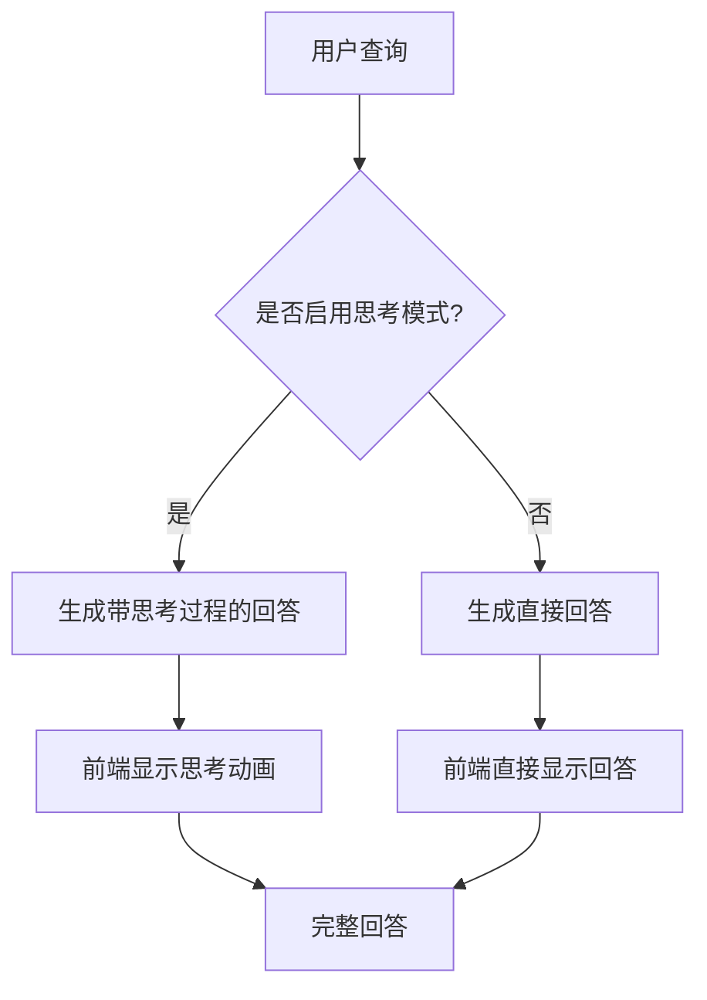
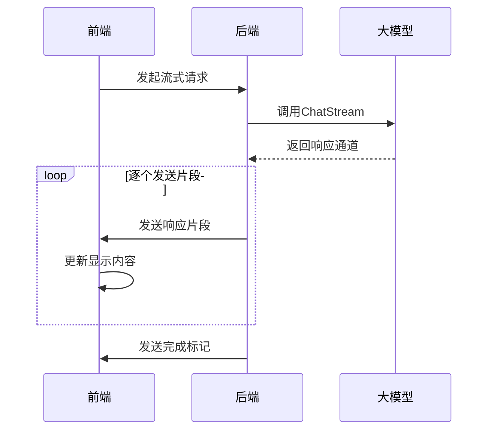
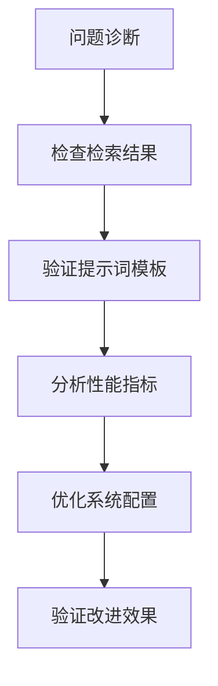

# 智能问答

<cite>
**本文档引用的文件**   
- [chat_pipline.go](file://internal/application/service/chat_pipline/chat_pipline.go)
- [preprocess.go](file://internal/application/service/chat_pipline/preprocess.go)
- [rewrite.go](file://internal/application/service/chat_pipline/rewrite.go)
- [search.go](file://internal/application/service/chat_pipline/search.go)
- [rerank.go](file://internal/application/service/chat_pipline/rerank.go)
- [chat_completion.go](file://internal/application/service/chat_pipline/chat_completion.go)
- [chat_completion_stream.go](file://internal/application/service/chat_pipline/chat_completion_stream.go)
- [common.go](file://internal/application/service/chat_pipline/common.go)
- [into_chat_message.go](file://internal/application/service/chat_pipline/into_chat_message.go)
- [merge.go](file://internal/application/service/chat_pipline/merge.go)
- [chat_manage.go](file://internal/types/chat_manage.go)
- [session.go](file://internal/types/session.go)
- [index.vue](file://frontend/src/views/chat/index.vue)
- [streame.ts](file://frontend/src/api/chat/streame.ts)
</cite>

## 目录
1. [对话流水线工作机制](#对话流水线工作机制)
2. [上下文感知与多轮对话管理](#上下文感知与多轮对话管理)
3. [会话状态存储与恢复机制](#会话状态存储与恢复机制)
4. [提示词模板结构与动态注入](#提示词模板结构与动态注入)
5. [思考模式与非思考模式](#思考模式与非思考模式)
6. [流式响应实现与前端展示](#流式响应实现与前端展示)
7. [典型场景调试方法](#典型场景调试方法)

## 对话流水线工作机制

智能问答系统的对话流水线（chat_pipline）采用插件化架构，通过事件驱动的方式处理用户查询。系统定义了多个处理阶段，包括查询重写、混合检索、结果重排序和大模型生成等关键步骤。

对话流水线的核心是`EventManager`，它管理着一系列插件（Plugin），每个插件负责处理特定类型的事件。事件类型定义在`types.EventType`常量中，包括`PREPROCESS_QUERY`（查询预处理）、`REWRITE_QUERY`（查询重写）、`CHUNK_SEARCH`（块搜索）、`CHUNK_RERANK`（块重排序）等。这些事件按照预定义的顺序执行，构成了完整的对话处理流程。

**对话流水线工作机制**
- [chat_pipline.go](file://internal/application/service/chat_pipline/chat_pipline.go#L1-L162)
- [chat_manage.go](file://internal/types/chat_manage.go#L73-L118)

## 上下文感知与多轮对话管理

系统通过`PluginRewrite`插件实现上下文感知和多轮对话管理。当用户发起查询时，系统会从数据库中获取最近的对话历史，通常限制为20轮，然后根据配置的最大轮数（MaxRounds）进行截取。

在`rewrite.go`文件中，`PluginRewrite`插件的`OnEvent`方法负责处理查询重写事件。该方法首先获取会话ID对应的对话历史，然后将历史消息转换为结构化的对话历史对象。历史消息按请求ID分组，用户消息作为查询，系统消息作为回答，同时移除思考过程标记`<think>`和`</think>`。

重写过程使用了提示词模板，系统会将原始查询、当前时间和对话历史注入到模板中，然后调用大语言模型生成重写后的查询。这种机制使得系统能够理解多轮对话的上下文，将当前查询与之前的对话关联起来，从而提供更准确的回答。

**上下文感知与多轮对话管理**
- [rewrite.go](file://internal/application/service/chat_pipline/rewrite.go#L1-L183)
- [session.go](file://internal/types/session.go#L60-L61)

## 会话状态存储与恢复机制

会话状态的存储和恢复通过`Session`结构体实现，该结构体定义了会话的各种配置参数和状态信息。会话ID作为唯一标识符，在整个对话过程中保持不变，确保了对话状态的连续性。

`Session`结构体包含多个重要字段：`KnowledgeBaseID`指定关联的知识库ID，`MaxRounds`定义多轮对话保持的轮数，`EnableRewrite`控制多轮改写开关，`FallbackStrategy`和`FallbackResponse`定义了兜底策略和固定回复内容。此外，还包含检索和排序相关的参数，如`EmbeddingTopK`、`KeywordThreshold`、`VectorThreshold`、`RerankModelID`等。

会话状态的恢复机制通过会话ID实现。当用户继续之前的对话时，系统根据会话ID从数据库中加载对应的会话配置和历史消息，重建`ChatManage`对象的状态。这种机制确保了用户可以在不同时间点继续之前的对话，而不会丢失上下文信息。

**会话状态存储与恢复机制**
- [session.go](file://internal/types/session.go#L48-L121)
- [chat_manage.go](file://internal/types/chat_manage.go#L5-L36)

## 提示词模板结构与动态注入

提示词模板（prompt template）是连接检索结果和大模型生成的关键组件。系统使用Go语言的`html/template`包来定义和解析提示词模板，支持动态注入查询、上下文、时间和星期等信息。

在`into_chat_message.go`文件中，`PluginIntoChatMessage`插件负责将检索结果转换为大模型可理解的聊天消息。该插件首先从合并后的检索结果中提取内容，然后解析配置中的上下文模板。模板中可以使用`{{.Query}}`、`{{.Contexts}}`、`{{.CurrentTime}}`和`{{.CurrentWeek}}`等占位符，分别表示用户查询、上下文内容、当前时间和星期。

系统还实现了输入验证机制，使用`secutils.ValidateInput`函数验证用户查询的安全性，防止恶意内容注入。如果查询包含非法内容，系统会返回错误。模板执行后生成的内容被设置为`chatManage.UserContent`，供后续的大模型生成步骤使用。

**提示词模板结构与动态注入**
- [into_chat_message.go](file://internal/application/service/chat_pipline/into_chat_message.go#L1-L44)
- [common.go](file://internal/application/service/chat_pipline/common.go#L46-L67)

## 思考模式与非思考模式

系统支持思考模式（deep think）和非思考模式两种不同的处理方式，主要区别在于大模型生成时是否启用思考过程。思考模式通过在提示词中添加`<think>`和`</think>`标记来实现，允许模型在生成最终回答前进行内部推理。

在`common.go`文件中，`prepareChatModel`函数设置了大模型的调用选项。思考模式的启用由`Thinking`参数控制，当设置为`true`时，模型会生成包含思考过程的回答。非思考模式则直接生成最终回答，响应速度更快但缺乏推理过程的透明度。

前端通过`index.vue`文件中的逻辑处理思考模式的展示。当接收到包含`<think>`标记的流式响应时，前端会提取思考内容并显示思考动画，同时逐步显示最终回答。这种设计既保持了用户体验的流畅性，又提供了模型推理过程的可视化。

**思考模式与非思考模式**
- [common.go](file://internal/application/service/chat_pipline/common.go#L24-L33)
- [index.vue](file://frontend/src/views/chat/index.vue#L114-L126)

## 流式响应实现与前端展示

流式响应的实现基于Server-Sent Events（SSE）技术，后端通过`chat_completion_stream.go`文件中的`PluginChatCompletionStream`插件生成流式响应，前端通过`fetchEventSource`接收并处理流式数据。

在后端，`PluginChatCompletionStream`插件调用大模型的`ChatStream`方法，返回一个通道（channel），系统通过该通道逐个发送响应片段。每个片段包含部分内容和完成状态，前端通过监听`onmessage`事件接收这些片段并逐步显示。

前端实现位于`streame.ts`文件中，使用`useStream`组合式函数管理流式状态。该函数返回`startStream`、`stopStream`和`onChunk`等方法，用于控制流式连接和处理数据片段。`onChunk`回调函数接收每个数据片段，更新`output`响应式变量，触发视图更新。

**流式响应实现与前端展示**
- [chat_completion_stream.go](file://internal/application/service/chat_pipline/chat_completion_stream.go#L1-L63)
- [streame.ts](file://frontend/src/api/chat/streame.ts#L1-L122)

## 典型场景调试方法

针对智能问答系统的调试，可以从检索结果分析、提示词优化和性能瓶颈诊断三个方面入手。系统提供了详细的日志记录，可以帮助开发者定位问题。

在检索结果分析方面，可以通过检查`search.go`文件中的日志输出来验证混合检索的效果。重点关注`Search parameters`和`Search results count`日志，确认查询文本、向量阈值、关键词阈值和匹配数量等参数是否正确设置。如果检索结果为空，需要检查知识库ID和检索参数配置。

提示词优化方面，可以查看`rewrite.go`和`into_chat_message.go`中的日志，特别是`User content for rewrite`和`System content for rewrite`等日志，确认提示词模板是否正确生成。如果重写效果不理想，可以调整`RewritePromptUser`和`RewritePromptSystem`配置。

性能瓶颈诊断需要关注各个处理阶段的耗时。系统在每个插件的`OnEvent`方法中都添加了日志记录，可以分析`Starting`和`completed successfully`日志之间的时间间隔，识别耗时较长的处理阶段。对于重排序等计算密集型操作，可以调整`RerankThreshold`和`RerankTopK`参数来平衡性能和准确性。

**典型场景调试方法**
- [search.go](file://internal/application/service/chat_pipline/search.go#L50-L54)
- [rewrite.go](file://internal/application/service/chat_pipline/rewrite.go#L143-L145)
- [rerank.go](file://internal/application/service/chat_pipline/rerank.go#L39-L40)