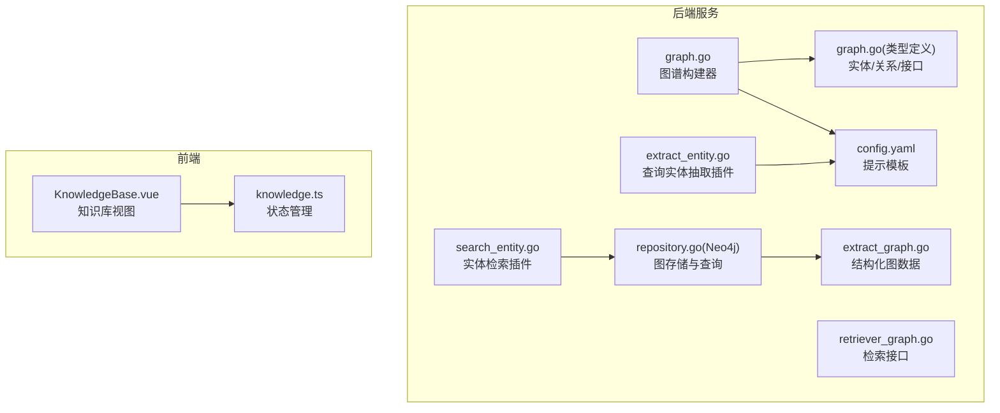
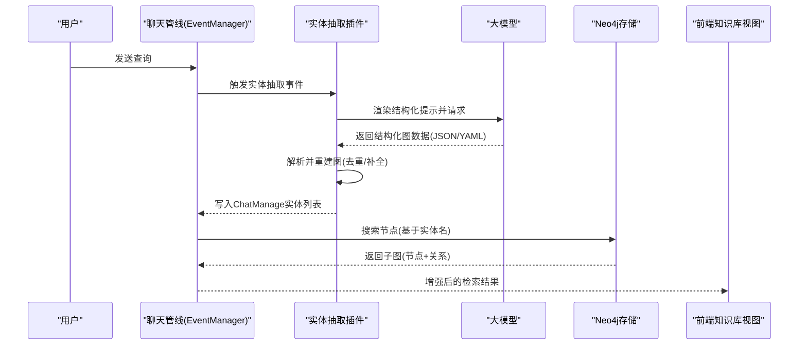
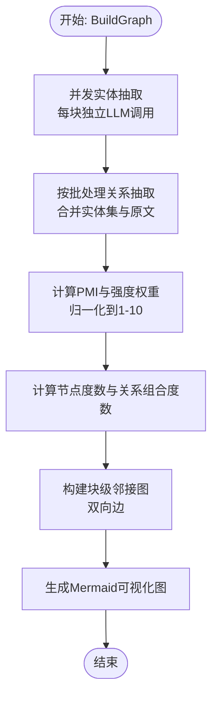
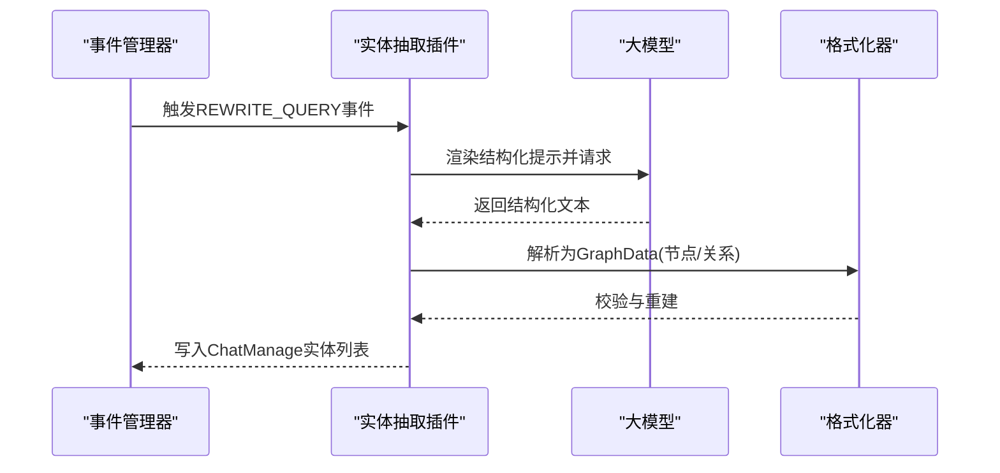
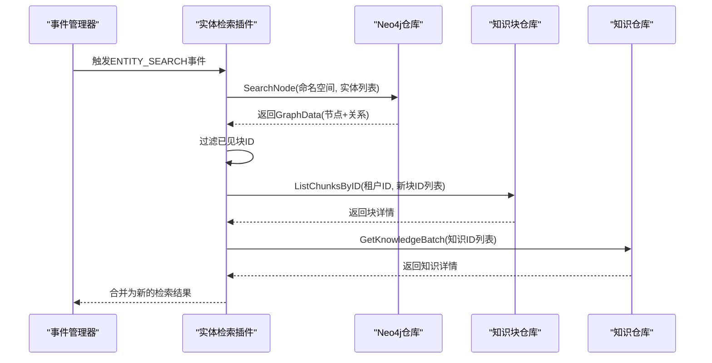
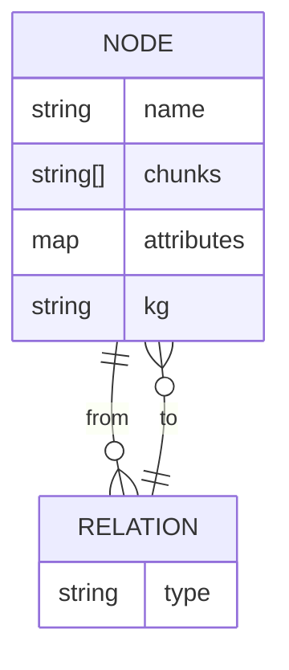
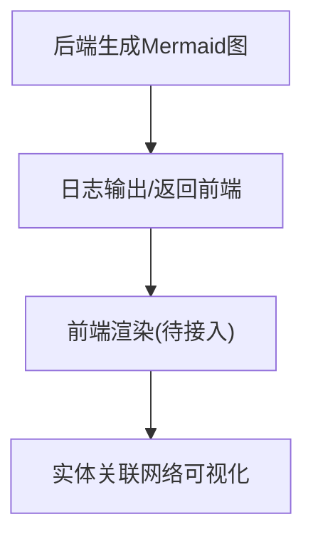
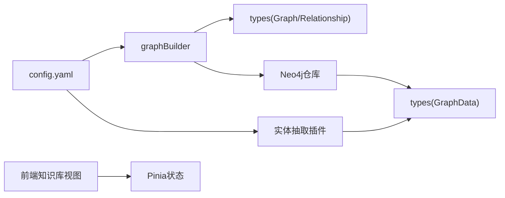

# 知识图谱

<cite>
**本文引用的文件**
- [graph.go](file://internal/application/service/graph.go)
- [graph.go（类型定义）](file://internal/types/graph.go)
- [retriever_graph.go](file://internal/types/interfaces/retriever_graph.go)
- [repository.go（Neo4j）](file://internal/application/repository/retriever/neo4j/repository.go)
- [extract_entity.go](file://internal/application/service/chat_pipline/extract_entity.go)
- [search_entity.go](file://internal/application/service/chat_pipline/search_entity.go)
- [chat_pipline.go](file://internal/application/service/chat_pipline/chat_pipline.go)
- [extract_graph.go](file://internal/types/extract_graph.go)
- [config.yaml](file://config/config.yaml)
- [KnowledgeBase.vue](file://frontend/src/views/knowledge/KnowledgeBase.vue)
- [knowledge.ts](file://frontend/src/stores/knowledge.ts)
</cite>

## 目录
1. [简介](#简介)
2. [项目结构](#项目结构)
3. [核心组件](#核心组件)
4. [架构总览](#架构总览)
5. [详细组件分析](#详细组件分析)
6. [依赖分析](#依赖分析)
7. [性能考量](#性能考量)
8. [故障排查指南](#故障排查指南)
9. [结论](#结论)
10. [附录](#附录)

## 简介
本文件系统性阐述 WeKnora 新版项目中的“知识图谱”能力，覆盖从文档中抽取实体与关系、构建图谱、存储与查询、前端可视化展示，以及在问答系统中的应用实践。重点说明：
- 实体识别（NER）与关系抽取的提示工程与大模型调用流程
- 图谱权重计算（PMI 与强度加权）、节点度数统计、邻接块图构建
- Neo4j 图数据库的存储结构、查询机制与清理策略
- 前端如何渲染实体关联网络（Mermaid 图）
- 问答系统中通过图谱推理增强检索结果的路径
- 构建过程中的性能挑战与优化方向（并发、批处理、增量更新、实体消歧）

## 项目结构
知识图谱相关代码分布在后端 Go 服务与前端 Vue 应用中，核心模块包括：
- 后端服务层：图谱构建器、实体/关系抽取插件、检索插件、Neo4j 仓库
- 类型与接口：图谱数据结构、命名空间、检索接口
- 配置：实体与关系抽取提示模板
- 前端：知识库视图与状态管理（用于承载后续图谱可视化集成）

图表来源
- [graph.go](file://internal/application/service/graph.go#L1-L120)
- [extract_entity.go](file://internal/application/service/chat_pipline/extract_entity.go#L1-L120)
- [search_entity.go](file://internal/application/service/chat_pipline/search_entity.go#L1-L60)
- [repository.go（Neo4j）](file://internal/application/repository/retriever/neo4j/repository.go#L1-L60)
- [graph.go（类型定义）](file://internal/types/graph.go#L1-L54)
- [retriever_graph.go](file://internal/types/interfaces/retriever_graph.go#L1-L14)
- [extract_graph.go](file://internal/types/extract_graph.go#L1-L52)
- [config.yaml](file://config/config.yaml#L240-L531)
- [KnowledgeBase.vue](file://frontend/src/views/knowledge/KnowledgeBase.vue#L1-L120)
- [knowledge.ts](file://frontend/src/stores/knowledge.ts#L1-L12)

章节来源
- [graph.go](file://internal/application/service/graph.go#L1-L120)
- [config.yaml](file://config/config.yaml#L240-L531)

## 核心组件
- 图谱构建器（GraphBuilder）
  - 负责从文档块中并发抽取实体与关系，计算权重与度数，构建块级邻接图，并生成 Mermaid 可视化图
- 实体/关系抽取插件（Chat Pipeline）
  - 面向用户查询的实体抽取与基于图谱的检索增强
- Neo4j 图存储与查询
  - 提供节点与关系的增删查能力，支持命名空间隔离
- 类型与接口
  - 定义实体、关系、命名空间、检索接口与结构化图数据
- 前端知识库视图
  - 展示知识库卡片与文档解析状态，为后续图谱可视化留出扩展点

章节来源
- [graph.go（类型定义）](file://internal/types/graph.go#L1-L54)
- [retriever_graph.go](file://internal/types/interfaces/retriever_graph.go#L1-L14)
- [extract_graph.go](file://internal/types/extract_graph.go#L1-L52)
- [graph.go](file://internal/application/service/graph.go#L1-L120)
- [extract_entity.go](file://internal/application/service/chat_pipline/extract_entity.go#L1-L120)
- [search_entity.go](file://internal/application/service/chat_pipline/search_entity.go#L1-L60)
- [repository.go（Neo4j）](file://internal/application/repository/retriever/neo4j/repository.go#L1-L60)
- [KnowledgeBase.vue](file://frontend/src/views/knowledge/KnowledgeBase.vue#L1-L120)
- [knowledge.ts](file://frontend/src/stores/knowledge.ts#L1-L12)

## 架构总览
后端采用“提示工程 + 大模型 + 结构化解析”的方式完成实体与关系抽取，随后进行权重与度数计算，构建块级邻接图并输出 Mermaid 可视化。Neo4j 作为持久化存储，提供节点与关系的合并、查询与批量删除能力。前端知识库视图负责展示文档解析状态，为后续图谱可视化提供入口。

图表来源
- [chat_pipline.go](file://internal/application/service/chat_pipline/chat_pipline.go#L1-L80)
- [extract_entity.go](file://internal/application/service/chat_pipline/extract_entity.go#L1-L120)
- [search_entity.go](file://internal/application/service/chat_pipline/search_entity.go#L1-L90)
- [repository.go（Neo4j）](file://internal/application/repository/retriever/neo4j/repository.go#L155-L215)

## 详细组件分析

### 图谱构建器（实体/关系抽取与权重计算）
- 实体抽取
  - 通过系统提示与用户文本构造消息，调用大模型抽取实体，解析 JSON 并去重、计数、记录所属块
- 关系抽取
  - 将多块内容合并，构造包含实体列表与原文的提示，调用大模型抽取关系，解析 JSON 并合并相同关系
- 权重与度数
  - 基于 PMI 与关系强度加权，归一化到 1-10 区间；节点度数为入度与出度之和
- 块级邻接图
  - 以块为单位建立双向连接，权重来自关系权重，度数来自节点度数之和
- 可视化
  - 生成 Mermaid 图，按频率与强度着色，按连通分量分组显示

图表来源
- [graph.go](file://internal/application/service/graph.go#L325-L467)
- [graph.go](file://internal/application/service/graph.go#L467-L581)
- [graph.go](file://internal/application/service/graph.go#L583-L623)
- [graph.go](file://internal/application/service/graph.go#L818-L995)

章节来源
- [graph.go](file://internal/application/service/graph.go#L1-L120)
- [graph.go](file://internal/application/service/graph.go#L325-L467)
- [graph.go](file://internal/application/service/graph.go#L467-L581)
- [graph.go](file://internal/application/service/graph.go#L583-L623)
- [graph.go](file://internal/application/service/graph.go#L818-L995)

### 实体抽取插件（面向用户查询）
- 插件在聊天管线中响应“重写查询”事件，启用时调用大模型抽取查询中的关键实体
- 使用结构化提示模板，解析模型输出为节点与关系列表，去除非目标关系类型
- 将抽取到的实体写入聊天上下文，供后续检索增强使用

图表来源
- [chat_pipline.go](file://internal/application/service/chat_pipline/chat_pipline.go#L1-L80)
- [extract_entity.go](file://internal/application/service/chat_pipline/extract_entity.go#L1-L120)
- [extract_entity.go](file://internal/application/service/chat_pipline/extract_entity.go#L121-L228)
- [extract_entity.go](file://internal/application/service/chat_pipline/extract_entity.go#L229-L500)

章节来源
- [extract_entity.go](file://internal/application/service/chat_pipline/extract_entity.go#L1-L120)
- [extract_entity.go](file://internal/application/service/chat_pipline/extract_entity.go#L121-L228)
- [extract_entity.go](file://internal/application/service/chat_pipline/extract_entity.go#L229-L500)
- [chat_pipline.go](file://internal/application/service/chat_pipline/chat_pipline.go#L1-L80)

### 实体检索插件（基于图谱增强检索）
- 在“实体搜索”事件中，根据已抽取的实体列表，查询 Neo4j 存储，返回包含节点与关系的子图
- 过滤掉已见过的块 ID，合并为新的检索结果，去重后返回给聊天管线

图表来源
- [search_entity.go](file://internal/application/service/chat_pipline/search_entity.go#L1-L90)
- [repository.go（Neo4j）](file://internal/application/repository/retriever/neo4j/repository.go#L155-L215)

章节来源
- [search_entity.go](file://internal/application/service/chat_pipline/search_entity.go#L1-L90)
- [repository.go（Neo4j）](file://internal/application/repository/retriever/neo4j/repository.go#L155-L215)

### Neo4j 图存储与查询
- 节点与关系导入
  - 使用 apoc.merge.node/relationship 合并节点与关系，属性中保存实体属性与块 ID 列表
- 删除
  - 基于命名空间标签，分批删除节点与关系
- 查询
  - 按命名空间标签匹配节点与邻接关系，返回节点与关系集合

图表来源
- [repository.go（Neo4j）](file://internal/application/repository/retriever/neo4j/repository.go#L40-L116)
- [repository.go（Neo4j）](file://internal/application/repository/retriever/neo4j/repository.go#L110-L187)
- [extract_graph.go](file://internal/types/extract_graph.go#L19-L41)

章节来源
- [repository.go（Neo4j）](file://internal/application/repository/retriever/neo4j/repository.go#L1-L116)
- [repository.go（Neo4j）](file://internal/application/repository/retriever/neo4j/repository.go#L110-L187)
- [extract_graph.go](file://internal/types/extract_graph.go#L19-L41)

### 前端可视化（Mermaid 图）
- 后端生成 Mermaid 图字符串，包含节点样式、连边与强度样式、连通分量分组
- 前端知识库视图目前聚焦于文档卡片与解析状态，尚未直接展示图谱可视化；可在现有视图基础上接入 Mermaid 渲染组件

图表来源
- [graph.go](file://internal/application/service/graph.go#L818-L995)
- [KnowledgeBase.vue](file://frontend/src/views/knowledge/KnowledgeBase.vue#L1-L120)

章节来源
- [graph.go](file://internal/application/service/graph.go#L818-L995)
- [KnowledgeBase.vue](file://frontend/src/views/knowledge/KnowledgeBase.vue#L1-L120)

## 依赖分析
- 组件耦合
  - 图谱构建器依赖配置中的提示模板与大模型接口
  - 实体/关系抽取插件依赖提示模板与格式化器
  - Neo4j 仓库实现检索接口，供聊天管线调用
- 外部依赖
  - Neo4j 驱动与 APOC 扩展用于节点/关系合并与批量删除
  - 大模型接口用于结构化抽取与解析

图表来源
- [config.yaml](file://config/config.yaml#L240-L531)
- [graph.go](file://internal/application/service/graph.go#L1-L120)
- [extract_entity.go](file://internal/application/service/chat_pipline/extract_entity.go#L1-L120)
- [repository.go（Neo4j）](file://internal/application/repository/retriever/neo4j/repository.go#L1-L60)
- [extract_graph.go](file://internal/types/extract_graph.go#L1-L52)
- [KnowledgeBase.vue](file://frontend/src/views/knowledge/KnowledgeBase.vue#L1-L120)
- [knowledge.ts](file://frontend/src/stores/knowledge.ts#L1-L12)

章节来源
- [config.yaml](file://config/config.yaml#L240-L531)
- [graph.go](file://internal/application/service/graph.go#L1-L120)
- [extract_entity.go](file://internal/application/service/chat_pipline/extract_entity.go#L1-L120)
- [repository.go（Neo4j）](file://internal/application/repository/retriever/neo4j/repository.go#L1-L60)
- [extract_graph.go](file://internal/types/extract_graph.go#L1-L52)
- [KnowledgeBase.vue](file://frontend/src/views/knowledge/KnowledgeBase.vue#L1-L120)
- [knowledge.ts](file://frontend/src/stores/knowledge.ts#L1-L12)

## 性能考量
- 并发与批处理
  - 实体抽取与关系抽取均采用并发组与限流，批大小可配置，减少 LLM 调用次数与延迟
- 权重与度数计算
  - PMI 计算与归一化、强度加权、度数统计均为 O(E) 或 O(V+E)，适合大规模图谱
- Neo4j 批量操作
  - apoc.periodic.iterate 用于批量删除，UNWIND + apoc.merge 减少往返开销
- 增量更新
  - 建议在新增/删除知识块时，仅对受影响的实体与块进行增量更新，避免全量重建
- 实体消歧
  - 在提示模板中明确歧义说明字段，或引入外部 KB/实体消歧服务，减少同名异义导致的错误关系
- 前端渲染
  - 大图建议采用分页/分层/缩放策略，Mermaid 渲染可按需懒加载

[本节为通用指导，无需代码引用]

## 故障排查指南
- 实体/关系解析失败
  - 检查提示模板是否正确，确认模型输出格式与 JSON/YAML 闭合标记
  - 查看解析器日志，定位格式化失败的具体项
- Neo4j 导入/删除异常
  - 确认命名空间标签与知识 ID 是否一致，检查 apoc 扩展可用性
  - 关注批处理参数与并行度，避免锁竞争
- 聊天管线插件未生效
  - 确认事件类型是否触发，环境变量是否启用 Neo4j，插件是否注册成功

章节来源
- [extract_entity.go](file://internal/application/service/chat_pipline/extract_entity.go#L121-L228)
- [repository.go（Neo4j）](file://internal/application/repository/retriever/neo4j/repository.go#L110-L187)
- [chat_pipline.go](file://internal/application/service/chat_pipline/chat_pipline.go#L1-L80)

## 结论
本项目以“提示工程 + 大模型 + 结构化解析”为核心，实现了从文档到知识图谱的自动化构建，并通过 Neo4j 提供稳定存储与查询能力。聊天管线中的实体抽取与检索增强，为问答系统提供了图谱推理的补充路径。前端层面，知识库视图已具备基础展示能力，后续可直接接入 Mermaid 图谱可视化，以提升用户体验与洞察效率。

[本节为总结，无需代码引用]

## 附录
- 提示模板要点
  - 实体抽取：限定类型集合、强制 JSON 输出、歧义说明字段
  - 关系抽取：仅提取文本中明确关系、双向/单向判定、强度评分标准
- 数据结构要点
  - GraphData：节点、关系、文本三要素，便于前后端传输与解析
  - 命名空间：知识库与知识维度标签，用于 Neo4j 节点/关系隔离

章节来源
- [config.yaml](file://config/config.yaml#L240-L531)
- [extract_graph.go](file://internal/types/extract_graph.go#L19-L41)