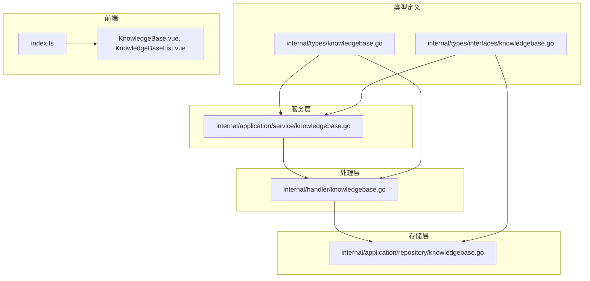
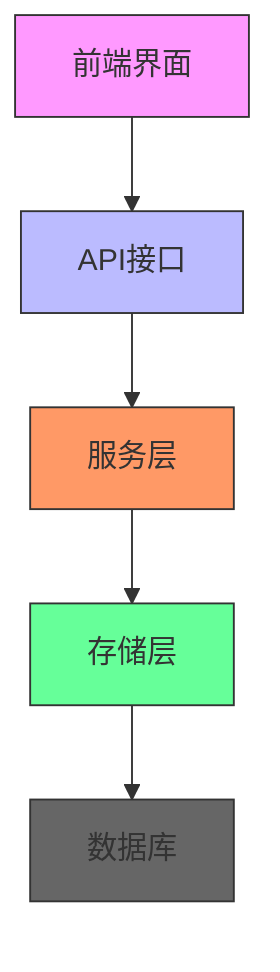
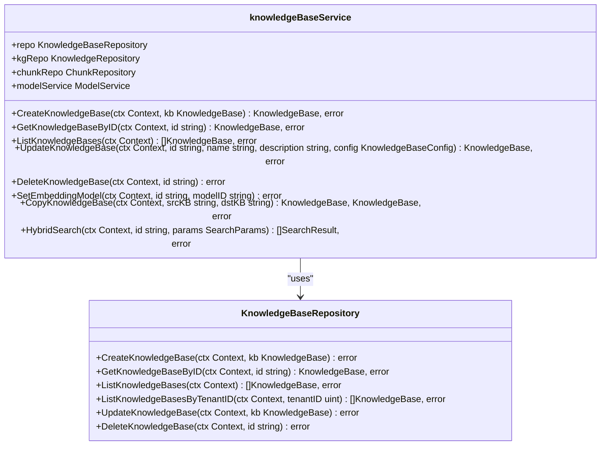
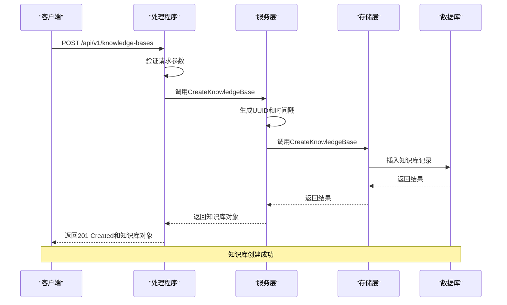
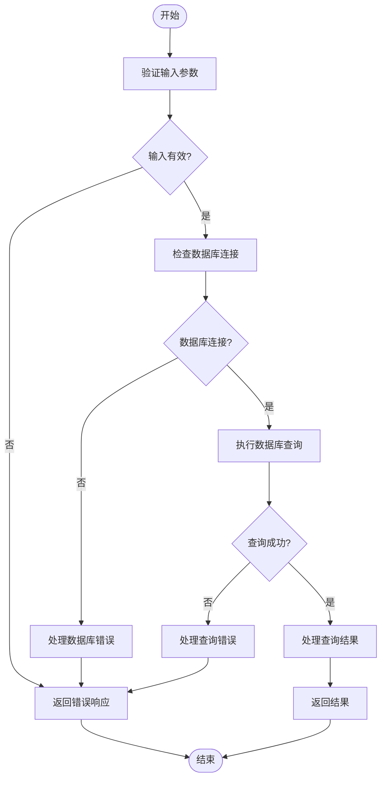
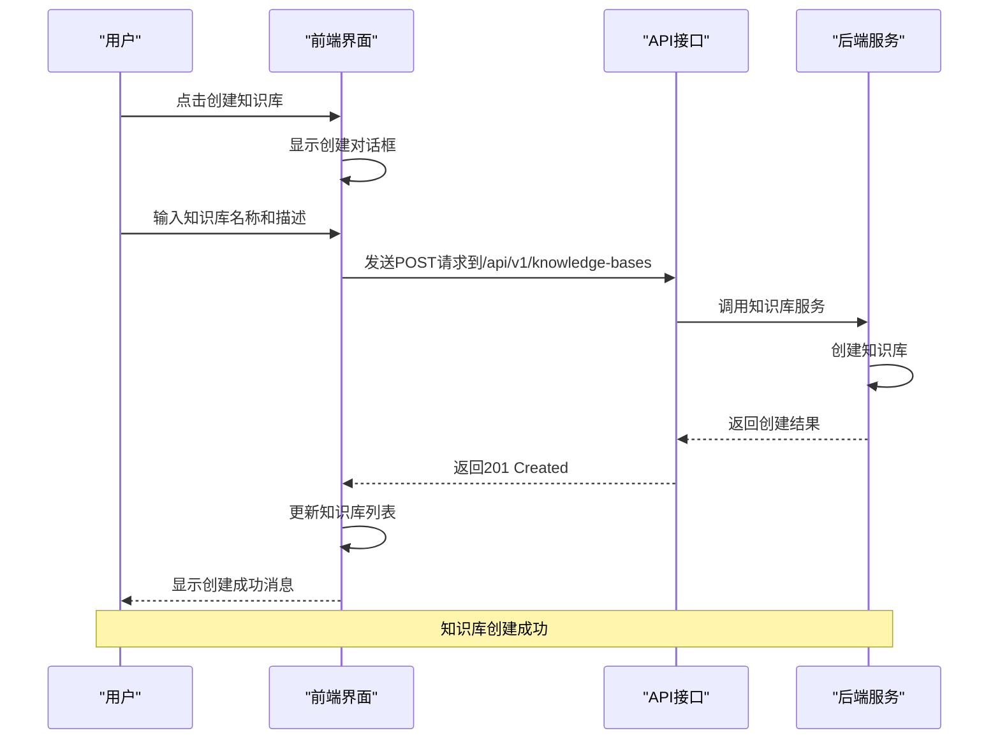
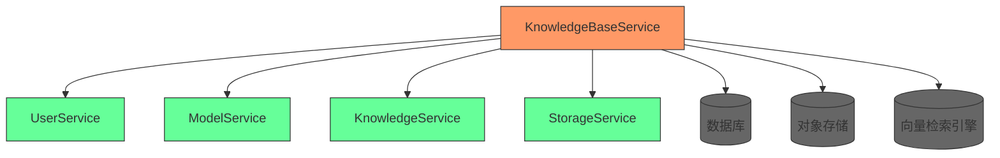

# 知识库管理

<cite>
**本文档引用的文件**   
- [knowledgebase.go](file://internal/application/service/knowledgebase.go)
- [knowledgebase.go](file://internal/handler/knowledgebase.go)
- [knowledgebase.go](file://internal/application/repository/knowledgebase.go)
- [knowledgebase.go](file://internal/types/knowledgebase.go)
- [knowledgebase.go](file://internal/types/interfaces/knowledgebase.go)
- [index.ts](file://frontend/src/api/knowledge-base/index.ts)
- [KnowledgeBase.vue](file://frontend/src/views/knowledge/KnowledgeBase.vue)
- [KnowledgeBaseList.vue](file://frontend/src/views/knowledge/KnowledgeBaseList.vue)
- [router.go](file://internal/router/router.go)
- [auth.go](file://internal/middleware/auth.go)
</cite>

## 目录
1. [简介](#简介)
2. [项目结构](#项目结构)
3. [核心组件](#核心组件)
4. [架构概述](#架构概述)
5. [详细组件分析](#详细组件分析)
6. [依赖分析](#依赖分析)
7. [性能考虑](#性能考虑)
8. [故障排除指南](#故障排除指南)
9. [结论](#结论)

## 简介
知识库管理功能是WeKnora系统的核心模块，提供知识库的创建、配置、文档关联和权限管理机制。知识库作为文档集合的逻辑容器，用于组织和隔离数据，支持多租户环境下的数据安全和访问控制。该功能通过API接口实现CRUD操作，支持分块策略、embedding模型选择、检索参数设置等高级配置选项，并提供直观的前端交互界面。

## 项目结构
知识库管理功能的代码分布在多个目录中，主要包括服务层、处理层、存储层和前端界面。服务层负责业务逻辑处理，处理层负责HTTP请求的接收和响应，存储层负责数据的持久化，前端界面提供用户交互。

**Diagram sources**
- [knowledgebase.go](file://internal/application/service/knowledgebase.go)
- [knowledgebase.go](file://internal/handler/knowledgebase.go)
- [knowledgebase.go](file://internal/application/repository/knowledgebase.go)
- [knowledgebase.go](file://internal/types/knowledgebase.go)
- [knowledgebase.go](file://internal/types/interfaces/knowledgebase.go)
- [index.ts](file://frontend/src/api/knowledge-base/index.ts)
- [KnowledgeBase.vue](file://frontend/src/views/knowledge/KnowledgeBase.vue)
- [KnowledgeBaseList.vue](file://frontend/src/views/knowledge/KnowledgeBaseList.vue)

**Section sources**
- [knowledgebase.go](file://internal/application/service/knowledgebase.go)
- [knowledgebase.go](file://internal/handler/knowledgebase.go)
- [knowledgebase.go](file://internal/application/repository/knowledgebase.go)
- [knowledgebase.go](file://internal/types/knowledgebase.go)
- [knowledgebase.go](file://internal/types/interfaces/knowledgebase.go)
- [index.ts](file://frontend/src/api/knowledge-base/index.ts)
- [KnowledgeBase.vue](file://frontend/src/views/knowledge/KnowledgeBase.vue)
- [KnowledgeBaseList.vue](file://frontend/src/views/knowledge/KnowledgeBaseList.vue)

## 核心组件
知识库管理功能的核心组件包括知识库服务、处理程序、存储库和前端界面。知识库服务负责处理业务逻辑，如创建、更新、删除和搜索知识库。处理程序负责接收HTTP请求并调用服务层的方法。存储库负责与数据库交互，实现数据的持久化。前端界面提供用户友好的操作界面，支持知识库的创建、配置和文档管理。

**Section sources**
- [knowledgebase.go](file://internal/application/service/knowledgebase.go)
- [knowledgebase.go](file://internal/handler/knowledgebase.go)
- [knowledgebase.go](file://internal/application/repository/knowledgebase.go)
- [KnowledgeBase.vue](file://frontend/src/views/knowledge/KnowledgeBase.vue)
- [KnowledgeBaseList.vue](file://frontend/src/views/knowledge/KnowledgeBaseList.vue)

## 架构概述
知识库管理功能采用分层架构，包括前端界面、API接口、服务层、存储层和数据库。前端界面通过API接口与后端服务通信，服务层处理业务逻辑并调用存储层的方法，存储层负责与数据库交互。这种分层架构提高了代码的可维护性和可扩展性。

**Diagram sources**
- [knowledgebase.go](file://internal/application/service/knowledgebase.go)
- [knowledgebase.go](file://internal/handler/knowledgebase.go)
- [knowledgebase.go](file://internal/application/repository/knowledgebase.go)
- [index.ts](file://frontend/src/api/knowledge-base/index.ts)

## 详细组件分析

### 知识库服务分析
知识库服务是知识库管理功能的核心，负责处理所有与知识库相关的业务逻辑。服务层实现了知识库的创建、更新、删除、搜索和复制等操作。每个操作都遵循严格的验证和错误处理流程，确保数据的一致性和完整性。

#### 服务类结构

**Diagram sources**
- [knowledgebase.go](file://internal/application/service/knowledgebase.go)
- [knowledgebase.go](file://internal/application/repository/knowledgebase.go)

### 知识库处理程序分析
知识库处理程序负责接收HTTP请求并调用服务层的方法。处理程序实现了RESTful API，支持知识库的创建、更新、删除、搜索和复制等操作。每个API接口都包含详细的参数验证和错误处理，确保请求的合法性和安全性。

#### API请求处理流程

**Diagram sources**
- [knowledgebase.go](file://internal/handler/knowledgebase.go)
- [knowledgebase.go](file://internal/application/service/knowledgebase.go)
- [knowledgebase.go](file://internal/application/repository/knowledgebase.go)

### 知识库存储库分析
知识库存储库负责与数据库交互，实现知识库数据的持久化。存储库使用GORM作为ORM框架，提供了创建、查询、更新和删除知识库记录的方法。存储库还实现了按租户ID查询知识库列表的功能，支持多租户环境下的数据隔离。

#### 数据库操作流程

**Diagram sources**
- [knowledgebase.go](file://internal/application/repository/knowledgebase.go)

### 前端界面分析
前端界面提供了用户友好的知识库管理功能，支持知识库的创建、配置和文档管理。界面采用Vue.js框架开发，使用TDesign组件库构建UI。前端通过API接口与后端服务通信，实现了知识库列表、文档管理界面和权限设置面板。

#### 前端交互流程

**Diagram sources**
- [KnowledgeBaseList.vue](file://frontend/src/views/knowledge/KnowledgeBaseList.vue)
- [index.ts](file://frontend/src/api/knowledge-base/index.ts)

## 依赖分析
知识库管理功能依赖于多个内部和外部组件。内部依赖包括用户服务、模型服务、知识服务和存储服务。外部依赖包括数据库（MySQL或PostgreSQL）、对象存储（COS）和向量检索引擎（Elasticsearch或Neo4j）。这些依赖关系通过接口定义实现解耦，提高了系统的可测试性和可维护性。

**Diagram sources**
- [knowledgebase.go](file://internal/application/service/knowledgebase.go)

## 性能考虑
知识库管理功能在设计时考虑了性能优化。服务层采用了批量操作和缓存机制，减少数据库查询次数。存储层使用了索引优化，提高查询效率。前端界面实现了分页加载和懒加载，减少网络传输数据量。此外，系统还支持异步任务处理，如文档解析和向量化，避免阻塞主线程。

## 故障排除指南
在使用知识库管理功能时，可能会遇到一些常见问题。例如，知识库删除时需要确保没有关联的文档；文档去重策略需要根据具体需求进行配置；权限管理需要正确设置租户和用户角色。建议在生产环境中定期备份数据，并监控系统性能指标，及时发现和解决问题。

**Section sources**
- [knowledgebase.go](file://internal/application/service/knowledgebase.go)
- [knowledgebase.go](file://internal/handler/knowledgebase.go)
- [knowledgebase.go](file://internal/application/repository/knowledgebase.go)

## 结论
知识库管理功能是WeKnora系统的重要组成部分，提供了完整的知识库生命周期管理。通过分层架构和接口定义，实现了高内聚低耦合的设计。前端界面提供了用户友好的操作体验，后端服务保证了数据的一致性和安全性。未来可以进一步优化性能，增加更多高级功能，如自动文档分类和智能推荐。