# 系统概述

<cite>
**本文引用的文件**
- [README.md](file://README.md)
- [cmd/server/main.go](file://cmd/server/main.go)
- [config/config.yaml](file://config/config.yaml)
- [internal/config/config.go](file://internal/config/config.go)
- [internal/router/router.go](file://internal/router/router.go)
- [internal/container/container.go](file://internal/container/container.go)
- [internal/application/service/chat_pipline/chat_pipline.go](file://internal/application/service/chat_pipline/chat_pipline.go)
- [internal/application/service/retriever/composite.go](file://internal/application/service/retriever/composite.go)
- [internal/types/interfaces/session.go](file://internal/types/interfaces/session.go)
- [docreader/main.py](file://docreader/main.py)
- [docreader/parser/parser.py](file://docreader/parser/parser.py)
- [frontend/src/main.ts](file://frontend/src/main.ts)
- [frontend/package.json](file://frontend/package.json)
- [docker-compose.yml](file://docker-compose.yml)
- [mcp-server/main.py](file://mcp-server/main.py)
</cite>

## 目录
1. [简介](#简介)
2. [项目结构](#项目结构)
3. [核心组件](#核心组件)
4. [架构总览](#架构总览)
5. [详细组件分析](#详细组件分析)
6. [依赖关系分析](#依赖关系分析)
7. [性能考量](#性能考量)
8. [故障排查指南](#故障排查指南)
9. [结论](#结论)
10. [附录](#附录)

## 简介
WeKnora_New 是一个基于大语言模型（LLM）的文档理解与语义检索框架，采用检索增强生成（RAG）范式，实现“检索-重排-生成”的端到端问答流程。系统支持多模态文档解析、向量索引、混合检索策略、知识图谱增强检索以及多轮对话能力，适用于企业知识管理、学术研究分析、产品技术支持、法律合规审查、医疗知识辅助等场景。

系统通过模块化设计，将文档解析、向量化、检索引擎、大模型推理等能力解耦，便于按需扩展与替换。后端采用 Go/Gin 构建 REST API 服务，前端使用 Vue 3 + TypeScript 提供 Web 界面，文档解析服务采用 Python + gRPC，MCP 服务器提供与外部工具链的集成能力。

## 项目结构
仓库采用“分层+模块化”组织方式：
- cmd/server：后端服务入口，负责初始化容器、启动 HTTP 服务器与信号处理
- internal：核心业务逻辑，包含配置、路由、容器装配、服务层、仓储层、类型定义、中间件、流管理、追踪等
- frontend：Vue 3 前端应用，提供知识库管理、聊天对话、系统设置等功能界面
- docreader：Python 文档解析微服务，提供 gRPC 接口，支持 PDF、Word、Markdown、图片（含 OCR/Caption）、网页等多格式解析
- mcp-server：MCP（Model Context Protocol）服务器，提供与 WeKnora 的集成入口，便于在外部工具链中调用
- config：运行时配置文件
- docker-compose.yml：多服务编排，包含 app、docreader、postgres、redis、neo4j、jaeger、minio、frontend 等
- scripts、migrations、dataset、docker 等：部署脚本、数据库迁移、评测数据集与容器配置

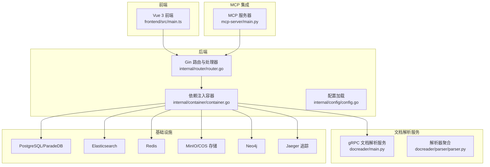

图表来源
- [frontend/src/main.ts](file://frontend/src/main.ts#L1-L19)
- [internal/router/router.go](file://internal/router/router.go#L1-L90)
- [internal/container/container.go](file://internal/container/container.go#L45-L138)
- [docreader/main.py](file://docreader/main.py#L354-L404)
- [docreader/parser/parser.py](file://docreader/parser/parser.py#L1-L60)
- [docker-compose.yml](file://docker-compose.yml#L1-L120)

章节来源
- [README.md](file://README.md#L268-L308)
- [docker-compose.yml](file://docker-compose.yml#L1-L120)

## 核心组件
- 后端服务入口与生命周期管理：后端通过入口函数构建依赖注入容器，启动 HTTP 服务器并监听系统信号，优雅关闭时清理资源
- 配置系统：支持 YAML 配置文件与环境变量替换，涵盖服务器、对话、知识库、模型、向量数据库、流管理、抽取模板等
- 路由与中间件：统一注册认证、CORS、日志、恢复、错误处理与 OpenTelemetry 追踪中间件，暴露知识库、知识、分块、会话、消息、模型、评估、初始化、系统等 API
- 依赖注入容器：集中注册仓储、服务、处理器、检索引擎注册表、流管理器、文档解析客户端、Ollama 客户端、Neo4j 客户端等
- 检索引擎复合体：支持多后端（PostgreSQL、Elasticsearch v7/v8、Neo4j）混合检索，按检索器类型分派到对应引擎
- 聊天流水线插件：事件驱动的插件体系，覆盖预处理、改写、搜索、重排、合并、生成、流过滤、TopK 过滤、实体抽取、实体搜索等阶段
- 文档解析服务：gRPC 服务，支持文件与 URL 两种输入，按配置切分文本、处理图片（OCR/Caption）、返回结构化分块与图像信息
- 前端应用：Vue 3 + Pinia + Vue Router + TDesign，提供知识上传、问答入口、富文本与图片响应、知识图谱视图、设置与国际化
- MCP 服务器：提供与外部工具链集成的入口，支持通过环境变量配置 WeKnora API 基础地址与密钥

章节来源
- [cmd/server/main.go](file://cmd/server/main.go#L24-L104)
- [internal/config/config.go](file://internal/config/config.go#L1-L193)
- [config/config.yaml](file://config/config.yaml#L1-L120)
- [internal/router/router.go](file://internal/router/router.go#L1-L90)
- [internal/container/container.go](file://internal/container/container.go#L45-L138)
- [internal/application/service/retriever/composite.go](file://internal/application/service/retriever/composite.go#L1-L120)
- [internal/application/service/chat_pipline/chat_pipline.go](file://internal/application/service/chat_pipline/chat_pipline.go#L1-L80)
- [docreader/main.py](file://docreader/main.py#L354-L404)
- [docreader/parser/parser.py](file://docreader/parser/parser.py#L1-L60)
- [frontend/src/main.ts](file://frontend/src/main.ts#L1-L19)
- [mcp-server/main.py](file://mcp-server/main.py#L1-L60)

## 架构总览
WeKnora_New 采用“前端-后端-解析服务-检索引擎-大模型推理”的分层架构。前端通过 REST API 与后端交互；后端通过依赖注入容器装配服务与仓储，统一路由与中间件；文档解析服务通过 gRPC 与后端通信；检索引擎支持多种后端并行执行；聊天流水线插件串联检索、重排、生成等步骤；MCP 服务器提供外部集成入口。

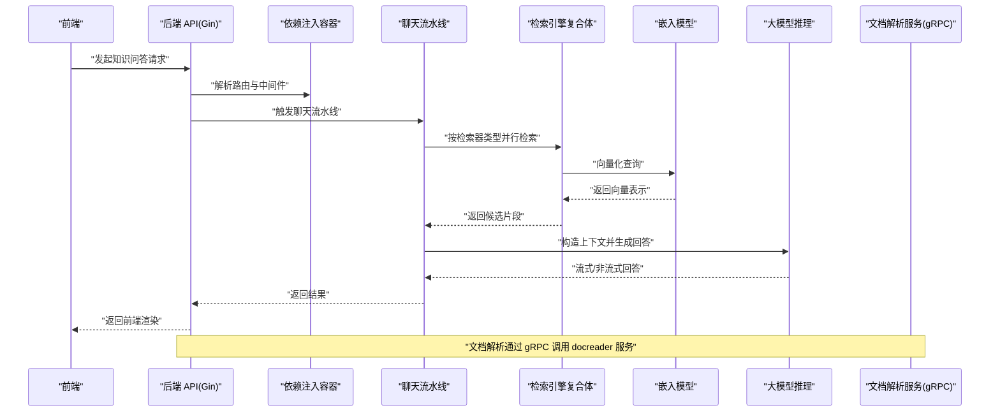

图表来源
- [internal/router/router.go](file://internal/router/router.go#L190-L200)
- [internal/application/service/chat_pipline/chat_pipline.go](file://internal/application/service/chat_pipline/chat_pipline.go#L1-L80)
- [internal/application/service/retriever/composite.go](file://internal/application/service/retriever/composite.go#L1-L120)
- [docreader/main.py](file://docreader/main.py#L354-L404)

## 详细组件分析

### 后端服务入口与生命周期
- 初始化日志、Gin 模式与依赖注入容器
- 启动 HTTP 服务器，注册信号处理，优雅关闭时清理追踪与资源
- 通过容器 Invoke 方式获取配置、路由、追踪器与资源清理器

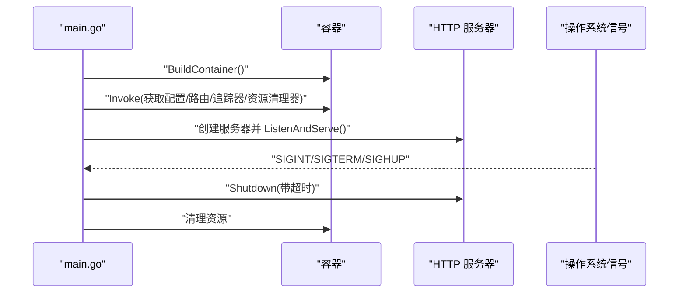

图表来源
- [cmd/server/main.go](file://cmd/server/main.go#L24-L104)

章节来源
- [cmd/server/main.go](file://cmd/server/main.go#L24-L104)

### 配置系统与运行时参数
- YAML 配置文件支持对话阈值、重排策略、摘要生成、关键词抽取、实体抽取与关系抽取等模板
- Go 配置结构体映射 YAML 字段，支持环境变量替换与默认值
- 运行时通过环境变量控制数据库驱动、存储类型、检索驱动、ES 地址、DocReader 地址、流管理器类型、Neo4j 开关等

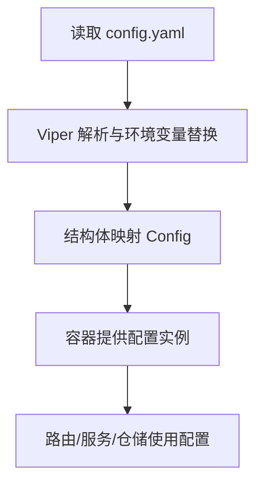

图表来源
- [internal/config/config.go](file://internal/config/config.go#L144-L193)
- [config/config.yaml](file://config/config.yaml#L1-L120)
- [internal/container/container.go](file://internal/container/container.go#L58-L66)

章节来源
- [internal/config/config.go](file://internal/config/config.go#L1-L193)
- [config/config.yaml](file://config/config.yaml#L1-L120)
- [internal/container/container.go](file://internal/container/container.go#L58-L66)

### 路由与中间件
- 统一注册 CORS、请求 ID、日志、恢复、错误处理与认证中间件
- 健康检查 /health
- API 分组：认证、租户、知识库、知识、分块、会话、消息、模型、评估、初始化、系统
- 知识问答与混合检索接口

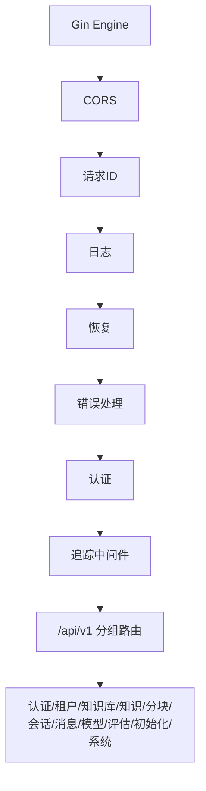

图表来源
- [internal/router/router.go](file://internal/router/router.go#L43-L90)

章节来源
- [internal/router/router.go](file://internal/router/router.go#L1-L90)

### 依赖注入容器
- 注册资源清理器、配置、追踪器、数据库连接、文件存储服务、协程池、检索引擎注册表
- 注册文档解析客户端、Ollama 客户端、Neo4j 客户端、流管理器
- 注册仓储层、服务层、处理器层、聊天流水线插件
- 启动异步队列服务并运行

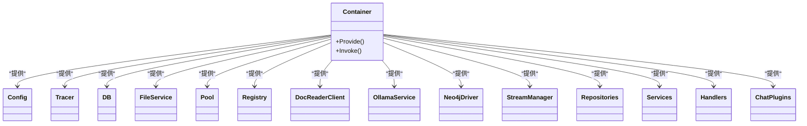

图表来源
- [internal/container/container.go](file://internal/container/container.go#L45-L138)

章节来源
- [internal/container/container.go](file://internal/container/container.go#L45-L138)

### 检索引擎复合体
- 支持多后端（PostgreSQL、Elasticsearch v7/v8、Neo4j）混合检索
- 按检索器类型分派到对应引擎，支持并发检索与错误聚合
- 提供索引、批量索引、复制索引、删除索引等操作

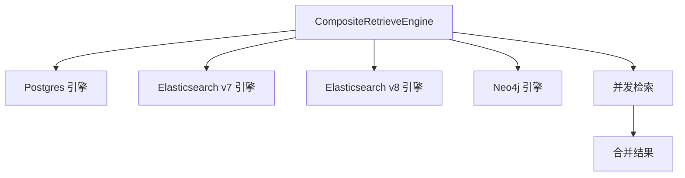

图表来源
- [internal/application/service/retriever/composite.go](file://internal/application/service/retriever/composite.go#L1-L120)

章节来源
- [internal/application/service/retriever/composite.go](file://internal/application/service/retriever/composite.go#L1-L120)

### 聊天流水线插件
- 插件接口定义事件类型与处理链路
- 事件管理器按事件类型构建插件链，支持预处理、改写、搜索、重排、合并、生成、流过滤、TopK 过滤、实体抽取、实体搜索等
- 提供回退通道与错误封装

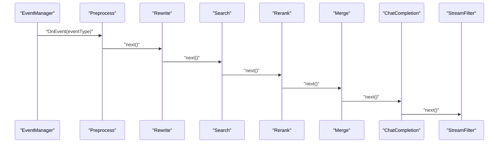

图表来源
- [internal/application/service/chat_pipline/chat_pipline.go](file://internal/application/service/chat_pipline/chat_pipline.go#L1-L80)

章节来源
- [internal/application/service/chat_pipline/chat_pipline.go](file://internal/application/service/chat_pipline/chat_pipline.go#L1-L162)

### 文档解析服务（Python/gRPC）
- gRPC 服务：ReadFromFile、ReadFromURL
- 解析器聚合：支持 docx、doc、pdf、md、txt、图片、网页等
- 切分策略：按配置的 chunk_size、chunk_overlap、分隔符与多模态开关
- 返回结构化分块与图像信息（URL、Caption、OCR 文本）

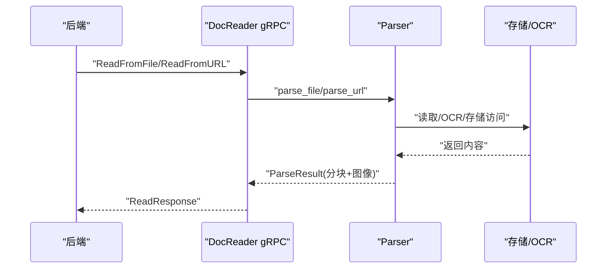

图表来源
- [docreader/main.py](file://docreader/main.py#L100-L198)
- [docreader/parser/parser.py](file://docreader/parser/parser.py#L78-L150)

章节来源
- [docreader/main.py](file://docreader/main.py#L100-L198)
- [docreader/parser/parser.py](file://docreader/parser/parser.py#L78-L150)

### 前端应用（Vue 3）
- 应用入口：创建 Vue 应用、Pinia、路由、国际化与组件库
- 依赖：axios、vue-router、pinia、tdesign-vue-next、marked、pagefind 等
- 页面：登录、知识库管理、聊天对话、系统设置、租户信息等

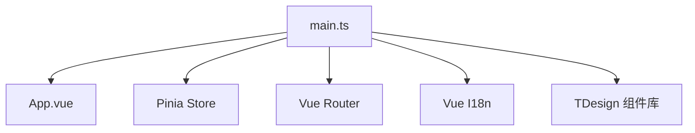

图表来源
- [frontend/src/main.ts](file://frontend/src/main.ts#L1-L19)
- [frontend/package.json](file://frontend/package.json#L1-L52)

章节来源
- [frontend/src/main.ts](file://frontend/src/main.ts#L1-L19)
- [frontend/package.json](file://frontend/package.json#L1-L52)

### MCP 服务器
- 提供多种运行方式：脚本、模块、命令行入口
- 检查依赖与环境变量（WEKNORA_BASE_URL、WEKNORA_API_KEY）
- 异步运行并处理异常与键盘中断

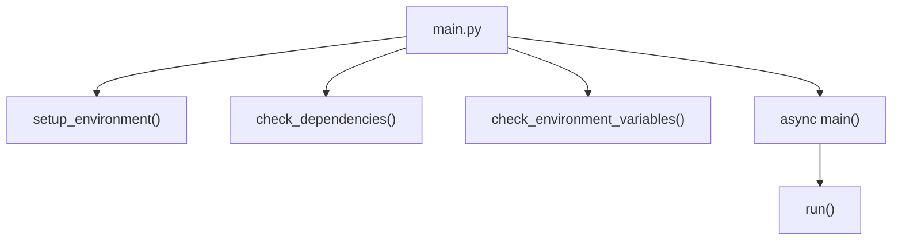

图表来源
- [mcp-server/main.py](file://mcp-server/main.py#L1-L60)

章节来源
- [mcp-server/main.py](file://mcp-server/main.py#L1-L60)

## 依赖关系分析
- 组件耦合与内聚
  - 后端通过容器解耦服务与仓储，路由与中间件统一接入，降低控制器与底层实现耦合
  - 检索引擎注册表与复合体实现“按类型分派”，提升检索策略扩展性
  - 文档解析服务通过 gRPC 与后端解耦，便于独立演进与扩容
- 外部依赖
  - 数据库：PostgreSQL/ParadeDB（通过 GORM）
  - 搜索：Elasticsearch v7/v8（通过 typed client）
  - 存储：MinIO/COS/本地存储
  - 流管理：内存/Redis
  - 追踪：OpenTelemetry/Jaeger
  - 大模型：Ollama（本地）或远程 API
  - 知识图谱：Neo4j
- 可能的循环依赖
  - 容器装配采用延迟注入与运行时获取，避免编译期循环依赖
- 接口契约
  - 会话服务接口定义问答、搜索、标题生成等能力，前后端通过 API 对接

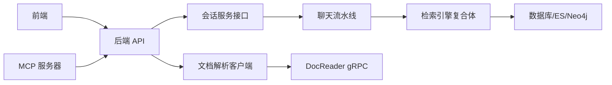

图表来源
- [internal/types/interfaces/session.go](file://internal/types/interfaces/session.go#L1-L50)
- [internal/application/service/retriever/composite.go](file://internal/application/service/retriever/composite.go#L1-L120)
- [internal/container/container.go](file://internal/container/container.go#L70-L138)
- [docker-compose.yml](file://docker-compose.yml#L1-L120)

章节来源
- [internal/types/interfaces/session.go](file://internal/types/interfaces/session.go#L1-L50)
- [internal/application/service/retriever/composite.go](file://internal/application/service/retriever/composite.go#L1-L120)
- [internal/container/container.go](file://internal/container/container.go#L70-L138)
- [docker-compose.yml](file://docker-compose.yml#L1-L120)

## 性能考量
- 并发与资源池
  - 协程池大小可通过环境变量配置，默认值在容器初始化中设置
  - 检索引擎复合体并发执行不同后端检索，减少总等待时间
- 索引与存储
  - 批量索引去重 SourceID，降低重复写入开销
  - 估算存储大小用于容量规划
- I/O 与网络
  - gRPC 最大消息长度与线程池配置，避免大文档传输阻塞
  - 前端静态资源与后端 API 分离部署，减少耦合
- 追踪与可观测性
  - OpenTelemetry 追踪贯穿聊天流水线，定位热点与瓶颈
- 缓存与流管理
  - Redis/内存流管理器支持会话流的持续与恢复

[本节为通用指导，无需引用具体文件]

## 故障排查指南
- 启动与健康检查
  - 后端健康检查端点 /health，容器健康检查脚本
  - gRPC 健康探针用于文档解析服务
- 认证与权限
  - 前端通过 X-API-Key 与 Authorization 头与后端交互
  - 认证中间件拦截未授权请求
- 日志与追踪
  - 后端日志包含请求 ID，便于跨服务追踪
  - Jaeger UI 查看分布式追踪链路
- 配置问题
  - 确认 config.yaml 与环境变量一致
  - 检查 DocReader 地址、存储类型、数据库驱动、检索驱动等环境变量
- 文档解析失败
  - 检查 gRPC 端口与健康状态
  - 确认 OCR/VLM 配置与存储配置正确
- 检索异常
  - 检查 ES 地址、用户名/密码、索引名称
  - 确认检索驱动列表包含所需后端
- 前端访问
  - 确认前端容器依赖后端健康状态
  - 检查端口映射与网络连通性

章节来源
- [internal/router/router.go](file://internal/router/router.go#L68-L71)
- [docker-compose.yml](file://docker-compose.yml#L1-L120)
- [docreader/main.py](file://docreader/main.py#L354-L404)

## 结论
WeKnora_New 通过模块化与分层架构，将文档理解、语义检索与大模型推理有机整合，形成可扩展、可观测、可运维的 RAG 能力平台。前端提供易用界面，后端以容器化方式统一接入各类基础设施，文档解析服务与 MCP 服务器为外部生态提供集成能力。系统支持多场景应用，具备良好的扩展性与工程实践价值。

[本节为总结性内容，无需引用具体文件]

## 附录
- 适用场景
  - 企业知识管理：内部文档检索、政策问答、操作手册搜索
  - 学术研究分析：论文检索、报告分析、材料整理
  - 产品技术支持：产品手册问答、技术文档搜索、故障排查
  - 法律合规审查：合同条款检索、法规政策搜索、案例分析
  - 医疗知识辅助：医学文献检索、治疗指南搜索、病例分析
- 关键特性
  - 多模态文档解析与结构化抽取
  - 混合检索策略（关键词、稠密向量、知识图谱）
  - 多轮对话与上下文管理
  - 知识图谱构建与可视化
  - 安全可控的本地/私有云部署

[本节为概览性内容，无需引用具体文件]