# WeKnora 文档服务与管理设计文档

## 概述

本文档详细阐述 WeKnora 系统中文档服务与管理的完整设计，包括文档上传、解析、存储、检索以及生命周期管理等核心功能。系统采用分层架构设计，通过微服务协同实现多格式文档的智能处理和高效管理。

### 业务目标

- 支持多种文档格式（PDF、Word、Markdown、HTML、图片等）的统一处理
- 实现文档的自动解析、分块和向量化
- 提供高效的文档存储和检索能力
- 支持多模态内容（文本+图像）的智能处理
- 保证文档处理的可靠性和可追溯性

### 设计原则

- **服务解耦**：文档解析服务独立部署，通过 gRPC 与主服务通信
- **异步处理**：文档解析和向量化采用异步任务队列，避免阻塞用户请求
- **容错机制**：完善的错误处理和状态管理，支持失败重试
- **多租户隔离**：基于租户 ID 实现数据和存储配额的隔离
- **可扩展性**：支持新增文档格式解析器和存储后端

## 系统架构

### 整体架构

系统采用三层架构设计，结合独立的文档解析服务，形成完整的文档处理流水线。

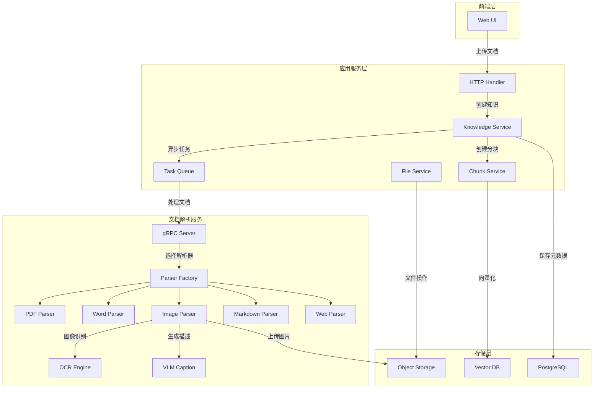

### 服务分层

#### Handler 层（请求处理层）

负责接收和响应 HTTP 请求，进行参数验证和权限校验。

**核心处理器**
- `KnowledgeHandler`：处理文档上传、创建、查询、删除等操作
- `KnowledgeBaseHandler`：处理知识库的管理操作

**关键职责**
- 解析 HTTP 请求参数（文件、元数据、配置项）
- 验证知识库访问权限（租户隔离）
- 处理文件上传流
- 返回标准化响应（成功/失败/冲突）

#### Service 层（业务逻辑层）

实现核心业务逻辑，协调多个组件完成复杂操作。

**核心服务**
- `knowledgeService`：文档生命周期管理
- `chunkService`：文档分块管理
- `knowledgeBaseService`：知识库配置管理
- `fileService`：文件存储管理

**关键职责**
- 文档去重检测（基于文件哈希）
- 存储配额验证和更新
- 调用文档解析服务
- 异步任务调度
- 向量化和索引管理

#### Repository 层（数据访问层）

封装数据库操作，提供统一的数据访问接口。

**核心仓储**
- `knowledgeRepository`：知识（文档）数据持久化
- `chunkRepository`：分块数据持久化
- `tenantRepository`：租户信息管理

**关键职责**
- CRUD 操作
- 复杂查询（分页、过滤、排序）
- 事务管理
- 软删除处理

## 文档数据模型

### Knowledge（文档实体）

文档是系统中知识的载体，记录文档的元数据、处理状态和物理位置。

| 字段名 | 类型 | 说明 | 约束 |
|--------|------|------|------|
| id | varchar(36) | 文档唯一标识 | 主键，UUID |
| tenant_id | integer | 租户 ID | 非空，索引 |
| knowledge_base_id | varchar(36) | 所属知识库 ID | 非空，外键 |
| type | varchar(50) | 文档类型 | file/url |
| title | varchar(255) | 文档标题 | 非空 |
| description | text | 文档描述 | 可选 |
| source | varchar(128) | 文档来源 | 文件路径或 URL |
| parse_status | varchar(50) | 解析状态 | unprocessed/processing/completed/failed |
| enable_status | varchar(50) | 启用状态 | enabled/disabled |
| embedding_model_id | varchar(64) | 向量模型 ID | 可选 |
| file_name | varchar(255) | 文件名 | 可选 |
| file_type | varchar(50) | 文件类型 | pdf/docx/md/jpg 等 |
| file_size | bigint | 文件大小（字节） | 可选 |
| file_hash | varchar(64) | 文件哈希值 | 用于去重 |
| file_path | text | 文件存储路径 | 可选 |
| storage_size | bigint | 存储占用（字节） | 默认 0 |
| metadata | json | 扩展元数据 | 可选 |
| created_at | timestamp | 创建时间 | 自动设置 |
| updated_at | timestamp | 更新时间 | 自动更新 |
| processed_at | timestamp | 处理完成时间 | 可选 |
| error_message | text | 错误信息 | 处理失败时记录 |
| deleted_at | timestamp | 软删除时间 | 支持恢复 |

**状态转换流程**

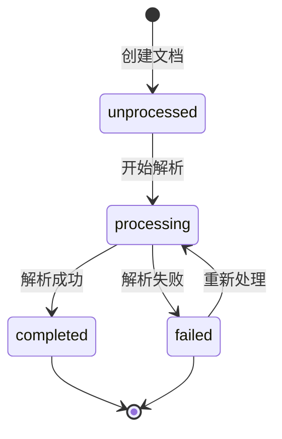

### KnowledgeBase（知识库实体）

知识库是文档的容器，定义了文档处理的配置参数。

| 字段名 | 类型 | 说明 |
|--------|------|------|
| id | varchar(36) | 知识库唯一标识 |
| name | varchar(255) | 知识库名称 |
| description | text | 知识库描述 |
| tenant_id | integer | 租户 ID |
| chunking_config | json | 分块配置（chunk_size、chunk_overlap、separators） |
| image_processing_config | json | 图像处理配置 |
| embedding_model_id | varchar(64) | 向量模型 ID |
| summary_model_id | varchar(64) | 摘要模型 ID |
| rerank_model_id | varchar(64) | 重排模型 ID |
| vlm_model_id | varchar(64) | 视觉语言模型 ID |
| vlm_config | json | VLM 配置（model_name、base_url、api_key、interface_type） |
| storage_config | json | 存储配置（provider、region、bucket_name、access_key 等） |
| extract_config | json | 信息抽取配置 |
| created_at | timestamp | 创建时间 |
| updated_at | timestamp | 更新时间 |
| deleted_at | timestamp | 软删除时间 |

**ChunkingConfig 结构**

| 参数 | 类型 | 说明 | 默认值 |
|------|------|------|--------|
| chunk_size | integer | 分块大小（字符数） | 512 |
| chunk_overlap | integer | 分块重叠（字符数） | 50 |
| separators | array[string] | 分隔符列表 | ["\n\n", "\n", "。"] |
| enable_multimodal | boolean | 是否启用多模态处理 | false |

**StorageConfig 结构**

| 参数 | 类型 | 说明 |
|------|------|------|
| provider | string | 存储提供商（cos/minio） |
| region | string | 区域（COS 使用） |
| bucket_name | string | 存储桶名称 |
| access_key_id | string | 访问密钥 ID |
| secret_access_key | string | 访问密钥 Secret |
| app_id | string | 应用 ID（COS 使用） |
| path_prefix | string | 路径前缀 |

**VLMConfig 结构**

| 参数 | 类型 | 说明 |
|------|------|------|
| model_name | string | 模型名称 |
| base_url | string | 服务地址 |
| api_key | string | API 密钥 |
| interface_type | string | 接口类型（ollama/openai） |

### Chunk（文档分块实体）

文档分块是文档的基本检索单元，包含文本内容、向量表示和图像信息。

| 字段名 | 类型 | 说明 |
|--------|------|------|
| id | varchar(36) | 分块唯一标识 |
| tenant_id | integer | 租户 ID |
| knowledge_id | varchar(36) | 所属文档 ID |
| knowledge_base_id | varchar(36) | 所属知识库 ID |
| seq | integer | 分块序号 |
| content | text | 文本内容 |
| embedding_status | varchar(50) | 向量化状态 |
| start_pos | integer | 在文档中的起始位置 |
| end_pos | integer | 在文档中的结束位置 |
| images | json | 图像信息列表 |
| created_at | timestamp | 创建时间 |
| updated_at | timestamp | 更新时间 |

**Image 结构（JSON）**

| 参数 | 类型 | 说明 |
|------|------|------|
| url | string | 图片访问 URL |
| caption | string | 图片描述（VLM 生成） |
| ocr_text | string | OCR 提取的文本 |
| original_url | string | 原始图片 URL |
| start | integer | 图片在分块中的起始位置 |
| end | integer | 图片在分块中的结束位置 |

## 核心业务流程

### 文档上传与创建流程

用户通过 Web UI 上传文档到指定知识库，系统进行一系列验证和处理。

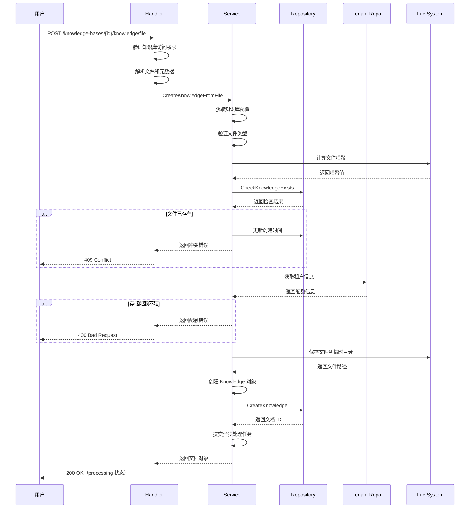

**关键验证点**

1. **权限验证**：确认用户对知识库有操作权限（租户 ID 匹配）
2. **文件类型验证**：检查文件扩展名是否在支持列表中
3. **去重检测**：基于文件名、大小和哈希值判断是否重复
4. **配额验证**：检查租户存储配额是否充足
5. **配置完整性验证**：对于图片文件，验证对象存储和 VLM 配置是否完整

**支持的文件类型**

| 类型 | 扩展名 | 说明 |
|------|--------|------|
| PDF | .pdf | 支持表格和图像提取 |
| Word | .docx, .doc | 支持文本和图像提取 |
| Markdown | .md | 保留文本结构 |
| 纯文本 | .txt | 直接文本内容 |
| HTML | .html, .htm | 网页内容解析 |
| 图像 | .jpg, .jpeg, .png, .bmp | 支持 OCR 和描述生成 |

### 文档异步处理流程

文档创建后，系统通过异步任务队列进行解析、分块和向量化处理。

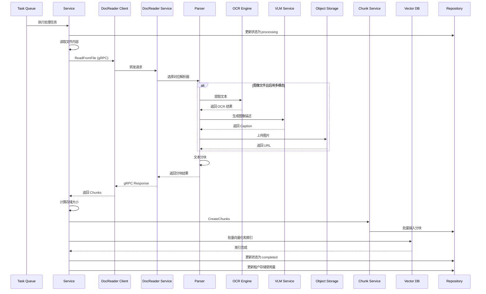

**处理阶段说明**

**阶段 1：文档解析**
- 根据文件类型选择对应的解析器
- 提取文本内容和图像信息
- 对于图像文件，执行 OCR 识别和描述生成

**阶段 2：内容分块**
- 根据知识库配置的参数进行文本分块
- 保留分块的位置信息（start、end）
- 关联图像到相应的分块

**阶段 3：存储处理**
- 上传图片到对象存储服务
- 保存分块数据到数据库
- 计算并更新存储占用

**阶段 4：向量化索引**
- 调用 Embedding 模型生成向量
- 批量写入向量数据库
- 更新向量化状态

**阶段 5：状态更新**
- 更新文档处理状态为 completed
- 记录处理完成时间
- 更新租户存储使用量

**错误处理**
- 任何阶段失败，更新文档状态为 failed
- 记录详细错误信息到 error_message 字段
- 清理已创建的中间数据（分块、索引）
- 回滚租户存储使用量

### URL 文档创建流程

除了文件上传，系统还支持从 URL 创建文档。

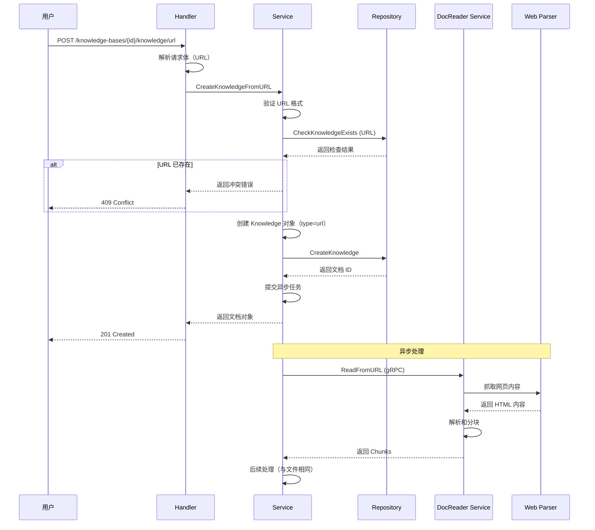

**与文件上传的差异**

- 无需文件哈希计算，基于 URL 进行去重
- 不占用租户存储配额（无文件保存）
- 使用 Web Parser 抓取和解析网页内容
- 文档标题从网页 `<title>` 标签提取

### 文档查询流程

用户可以查询知识库中的文档列表和单个文档详情。

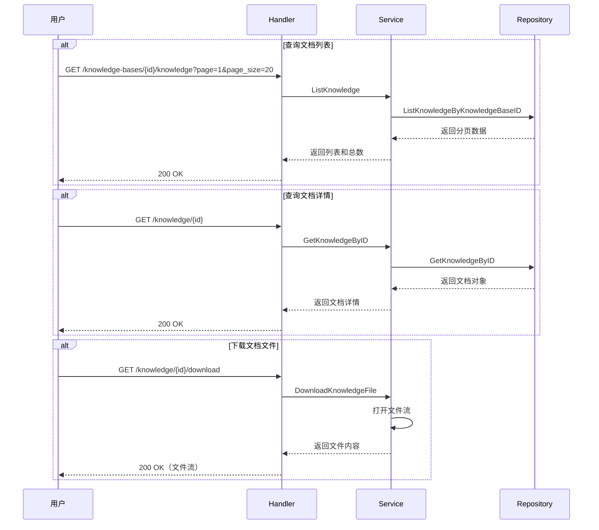

**查询参数**

| 参数 | 类型 | 说明 | 默认值 |
|------|------|------|--------|
| page | integer | 页码（从 1 开始） | 1 |
| page_size | integer | 每页数量 | 20 |

**返回字段**

列表查询返回文档的基本信息，包括 ID、标题、类型、状态、创建时间等。详情查询返回完整的文档对象，包括元数据、错误信息等扩展字段。

### 文档删除流程

文档删除采用软删除机制，支持数据恢复。

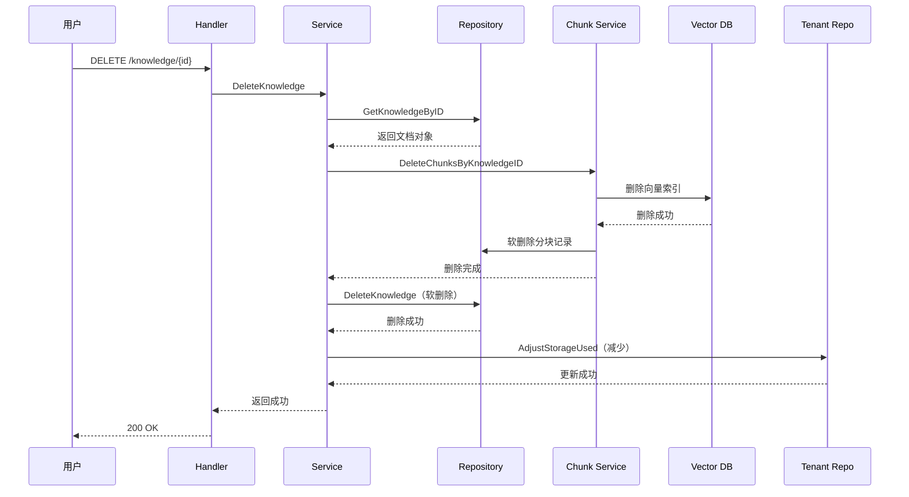

**删除操作说明**

1. **软删除文档记录**：设置 deleted_at 字段，不物理删除
2. **删除分块数据**：同样采用软删除
3. **清理向量索引**：从向量数据库中移除索引
4. **回收存储配额**：减少租户已用存储
5. **保留文件**：文件本身不立即删除，便于恢复

### 文档更新流程

系统支持更新文档的元数据和图像信息。

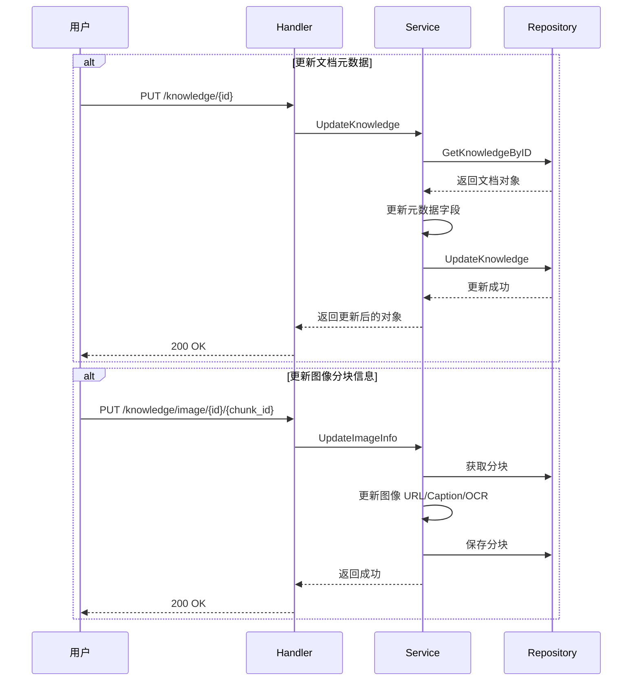

**可更新字段**

- title：文档标题
- description：文档描述
- metadata：扩展元数据
- enable_status：启用/禁用状态
- 图像信息：URL、Caption、OCR 文本

## 文档解析服务

### 服务架构

文档解析服务是独立部署的 Python 服务，通过 gRPC 与主服务通信。

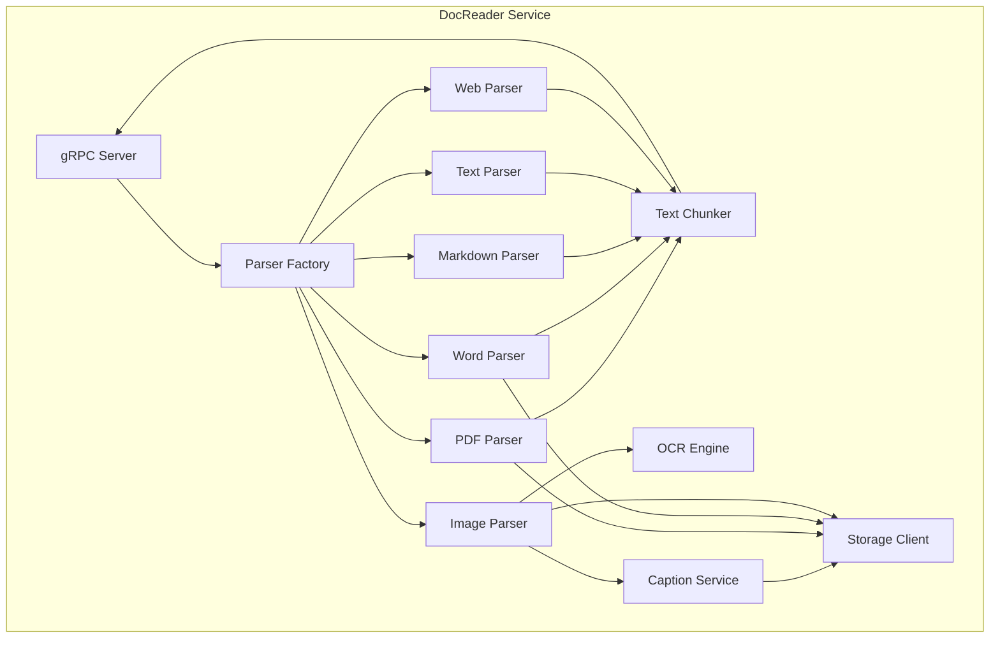

### gRPC 接口定义

**服务定义**

服务名称：`DocReader`

**方法列表**

| 方法名 | 请求类型 | 响应类型 | 说明 |
|--------|----------|----------|------|
| ReadFromFile | ReadFromFileRequest | ReadResponse | 从文件读取文档 |
| ReadFromURL | ReadFromURLRequest | ReadResponse | 从 URL 读取文档 |

**ReadFromFileRequest 消息**

| 字段 | 类型 | 说明 |
|------|------|------|
| file_content | bytes | 文件内容 |
| file_name | string | 文件名 |
| file_type | string | 文件类型 |
| read_config | ReadConfig | 读取配置 |
| request_id | string | 请求追踪 ID |

**ReadFromURLRequest 消息**

| 字段 | 类型 | 说明 |
|------|------|------|
| url | string | 文档 URL |
| title | string | 标题 |
| read_config | ReadConfig | 读取配置 |
| request_id | string | 请求追踪 ID |

**ReadConfig 消息**

| 字段 | 类型 | 说明 |
|------|------|------|
| chunk_size | int32 | 分块大小 |
| chunk_overlap | int32 | 分块重叠 |
| separators | repeated string | 分隔符 |
| enable_multimodal | bool | 多模态处理 |
| storage_config | StorageConfig | 存储配置 |
| vlm_config | VLMConfig | VLM 配置 |

**StorageConfig 消息**

| 字段 | 类型 | 说明 |
|------|------|------|
| provider | StorageProvider | 存储提供方（COS=1/MINIO=2） |
| region | string | 区域 |
| bucket_name | string | 桶名 |
| access_key_id | string | 访问密钥 ID |
| secret_access_key | string | 访问密钥 Secret |
| app_id | string | 应用 ID |
| path_prefix | string | 路径前缀 |

**VLMConfig 消息**

| 字段 | 类型 | 说明 |
|------|------|------|
| model_name | string | 模型名称 |
| base_url | string | 服务地址 |
| api_key | string | API 密钥 |
| interface_type | string | 接口类型 |

**ReadResponse 消息**

| 字段 | 类型 | 说明 |
|------|------|------|
| chunks | repeated Chunk | 文档分块 |
| error | string | 错误信息 |

**Chunk 消息**

| 字段 | 类型 | 说明 |
|------|------|------|
| content | string | 块内容 |
| seq | int32 | 块序号 |
| start | int32 | 起始位置 |
| end | int32 | 结束位置 |
| images | repeated Image | 图片信息 |

**Image 消息**

| 字段 | 类型 | 说明 |
|------|------|------|
| url | string | 图片 URL |
| caption | string | 图片描述 |
| ocr_text | string | OCR 文本 |
| original_url | string | 原始 URL |
| start | int32 | 起始位置 |
| end | int32 | 结束位置 |

### 解析器实现策略

每种文件格式对应一个专门的解析器，所有解析器继承自 `BaseParser`。

**PDF Parser**
- 使用库：pdfplumber
- 功能：文本提取、表格识别、图像提取
- 特点：支持复杂布局的 PDF

**Word Parser**
- 使用库：python-docx
- 功能：文本提取、样式保留、图像提取
- 支持格式：.docx、.doc

**Markdown Parser**
- 使用库：markdown
- 功能：保留文本结构、代码块提取
- 特点：保持原始格式

**Image Parser**
- 使用库：PaddleOCR（OCR）、VLM API（描述生成）
- 功能：文本识别、图像理解
- 输出：OCR 文本、图像描述

**Web Parser**
- 使用库：Playwright
- 功能：网页抓取、JavaScript 渲染
- 特点：支持动态内容

**Text Parser**
- 功能：编码检测、文本解码
- 支持编码：UTF-8、GB18030、Latin-1

### 文本分块策略

文本分块是将长文档切分为可检索的片段，基于滑动窗口算法实现。

**分块算法**

1. **按分隔符切分**：优先使用自然分隔符（段落、句子）
2. **控制大小**：每个分块不超过 chunk_size 字符
3. **保留重叠**：相邻分块重叠 chunk_overlap 字符
4. **记录位置**：记录分块在原文中的起始和结束位置

**分隔符优先级**

默认分隔符按优先级排序：
1. `\n\n`（段落分隔）
2. `\n`（行分隔）
3. `。`（中文句号）
4. `！`（中文感叹号）
5. `？`（中文问号）
6. `;`（分号）
7. `；`（中文分号）

**分块示例**

假设配置：
- chunk_size = 100
- chunk_overlap = 20
- separators = ["\n\n", "\n", "。"]

原文：
```
第一段内容，包含一些文字。这是第一段的第二句话。

第二段内容开始了。这里有更多的信息。
```

分块结果：
- Chunk 1：第一段内容，包含一些文字。这是第一段的第二句话。
- Chunk 2：（重叠部分）这是第一段的第二句话。\n\n第二段内容开始了。
- Chunk 3：（重叠部分）第二段内容开始了。这里有更多的信息。

### 多模态处理

对于包含图像的文档（PDF、Word、图片文件），系统提供多模态处理能力。

**处理流程**

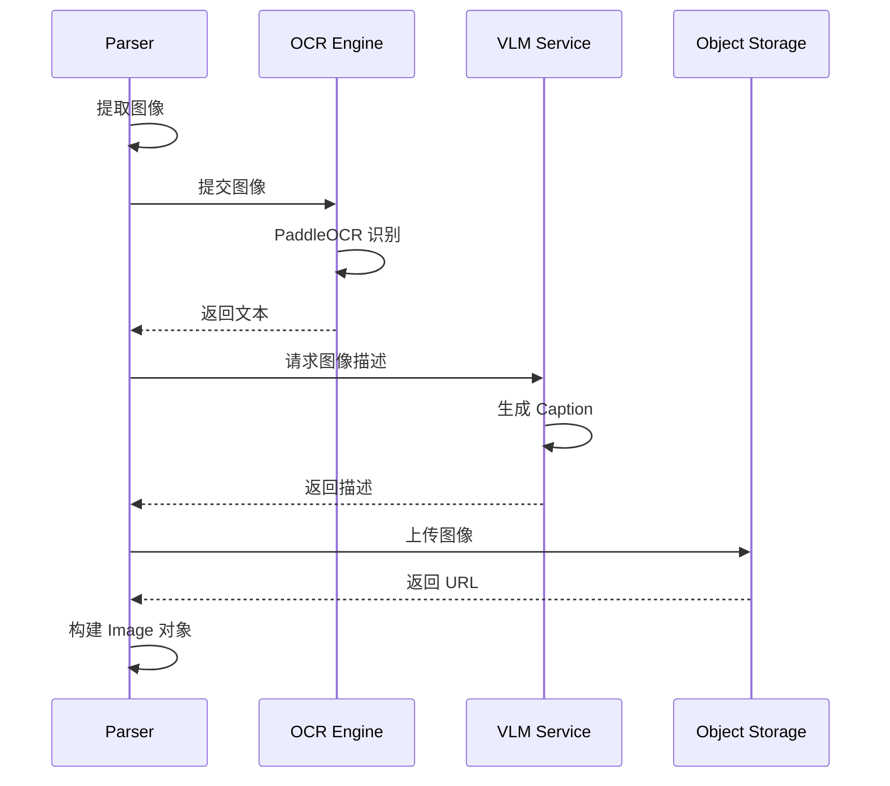

**OCR 引擎**

- 默认使用 PaddleOCR
- 支持中英文混合识别
- 自动检测文本方向
- 输出文本和置信度

**VLM 描述生成**

- 支持接口：OpenAI、Ollama
- 输入：图像 Base64 编码
- 输出：自然语言描述
- 用途：生成图像摘要，辅助检索

**对象存储**

- 支持腾讯云 COS
- 支持 MinIO（S3 兼容）
- 生成公网访问 URL
- 设置访问权限

### 错误处理

文档解析服务采用分级错误处理机制。

**错误类型**

| 错误类型 | 处理策略 | 返回状态 |
|----------|----------|----------|
| 文件格式不支持 | 记录错误，返回空结果 | INVALID_ARGUMENT |
| 文件损坏 | 记录错误，返回空结果 | INVALID_ARGUMENT |
| OCR 失败 | 跳过 OCR，仅返回原图 | 部分成功 |
| VLM 失败 | 跳过描述生成 | 部分成功 |
| 存储上传失败 | 重试 3 次，失败则返回本地路径 | 部分成功 |
| 内存不足 | 分批处理或降低质量 | RESOURCE_EXHAUSTED |
| 超时 | 返回已处理部分 | DEADLINE_EXCEEDED |

**错误响应**

错误信息通过 `ReadResponse.error` 字段返回，包含详细的错误描述和堆栈信息。主服务根据错误类型决定是否重试或标记为失败。

## 存储管理

### 对象存储

系统支持两种对象存储后端：腾讯云 COS 和 MinIO。

**存储用途**

- 原始文档文件
- 文档中提取的图片
- 临时处理文件

**存储路径规范**

```
{path_prefix}/{tenant_id}/{knowledge_base_id}/{knowledge_id}/{filename}
```

示例：
```
weknora/1/kb-00000001/doc-123456/image-001.jpg
```

**访问控制**

- 文件默认私有访问
- 图片 URL 设置有效期（24 小时）
- 支持预签名 URL

**配额管理**

每个租户有存储配额限制：

| 字段 | 说明 |
|------|------|
| storage_quota | 最大存储空间（字节） |
| storage_used | 已用存储空间（字节） |

上传文档时检查配额，超限则拒绝上传。删除文档时回收配额。

### 数据库存储

系统使用 PostgreSQL 数据库存储元数据和结构化数据。

**表结构**

主要表包括：
- `knowledge_bases`：知识库
- `knowledges`：文档
- `chunks`：文档分块
- `tenants`：租户
- `models`：模型配置
- `sessions`：会话

**索引设计**

关键索引：

| 表 | 索引字段 | 类型 | 用途 |
|-----|----------|------|------|
| knowledges | tenant_id | B-tree | 租户隔离 |
| knowledges | knowledge_base_id | B-tree | 知识库查询 |
| knowledges | file_hash | B-tree | 去重检测 |
| knowledges | deleted_at | B-tree | 软删除过滤 |
| chunks | knowledge_id | B-tree | 分块查询 |
| chunks | seq | B-tree | 排序 |

**事务管理**

关键操作使用数据库事务保证一致性：
- 文档创建和配额更新
- 文档删除和配额回收
- 批量分块插入

### 向量存储

系统支持两种向量数据库：PostgreSQL（pgvector）和 Elasticsearch。

**pgvector 方案**

- 表：chunks 表增加 embedding 列（vector 类型）
- 索引：ivfflat 或 hnsw
- 查询：余弦相似度或欧氏距离

**Elasticsearch 方案**

- 索引：每个知识库一个索引
- 映射：text 字段 + dense_vector 字段
- 查询：knn 查询 + 关键词查询

**索引管理**

- 批量索引：减少网络开销
- 异步索引：不阻塞主流程
- 索引清理：删除文档时同步清理

## 检索与查询

### 混合检索

系统支持向量检索、关键词检索和知识图谱检索的混合模式。

**检索流程**

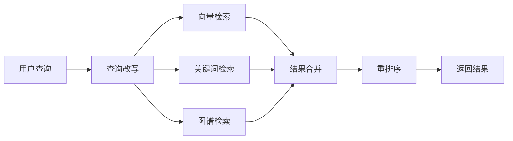

**向量检索**

1. 使用 Embedding 模型向量化查询
2. 在向量数据库中执行 kNN 查询
3. 根据 vector_threshold 过滤结果
4. 返回 Top-K 结果

**关键词检索**

1. 使用 BM25 算法计算相关性
2. 根据 keyword_threshold 过滤结果
3. 返回 Top-K 结果

**知识图谱检索**

1. 基于实体和关系扩展查询
2. 查找相关的文档节点
3. 返回图谱增强的结果

**结果合并**

使用加权融合算法（Reciprocal Rank Fusion）合并多路检索结果。

**重排序**

使用 Rerank 模型对合并结果进行精排，提升准确性。

### 检索参数

| 参数 | 类型 | 说明 | 默认值 |
|------|------|------|--------|
| query | string | 查询文本 | 必填 |
| vector_threshold | float | 向量相似度阈值 | 0.5 |
| keyword_threshold | float | 关键词相关性阈值 | 0.5 |
| embedding_top_k | integer | 向量检索数量 | 10 |
| rerank_top_k | integer | 重排后数量 | 10 |
| rerank_threshold | float | 重排阈值 | 0.65 |

### 检索结果

返回字段：

| 字段 | 类型 | 说明 |
|------|------|------|
| chunk_id | string | 分块 ID |
| content | string | 分块内容 |
| score | float | 相关性得分 |
| knowledge_id | string | 所属文档 ID |
| knowledge_title | string | 文档标题 |
| images | array | 图像信息 |

## 权限与安全

### 多租户隔离

系统基于租户 ID 实现数据隔离。

**隔离层级**

1. **应用层隔离**：所有查询自动添加 tenant_id 过滤条件
2. **数据库隔离**：通过索引和查询优化保证性能
3. **存储隔离**：不同租户文件存储在不同路径

**租户鉴权**

每个请求都需要携带租户身份信息（通过 JWT Token 或 Session）。Handler 层从上下文获取租户 ID，并在调用 Service 时传递。Repository 层的所有查询都基于租户 ID 进行过滤。

### 访问控制

**知识库权限**

- 只有知识库所属租户的用户可以访问
- 跨租户访问被拒绝（403 Forbidden）

**文档权限**

- 继承知识库权限
- 删除文档需要验证所有权

**API 鉴权**

- 所有 API 端点需要身份认证
- 使用中间件统一鉴权
- 支持 Token 刷新

### 数据安全

**敏感信息保护**

- API Key、Secret Key 加密存储
- 日志中脱敏处理
- 传输使用 HTTPS

**软删除**

- 文档和分块采用软删除
- 定期清理过期数据
- 支持数据恢复

**审计日志**

- 记录关键操作（创建、删除、更新）
- 包含操作人、时间、IP 等信息
- 便于追溯和排查问题

## 性能优化

### 异步处理

**任务队列**

使用 Asynq 任务队列实现异步处理：
- 文档解析任务
- 向量化任务
- 批量删除任务

**优势**

- 避免阻塞用户请求
- 支持任务重试
- 分布式处理

### 批量操作

**批量插入**

- 分块数据批量插入数据库
- 向量批量索引到向量数据库
- 减少网络往返

**批量查询**

- 支持批量获取文档信息
- 减少数据库查询次数

### 缓存策略

**知识库配置缓存**

- 知识库配置变化不频繁，适合缓存
- 降低数据库查询压力

**Embedding 缓存**

- 相同文本的向量可以复用
- 减少模型调用次数

### 连接池

**数据库连接池**

- 配置合理的最大连接数
- 避免连接耗尽
- 复用连接降低开销

**gRPC 连接池**

- 复用与 DocReader 服务的连接
- 减少连接建立时间

## 监控与运维

### 日志记录

**日志级别**

- DEBUG：详细调试信息
- INFO：一般操作信息
- WARN：警告信息
- ERROR：错误信息

**日志内容**

- 请求 ID：用于追踪请求链路
- 租户 ID：用于隔离租户日志
- 操作对象：知识库 ID、文档 ID 等
- 操作结果：成功/失败、耗时

**日志存储**

- 输出到标准输出（stdout）
- 通过日志采集系统（如 Filebeat）收集
- 存储到日志中心（如 Elasticsearch）

### 链路追踪

**OpenTelemetry**

系统集成 OpenTelemetry 进行分布式追踪：
- Span：每个操作创建 Span
- Trace：跨服务的完整调用链
- 属性：记录关键参数和结果

**追踪点**

- HTTP 请求
- 服务方法调用
- gRPC 调用
- 数据库操作
- 外部 API 调用

### 指标监控

**关键指标**

| 指标 | 类型 | 说明 |
|------|------|------|
| 文档上传数 | Counter | 累计上传文档数 |
| 文档处理成功率 | Gauge | 成功/总数 |
| 文档处理耗时 | Histogram | 处理时间分布 |
| 存储使用量 | Gauge | 租户存储占用 |
| gRPC 调用延迟 | Histogram | DocReader 调用延迟 |
| 数据库查询耗时 | Histogram | 查询时间分布 |

**告警规则**

- 文档处理失败率 > 10%
- gRPC 调用延迟 > 5s
- 存储使用率 > 90%
- 数据库连接池耗尽

### 故障排查

**常见问题**

| 问题 | 可能原因 | 排查方法 |
|------|----------|----------|
| 文档处理失败 | 文件损坏、格式不支持、服务异常 | 查看 error_message 字段和日志 |
| 上传超时 | 文件过大、网络慢 | 检查文件大小和网络状况 |
| 存储配额不足 | 超出租户限制 | 查看租户存储使用情况 |
| 向量化失败 | Embedding 模型异常 | 检查模型服务状态 |
| 检索无结果 | 向量数据未索引、阈值过高 | 检查索引状态和参数配置 |

**诊断工具**

- 日志查询：根据 request_id 追踪请求
- 链路追踪：查看完整调用链
- 数据库查询：检查数据状态
- 健康检查：验证服务可用性

## 扩展性设计

### 新增文件格式

添加新的文件格式支持需要以下步骤：

1. 在 DocReader 服务中实现新的 Parser 类
2. 继承 `BaseParser` 基类
3. 实现 `parse_into_text` 方法
4. 在 `Parser Factory` 中注册新的解析器
5. 更新文件类型验证列表

### 新增存储后端

添加新的对象存储后端：

1. 实现 `StorageClient` 接口
2. 在 `storage.py` 中添加新的客户端类
3. 在 gRPC 接口中添加新的 Provider 枚举值
4. 更新配置解析逻辑

### 新增向量数据库

添加新的向量数据库后端：

1. 实现 `RetrieveEngine` 接口
2. 实现 `Index`、`Search`、`Delete` 等方法
3. 在 `factory.go` 中注册新的引擎
4. 更新配置文件

### 水平扩展

**服务扩展**

- 主服务：通过负载均衡器分发请求
- DocReader 服务：部署多个实例
- 数据库：读写分离、分库分表
- 向量数据库：集群部署

**任务队列**

- 使用 Redis 作为队列存储
- 部署多个 Worker 并发处理
- 支持优先级队列

## 总结

本文档详细描述了 WeKnora 文档服务与管理的设计方案，涵盖架构设计、数据模型、业务流程、服务接口、存储管理、检索机制、安全控制、性能优化和运维监控等方面。

**核心设计特点**

1. **分层架构**：Handler、Service、Repository 职责清晰
2. **服务解耦**：文档解析服务独立部署，通过 gRPC 通信
3. **异步处理**：文档处理不阻塞用户请求，支持大规模并发
4. **多格式支持**：统一接口处理多种文档格式
5. **多模态能力**：支持文本和图像的联合处理
6. **灵活存储**：支持多种对象存储和向量数据库
7. **混合检索**：结合向量、关键词和图谱的多路检索
8. **多租户隔离**：完善的权限控制和数据隔离
9. **可观测性**：日志、追踪、指标全面覆盖
10. **可扩展性**：支持新增格式、存储和数据库

该设计确保了系统的高可用、高性能和易维护性，为上层应用提供了可靠的文档管理能力。